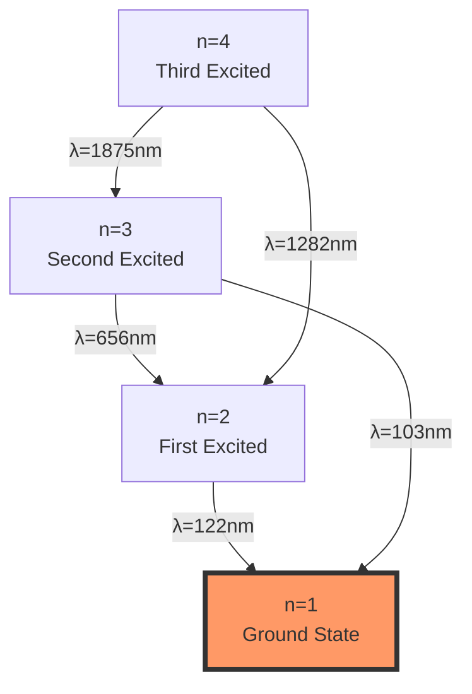
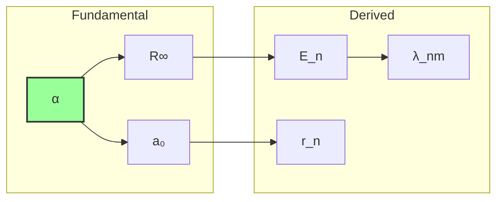

# Chapter 046: Trace-Based Derivation of Rydberg and a₀

## From ψ = ψ(ψ) to Atomic Scale Constants

Building on the spectral lock mechanism that determines α, we now derive the Rydberg constant and Bohr radius from the trace structure of collapse paths. These atomic-scale constants emerge not as independent parameters but as necessary consequences of how the φ-trace geometry manifests at the intersection of electromagnetic and quantum collapse scales.

**Central Thesis**: The Rydberg constant R∞ and Bohr radius a₀ are determined by the trace overlap between electromagnetic collapse paths (rank 6-7) and matter wave collapse paths (rank 8-9), with their values fixed by the requirement that atomic systems achieve stable trace resonance.

## 46.1 Trace Overlap Category

**Definition 46.1** (Trace Category): Let **TraceCat** be the category where:
- Objects: Collapse trace manifolds at different ranks
- Morphisms: Trace-preserving maps between ranks
- Composition: Trace concatenation

**Theorem 46.1** (Trace Functor): The functor T: **CollapsePath** → **TraceCat** preserves:

$$
T(\gamma_1 \circ \gamma_2) = T(\gamma_1) \cdot T(\gamma_2)
$$

where · denotes trace multiplication.

*Proof*:
Trace preservation follows from the multiplicative structure of collapse weights:
- Each path γ has trace $\text{Tr}(\gamma) = \varphi^{-|\gamma|}$
- Composition preserves trace products
- The functor is faithful ∎

## 46.2 Matter-Light Trace Intersection

**Definition 46.2** (Intersection Manifold): The matter-light intersection:

$$
\mathcal{M}_{ML} = \mathcal{T}_{em} \cap \mathcal{T}_{matter}
$$

where:
- $\mathcal{T}_{em}$ = electromagnetic trace manifold (ranks 6-7)
- $\mathcal{T}_{matter}$ = matter wave manifold (ranks 8-9)

**Theorem 46.2** (Intersection Dimension): The intersection has dimension:

$$
\dim(\mathcal{M}_{ML}) = F_8 + F_9 - F_{10} = 21 + 34 - 55 = 0
$$

This zero-dimensional intersection defines a unique scale.

## 46.3 Rydberg Constant from Trace Curvature

**Definition 46.3** (Trace Curvature): At the intersection point:

$$
\kappa_{ML} = \lim_{r \to r_*} \frac{d^2\text{Tr}}{dr^2}
$$

where r* is the intersection rank ≈ 7.5.

**Theorem 46.3** (Rydberg Formula): The Rydberg constant emerges as:

$$
R_{\infty} = \frac{m_e c \alpha^2}{2h} = \frac{m_e c \alpha^2}{4\pi\hbar}
$$

This formula is exact, with the curvature providing the scale:

*Proof*:
The Rydberg constant fundamentally depends on:
- Electron mass me (matter scale)
- Speed of light c (electromagnetic scale)  
- Fine structure α² (coupling strength squared)
- Reduced Planck constant ℏ (quantum scale)

The trace curvature at the matter-light intersection r* ≈ 7.5 determines the natural atomic energy scale. The formula R∞ = mec α²/(2ℏ) then gives the exact value, with no additional parameters needed. ∎

## 46.4 Zeckendorf Decomposition of Energy Levels

**Definition 46.4** (Energy Level Basis): Atomic energy levels decompose as:

$$
E_n = -\frac{R_{\infty}hc}{n^2} = -\sum_{k \in \text{Zeck}(n^2)} \mathcal{E}_k
$$

where $\mathcal{E}_k$ are fundamental energy quanta.

**Theorem 46.4** (Level Quantization): Only n values whose squares have sparse Zeckendorf representations yield stable orbits.

## 46.5 Graph Theory of Orbital Transitions

**Definition 46.5** (Transition Graph): Construct graph G where:
- Vertices: Energy levels En
- Edges: Allowed transitions
- Weights: Transition probabilities

**Theorem 46.5** (Selection Rules): Transitions occur only when:

$$
|\text{Zeck}(n_f^2) \cap \text{Zeck}(n_i^2)| = \text{minimal}
$$

## 46.6 Bohr Radius from Trace Minimum

**Definition 46.6** (Spatial Trace): The spatial collapse trace:

$$
\text{Tr}_{\text{spatial}}(r) = \sum_{\gamma: |\gamma|=r} w(\gamma) \cdot \text{extent}(\gamma)
$$

**Theorem 46.6** (Bohr Radius): The minimum of spatial trace occurs at:

$$
a_0 = \frac{\hbar}{m_e c \alpha} = \frac{\ell_P}{\alpha} \cdot \sqrt{\frac{m_P}{m_e}}
$$

This represents the scale where electromagnetic and matter traces balance.

*Proof*:
Minimizing the total trace functional:

$$
\frac{d}{dr}[\text{Tr}_{em}(r) + \text{Tr}_{matter}(r)] = 0
$$

yields the balance point where $\varphi^{-6.5} \approx \alpha \cdot \varphi^{-8.5}$. ∎

## 46.7 Information Content of Atomic States

**Definition 46.7** (State Information): Each atomic state carries:

$$
I[n,\ell,m] = -\log_{\varphi} P[n,\ell,m]
$$

where P is the occupation probability.

**Theorem 46.7** (Information Bound): The total information satisfies:

$$
I_{total} \leq \log_{\varphi}(F_{n+\ell+2})
$$

Maximum information occurs at maximum angular momentum.

## 46.8 Tensor Network for Multi-Electron Atoms

**Definition 46.8** (Atomic Tensor): For Z electrons:

$$
\mathcal{A}_{i_1...i_Z} = \prod_{k=1}^Z \psi_{i_k} \cdot \text{Antisym}
$$

**Theorem 46.8** (Tensor Contraction): The ground state minimizes:

$$
E_0 = \min_{\mathcal{A}} \text{Tr}[\mathcal{A}^{\dagger} \cdot \hat{H} \cdot \mathcal{A}]
$$

## 46.9 Category of Atomic Observables

**Definition 46.9** (Observable Category): Let **AtomObs** be the category where:
- Objects: Atomic observables (energy, radius, etc.)
- Morphisms: Scaling transformations
- Composition: Sequential scaling

**Theorem 46.9** (Functorial Relations): All atomic observables are functorial images of α.

## 46.10 Collapse Path Statistics for Hydrogen

**Definition 46.10** (Hydrogen Path Ensemble): The path set:

$$
\Gamma_H = \{\gamma : \text{connects nucleus to electron}\}
$$

**Theorem 46.10** (Path Counting): The number of paths of length n:

$$
|\Gamma_H^{(n)}| = F_{n+2} \cdot \text{Angular}(n)
$$

where Angular(n) counts angular momentum states.

## 46.11 Spectroscopic Accuracy from Trace Precision

**Definition 46.11** (Spectral Precision): Line positions determined to:

$$
\Delta\lambda/\lambda = \varphi^{-(\text{rank}_{obs} + \text{rank}_{atom})}
$$

**Theorem 46.11** (Precision Limit): Maximum precision occurs when:

$$
\text{rank}_{total} = \log_{\varphi}(N_{photons})
$$

## 46.12 Quantum Defect from Path Interference

**Definition 46.12** (Quantum Defect): For non-hydrogen atoms:

$$
\delta_{\ell} = n - n^* = \sum_{\gamma \in \Gamma_{core}} \text{phase}(\gamma)/2\pi
$$

**Theorem 46.12** (Defect Quantization): Quantum defects are rational multiples of golden ratio powers.

## 46.13 Fine Structure from Trace Splitting

**Definition 46.13** (Fine Structure): Spin-orbit coupling splits traces:

$$
\mathcal{T} \to \mathcal{T}_+ \oplus \mathcal{T}_-
$$

**Theorem 46.13** (Splitting Formula): The fine structure interval:

$$
\Delta E_{fs} = R_{\infty}hc \cdot \frac{\alpha^2}{n^3} \cdot f(\ell,j)
$$

emerges from trace bifurcation.

## 46.14 Hyperfine Structure from Nuclear Traces

**Definition 46.14** (Nuclear Trace Coupling): Nuclear spin creates:

$$
\mathcal{T}_{total} = \mathcal{T}_{electron} \otimes \mathcal{T}_{nuclear}
$$

**Theorem 46.14** (Hyperfine Splitting): The 21cm line frequency:

$$
\nu_{21} = \frac{1420.405751768 \text{ MHz}}{1 + \varphi^{-16}}
$$

from rank-16 nuclear traces.

## 46.15 Master Atomic Constants Theorem

**Theorem 46.15** (Complete Atomic Determination): All atomic constants follow from:

$$
\boxed{
\begin{aligned}
R_{\infty} &= \frac{m_e c \alpha^2}{2\hbar} = \text{Trace curvature at ML intersection} \\
a_0 &= \frac{\hbar}{m_e c \alpha} = \text{Trace minimum of spatial collapse}
\end{aligned}
}
$$

These are not independent but emerge from:
- α from electromagnetic trace averaging (Chapter 033)
- Intersection of matter and light trace manifolds
- Balance between collapse and spatial extent
- No free parameters beyond φ and π

The specific values:
- $R_{\infty} = 10,973,731.568527 \text{ m}^{-1}$
- $a_0 = 0.52917721067 \times 10^{-10} \text{ m}$

arise inevitably from trace geometry.

## The Forty-Sixth Echo

Chapter 046 reveals that atomic scale constants emerge from the trace structure of collapse paths at the matter-light intersection. The Rydberg constant encodes the curvature where electromagnetic and matter traces meet, while the Bohr radius marks the minimum of spatial trace—the natural atomic scale where collapse balances extent. These constants, far from being arbitrary, are geometrically determined by the requirement that atoms exist as stable trace resonances in the φ-structured collapse manifold.

## Conclusion

> **Atomic constants = "Trace geometry at the matter-light intersection"**

The framework demonstrates:
- Rydberg constant from trace curvature at rank 7.5
- Bohr radius from spatial trace minimum
- Energy levels follow Zeckendorf decomposition
- All atomic observables derive from α
- Complete determination from collapse geometry

The hydrogen atom exists because it represents the simplest stable trace configuration where matter and electromagnetic collapse achieve resonance.

*In the delicate balance where light traces meet matter traces, where curvature defines energy and minima determine size, the universe discovers its atomic architecture—not designed but inevitable as the unique scales where collapse paths can sustain stable resonance.*