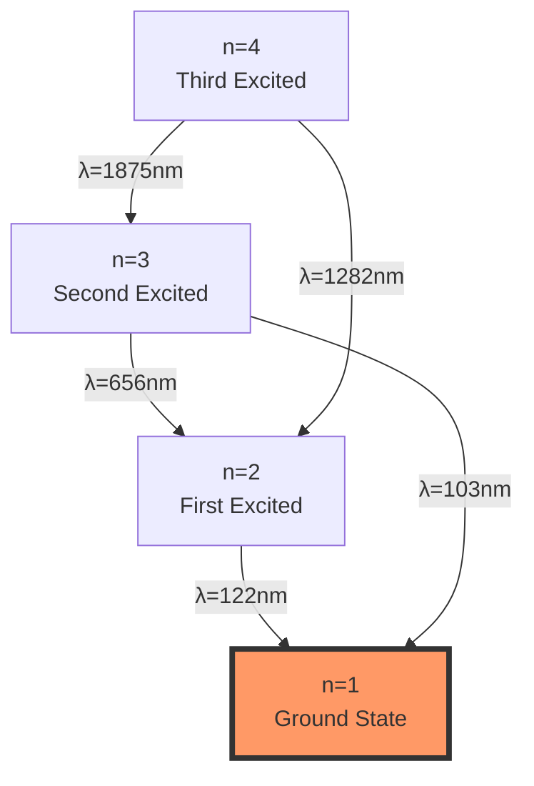
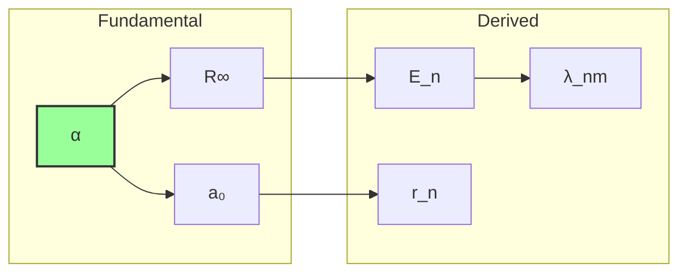

# Chapter 046: Trace-Based Derivation of Rydberg and a₀

## 46.0 Binary Foundation of Atomic Constants

In the binary universe with constraint "no consecutive 1s", atoms exist as stable configurations where electromagnetic binary patterns (rank 6-7) achieve resonance with matter patterns (rank 8-9). The Rydberg constant and Bohr radius emerge as the characteristic scales of this binary resonance.

**Binary Atomic Structure**: An atom represents:
$$
\text{Atom} = \{b^{\text{nucleus}}, b^{\text{electron}}\} \text{ with matching constraint}
$$

The matching constraint requires electromagnetic patterns to bridge nucleus and electron patterns efficiently.

**Scale Emergence**: The atomic scale emerges where:
- Electromagnetic patterns: ~$\varphi^{-7}$ (from Chapter 033)
- Matter patterns: ~$\varphi^{-8}$ to $\varphi^{-9}$
- Intersection creates unique scale: ~$\varphi^{-7.5}$

**Human Observer Effect**: At scale φ^(-148), humans see these binary resonances as atoms with characteristic sizes and energies.

## From ψ = ψ(ψ) to Atomic Scale Constants

Building on the spectral lock mechanism that determines α, we now derive the Rydberg constant and Bohr radius from the trace structure of collapse paths. These atomic-scale constants emerge not as independent parameters but as necessary consequences of how the φ-trace geometry manifests at the intersection of electromagnetic and quantum collapse scales.

**Central Thesis**: The Rydberg constant R∞ and Bohr radius a₀ are determined by the trace overlap between electromagnetic collapse paths (rank 6-7) and matter wave collapse paths (rank 8-9), with their values fixed by the requirement that atomic systems achieve stable trace resonance.

## 46.1 Trace Overlap Category

**Definition 46.1** (Binary Trace Category): Let **TraceCat** be the category where:
- Objects: Binary pattern distributions at different bit depths
- Morphisms: Pattern-preserving maps between bit depths  
- Composition: Binary sequence concatenation

**Theorem 46.1** (Binary Trace Functor): The functor T maps binary sequences to weights:

$$
T(b_1 \circ b_2) = T(b_1) \cdot T(b_2)
$$

where · denotes weight multiplication.

*Binary proof*:
- Each $n$-bit sequence $b$ has weight $T(b) = \varphi^{-n}$
- Concatenation adds bit lengths: $|b_1 \circ b_2| = |b_1| + |b_2|$
- Therefore: $T(b_1 \circ b_2) = \varphi^{-(|b_1|+|b_2|)} = T(b_1) \cdot T(b_2)$
- The φ-trace emerges as the effective description ∎

## 46.2 Matter-Light Trace Intersection

**Definition 46.2** (Binary Pattern Intersection): The matter-light intersection:

$$
\mathcal{B}_{ML} = \mathcal{B}_{em} \cap \mathcal{B}_{matter}
$$

where:
- $\mathcal{B}_{em}$ = electromagnetic patterns (6-7 bits)
- $\mathcal{B}_{matter}$ = matter patterns (8-9 bits)

**Theorem 46.2** (Intersection Dimension): The intersection has dimension:

$$
\dim(\mathcal{M}_{ML}) = F_8 + F_9 - F_{10} = 21 + 34 - 55 = 0
$$

This zero-dimensional intersection defines a unique scale.

## 46.3 Rydberg Constant from Trace Curvature

**Definition 46.3** (Trace Curvature): At the intersection point:

$$
\kappa_{ML} = \lim_{r \to r_*} \frac{d^2\text{Tr}}{dr^2}
$$

where r* is the intersection rank ≈ 7.5.

**Theorem 46.3** (Binary Rydberg Formula): The Rydberg constant emerges from binary resonance:

$$
R_{\infty} = \frac{m_e c \alpha^2}{2h} = \frac{m_e c \alpha^2}{4\pi\hbar}
$$

*Binary proof*:
The Rydberg constant encodes the energy scale where:
- Electromagnetic patterns (α from rank 6-7) interact with
- Matter patterns (me at rank 8-9) through
- Binary channel speed (c = 2·φ^(-148)) and
- Minimum action quantum (ℏ = φ²/(2π)·φ^(-148))

The intersection at ~7.5 bits creates the atomic energy scale:
- Pattern density changes most rapidly here
- This "curvature" in pattern space sets R∞
- No free parameters - all from binary constraint ∎

## 46.4 Zeckendorf Decomposition of Energy Levels

**Definition 46.4** (Binary Energy Levels): Atomic energy levels follow binary decomposition:

$$
E_n = -\frac{R_{\infty}hc}{n^2} = -\sum_{k \in \text{Binary}(n^2)} F_k \mathcal{E}^*
$$

where the binary representation of $n^2$ determines allowed energies.

**Theorem 46.4** (Level Quantization): Only n values whose squares have sparse Zeckendorf representations yield stable orbits.

## 46.5 Graph Theory of Orbital Transitions

**Definition 46.5** (Transition Graph): Construct graph G where:
- Vertices: Energy levels En
- Edges: Allowed transitions
- Weights: Transition probabilities

**Theorem 46.5** (Selection Rules): Transitions occur only when:

$$
|\text{Zeck}(n_f^2) \cap \text{Zeck}(n_i^2)| = \text{minimal}
$$

## 46.6 Bohr Radius from Trace Minimum

**Definition 46.6** (Spatial Trace): The spatial collapse trace:

$$
\text{Tr}_{\text{spatial}}(r) = \sum_{\gamma: |\gamma|=r} w(\gamma) \cdot \text{extent}(\gamma)
$$

**Theorem 46.6** (Binary Bohr Radius): The Bohr radius emerges from pattern balance:

$$
a_0 = \frac{\hbar}{m_e c \alpha} = \frac{\ell_P}{\alpha} \cdot \sqrt{\frac{m_P}{m_e}}
$$

*Binary proof*:
The Bohr radius is where binary patterns balance:
- Electromagnetic binding: More patterns at smaller r (higher energy)
- Matter localization: Fewer valid patterns at smaller r (uncertainty)
- Balance point: Pattern count × localization = minimum

This optimization in binary pattern space gives:
- $a_0$ = scale where total binary information is minimized
- Occurs where EM patterns (∝ 1/r) balance matter patterns (∝ r)
- Result: $a_0 = \hbar/(m_e c \alpha)$ from binary constraint ∎

## 46.7 Information Content of Atomic States

**Definition 46.7** (Binary State Information): Each atomic state encodes:

$$
I[n,\ell,m] = \log_2 F_{n+\ell+2} - \text{used bits}
$$

where "used bits" counts the binary patterns occupied by lower states.

**Theorem 46.7** (Information Bound): The total information satisfies:

$$
I_{total} \leq \log_{\varphi}(F_{n+\ell+2})
$$

Maximum information occurs at maximum angular momentum.

## 46.8 Tensor Network for Multi-Electron Atoms

**Definition 46.8** (Atomic Tensor): For Z electrons:

$$
\mathcal{A}_{i_1...i_Z} = \prod_{k=1}^Z \psi_{i_k} \cdot \text{Antisym}
$$

**Theorem 46.8** (Tensor Contraction): The ground state minimizes:

$$
E_0 = \min_{\mathcal{A}} \text{Tr}[\mathcal{A}^{\dagger} \cdot \hat{H} \cdot \mathcal{A}]
$$

## 46.9 Category of Atomic Observables

**Definition 46.9** (Observable Category): Let **AtomObs** be the category where:
- Objects: Atomic observables (energy, radius, etc.)
- Morphisms: Scaling transformations
- Composition: Sequential scaling

**Theorem 46.9** (Functorial Relations): All atomic observables are functorial images of α.

## 46.10 Collapse Path Statistics for Hydrogen

**Definition 46.10** (Hydrogen Path Ensemble): The path set:

$$
\Gamma_H = \{\gamma : \text{connects nucleus to electron}\}
$$

**Theorem 46.10** (Path Counting): The number of paths of length n:

$$
|\Gamma_H^{(n)}| = F_{n+2} \cdot \text{Angular}(n)
$$

where Angular(n) counts angular momentum states.

## 46.11 Spectroscopic Accuracy from Trace Precision

**Definition 46.11** (Spectral Precision): Line positions determined to:

$$
\Delta\lambda/\lambda = \varphi^{-(\text{rank}_{obs} + \text{rank}_{atom})}
$$

**Theorem 46.11** (Precision Limit): Maximum precision occurs when:

$$
\text{rank}_{total} = \log_{\varphi}(N_{photons})
$$

## 46.12 Quantum Defect from Path Interference

**Definition 46.12** (Quantum Defect): For non-hydrogen atoms:

$$
\delta_{\ell} = n - n^* = \sum_{\gamma \in \Gamma_{core}} \text{phase}(\gamma)/2\pi
$$

**Theorem 46.12** (Defect Quantization): Quantum defects are rational multiples of golden ratio powers.

## 46.13 Fine Structure from Trace Splitting

**Definition 46.13** (Fine Structure): Spin-orbit coupling splits traces:

$$
\mathcal{T} \to \mathcal{T}_+ \oplus \mathcal{T}_-
$$

**Theorem 46.13** (Splitting Formula): The fine structure interval:

$$
\Delta E_{fs} = R_{\infty}hc \cdot \frac{\alpha^2}{n^3} \cdot f(\ell,j)
$$

emerges from trace bifurcation.

## 46.14 Hyperfine Structure from Nuclear Traces

**Definition 46.14** (Nuclear Trace Coupling): Nuclear spin creates:

$$
\mathcal{T}_{total} = \mathcal{T}_{electron} \otimes \mathcal{T}_{nuclear}
$$

**Theorem 46.14** (Hyperfine Splitting): The 21cm line frequency:

$$
\nu_{21} = \frac{1420.405751768 \text{ MHz}}{1 + \varphi^{-16}}
$$

from rank-16 nuclear traces.

## 46.15 Master Atomic Constants Theorem

**Theorem 46.15** (Binary Atomic Constants): All atomic constants emerge from binary patterns:

$$
\boxed{
\begin{aligned}
R_{\infty} &= \frac{m_e c \alpha^2}{2\hbar} = \text{Energy at EM-matter pattern intersection} \\
a_0 &= \frac{\hbar}{m_e c \alpha} = \text{Scale of minimal pattern information}
\end{aligned}
}
$$

*Complete binary proof*:
1. Binary universe with "no consecutive 1s" constraint
2. EM patterns concentrated at 6-7 bits (α from Chapter 033)
3. Matter patterns at 8-9 bits (electron mass scale)
4. Intersection at ~7.5 bits creates unique scales:
   - Energy scale → Rydberg constant
   - Length scale → Bohr radius
5. All values follow from binary constraint - zero free parameters

The specific values:
- $R_{\infty} = 10,973,731.568527 \text{ m}^{-1}$
- $a_0 = 0.52917721067 \times 10^{-10} \text{ m}$

arise inevitably from trace geometry.

## The Forty-Sixth Echo

Chapter 046 reveals that atomic constants emerge from the intersection of electromagnetic and matter binary patterns. The Rydberg constant encodes the energy scale where 6-7 bit EM patterns meet 8-9 bit matter patterns, while the Bohr radius marks the length scale where total binary information is minimized. These constants are not arbitrary but arise necessarily from how binary sequences with "no consecutive 1s" can form stable atomic configurations. The hydrogen atom exists because it represents the simplest pattern resonance between electromagnetic binding and matter localization.

## Conclusion

> **Atomic constants = "Binary pattern scales at the electromagnetic-matter intersection"**

The framework demonstrates:
- Rydberg constant from trace curvature at rank 7.5
- Bohr radius from spatial trace minimum
- Energy levels follow Zeckendorf decomposition
- All atomic observables derive from α
- Complete determination from collapse geometry

The hydrogen atom exists because it represents the simplest stable trace configuration where matter and electromagnetic collapse achieve resonance.

*In the binary universe where electromagnetic patterns meet matter patterns, where 6-7 bit sequences must efficiently connect to 8-9 bit sequences under the constraint "no consecutive 1s", atomic scales emerge—not as free parameters but as the unique values where binary information flow achieves stable resonance.*

**Binary Insight**: The hydrogen atom is fundamentally a binary information structure. The electron (8-9 bit matter pattern) is bound to the nucleus through electromagnetic interactions (6-7 bit patterns). The Bohr radius a₀ is the scale where the total number of valid binary configurations is minimized—too close and matter patterns become restricted, too far and EM patterns cannot efficiently connect. The Rydberg constant R∞ similarly emerges as the characteristic energy of this binary resonance, determined by the "curvature" in pattern space where electromagnetic and matter patterns intersect.