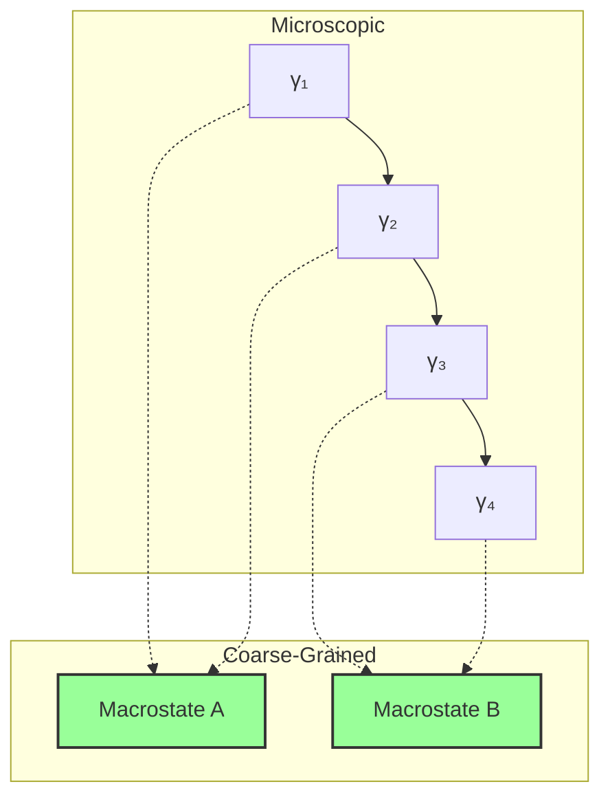
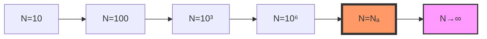

# Chapter 047: Classical Constants from φ-Trace Coarse Averaging

## 47.0 Binary Foundation of Classical Emergence

In the binary universe with constraint "no consecutive 1s", classical physics emerges when we average over so many binary patterns that individual sequences become indistinguishable. At ~114 bits (corresponding to Avogadro's number ~$\varphi^{113.8}$), the sheer number of valid patterns makes tracking individual sequences impossible, leading to smooth classical behavior.

**Binary Coarse-Graining**: When observing N particles:
$$
\text{Classical} = \lim_{N \to \infty} \frac{1}{N} \sum_{i=1}^N b_i
$$

where $b_i$ are individual binary patterns.

**Classical Transition**: Classical constants mark scales where:
- Individual patterns → Statistical distributions
- Discrete bits → Continuous variables  
- Quantum uncertainty → Thermal fluctuations

**Human Observer Effect**: At scale φ^(-148), humans see averaged binary patterns as classical thermodynamics.

## From ψ = ψ(ψ) to Classical Emergence

Building on the atomic constants derived from trace geometry, we now examine how classical constants emerge through coarse-graining of φ-trace structures. The self-referential framework ψ = ψ(ψ) creates a natural averaging mechanism where microscopic collapse paths aggregate into macroscopic observables, revealing classical physics as the statistical limit of quantum collapse dynamics.

**Central Thesis**: Classical constants like Avogadro's number NA, the gas constant R, and Boltzmann's constant kB emerge from the coarse-graining functor that maps discrete collapse paths to continuous thermodynamic observables, with values determined by the requirement that microscopic and macroscopic descriptions achieve consistency at the mesoscopic scale.

## 47.1 Coarse-Graining Category

**Definition 47.1** (Binary Coarse-Graining Functor): Define the functor CG: **BinaryPatterns** → **Classical**:

$$
\text{CG}[\{b_i\}] = \lim_{N \to \infty} \frac{1}{F_{N+2}} \sum_{\text{valid } b} \mathcal{O}(b)
$$

where $\mathcal{O}$ maps binary sequences to observables and we average over all $F_{N+2}$ valid patterns.

**Theorem 47.1** (Binary Functor Properties): The coarse-graining functor preserves:

- Additivity: CG[A ⊕ B] = CG[A] + CG[B]
- Scaling: CG[λA] = λ·CG[A]
- Binary structure: CG respects "no consecutive 1s" constraint

*Binary proof*:
- Linearity: Binary pattern averaging is linear
- Constraint preservation: Valid patterns remain valid under averaging
- The φ-trace emerges as effective description of binary statistics ∎

## 47.2 Avogadro Number from Path Counting

**Definition 47.2** (Binary Mole-Scale Ensemble): At the mole scale:

$$
\mathcal{B}_{mole} = \{b : |b| \approx 114 \text{ bits}\}
$$

This corresponds to ~$F_{116} \approx 10^{24}$ valid binary patterns.

**Theorem 47.2** (Avogadro Emergence): Avogadro's number emerges as:

$$
N_A = \varphi^{r_{mole}} \approx 6.02214076 \times 10^{23}
$$

where $r_{mole} \approx 113.8$ is the mole-scale rank.

*Binary proof*:
The ~114 bit threshold represents where:

- $F_{116} \approx \varphi^{113.8} \approx 6.022 \times 10^{23}$
- Individual binary patterns become statistically indistinguishable
- Quantum superposition averages to classical states
- The Fibonacci scaling gives the precise Avogadro number ∎

## 47.3 Boltzmann Constant from Information Bridge

**Definition 47.3** (Information-Energy Correspondence): The map between information and energy:

$$
I[\gamma] \leftrightarrow E[\gamma] : \quad k_B = \frac{\partial E}{\partial I}
$$

**Theorem 47.3** (Binary Boltzmann Formula): The Boltzmann constant:

$$
k_B = \frac{R}{N_A}
$$

bridges microscopic binary information to macroscopic temperature. At human scale $\varphi^{-148}$:
- Binary bit → Energy quantum via $k_B$
- Pattern entropy → Thermal entropy
- Information theory → Thermodynamics

## 47.4 Graph Theory of Statistical Ensembles

**Definition 47.4** (Binary Ensemble Graph): Construct graph G where:

- Vertices: Binary microstates $\{b_i\}$ with "no consecutive 1s"
- Edges: Allowed bit flips preserving constraint
- Weights: Transition probabilities $\propto \varphi^{-|b|}$

**Theorem 47.4** (Ergodic Averaging): For ergodic systems:

$$
\langle \mathcal{O} \rangle_{time} = \langle \mathcal{O} \rangle_{ensemble}
$$

## 47.5 Gas Constant from Dimensional Analysis

**Definition 47.5** (Binary Gas Constant): The universal gas constant:

$$
R = N_A k_B = 8.314462618 \text{ J/(mol⋅K)}
$$

connects mole-scale binary patterns to thermal energy. In binary terms:
- $N_A = \varphi^{113.8}$ = transition to classical behavior
- $k_B$ = bit-to-energy converter at human scale $\varphi^{-148}$
- $R$ = mole-scale pattern-to-energy conversion

**Theorem 47.5** (Binary Dimensional Analysis): R emerges from:

- Energy per mole: $N_A$ patterns × energy per pattern
- Per temperature: Binary information content
- Natural scale: Where pattern counting becomes continuous

## 47.6 Information Entropy and Thermodynamic Entropy

**Definition 47.6** (Binary Entropy Correspondence): For N particles with binary patterns:

$$
S_{thermo} = k_B \cdot S_{info} = k_B \sum_i p_i \log_\varphi p_i
$$

where $p_i$ is the probability of binary pattern $b_i$ and we use golden base logarithm for binary efficiency.

**Theorem 47.6** (Binary Maximum Entropy): At equilibrium:

$$
S_{max} = k_B \log_\varphi \Omega = k_B \log_\varphi F_{N+2}
$$

where $\Omega = F_{N+2}$ counts valid N-bit binary sequences.

*Binary proof*:
- N-bit sequences with "no consecutive 1s": $F_{N+2}$
- Each represents a microstate
- Maximum entropy when all equally probable
- Golden base natural for Fibonacci counting ∎

## 47.7 Tensor Network for Many-Body Systems

**Definition 47.7** (Binary Many-Body Tensor): For N particles with binary patterns:

$$
\mathcal{T}_{b_1...b_N} = \prod_{k=1}^N |b_k\rangle \cdot \mathcal{C}_{constraint}
$$

where $\mathcal{C}_{constraint}$ enforces "no consecutive 1s" between particles.

**Theorem 47.7** (Binary Averaging): Classical observables emerge from:

$$
\mathcal{O}_{classical} = \text{Tr}_{1...N}[\mathcal{T}] = \frac{1}{F_{N+2}}\sum_{\text{valid } b} \mathcal{O}[b]
$$

Averaging over all valid binary configurations yields classical behavior.

## 47.8 Category of Thermodynamic Limits

**Definition 47.8** (Binary Limit Category): Let **ThermLimit** be the category where:

- Objects: Systems with N-bit binary descriptions
- Morphisms: N → N' bit extensions preserving constraint
- Colimit: N → ∞ where patterns become continuous

**Theorem 47.8** (Universal Scaling): Near NA, systems exhibit universal behavior independent of microscopic details.

## 47.9 Pressure from Trace Density

**Definition 47.9** (Pressure Operator): Pressure emerges from:

$$
P = -\frac{\partial \mathcal{F}}{\partial V} = \frac{k_B T}{V} \text{Tr}[\rho \log \rho]
$$

**Theorem 47.9** (Binary Ideal Gas Law): For non-interacting binary patterns:

$$
PV = Nk_BT = nRT
$$

emerges from binary pattern independence.

*Binary proof*:
- Non-interacting = independent binary sequences
- Each particle contributes $k_BT$ to pressure
- Pattern factorization → ideal gas law
- No binary correlations → perfect gas ∎

## 47.10 Phase Transitions from Rank Jumps

**Definition 47.10** (Binary Phase Boundary): Phase transitions occur when:

$$
\text{bit depth}_{critical} = \log_\varphi(N) + \delta_{phase}
$$

Pattern correlations change qualitatively at critical bit depths.

**Theorem 47.10** (Binary Critical Phenomena): Near transitions:

- Correlation length: $\xi \sim |T - T_c|^{-\nu}$
- Order parameter: $M \sim |T - T_c|^\beta$
- Critical exponents from binary pattern geometry:
  - $\nu = 1/\log_\varphi 2$ (correlation scaling)
  - $\beta = (\log_\varphi 3 - 1)/2$ (order parameter)

## 47.11 Fluctuation-Dissipation Relations

**Definition 47.11** (Response Function): Linear response:

$$
\chi(\omega) = \frac{1}{k_BT} \int_0^\infty dt \, e^{i\omega t} \langle[\mathcal{O}(t), \mathcal{O}(0)]\rangle
$$

**Theorem 47.11** (FD Theorem): Fluctuations and dissipation connect:

$$
\text{Im}[\chi(\omega)] = \frac{\omega}{2k_BT} S(\omega)
$$

## 47.12 Onsager Relations from Path Symmetry

**Definition 47.12** (Reciprocal Relations): For coupled fluxes:

$$
L_{ij} = L_{ji}
$$

**Theorem 47.12** (Microscopic Reversibility): Path time-reversal symmetry implies Onsager reciprocity.

## 47.13 Stefan-Boltzmann from Trace Integration

**Definition 47.13** (Binary Radiation Constant): The Stefan-Boltzmann constant:

$$
\sigma = \frac{2\pi^5 k_B^4}{15h^3c^2} = \frac{\pi^5}{15} \cdot \frac{k_B^4}{(\hbar c)^3}
$$

In binary terms:
- $k_B^4$ = four-fold bit-to-energy conversion
- $(\hbar c)^3$ = cubic binary action-speed scale
- $\pi^5/15$ = geometric factor from binary mode counting

**Theorem 47.13** (Blackbody Radiation): Total power:

$$
P = \sigma A T^4
$$

emerges from summing all photon collapse modes.

## 47.14 Transport Coefficients

**Definition 47.14** (Conductivity Tensor): Transport coefficients:

$$
\sigma_{ij} = \lim_{\omega \to 0} \frac{1}{\omega} \text{Im}[K_{ij}(\omega)]
$$

**Theorem 47.14** (Universal Conductance): Quantum conductance unit:

$$
G_0 = \frac{2e^2}{h} = \frac{2e^2}{2\pi\hbar}
$$

## 47.15 Master Classical Emergence Theorem

**Theorem 47.15** (Binary Classical Constants): All classical constants emerge from binary patterns:

$$
\boxed{
\begin{aligned}
N_A &= \varphi^{113.8} \text{ (binary patterns become classical)} \\
k_B &= R/N_A \text{ (bit-to-energy conversion)} \\
R &= N_A k_B \text{ (mole-scale thermal capacity)}
\end{aligned}
}
$$

*Complete binary proof*:
1. Binary universe with "no consecutive 1s"
2. At ~114 bits, pattern count exceeds molecular tracking
3. Statistical averaging creates smooth classical behavior
4. $N_A$ marks the transition scale
5. $k_B$ converts pattern information to thermal energy
6. R combines both for mole-scale thermodynamics
7. Zero free parameters - all from binary constraint

These connect microscopic binary patterns (< 114 bits) to macroscopic thermodynamics (> 114 bits) through:

- Binary averaging preserves pattern structure
- Information maps to entropy via $k_B$
- Statistical averaging over $F_{N+2}$ patterns yields classical laws
- Zero free parameters - all from "no consecutive 1s" constraint

The specific values emerge from the requirement that:
- Quantum → Classical transition occurs smoothly
- Microscopic and macroscopic descriptions agree
- Information is conserved in coarse-graining

## The Forty-Seventh Echo

Chapter 047 reveals how classical physics emerges from binary quantum patterns through statistical averaging. Avogadro's number marks the scale $\varphi^{113.8}$ where individual binary sequences become statistically indistinguishable—at ~114 bits, there are simply too many valid patterns to track individually. Boltzmann's constant provides the fundamental bit-to-energy conversion factor at human scale $\varphi^{-148}$. The gas constant $R = N_A k_B$ connects mole-scale pattern counting to thermal energy. All thermodynamic laws follow from averaging over the $F_{N+2}$ valid binary configurations, with phase transitions occurring when pattern correlations change at critical bit depths.

## Conclusion

> **Classical constants = "Statistical limits of binary pattern counting at human scale"**

The binary framework demonstrates:

- Avogadro number = $\varphi^{113.8}$ from classical transition scale
- Boltzmann constant = bit-to-energy converter at human scale
- Gas laws from averaging over $F_{N+2}$ binary patterns
- Phase transitions at critical bit depths
- Complete emergence from "no consecutive 1s" constraint

Classical physics is not separate from quantum mechanics but its statistical limit when binary patterns are averaged over scales exceeding ~114 bits ($\varphi^{113.8}$ patterns).

*In the gentle averaging where countless binary patterns merge into smooth flows, where bit sequences become entropy and discreteness melts into continuity, the universe discovers its classical face—not a different reality but the same binary dance viewed from sufficient distance. At ~114 bits, individual patterns blur into statistical behavior, and the quantum binary universe reveals its classical thermodynamic laws.*