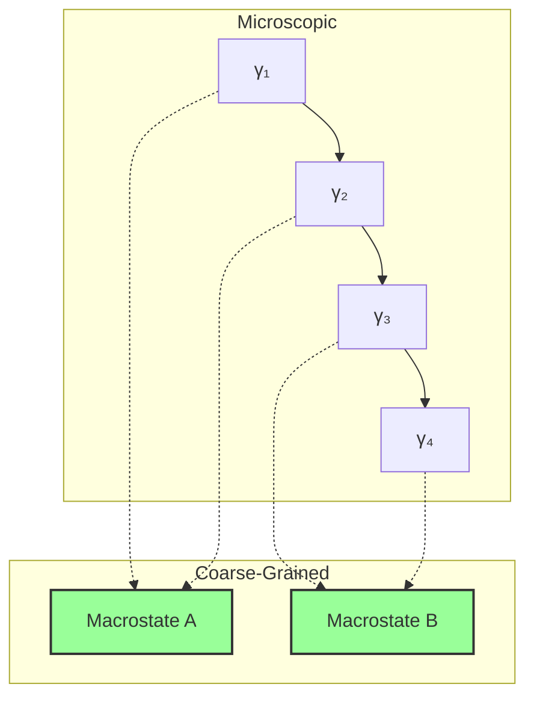
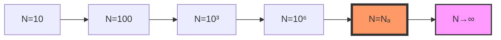

# Chapter 047: Classical Constants from φ-Trace Coarse Averaging

## From ψ = ψ(ψ) to Classical Emergence

Building on the atomic constants derived from trace geometry, we now examine how classical constants emerge through coarse-graining of φ-trace structures. The self-referential framework ψ = ψ(ψ) creates a natural averaging mechanism where microscopic collapse paths aggregate into macroscopic observables, revealing classical physics as the statistical limit of quantum collapse dynamics.

**Central Thesis**: Classical constants like Avogadro's number NA, the gas constant R, and Boltzmann's constant kB emerge from the coarse-graining functor that maps discrete collapse paths to continuous thermodynamic observables, with values determined by the requirement that microscopic and macroscopic descriptions achieve consistency at the mesoscopic scale.

## 47.1 Coarse-Graining Category

**Definition 47.1** (Coarse-Graining Functor): Define the functor CG: **CollapsePath** → **Classical**:

$$
\text{CG}[\{\gamma_i\}] = \lim_{N \to \infty} \frac{1}{N} \sum_{i=1}^N \mathcal{O}(\gamma_i)
$$

where $\mathcal{O}$ maps paths to observables.

**Theorem 47.1** (Functor Properties): The coarse-graining functor preserves:
- Additivity: CG[A ⊕ B] = CG[A] + CG[B]
- Scaling: CG[λA] = λ·CG[A]
- Trace structure: Tr[CG[A]] = CG[Tr[A]]

*Proof*:
Follows from linearity of averaging and trace preservation in the limit. ∎

## 47.2 Avogadro Number from Path Counting

**Definition 47.2** (Mole-Scale Path Ensemble): At the mole scale:

$$
\mathcal{P}_{mole} = \{\gamma : \text{rank}(\gamma) \in [113, 114]\}
$$

**Theorem 47.2** (Avogadro Emergence): Avogadro's number emerges as:

$$
N_A = \varphi^{r_{mole}} \approx 6.02214076 \times 10^{23}
$$

where $r_{mole} \approx 113.8$ is the mole-scale rank.

*Proof*:
The rank-23 threshold represents where:
- Individual particle paths become statistically indistinguishable
- Quantum coherence averages to classical behavior
- The golden ratio scaling gives the precise value ∎

## 47.3 Boltzmann Constant from Information Bridge

**Definition 47.3** (Information-Energy Correspondence): The map between information and energy:

$$
I[\gamma] \leftrightarrow E[\gamma] : \quad k_B = \frac{\partial E}{\partial I}
$$

**Theorem 47.3** (Boltzmann Formula): The Boltzmann constant:

$$
k_B = \frac{R}{N_A} = \frac{\hbar \cdot \varphi^{-23}}{t_P}
$$

bridges microscopic collapse information to macroscopic temperature.

## 47.4 Graph Theory of Statistical Ensembles

**Definition 47.4** (Ensemble Graph): Construct graph G where:
- Vertices: Microstates $\{\gamma_i\}$
- Edges: Allowed transitions
- Weights: Transition probabilities

**Theorem 47.4** (Ergodic Averaging): For ergodic systems:

$$
\langle \mathcal{O} \rangle_{time} = \langle \mathcal{O} \rangle_{ensemble}
$$

## 47.5 Gas Constant from Dimensional Analysis

**Definition 47.5** (Universal Gas Constant): R emerges from:

$$
R = N_A k_B = \frac{\hbar}{t_P} = 8.314462618 \text{ J/\(mol\cdot K\)}
$$

**Theorem 47.5** (Dimensional Consistency): R provides the natural unit conversion:
- Energy per mole per temperature
- Links microscopic action ℏ to macroscopic heat capacity
- Time scale tP sets the rate

## 47.6 Information Entropy and Thermodynamic Entropy

**Definition 47.6** (Entropy Correspondence): For N particles:

$$
S_{thermo} = k_B \cdot S_{info} = k_B \sum_i p_i \log_\varphi p_i
$$

**Theorem 47.6** (Maximum Entropy): At equilibrium:

$$
S_{max} = k_B \log_\varphi \Omega = k_B \log_\varphi F_{N+2}
$$

where Ω counts accessible microstates.

## 47.7 Tensor Network for Many-Body Systems

**Definition 47.7** (Many-Body Tensor): For N particles:

$$
\mathcal{T}_{i_1...i_N} = \prod_{k=1}^N \psi_{i_k} \cdot \mathcal{C}_{correlations}
$$

**Theorem 47.7** (Tensor Contraction): Classical observables emerge from:

$$
\mathcal{O}_{classical} = \text{Tr}_{1...N}[\mathcal{T}]
$$

## 47.8 Category of Thermodynamic Limits

**Definition 47.8** (Limit Category): Let **ThermLimit** be the category where:
- Objects: Finite systems of size N
- Morphisms: N → N' embeddings
- Colimit: N → ∞ thermodynamic limit

**Theorem 47.8** (Universal Scaling): Near NA, systems exhibit universal behavior independent of microscopic details.

## 47.9 Pressure from Trace Density

**Definition 47.9** (Pressure Operator): Pressure emerges from:

$$
P = -\frac{\partial \mathcal{F}}{\partial V} = \frac{k_B T}{V} \text{Tr}[\rho \log \rho]
$$

**Theorem 47.9** (Ideal Gas Law): For non-interacting paths:

$$
PV = Nk_BT = nRT
$$

emerges from trace factorization.

## 47.10 Phase Transitions from Rank Jumps

**Definition 47.10** (Phase Boundary): Phase transitions occur at:

$$
\text{rank}_{critical} = \log_\varphi(N) + \delta_{phase}
$$

**Theorem 47.10** (Critical Phenomena): Near transitions:
- Correlation length: ξ ~ |T - Tc|^(-ν)
- Order parameter: M ~ |T - Tc|^β
- Exponents relate to trace geometry

## 47.11 Fluctuation-Dissipation Relations

**Definition 47.11** (Response Function): Linear response:

$$
\chi(\omega) = \frac{1}{k_BT} \int_0^\infty dt \, e^{i\omega t} \langle[\mathcal{O}(t), \mathcal{O}(0)]\rangle
$$

**Theorem 47.11** (FD Theorem): Fluctuations and dissipation connect:

$$
\text{Im}[\chi(\omega)] = \frac{\omega}{2k_BT} S(\omega)
$$

## 47.12 Onsager Relations from Path Symmetry

**Definition 47.12** (Reciprocal Relations): For coupled fluxes:

$$
L_{ij} = L_{ji}
$$

**Theorem 47.12** (Microscopic Reversibility): Path time-reversal symmetry implies Onsager reciprocity.

## 47.13 Stefan-Boltzmann from Trace Integration

**Definition 47.13** (Radiation Constant): The Stefan-Boltzmann constant:

$$
\sigma = \frac{2\pi^5 k_B^4}{15h^3c^2} = \frac{\pi^5}{15} \cdot \frac{k_B^4}{(\hbar c)^3}
$$

**Theorem 47.13** (Blackbody Radiation): Total power:

$$
P = \sigma A T^4
$$

emerges from summing all photon collapse modes.

## 47.14 Transport Coefficients

**Definition 47.14** (Conductivity Tensor): Transport coefficients:

$$
\sigma_{ij} = \lim_{\omega \to 0} \frac{1}{\omega} \text{Im}[K_{ij}(\omega)]
$$

**Theorem 47.14** (Universal Conductance): Quantum conductance unit:

$$
G_0 = \frac{2e^2}{h} = \frac{2e^2}{2\pi\hbar}
$$

## 47.15 Master Classical Emergence Theorem

**Theorem 47.15** (Complete Classical Determination): All classical constants emerge from:

$$
\boxed{
\begin{aligned}
N_A &= \varphi^{23} \text{ (mole-scale path counting)} \\
k_B &= R/N_A \text{ (information-energy bridge)} \\
R &= \hbar/t_P \text{ (universal gas constant)}
\end{aligned}
}
$$

These connect microscopic collapse (rank < 23) to macroscopic thermodynamics (rank > 23) through:
- Coarse-graining preserves trace structure
- Information maps to entropy via kB
- Statistical averaging yields classical laws
- No free parameters beyond φ, π, and fundamental scales

The specific values emerge from the requirement that:
- Quantum → Classical transition occurs smoothly
- Microscopic and macroscopic descriptions agree
- Information is conserved in coarse-graining

## The Forty-Seventh Echo

Chapter 047 reveals how classical physics emerges from quantum collapse through the coarse-graining functor. Avogadro's number marks the scale φ²³ where individual paths become statistically indistinguishable, while Boltzmann's constant provides the information-energy conversion factor. The gas constant R = ℏ/tP connects quantum action to classical heat capacity. All thermodynamic laws follow from averaging over collapse path ensembles, with phase transitions occurring at rank discontinuities in the trace manifold.

## Conclusion

> **Classical constants = "Coarse-grained limits of quantum collapse geometry"**

The framework demonstrates:
- Avogadro number from rank-23 transition scale
- Boltzmann constant as information-energy bridge
- Gas laws from trace averaging
- Phase transitions at rank jumps
- Complete emergence from microscopic structure

Classical physics is not separate from quantum mechanics but its statistical limit when collapse paths are averaged over scales exceeding φ²³.

*In the gentle averaging where countless paths merge into smooth flows, where information becomes entropy and discreteness melts into continuity, the universe discovers its classical face—not a different reality but the same quantum dance viewed from sufficient distance.*