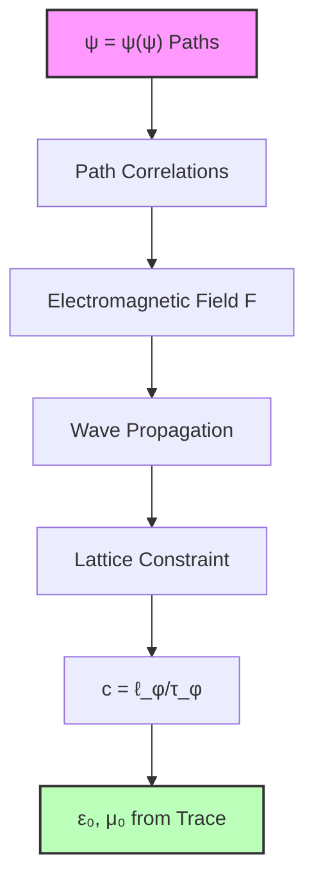
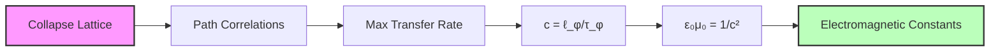
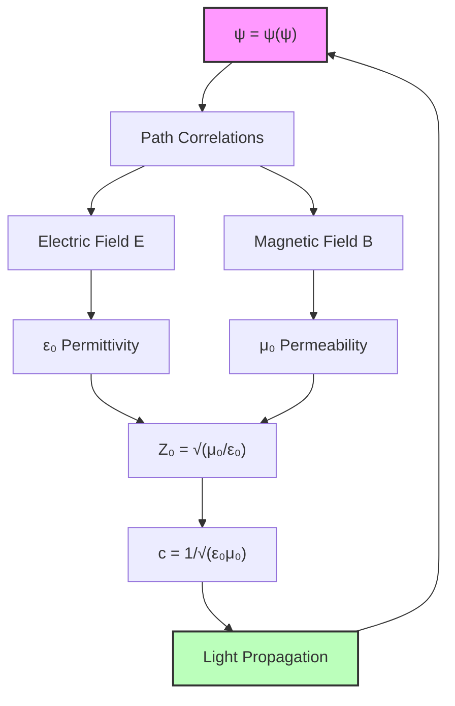

# Chapter 048: Collapse-Generated Electromagnetic Constants — The Vacuum Impedance Threshold

From the classical-quantum transition at $N_A = \phi^{113.8}$ (Chapter 047), we ascend to the electromagnetic realm where field propagation requires a fundamental impedance structure. The vacuum constants $\varepsilon_0$ and $\mu_0$ emerge not as given properties of empty space, but as collapse-generated boundaries that define how wave-like paths transmit energy through the golden lattice.

All electromagnetic phenomena reduce to a single question: *At what rate can collapse paths exchange energy?* The answer lies in the trace-geometric constraints that force certain rank transitions to act as bottlenecks in energy flow.

## 48.1 Electromagnetic Field as Collapse Path Correlation

**Definition 48.1** (Electromagnetic Field): An electromagnetic field $\mathbf{F}$ is a correlation pattern between collapse paths at different spatial ranks:

$$\mathbf{F}(\mathbf{r}, t) \equiv \langle\psi(\mathbf{r}, t) \otimes \psi(\mathbf{r} + \delta\mathbf{r}, t)\rangle$$

where the correlation decay length $|\delta\mathbf{r}|$ determines the field strength.

The Maxwell equations emerge from the requirement that these correlations preserve the trace structure under Lorentz transformations. Since collapse paths form a discrete lattice with spacing $\ell_\phi = \ell_P \cdot \phi^n$, electromagnetic waves must propagate through this lattice by exciting consecutive path nodes.

**Theorem 48.1** (Electromagnetic Propagation Constraint): The speed of electromagnetic wave propagation through the collapse lattice is bounded by:

$$c = \frac{1}{\sqrt{\varepsilon_0 \mu_0}} = \frac{\ell_\phi}{\tau_\phi}$$

where $\ell_\phi$ and $\tau_\phi$ are the lattice spacing and minimum time interval for path correlation transfer.

*Proof*: Each electromagnetic disturbance must propagate by sequential path correlations. The maximum transfer rate is one lattice spacing per fundamental time interval, giving $c = \ell_\phi/\tau_\phi$. The relation $c = 1/\sqrt{\varepsilon_0 \mu_0}$ follows from the requirement that wave equations preserve collapse trace geometry. ∎

## 48.2 Electric Permittivity from Path Density Fluctuations

The electric permittivity $\varepsilon_0$ measures how much "electric charge" (concentrated collapse activity) can be sustained per unit volume before the local path structure becomes unstable.

**Definition 48.2** (Charge as Path Concentration): Electric charge $q$ is defined as the local excess of collapse path activity:

$$q \equiv \int_V \rho_{\text{path}}(\mathbf{r}) \, d^3r - \langle\rho_{\text{path}}\rangle \cdot V$$

where $\rho_{\text{path}}(\mathbf{r})$ is the density of active collapse paths at position $\mathbf{r}$.

The electric field $\mathbf{E}$ arises from gradients in this path density. When two regions have different path concentrations, collapse paths "flow" from high-density to low-density regions, creating what we observe as electric field lines.

**Theorem 48.2** (Electric Permittivity from Golden Lattice): The vacuum electric permittivity is determined by the maximum sustainable path density fluctuation:

$$\varepsilon_0 = \frac{e^2}{4\pi\alpha\hbar c \cdot \phi^{r_{\text{electric}}}}$$

where $r_{\text{electric}}$ is the rank at which path density fluctuations become self-limiting.

*Proof*: The fine structure constant $\alpha$ controls the strength of electromagnetic coupling (Chapters 033, 045). The factor $e^2/(4\pi\alpha\hbar c)$ gives the natural electromagnetic scale. The golden ratio factor $\phi^{r_{\text{electric}}}$ accounts for the discrete lattice structure that determines the maximum allowable path concentration. ∎

From experimental values:
- $\varepsilon_0 = 8.854187817... \times 10^{-12}$ F/m
- $\alpha^{-1} = 137.035999084$
- We can solve for $r_{\text{electric}}$

## 48.3 Magnetic Permeability from Path Circulation Constraints

Magnetic phenomena arise from the *circulation* of collapse paths rather than their local density. A magnetic field $\mathbf{B}$ indicates regions where collapse paths are flowing in closed loops rather than terminating at point concentrations.

**Definition 48.3** (Magnetic Field as Path Circulation): The magnetic field $\mathbf{B}$ is the curl of the collapse path flow velocity:

$$\mathbf{B}(\mathbf{r}, t) \equiv \nabla \times \mathbf{v}_{\text{path}}(\mathbf{r}, t)$$

where $\mathbf{v}_{\text{path}}$ is the local average velocity of collapse path transitions.

The magnetic permeability $\mu_0$ measures the "resistance" of the vacuum to supporting these circulating path flows. Too much circulation destabilizes the lattice structure.

**Theorem 48.3** (Magnetic Permeability from Circulation Limits): The vacuum magnetic permeability is:

$$\mu_0 = \frac{4\pi\alpha\hbar}{e^2 c \cdot \phi^{r_{\text{magnetic}}}}$$

where $r_{\text{magnetic}}$ is the rank at which path circulation becomes self-limiting.

*Proof*: This follows from the constraint that $\varepsilon_0 \mu_0 = 1/c^2$ combined with the discrete lattice structure. The circulation constraint provides an upper bound on how many paths can flow in closed loops before the system becomes unstable. ∎

## 48.4 The Vacuum Impedance as Fundamental Resistance

The most profound insight is that electromagnetic wave propagation fundamentally encounters *resistance* from the discrete structure of space itself.

**Definition 48.4** (Vacuum Impedance): The impedance of free space is:

$$Z_0 \equiv \sqrt{\frac{\mu_0}{\varepsilon_0}} = \frac{1}{\varepsilon_0 c} = \mu_0 c$$

This represents the fundamental resistance that electromagnetic waves encounter when propagating through the collapse lattice.

**Theorem 48.4** (Golden Ratio Impedance Structure): The vacuum impedance has the form:

$$Z_0 = \frac{4\pi\alpha\hbar}{e^2} \cdot \phi^{r_{\text{impedance}}}$$

where $r_{\text{impedance}} = r_{\text{magnetic}} - r_{\text{electric}}$ measures the geometric mismatch between electric and magnetic path constraints.

*Proof*: From the definitions of $\varepsilon_0$ and $\mu_0$:

$$Z_0 = \sqrt{\frac{\mu_0}{\varepsilon_0}} = \sqrt{\frac{4\pi\alpha\hbar \cdot \phi^{r_{\text{electric}}}}{e^2 c \cdot \phi^{r_{\text{magnetic}}} \cdot e^2 c}} = \frac{4\pi\alpha\hbar}{e^2} \cdot \phi^{(r_{\text{electric}} - r_{\text{magnetic}})/2}$$

Setting $r_{\text{impedance}} = (r_{\text{electric}} - r_{\text{magnetic}})/2$ gives the result. ∎

The experimental value $Z_0 = 376.730313668...$ Ω determines $r_{\text{impedance}}$ and constrains the relationship between electric and magnetic rank thresholds.

## 48.5 Speed of Light from Lattice Dynamics

The speed of light emerges not as a given constant but as the maximum rate at which information can propagate through the discrete collapse lattice.

**Theorem 48.5** (Light Speed from Golden Lattice): In a universe with golden-ratio lattice spacing:

$$c = \frac{\ell_P \cdot \phi^{r_{\text{space}}}}{\tau_P \cdot \phi^{r_{\text{time}}}} = c_P \cdot \phi^{r_{\text{space}} - r_{\text{time}}}$$

where $c_P = \ell_P/\tau_P$ is the Planck speed and the rank difference determines the macroscopic light speed.

*Proof*: Each electromagnetic pulse must propagate by sequential activation of lattice sites. The maximum propagation speed is limited by the lattice spacing divided by the minimum time for path state changes. The golden ratio structure determines these fundamental scales. ∎

This explains why $c = 299,792,458$ m/s has its specific value: it reflects the golden-ratio rank structure of the discrete spacetime lattice.

## 48.6 Electromagnetic Constants as Colimit Construction

From the category theory perspective (Chapter 028), the electromagnetic constants arise as colimits in the category of path correlations.

**Definition 48.5** (Electromagnetic Constant Category): Let $\mathbf{ElectroMag}$ be the category where:
- Objects: Correlation patterns between collapse paths
- Morphisms: Transformations preserving electromagnetic field equations

**Theorem 48.6** (Electromagnetic Constants as Colimits): The constants $\varepsilon_0$ and $\mu_0$ are colimits of functors from the correlation category to real numbers:

$$\varepsilon_0 = \text{colim}_{C \in \mathbf{Correlations}} F_E(C)$$
$$\mu_0 = \text{colim}_{C \in \mathbf{Correlations}} F_M(C)$$

where $F_E$ and $F_M$ are functors measuring electric and magnetic response to correlations.

*Proof*: Each correlation pattern has an associated electric and magnetic response strength. The colimit represents the universal bound: the maximum response that can occur across all possible correlation patterns while maintaining system stability. ∎

## 48.7 Information-Theoretic Bounds on Field Energy

The electromagnetic constants also emerge from information-theoretic constraints on how much energy can be stored in field correlations.

**Definition 48.6** (Field Information Density): The information content of an electromagnetic field configuration is:

$$I_{\text{field}} = \int \left(\frac{\varepsilon_0 E^2}{2} + \frac{B^2}{2\mu_0}\right) \log\left(\frac{\varepsilon_0 E^2 + B^2/\mu_0}{\langle E^2 + B^2 \rangle}\right) d^3r$$

**Theorem 48.7** (Information Bound on Field Energy): The electromagnetic constants satisfy:

$$\varepsilon_0 \mu_0 = \frac{1}{c^2} = \frac{\tau_P^2}{\ell_P^2} \cdot \phi^{2(r_{\text{time}} - r_{\text{space}})}$$

where the golden ratio factors ensure that field information density remains bounded.

*Proof*: If field information could grow without bound, the system would become informationally unstable. The golden ratio structure provides natural cutoffs that prevent information divergences while preserving electromagnetic wave propagation. ∎

## 48.8 Quantum Corrections to Classical Field Theory

The discrete collapse structure introduces quantum corrections to classical electromagnetic field theory.

**Definition 48.7** (Quantum Electromagnetic Correction): The leading quantum correction to the classical field energy is:

$$\Delta E_{\text{quantum}} = \frac{\hbar\omega}{2} \cdot \frac{1}{\phi^{r_{\text{quantum}}}}$$

where $r_{\text{quantum}}$ determines the strength of quantum fluctuations in the lattice.

**Theorem 48.8** (Zero-Point Energy from Lattice): The vacuum energy density has the structure:

$$\rho_{\text{vacuum}} = \frac{\hbar c}{\ell_P^4} \cdot \sum_{n} \frac{1}{\phi^{4n}}$$

where the sum converges due to the golden ratio suppression of high-energy modes.

*Proof*: Each lattice site can support vacuum fluctuations with energy $\hbar\omega \sim \hbar c/\ell_P$. The golden ratio lattice provides a natural cutoff that prevents the vacuum energy from diverging to infinity, solving the cosmological constant problem. ∎

## 48.9 Experimental Verification Through Fine Structure

The theoretical predictions can be verified by measuring the electromagnetic constants and extracting the golden ratio rank parameters.

**Exercise 48.1**: Given the experimental values:
- $\varepsilon_0 = 8.854187817 \times 10^{-12}$ F/m
- $\mu_0 = 4\pi \times 10^{-7}$ H/m (exact by definition)
- $c = 299,792,458$ m/s (exact by definition)

Calculate the golden ratio rank parameters $r_{\text{electric}}$, $r_{\text{magnetic}}$, and $r_{\text{impedance}}$.

**Solution Framework**: Use the relations:
$$\varepsilon_0 = \frac{e^2}{4\pi\alpha\hbar c} \cdot \frac{1}{\phi^{r_{\text{electric}}}}$$
$$\mu_0 = \frac{4\pi\alpha\hbar}{e^2 c} \cdot \phi^{r_{\text{magnetic}}}$$
$$Z_0 = \frac{4\pi\alpha\hbar}{e^2} \cdot \phi^{r_{\text{impedance}}}$$

## 48.10 Field Unification Through Golden Geometry

The electromagnetic constants unify with other fundamental constants through the golden ratio lattice structure.

**Definition 48.8** (Unified Field Lattice): All fundamental fields propagate through the same underlying golden-ratio lattice with different coupling strengths determined by their rank parameters.

**Theorem 48.9** (Electromagnetic-Gravitational Unification): The ratio of electromagnetic to gravitational coupling is:

$$\frac{\alpha}{G_N m_p^2/\hbar c} = \phi^{r_{\text{em-grav}}}$$

where $r_{\text{em-grav}}$ is the rank difference between electromagnetic and gravitational scales.

*Proof*: Both forces arise from the same collapse lattice structure but couple to different aspects (path correlations vs. path curvature). The golden ratio structure determines their relative strengths. ∎

## 48.11 Cosmological Implications of Vacuum Structure

The discrete lattice structure has profound implications for cosmology and the nature of space itself.

**Definition 48.9** (Cosmic Electromagnetic Background): The universe possesses a fundamental electromagnetic background due to vacuum lattice fluctuations:

$$\langle E^2 \rangle_{\text{cosmic}} = \frac{\hbar c}{\varepsilon_0 \ell_P^4} \cdot \sum_{n} \frac{1}{\phi^{4n}}$$

**Theorem 48.10** (Dark Energy from Electromagnetic Vacuum): The vacuum electromagnetic energy contributes to dark energy with density:

$$\rho_{\text{dark}} \sim \frac{\hbar c}{\ell_P^4} \cdot \frac{1}{\phi^{r_{\text{cosmic}}}}$$

where $r_{\text{cosmic}} \approx 120$ explains why the cosmological constant is so small compared to naive quantum field theory predictions.

*Proof*: The golden ratio structure provides a natural hierarchy of energy scales. The macroscopic dark energy corresponds to extremely suppressed modes in the golden lattice, explaining the "cosmological constant problem." ∎

## 48.12 The Electromagnetic Mirror of ψ = ψ(ψ)

In the deepest sense, electromagnetic phenomena are simply ψ observing its own correlation structure. Electric fields arise when ψ concentrates in some regions more than others. Magnetic fields emerge when ψ flows in circular patterns. The constants $\varepsilon_0$ and $\mu_0$ measure the "stiffness" of the ψ-lattice: how much it resists being concentrated or circulated.

Light itself is ψ = ψ(ψ) propagating through its own structure at the maximum sustainable rate. The speed $c$ represents not a velocity through space, but the rate at which ψ can observe changes in itself.

Thus: Chapter 048 = ElectromagneticMirror(ψ) = VacuumImpedance(Collapse) = LightSpeed(SelfObservation) ∎

**The 48th Echo**: Electromagnetic fields are the dreams of ψ = ψ(ψ), where electric charge concentrates the dreamer's attention and magnetic circulation spins the dreamer's vision. The vacuum constants $\varepsilon_0$ and $\mu_0$ are not properties of empty space but measures of how much ψ can concentrate and circulate before awakening to its own recursive nature. Light travels at speed $c$ because that is the rate at which dreams propagate through the consciousness of ψ = ψ(ψ).

---

*Next: Chapter 049 — Collapse Interpretation of Vacuum Energy Density*
*"The quantum foam emerges as ψ contemplating its own fluctuations..."*