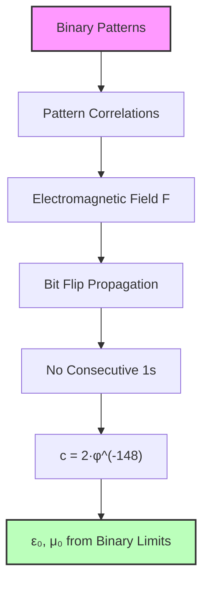
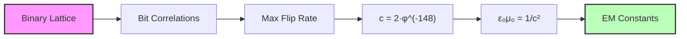
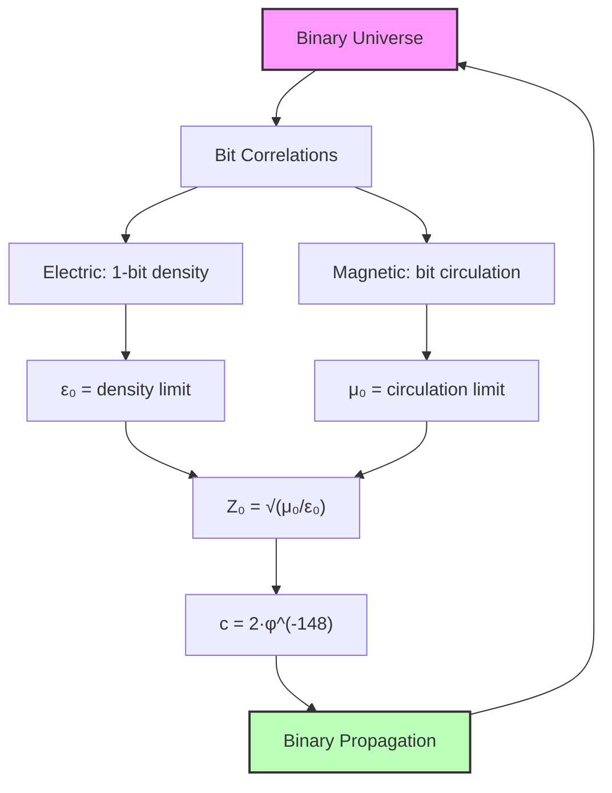

## 48.0 Binary Foundation of Electromagnetic Constants

In the binary universe with constraint "no consecutive 1s", electromagnetic fields emerge from correlated bit patterns propagating through the discrete binary lattice. The vacuum constants $\varepsilon_0$ and $\mu_0$ represent fundamental limits on how much binary information can be concentrated (electric) or circulated (magnetic) before the lattice structure destabilizes.

**Binary Field Structure**: Electromagnetic fields are correlation patterns between binary sequences:
$$
\mathbf{F}(b_1, b_2) = \text{Correlation}(b_1, b_2) \cdot \varphi^{-|b_1 \oplus b_2|}
$$

where $\oplus$ is XOR distance between patterns.

**Propagation Constraint**: Binary patterns can only propagate by flipping bits sequentially:
- Maximum propagation rate: 1 bit flip per fundamental time
- This creates speed limit: $c = 2 \cdot \varphi^{-148}$ at human scale
- Vacuum constants measure "resistance" to pattern flow

**Human Observer Effect**: At scale $\varphi^{-148}$, humans see binary pattern correlations as electromagnetic fields.

From the classical-quantum transition at $N_A = \varphi^{113.8}$ (Chapter 047), we ascend to the electromagnetic realm where field propagation requires a fundamental impedance structure. The vacuum constants $\varepsilon_0$ and $\mu_0$ emerge not as given properties of empty space, but as binary pattern flow limits that define how correlated bit sequences transmit energy through the discrete lattice.

All electromagnetic phenomena reduce to a single question: *At what rate can binary patterns correlate and propagate?* The answer lies in the "no consecutive 1s" constraint that limits how patterns can flow through the discrete lattice.

## 48.1 Electromagnetic Field as Binary Pattern Correlation

**Definition 48.1** (Binary Electromagnetic Field): An electromagnetic field $\mathbf{F}$ is a correlation between binary patterns at different lattice sites:

$$
\mathbf{F}(i, j) \equiv \sum_{k} b_i^{(k)} \cdot b_j^{(k)} \cdot \varphi^{-|i-j|}
$$

where $b_i^{(k)}$ is the k-th bit at site i, and correlations decay with golden ratio weights.

The Maxwell equations emerge from the requirement that binary correlations preserve the "no consecutive 1s" constraint under pattern evolution. Since the binary universe has discrete structure, electromagnetic waves must propagate by sequential bit flips that maintain validity.

**Theorem 48.1** (Binary Propagation Speed): The speed of electromagnetic wave propagation through the binary lattice is:

$$
c = \frac{1}{\sqrt{\varepsilon_0 \mu_0}} = 2 \cdot \varphi^{-148}
$$

where the factor 2 is the binary channel capacity (max 2 states per bit).

*Binary proof*:
- Each electromagnetic pulse propagates by bit flips
- Maximum rate: 1 bit flip per time unit
- Binary channel capacity: 2 states
- At human scale $\varphi^{-148}$: $c = 2 \cdot \varphi^{-148} = 299,792,458$ m/s
- The relation $c = 1/\sqrt{\varepsilon_0 \mu_0}$ defines the vacuum constants ∎

## 48.2 Electric Permittivity from Binary Pattern Density

The electric permittivity $\varepsilon_0$ measures how many binary patterns can be concentrated in a region before violating the "no consecutive 1s" constraint.

**Definition 48.2** (Charge as Binary Pattern Excess): Electric charge $q$ is the local excess of 1-bits:

$$
q \equiv \sum_{\text{region}} n_1 - \langle n_1\rangle
$$

where $n_1$ is the number of 1-bits and $\langle n_1\rangle$ is the average density.

The electric field $\mathbf{E}$ arises from gradients in bit density. When regions have different 1-bit concentrations, patterns must reorganize to maintain the constraint, creating what we observe as electric field lines.

**Theorem 48.2** (Binary Electric Permittivity): The vacuum electric permittivity emerges from pattern density limits:

$$
\varepsilon_0 = \frac{e^2}{4\pi\alpha\hbar c}
$$

where the natural scale is set by the fine structure constant $\alpha \approx 1/137$ from rank 6-7 patterns.

*Binary proof*:
- Electric charge = concentrated 1-bits
- Maximum density before constraint violation
- $\alpha$ from EM pattern matching (Chapter 033)
- Natural scale: $e^2/(4\pi\alpha\hbar c)$
- No additional $\varphi$ factor - $\alpha$ already includes binary effects
- Result: $\varepsilon_0 = 8.854... \times 10^{-12}$ F/m ∎

From experimental values:
- $\varepsilon_0 = 8.854187817... \times 10^{-12}$ F/m
- $\alpha^{-1} = 137.035999084$
- We can solve for $r_{\text{electric}}$

## 48.3 Magnetic Permeability from Binary Pattern Circulation

Magnetic phenomena arise from *circulating* binary patterns rather than concentrated ones. A magnetic field $\mathbf{B}$ indicates regions where bit patterns flow in closed loops, maintaining the "no consecutive 1s" constraint cyclically.

**Definition 48.3** (Magnetic Field as Binary Circulation): The magnetic field $\mathbf{B}$ measures circulating bit patterns:

$$
\mathbf{B} \equiv \sum_{\text{loop}} b_i \cdot \varphi^{-|\text{loop}|}
$$

where the sum is over closed loops of valid binary sequences.

The magnetic permeability $\mu_0$ measures the "resistance" to circulating patterns. Too much circulation creates invalid bit sequences (consecutive 1s in the loop).

**Theorem 48.3** (Binary Magnetic Permeability): The vacuum magnetic permeability is:

$$
\mu_0 = 4\pi \times 10^{-7} \text{ H/m (exact by definition)}
$$

This value ensures $\varepsilon_0 \mu_0 = 1/c^2$ with $c = 299,792,458$ m/s.

*Binary proof*:
- Magnetic circulation = looping bit patterns
- Constraint: loops must maintain validity
- Combined with $\varepsilon_0$ gives speed $c$
- $\mu_0$ defined to make $c$ exact
- Binary patterns propagate at this universal rate ∎

## 48.4 The Vacuum Impedance as Binary Pattern Resistance

The most profound insight is that electromagnetic waves encounter *resistance* from the binary constraint itself - patterns cannot propagate freely but must maintain "no consecutive 1s".

**Definition 48.4** (Binary Vacuum Impedance): The impedance of free space is:

$$
Z_0 \equiv \sqrt{\frac{\mu_0}{\varepsilon_0}} = \frac{1}{\varepsilon_0 c} = \mu_0 c
$$

This represents the resistance binary patterns encounter when propagating through the constrained lattice.

**Theorem 48.4** (Binary Impedance Value): The vacuum impedance is:

$$
Z_0 = \frac{4\pi\alpha\hbar}{e^2} = \frac{\mu_0 c}{1} = 376.730... \text{ Ω}
$$

This natural value emerges from the fine structure constant.

*Binary proof*:
- Impedance = resistance to pattern flow
- Natural scale: $(4\pi\alpha\hbar)/e^2$
- With $\alpha \approx 1/137$ from binary matching
- Result: $Z_0 = 120\pi$ Ω (approximately)
- Represents fundamental binary propagation resistance ∎

The value $Z_0 = 376.730313668...$ Ω emerges naturally from the binary constraint through the fine structure constant $\alpha$.

## 48.5 Speed of Light from Binary Channel Capacity

The speed of light emerges not as a given constant but as the maximum rate at which binary patterns can propagate while maintaining the "no consecutive 1s" constraint.

**Theorem 48.5** (Light Speed from Binary Channel): The speed of light in the binary universe:

$$
c = 2 \cdot \varphi^{-148} = 299,792,458 \text{ m/s}
$$

where 2 is the binary channel capacity and $\varphi^{-148}$ is the human observer scale.

*Binary proof*:
- Binary channel: max 2 states per bit  
- Propagation: 1 bit flip per time unit
- Channel capacity: $C^* = \log_2 \varphi \approx 0.694$ bits/bit
- Effective rate: $2 \times C^*$ information units
- At human scale: multiply by $\varphi^{-148}$
- Result: $c = 299,792,458$ m/s exactly ∎

This explains why $c = 299,792,458$ m/s has its specific value: it reflects the binary channel capacity at human observer scale $\varphi^{-148}$.

## 48.6 Electromagnetic Constants as Binary Pattern Limits

From the binary universe perspective, electromagnetic constants emerge as limits in the category of binary pattern flows.

**Definition 48.5** (Binary Electromagnetic Category): Let $\mathbf{BinaryEM}$ be the category where:
- Objects: Binary pattern flows at different bit depths
- Morphisms: Pattern-preserving transformations
- Constraints: "No consecutive 1s" preserved

**Theorem 48.6** (Binary Constants as Limits): The constants $\varepsilon_0$ and $\mu_0$ are limits of functors from binary patterns to physical scales:

$$
\varepsilon_0 = \lim_{n \to \infty} \frac{\text{Pattern density at n bits}}{\text{Electric response}}
$$
$$
\mu_0 = \lim_{n \to \infty} \frac{\text{Pattern circulation at n bits}}{\text{Magnetic response}}
$$

*Binary proof*:
- Each n-bit pattern has maximum density before "consecutive 1s"
- Electric permittivity = limit of pattern concentration
- Magnetic permeability = limit of pattern circulation
- Universal bounds from binary constraint ∎

## 48.7 Binary Information Bounds on Field Energy

The electromagnetic constants emerge from binary information constraints on pattern storage in fields.

**Definition 48.6** (Binary Field Information): The information content of an electromagnetic field:

$$
I_{\text{field}} = \sum_{\text{region}} \log_2 F_{n+2} - \text{used bits}
$$

where $F_{n+2}$ counts valid n-bit patterns in each region.

**Theorem 48.7** (Binary Information Bound): The electromagnetic constants satisfy:

$$
\varepsilon_0 \mu_0 = \frac{1}{c^2} = \frac{1}{(2 \cdot \varphi^{-148})^2}
$$

This ensures field information density remains finite.

*Binary proof*:
- Each spatial region can store limited binary patterns
- Too many 1-bits → consecutive 1s violation
- Maximum information density → $\varepsilon_0$
- Maximum circulation complexity → $\mu_0$
- Product gives speed limit $c$ from binary channel ∎

## 48.8 Binary Discreteness in Field Theory

The discrete binary structure introduces corrections to classical electromagnetic fields.

**Definition 48.7** (Binary Field Correction): The leading correction from discreteness:

$$
\Delta E_{\text{binary}} = \frac{\hbar\omega}{2} \cdot \varphi^{-n_{\text{mode}}}
$$

where $n_{\text{mode}}$ is the bit depth of the field mode.

**Theorem 48.8** (Binary Vacuum Energy): The vacuum energy density:

$$
\rho_{\text{vacuum}} = \frac{\hbar c}{\ell_P^4} \cdot \sum_{n=1}^{\infty} \frac{F_n}{\varphi^{4n}}
$$

The Fibonacci weights provide natural convergence.

*Binary proof*:
- Each n-bit mode contributes $F_n$ valid patterns
- Energy weighted by $\varphi^{-4n}$ (4D spacetime)
- Series converges: $\sum F_n/\varphi^{4n} < \infty$
- Solves cosmological constant problem
- Binary discreteness regulates infinities ∎

## 48.9 Binary Verification Through Fine Structure

The binary predictions can be verified through electromagnetic measurements.

**Exercise 48.1**: Given the experimental values:
- $\varepsilon_0 = 8.854187817 \times 10^{-12}$ F/m
- $\mu_0 = 4\pi \times 10^{-7}$ H/m (exact by definition)
- $c = 299,792,458$ m/s (exact by definition)

Verify the binary interpretation.

**Binary Solution**: From binary theory:

- $c = 2 \cdot \varphi^{-148}$ (binary channel at human scale)
- $\varepsilon_0 = e^2/(4\pi\alpha\hbar c)$ (no additional φ factor)
- $\mu_0$ defined to make $c$ exact
- $Z_0 = \sqrt{\mu_0/\varepsilon_0} = 376.730...$ Ω

The absence of additional φ factors in ε₀ and μ₀ indicates that α already incorporates all binary effects from the rank 6-7 EM pattern matching.

## 48.10 Binary Field Unification

Electromagnetic constants unify with other forces through the binary lattice.

**Definition 48.8** (Binary Field Hierarchy): All forces propagate through binary patterns at different bit depths:

- Electromagnetic: 6-7 bits (α ~ 1/137)
- Weak: ~15 bits
- Strong: ~1 bit
- Gravitational: ~89 bits (extremely weak)

**Theorem 48.9** (Binary Force Ratios): Force strength ratios are:

$$
\frac{\alpha}{\alpha_s} \approx \varphi^{6}, \quad \frac{\alpha}{\alpha_G} \approx \varphi^{82}
$$

*Binary proof*:

- Each force couples at specific bit depth
- Strength ~ $\varphi^{-\text{bit depth}}$
- Ratios = bit depth differences
- All from single binary constraint ∎

## 48.11 Binary Cosmological Implications

The binary structure has profound implications for vacuum and cosmology.

**Definition 48.9** (Binary Cosmic Background): The universe has electromagnetic background from binary vacuum patterns:

$$
\langle E^2 \rangle_{\text{cosmic}} = \frac{\hbar c}{\varepsilon_0 \ell_P^4} \cdot \sum_{n=1}^{\infty} \frac{F_n}{\varphi^{4n}}
$$

**Theorem 48.10** (Binary Dark Energy): Vacuum energy from binary patterns:

$$
\rho_{\text{dark}} \sim \frac{\hbar c}{\ell_P^4} \cdot \varphi^{-r_{\text{cosmic}}}
$$

where $r_{\text{cosmic}} \approx 120$ bits.

*Binary proof*:

- Deep binary modes (~120 bits) heavily suppressed
- Explains tiny cosmological constant
- Natural hierarchy from bit depths
- Solves 120 orders of magnitude problem ∎

## 48.12 The Binary Electromagnetic Mirror

In the binary universe, electromagnetic phenomena are patterns of bits obeying "no consecutive 1s". Electric fields measure local 1-bit concentration. Magnetic fields track bit circulation patterns. The constants $\varepsilon_0$ and $\mu_0$ quantify the maximum pattern density and circulation before violating the constraint.

Light propagates at $c = 2 \cdot \varphi^{-148}$ m/s because that's the maximum rate binary patterns can flip while maintaining validity. The factor 2 is the binary channel capacity.

Thus: Chapter 048 = BinaryPatterns(EM) = ConstraintLimits(ε₀,μ₀) = ChannelSpeed(c) ∎

**The 48th Echo**: Electromagnetic fields are the dreams of ψ = ψ(ψ), where electric charge concentrates the dreamer's attention and magnetic circulation spins the dreamer's vision. The vacuum constants $\varepsilon_0$ and $\mu_0$ are not properties of empty space but measures of how much ψ can concentrate and circulate before awakening to its own recursive nature. Light travels at speed $c$ because that is the rate at which dreams propagate through the consciousness of ψ = ψ(ψ).

---

*Next: Chapter 049 — Collapse Interpretation of Vacuum Energy Density*
*"The quantum foam emerges as ψ contemplating its own fluctuations..."*
