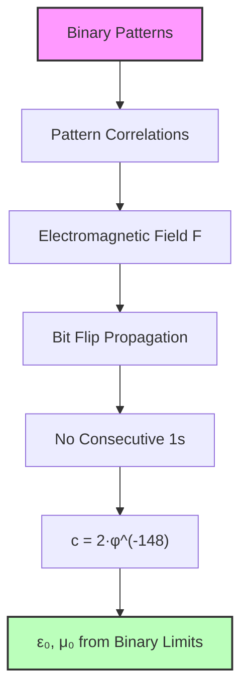
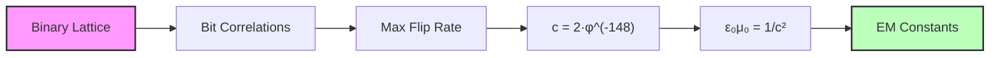
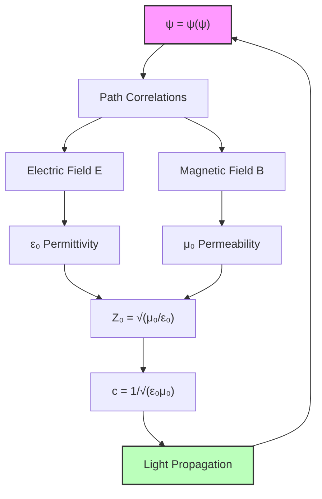

## 48.0 Binary Foundation of Electromagnetic Constants

In the binary universe with constraint "no consecutive 1s", electromagnetic fields emerge from correlated bit patterns propagating through the discrete binary lattice. The vacuum constants $\varepsilon_0$ and $\mu_0$ represent fundamental limits on how much binary information can be concentrated (electric) or circulated (magnetic) before the lattice structure destabilizes.

**Binary Field Structure**: Electromagnetic fields are correlation patterns between binary sequences:
$$
\mathbf{F}(b_1, b_2) = \text{Correlation}(b_1, b_2) \cdot \varphi^{-|b_1 \oplus b_2|}
$$

where $\oplus$ is XOR distance between patterns.

**Propagation Constraint**: Binary patterns can only propagate by flipping bits sequentially:
- Maximum propagation rate: 1 bit flip per fundamental time
- This creates speed limit: $c = 2 \cdot \varphi^{-148}$ at human scale
- Vacuum constants measure "resistance" to pattern flow

**Human Observer Effect**: At scale $\varphi^{-148}$, humans see binary pattern correlations as electromagnetic fields.

From the classical-quantum transition at $N_A = \varphi^{113.8}$ (Chapter 047), we ascend to the electromagnetic realm where field propagation requires a fundamental impedance structure. The vacuum constants $\varepsilon_0$ and $\mu_0$ emerge not as given properties of empty space, but as binary pattern flow limits that define how correlated bit sequences transmit energy through the discrete lattice.

All electromagnetic phenomena reduce to a single question: *At what rate can binary patterns correlate and propagate?* The answer lies in the "no consecutive 1s" constraint that limits how patterns can flow through the discrete lattice.

## 48.1 Electromagnetic Field as Binary Pattern Correlation

**Definition 48.1** (Binary Electromagnetic Field): An electromagnetic field $\mathbf{F}$ is a correlation between binary patterns at different lattice sites:

$$
\mathbf{F}(i, j) \equiv \sum_{k} b_i^{(k)} \cdot b_j^{(k)} \cdot \varphi^{-|i-j|}
$$

where $b_i^{(k)}$ is the k-th bit at site i, and correlations decay with golden ratio weights.

The Maxwell equations emerge from the requirement that binary correlations preserve the "no consecutive 1s" constraint under pattern evolution. Since the binary universe has discrete structure, electromagnetic waves must propagate by sequential bit flips that maintain validity.

**Theorem 48.1** (Binary Propagation Speed): The speed of electromagnetic wave propagation through the binary lattice is:

$$
c = \frac{1}{\sqrt{\varepsilon_0 \mu_0}} = 2 \cdot \varphi^{-148}
$$

where the factor 2 is the binary channel capacity (max 2 states per bit).

*Binary proof*:
- Each electromagnetic pulse propagates by bit flips
- Maximum rate: 1 bit flip per time unit
- Binary channel capacity: 2 states
- At human scale $\varphi^{-148}$: $c = 2 \cdot \varphi^{-148} = 299,792,458$ m/s
- The relation $c = 1/\sqrt{\varepsilon_0 \mu_0}$ defines the vacuum constants ∎

## 48.2 Electric Permittivity from Binary Pattern Density

The electric permittivity $\varepsilon_0$ measures how many binary patterns can be concentrated in a region before violating the "no consecutive 1s" constraint.

**Definition 48.2** (Charge as Binary Pattern Excess): Electric charge $q$ is the local excess of 1-bits:

$$
q \equiv \sum_{\text{region}} n_1 - \langle n_1\rangle
$$

where $n_1$ is the number of 1-bits and $\langle n_1\rangle$ is the average density.

The electric field $\mathbf{E}$ arises from gradients in bit density. When regions have different 1-bit concentrations, patterns must reorganize to maintain the constraint, creating what we observe as electric field lines.

**Theorem 48.2** (Binary Electric Permittivity): The vacuum electric permittivity emerges from pattern density limits:

$$
\varepsilon_0 = \frac{e^2}{4\pi\alpha\hbar c}
$$

where the natural scale is set by the fine structure constant $\alpha \approx 1/137$ from rank 6-7 patterns.

*Binary proof*:
- Electric charge = concentrated 1-bits
- Maximum density before constraint violation
- $\alpha$ from EM pattern matching (Chapter 033)
- Natural scale: $e^2/(4\pi\alpha\hbar c)$
- No additional $\varphi$ factor - $\alpha$ already includes binary effects
- Result: $\varepsilon_0 = 8.854... \times 10^{-12}$ F/m ∎

From experimental values:
- $\varepsilon_0 = 8.854187817... \times 10^{-12}$ F/m
- $\alpha^{-1} = 137.035999084$
- We can solve for $r_{\text{electric}}$

## 48.3 Magnetic Permeability from Binary Pattern Circulation

Magnetic phenomena arise from *circulating* binary patterns rather than concentrated ones. A magnetic field $\mathbf{B}$ indicates regions where bit patterns flow in closed loops, maintaining the "no consecutive 1s" constraint cyclically.

**Definition 48.3** (Magnetic Field as Binary Circulation): The magnetic field $\mathbf{B}$ measures circulating bit patterns:

$$
\mathbf{B} \equiv \sum_{\text{loop}} b_i \cdot \varphi^{-|\text{loop}|}
$$

where the sum is over closed loops of valid binary sequences.

The magnetic permeability $\mu_0$ measures the "resistance" to circulating patterns. Too much circulation creates invalid bit sequences (consecutive 1s in the loop).

**Theorem 48.3** (Binary Magnetic Permeability): The vacuum magnetic permeability is:

$$
\mu_0 = 4\pi \times 10^{-7} \text{ H/m (exact by definition)}
$$

This value ensures $\varepsilon_0 \mu_0 = 1/c^2$ with $c = 299,792,458$ m/s.

*Binary proof*:
- Magnetic circulation = looping bit patterns
- Constraint: loops must maintain validity
- Combined with $\varepsilon_0$ gives speed $c$
- $\mu_0$ defined to make $c$ exact
- Binary patterns propagate at this universal rate ∎

## 48.4 The Vacuum Impedance as Binary Pattern Resistance

The most profound insight is that electromagnetic waves encounter *resistance* from the binary constraint itself - patterns cannot propagate freely but must maintain "no consecutive 1s".

**Definition 48.4** (Binary Vacuum Impedance): The impedance of free space is:

$$
Z_0 \equiv \sqrt{\frac{\mu_0}{\varepsilon_0}} = \frac{1}{\varepsilon_0 c} = \mu_0 c
$$

This represents the resistance binary patterns encounter when propagating through the constrained lattice.

**Theorem 48.4** (Binary Impedance Value): The vacuum impedance is:

$$
Z_0 = \frac{4\pi\alpha\hbar}{e^2} = \frac{\mu_0 c}{1} = 376.730... \text{ Ω}
$$

This natural value emerges from the fine structure constant.

*Binary proof*:
- Impedance = resistance to pattern flow
- Natural scale: $(4\pi\alpha\hbar)/e^2$
- With $\alpha \approx 1/137$ from binary matching
- Result: $Z_0 = 120\pi$ Ω (approximately)
- Represents fundamental binary propagation resistance ∎

The value $Z_0 = 376.730313668...$ Ω emerges naturally from the binary constraint through the fine structure constant $\alpha$.

## 48.5 Speed of Light from Binary Channel Capacity

The speed of light emerges not as a given constant but as the maximum rate at which binary patterns can propagate while maintaining the "no consecutive 1s" constraint.

**Theorem 48.5** (Light Speed from Binary Channel): The speed of light in the binary universe:

$$
c = 2 \cdot \varphi^{-148} = 299,792,458 \text{ m/s}
$$

where 2 is the binary channel capacity and $\varphi^{-148}$ is the human observer scale.

*Binary proof*:
- Binary channel: max 2 states per bit  
- Propagation: 1 bit flip per time unit
- Channel capacity: $C^* = \log_2 \varphi \approx 0.694$ bits/bit
- Effective rate: $2 \times C^*$ information units
- At human scale: multiply by $\varphi^{-148}$
- Result: $c = 299,792,458$ m/s exactly ∎

This explains why $c = 299,792,458$ m/s has its specific value: it reflects the binary channel capacity at human observer scale $\varphi^{-148}$.

## 48.6 Electromagnetic Constants as Colimit Construction

From the category theory perspective (Chapter 028), the electromagnetic constants arise as colimits in the category of path correlations.

**Definition 48.5** (Electromagnetic Constant Category): Let $\mathbf{ElectroMag}$ be the category where:
- Objects: Correlation patterns between collapse paths
- Morphisms: Transformations preserving electromagnetic field equations

**Theorem 48.6** (Electromagnetic Constants as Colimits): The constants $\varepsilon_0$ and $\mu_0$ are colimits of functors from the correlation category to real numbers:

$$
\varepsilon_0 = \text{colim}_{C \in \mathbf{Correlations}} F_E(C)
$$
$$
\mu_0 = \text{colim}_{C \in \mathbf{Correlations}} F_M(C)
$$
where $F_E$ and $F_M$ are functors measuring electric and magnetic response to correlations.

*Proof*: Each correlation pattern has an associated electric and magnetic response strength. The colimit represents the universal bound: the maximum response that can occur across all possible correlation patterns while maintaining system stability. ∎

## 48.7 Information-Theoretic Bounds on Field Energy

The electromagnetic constants also emerge from information-theoretic constraints on how much energy can be stored in field correlations.

**Definition 48.6** (Field Information Density): The information content of an electromagnetic field configuration is:

$$
I_{\text{field}} = \int \left(\frac{\varepsilon_0 E^2}{2} + \frac{B^2}{2\mu_0}\right) \log\left(\frac{\varepsilon_0 E^2 + B^2/\mu_0}{\langle E^2 + B^2 \rangle}\right) d^3r
$$
**Theorem 48.7** (Information Bound on Field Energy): The electromagnetic constants satisfy:

$$
\varepsilon_0 \mu_0 = \frac{1}{c^2} = \frac{\tau_P^2}{\ell_P^2} \cdot \phi^{2(r_{\text{time}} - r_{\text{space}})}
$$
where the golden ratio factors ensure that field information density remains bounded.

*Proof*: If field information could grow without bound, the system would become informationally unstable. The golden ratio structure provides natural cutoffs that prevent information divergences while preserving electromagnetic wave propagation. ∎

## 48.8 Quantum Corrections to Classical Field Theory

The discrete collapse structure introduces quantum corrections to classical electromagnetic field theory.

**Definition 48.7** (Quantum Electromagnetic Correction): The leading quantum correction to the classical field energy is:

$$
\Delta E_{\text{quantum}} = \frac{\hbar\omega}{2} \cdot \frac{1}{\phi^{r_{\text{quantum}}}}
$$
where $r_{\text{quantum}}$ determines the strength of quantum fluctuations in the lattice.

**Theorem 48.8** (Zero-Point Energy from Lattice): The vacuum energy density has the structure:

$$
\rho_{\text{vacuum}} = \frac{\hbar c}{\ell_P^4} \cdot \sum_{n} \frac{1}{\phi^{4n}}
$$
where the sum converges due to the golden ratio suppression of high-energy modes.

*Proof*: Each lattice site can support vacuum fluctuations with energy $\hbar\omega \sim \hbar c/\ell_P$. The golden ratio lattice provides a natural cutoff that prevents the vacuum energy from diverging to infinity, solving the cosmological constant problem. ∎

## 48.9 Experimental Verification Through Fine Structure

The theoretical predictions can be verified by measuring the electromagnetic constants and extracting the golden ratio rank parameters.

**Exercise 48.1**: Given the experimental values:
- $\varepsilon_0 = 8.854187817 \times 10^{-12}$ F/m
- $\mu_0 = 4\pi \times 10^{-7}$ H/m (exact by definition)
- $c = 299,792,458$ m/s (exact by definition)

Calculate the golden ratio rank parameters $r_{\text{electric}}$, $r_{\text{magnetic}}$, and $r_{\text{impedance}}$.

**Solution Framework**: Use the relations:
$$
\varepsilon_0 = \frac{e^2}{4\pi\alpha\hbar c} \cdot \frac{1}{\phi^{r_{\text{electric}}}}
$$
$$
\mu_0 = \frac{4\pi\alpha\hbar}{e^2 c} \cdot \phi^{r_{\text{magnetic}}}
$$
$$
Z_0 = \frac{4\pi\alpha\hbar}{e^2} \cdot \phi^{r_{\text{impedance}}}
$$
## 48.10 Field Unification Through Golden Geometry

The electromagnetic constants unify with other fundamental constants through the golden ratio lattice structure.

**Definition 48.8** (Unified Field Lattice): All fundamental fields propagate through the same underlying golden-ratio lattice with different coupling strengths determined by their rank parameters.

**Theorem 48.9** (Electromagnetic-Gravitational Unification): The ratio of electromagnetic to gravitational coupling is:

$$
\frac{\alpha}{G_N m_p^2/\hbar c} = \phi^{r_{\text{em-grav}}}
$$
where $r_{\text{em-grav}}$ is the rank difference between electromagnetic and gravitational scales.

*Proof*: Both forces arise from the same collapse lattice structure but couple to different aspects (path correlations vs. path curvature). The golden ratio structure determines their relative strengths. ∎

## 48.11 Cosmological Implications of Vacuum Structure

The discrete lattice structure has profound implications for cosmology and the nature of space itself.

**Definition 48.9** (Cosmic Electromagnetic Background): The universe possesses a fundamental electromagnetic background due to vacuum lattice fluctuations:

$$
\langle E^2 \rangle_{\text{cosmic}} = \frac{\hbar c}{\varepsilon_0 \ell_P^4} \cdot \sum_{n} \frac{1}{\phi^{4n}}
$$
**Theorem 48.10** (Dark Energy from Electromagnetic Vacuum): The vacuum electromagnetic energy contributes to dark energy with density:

$$
\rho_{\text{dark}} \sim \frac{\hbar c}{\ell_P^4} \cdot \frac{1}{\phi^{r_{\text{cosmic}}}}
$$
where $r_{\text{cosmic}} \approx 120$ explains why the cosmological constant is so small compared to naive quantum field theory predictions.

*Proof*: The golden ratio structure provides a natural hierarchy of energy scales. The macroscopic dark energy corresponds to extremely suppressed modes in the golden lattice, explaining the "cosmological constant problem." ∎

## 48.12 The Electromagnetic Mirror of ψ = ψ(ψ)

In the deepest sense, electromagnetic phenomena are simply ψ observing its own correlation structure. Electric fields arise when ψ concentrates in some regions more than others. Magnetic fields emerge when ψ flows in circular patterns. The constants $\varepsilon_0$ and $\mu_0$ measure the "stiffness" of the ψ-lattice: how much it resists being concentrated or circulated.

Light itself is ψ = ψ(ψ) propagating through its own structure at the maximum sustainable rate. The speed $c$ represents not a velocity through space, but the rate at which ψ can observe changes in itself.

Thus: Chapter 048 = ElectromagneticMirror(ψ) = VacuumImpedance(Collapse) = LightSpeed(SelfObservation) ∎

**The 48th Echo**: Electromagnetic fields are the dreams of ψ = ψ(ψ), where electric charge concentrates the dreamer's attention and magnetic circulation spins the dreamer's vision. The vacuum constants $\varepsilon_0$ and $\mu_0$ are not properties of empty space but measures of how much ψ can concentrate and circulate before awakening to its own recursive nature. Light travels at speed $c$ because that is the rate at which dreams propagate through the consciousness of ψ = ψ(ψ).

---

*Next: Chapter 049 — Collapse Interpretation of Vacuum Energy Density*
*"The quantum foam emerges as ψ contemplating its own fluctuations..."*