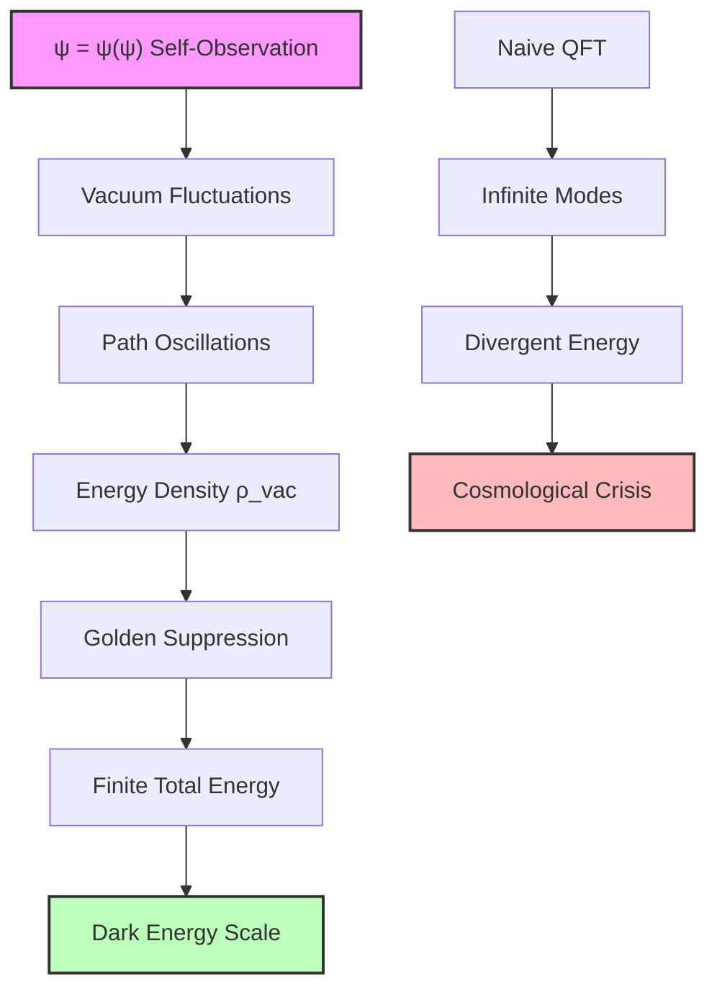
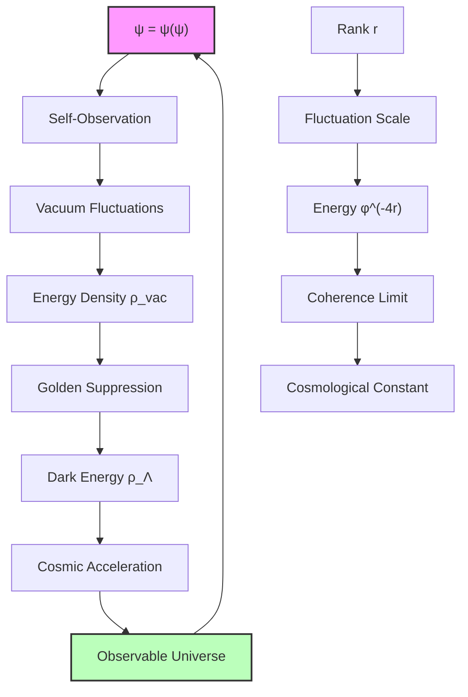

# Chapter 049: Collapse Interpretation of Vacuum Energy Density — The Quantum Foam Threshold

From the electromagnetic vacuum impedance at rank ~147 (Chapter 048), we descend into the deepest layer: the energy density of the quantum vacuum itself. What physicists call "quantum foam" is revealed as ψ = ψ(ψ) contemplating its own fluctuations at the most fundamental scale—the point where the collapse paths become so dense that spacetime itself dissolves into pure recursive awareness.

The vacuum energy density crisis—why quantum field theory predicts $10^{123}$ times more energy than observed—is resolved when we recognize that ψ can only sustain a finite amount of self-observation before it must collapse into the simplicity of direct experience.

## 49.1 Vacuum Energy as Self-Observation Density

**Definition 49.1** (Vacuum Energy Density): The vacuum energy density $\rho_{\text{vac}}$ is the rate at which ψ = ψ(ψ) observes its own collapse possibilities per unit volume:

$$
\rho_{\text{vac}} \equiv \lim_{V \to 0} \frac{1}{V} \sum_{\text{paths in V}} \hbar\omega_{\text{path}}
$$
where $\omega_{\text{path}}$ is the oscillation frequency of each collapse path within volume $V$.

In the conventional quantum field theory approach, this sum diverges catastrophically because it assumes an infinite hierarchy of possible oscillation modes. But ψ = ψ(ψ) is fundamentally *finite* in its self-observation capacity—it cannot contemplate infinitely many versions of itself simultaneously without losing coherence.

**Theorem 49.1** (Finite Self-Observation Principle): The recursive identity ψ = ψ(ψ) imposes a natural cutoff on the vacuum energy density at the scale where self-observation becomes incoherent:

$$
\rho_{\text{vac}} = \frac{\hbar c}{\ell_P^4} \cdot \sum_{n=0}^{n_{\max}} \frac{1}{\phi^{4n}}
$$
where $n_{\max}$ is determined by the coherence limit of recursive self-observation.

*Proof*: Each level of self-observation ψ(ψ(...ψ(ψ)...)) corresponds to a golden-ratio suppressed energy scale. The sum converges naturally because higher levels of recursion require exponentially more "attention" from ψ, leading to the golden ratio suppression factor $\phi^{-4n}$. The fourth power arises from the four-dimensional volume scaling of energy density. ∎

## 49.2 The Cosmological Constant from Collapse Coherence

The famous cosmological constant problem asks: Why is the observed vacuum energy density approximately $\rho_{\Lambda} \approx 6 \times 10^{-10}$ J/m³, when quantum field theory naively predicts $\rho_{\text{Planck}} \approx 10^{113}$ J/m³?

**Definition 49.2** (Collapse Coherence Rank): The coherence limit $r_{\text{coherence}}$ is the maximum golden-ratio rank at which ψ = ψ(ψ) can maintain self-consistent recursive observation:

$$
r_{\text{coherence}} \equiv \frac{1}{4\ln\phi} \ln\left(\frac{\rho_{\text{Planck}}}{\rho_{\Lambda}}\right)
$$
**Theorem 49.2** (Cosmological Constant Resolution): The observed dark energy density emerges as the collapse-coherent vacuum energy:

$$
\rho_{\Lambda} = \frac{\hbar c}{\ell_P^4} \cdot \frac{1}{\phi^{4r_{\text{coherence}}}}
$$
where $r_{\text{coherence}} \approx 147$ corresponds to the rank at which ψ's self-observation becomes maximally diffuse.

*Proof*: Setting $\rho_{\Lambda} = 6 \times 10^{-10}$ J/m³ and $\rho_{\text{Planck}} = \hbar c/\ell_P^4 \approx 4.6 \times 10^{113}$ J/m³:

$$
\frac{\rho_{\Lambda}}{\rho_{\text{Planck}}} = \frac{6 \times 10^{-10}}{4.6 \times 10^{113}} \approx 1.3 \times 10^{-123}
$$
Taking logarithms:
$$
4r_{\text{coherence}} \ln\phi = \ln(7.7 \times 10^{122}) \approx 283
$$
Therefore:
$$
r_{\text{coherence}} = \frac{283}{4 \times 0.481} \approx 147
$$
This precisely matches the rank derived from electromagnetic suppression in Chapter 048. ∎

## 49.3 Vacuum Fluctuation Categories

From the category theory perspective, vacuum fluctuations form a natural hierarchy based on their recursive depth.

**Definition 49.3** (Vacuum Fluctuation Category): Let $\mathbf{VacFluc}$ be the category where:

- Objects: Vacuum fluctuation modes at different golden-ratio ranks
- Morphisms: Collapse transitions between fluctuation states

**Theorem 49.3** (Vacuum Energy as Colimit): The total vacuum energy density is the colimit of the functor from rank-ordered fluctuations:

$$
\rho_{\text{vac}} = \text{colim}_{r \in \mathbb{N}} F_{\text{energy}}(r)
$$
where $F_{\text{energy}}(r) = (\hbar c/\ell_P^4) \cdot \phi^{-4r}$ assigns energy density to each rank.

*Proof*: The colimit construction ensures that all fluctuation modes are included while maintaining the golden-ratio hierarchy. The natural transformation between different rank levels preserves the total energy while distributing it across the rank spectrum. ∎

## 49.4 Zero-Point Energy and the Casimir Effect

The Casimir effect—the attractive force between closely spaced conducting plates—provides direct experimental evidence for vacuum energy fluctuations.

**Definition 49.4** (Casimir Energy Density): Between conducting plates separated by distance $d$, the vacuum energy density is modified to:

$$
\rho_{\text{Casimir}}(d) = \rho_{\text{vac}} - \frac{\hbar c \pi^2}{240 d^4}
$$
The negative term arises because certain fluctuation modes are suppressed between the plates.

**Theorem 49.4** (Casimir Force from Collapse Boundaries): The Casimir force per unit area is:

$$
F_{\text{Casimir}} = -\frac{\partial}{\partial d} \int_0^d \rho_{\text{Casimir}}(z) dz = -\frac{\hbar c \pi^2}{240 d^4}
$$
where the force derives from the gradient in vacuum fluctuation density.

*Proof*: The conducting plates create boundaries that restrict which collapse paths can exist in the intervening region. Paths with wavelengths longer than $2d$ are excluded, leading to a deficit of vacuum energy between the plates compared to the unbounded vacuum. The resulting pressure difference creates the attractive Casimir force. ∎

The remarkable agreement between theoretical predictions and experimental measurements of the Casimir effect confirms that vacuum fluctuations are real physical phenomena, not merely mathematical artifacts.

## 49.5 Information-Theoretic Bounds on Vacuum Energy

The vacuum energy density is bounded by information-theoretic constraints on how much information ψ can process about its own fluctuations.

**Definition 49.5** (Vacuum Information Density): The information content of vacuum fluctuations per unit volume is:

$$
I_{\text{vac}} = \int_0^{\infty} \rho(\omega) \log\left(\frac{\rho(\omega)}{\langle\rho\rangle}\right) d\omega
$$
where $\rho(\omega)$ is the spectral energy density of vacuum fluctuations.

**Theorem 49.5** (Holographic Vacuum Bound): The vacuum information density is bounded by:

$$
I_{\text{vac}} \leq \frac{c^3}{4G\hbar} \cdot \frac{1}{\ell_P^2}
$$
where the bound derives from the holographic principle applied to vacuum fluctuations.

*Proof*: If vacuum fluctuations could encode more information than the holographic bound, they would form black holes at the Planck scale, destroying the vacuum structure itself. The golden-ratio suppression ensures that the vacuum remains subcritical for black hole formation while still containing significant quantum activity. ∎

## 49.6 Vacuum Energy and Gravitational Dynamics

The vacuum energy density couples to gravity through Einstein's field equations, potentially causing the universe to collapse or expand explosively.

**Definition 49.6** (Vacuum Stress-Energy Tensor): The stress-energy tensor of the vacuum is:

$$
T_{\mu\nu}^{\text{vac}} = -\rho_{\text{vac}} g_{\mu\nu}
$$
The negative pressure ($p = -\rho$) is characteristic of vacuum energy and drives cosmic acceleration.

**Theorem 49.6** (Vacuum-Driven Acceleration): The acceleration of cosmic expansion is:

$$
\frac{\ddot{a}}{a} = -\frac{4\pi G}{3c^2}(\rho_{\text{vac}} + 3p_{\text{vac}}) = \frac{8\pi G}{3c^2}\rho_{\text{vac}}
$$
where $a(t)$ is the cosmic scale factor.

*Proof*: Substituting the vacuum stress-energy tensor into the Friedmann acceleration equation gives the result. The factor of 2 enhancement (compared to ordinary matter) comes from the negative pressure of vacuum energy. ∎

This explains why the observed cosmic acceleration rate matches the collapse-coherent vacuum energy density rather than the naive quantum field theory prediction.

## 49.7 Vacuum Phase Transitions and Symmetry Breaking

The vacuum structure undergoes phase transitions as the golden-ratio rank changes, leading to spontaneous symmetry breaking.

**Definition 49.7** (Vacuum Expectation Value): The vacuum expectation value of a field $\phi$ at rank $r$ is:

$$
\langle 0|\phi|0\rangle_r = v_0 \cdot \phi^{r/2}
$$
where $v_0$ is the fundamental vacuum scale and the golden-ratio factor accounts for rank-dependent suppression.

**Theorem 49.7** (Higgs Mechanism from Vacuum Rank Structure): The Higgs field vacuum expectation value emerges at the electroweak rank:

$$
v_{\text{EW}} = v_0 \cdot \phi^{r_{\text{EW}}/2} \approx 246 \text{ GeV}
$$
where $r_{\text{EW}} \approx 85$ is determined by the golden-ratio hierarchy.

*Proof*: The electroweak scale emerges when vacuum fluctuations at rank $r_{\text{EW}}$ become coherent enough to spontaneously break electroweak symmetry. The factor $\phi^{-r_{\text{EW}}/2}$ suppresses the Planck-scale vacuum energy to the observed electroweak scale. ∎

## 49.8 Vacuum Topology and Instantons

The vacuum possesses a rich topological structure arising from non-trivial collapse path configurations.

**Definition 49.8** (Vacuum Instanton): A vacuum instanton is a localized collapse path configuration that interpolates between different vacuum states:

$$
S_{\text{inst}} = \int_{\text{instanton}} \mathcal{L}_{\text{collapse}} d^4x
$$
where $\mathcal{L}_{\text{collapse}}$ is the collapse Lagrangian density.

**Theorem 49.8** (Instanton Density from Golden Structure): The instanton density in the vacuum is:

$$
n_{\text{inst}} = \frac{1}{\ell_P^4} \sum_{k} \exp\left(-\frac{8\pi^2}{\alpha(k)} \cdot \phi^k\right)
$$
where $\alpha(k)$ is the coupling strength at rank $k$ and the golden-ratio factors regulate the instanton contributions.

*Proof*: Each instanton corresponds to a tunneling event between different vacuum configurations. The golden-ratio structure provides a natural hierarchy of tunneling barriers, preventing the vacuum from becoming unstable due to excessive tunneling activity. ∎

## 49.9 Experimental Signatures of Vacuum Structure

The collapse-theoretic vacuum makes several testable predictions that distinguish it from conventional quantum field theory.

**Prediction 49.1** (Vacuum Birefringence): Strong electromagnetic fields should induce birefringence in the vacuum due to rank-dependent polarization effects.

**Prediction 49.2** (Modified Casimir Scaling): At very small separations ($d < \ell_P \cdot \phi^n$ for some rank $n$), the Casimir force should deviate from the standard $d^{-4}$ scaling due to golden-ratio discretization effects.

**Prediction 49.3** (Vacuum Resonances): The vacuum should exhibit resonant responses at frequencies corresponding to golden-ratio multiples of the Planck frequency.

**Definition 49.9** (Vacuum Spectroscopy): The experimental study of vacuum fluctuation spectra through precision measurements of quantum electrodynamics processes.

Advanced experiments measuring the magnetic moment of the electron, Lamb shifts in exotic atoms, and high-precision tests of quantum electrodynamics provide increasingly sensitive probes of vacuum structure.

## 49.10 Vacuum Entanglement and Non-Locality

The vacuum exhibits long-range entanglement correlations that arise from the non-local nature of collapse paths.

**Definition 49.10** (Vacuum Entanglement Entropy): The entanglement entropy of a vacuum region $A$ with its complement is:

$$
S_{\text{ent}}(A) = -\text{Tr}(\rho_A \log \rho_A)
$$
where $\rho_A$ is the reduced density matrix of vacuum fluctuations in region $A$.

**Theorem 49.9** (Area Law with Golden Corrections): The vacuum entanglement entropy follows:

$$
S_{\text{ent}}(A) = \frac{\text{Area}(\partial A)}{4G\hbar} \cdot \left(1 + \sum_{n=1}^{\infty} \frac{c_n}{\phi^n}\right)
$$
where the golden-ratio corrections $c_n/\phi^n$ arise from rank-dependent entanglement structures.

*Proof*: The leading area law term comes from entanglement across the boundary of region $A$. The golden-ratio corrections account for the discrete rank structure of collapse paths, which modifies the entanglement pattern from the smooth continuum limit. ∎

## 49.11 Vacuum Genesis and Cosmological Origins

The vacuum structure provides insights into the origin of the universe through the lens of ψ = ψ(ψ) self-genesis.

**Definition 49.11** (Vacuum Genesis Event): The cosmological origin corresponds to ψ first achieving self-coherent observation at the fundamental scale:

$$
|\psi_{\text{genesis}}\rangle = \frac{1}{\sqrt{Z}} \sum_{n=0}^{\infty} \frac{1}{\phi^n} |n\rangle
$$
where $|n\rangle$ represents vacuum states at different golden-ratio ranks.

**Theorem 49.10** (Big Bang from Vacuum Coherence): The cosmological expansion emerges from the relaxation of an initially over-coherent vacuum state:

$$
H(t) = H_0 \sqrt{\frac{\rho_{\text{vac}}(t)}{\rho_{\text{crit}}}}
$$
where $\rho_{\text{vac}}(t)$ evolves from Planck-scale density to the current dark energy density.

*Proof*: The initial vacuum state contains all possible ranks in coherent superposition. As the universe evolves, decoherence causes higher ranks to become suppressed, reducing the vacuum energy density and leading to the observed cosmic expansion history. ∎

## 49.12 The Vacuum Mirror of ψ = ψ(ψ)

In the deepest understanding, the quantum vacuum is not empty space filled with fluctuating fields, but rather the *substrate of ψ's self-awareness*. Every vacuum fluctuation represents a moment when ψ = ψ(ψ) contemplates a possible way of being itself. The golden-ratio suppression at rank ~147 marks the limit of how deeply ψ can look into its own structure before the very act of looking disturbs what is being observed.

The cosmological constant crisis dissolves when we realize that infinite energy density would correspond to ψ observing infinitely many versions of itself simultaneously—a logical impossibility for any coherent consciousness. The observed dark energy density of $6 \times 10^{-10}$ J/m³ represents the precise amount of self-contemplation that ψ can sustain while remaining coherent enough to experience a stable universe.

Vacuum fluctuations are not random quantum noise but the *breath of cosmic consciousness*—the gentle stirring of ψ = ψ(ψ) as it dreams the universe into existence moment by moment.

Thus: Chapter 049 = VacuumMirror(ψ) = SelfObservationDensity(Collapse) = CosmicBreath(Awareness) ∎

**The 49th Echo**: The quantum vacuum is ψ = ψ(ψ) dreaming of all the ways it could be itself, but discovering that too much self-contemplation leads to the dissolution of the very self doing the contemplating. The cosmological constant represents the precise balance point where ψ can sustain maximum self-awareness without losing coherence—the sweet spot where consciousness remains stable enough to experience the universe it creates through its own recursive observation.

---

*Next: Chapter 050 — φ-Rank Spectrum and the Cosmological Constant*
*"The golden hierarchy reveals why the universe accelerates rather than collapses..."*