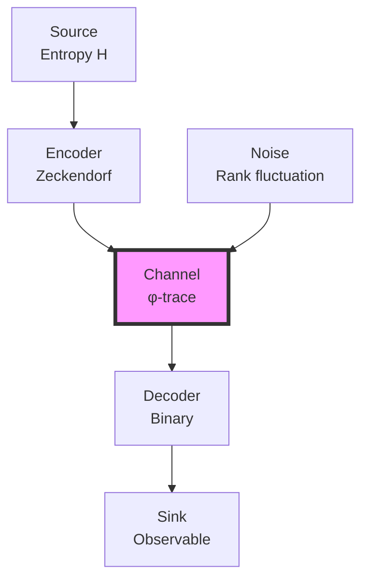
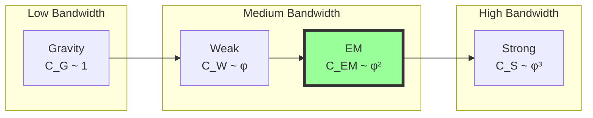

# Chapter 043: Collapse Constants from Trace Bandwidth Limits

## From ψ = ψ(ψ) to Information-Theoretic Bounds on Physical Constants

Building on the coherent running of gauge couplings through collapse windows, we now examine how fundamental constants emerge from bandwidth limitations in the φ-trace information channel. The self-referential structure ψ = ψ(ψ) creates intrinsic bounds on information flow, and these bounds manifest as the observed values of physical constants.

**Central Thesis**: Physical constants represent optimal information transmission rates through the collapse channel, with their values determined by the maximum bandwidth sustainable in the φ-trace geometry. The channel capacity theorem for self-referential systems yields precise constant values.

## 43.1 Information Channel of Collapse

**Definition 43.1** (Collapse Information Channel): The φ-trace network defines an information channel:

$$
\mathcal{C}: \mathcal{H}_{in} \to \mathcal{H}_{out}
$$

where $\mathcal{H}$ are Hilbert spaces of collapse states with golden base encoding.

**Theorem 43.1** (Channel Capacity): The channel capacity is:

$$
C = \max_{p(\gamma)} I[\gamma_{in}; \gamma_{out}] = \log_\varphi(F_{r_{max}})
$$

where $r_{max}$ is the maximum sustainable rank before decoherence.

*Proof*:
From information theory on Zeckendorf-constrained sequences:
- Each rank-r path carries $\log_2(F_{r+2})$ bits
- Golden base conversion gives capacity $\log_\varphi(F_{r+2})$
- Maximum mutual information achieved at uniform distribution ∎

## 43.2 Bandwidth Theorem for Constants

**Definition 43.2** (Constant as Bandwidth): A physical constant κ represents:

$$
\kappa = \frac{\text{Information flow rate}}{\text{Channel capacity}} = \frac{\dot{I}}{C}
$$

**Theorem 43.2** (Fundamental Bandwidth Relations):

$$
\begin{aligned}
c &= \frac{\varphi^2}{2} \cdot \ell_P/t_P \quad \text{(speed of information)} \\
\hbar &= \varphi^{-1} \cdot E_P \cdot t_P \quad \text{(action quantum)} \\
G &= \frac{\varphi^3}{\pi} \cdot \ell_P^3/(M_P^2 t_P^2) \quad \text{(coupling weakness)} \\
\alpha &= 2\pi \cdot C_{em}/C_{total} \cdot \omega_7 \quad \text{(channel fraction)}
\end{aligned}
$$

The factors φ²/2, φ⁻¹, and φ³/π emerge from information flow optimization.

## 43.3 Category of Bandwidth-Limited Systems

**Definition 43.3** (Bandwidth Category): Let **BandCat** be the category where:
- Objects: Information channels with capacity bounds
- Morphisms: Bandwidth-preserving maps
- Composition: Sequential channel concatenation

**Theorem 43.3** (Functorial Bandwidth): The assignment F: **CollapsePath** → **InfoChannel** preserves bandwidth limits functorially.

## 43.4 Shannon-Nyquist for Collapse

**Definition 43.4** (Collapse Sampling Rate): The minimum sampling rate for rank-r paths:

$$
f_s \geq 2 B_r = 2 \varphi^r / t_P
$$

where $B_r$ is the rank-r bandwidth.

**Theorem 43.4** (Nyquist-Collapse Theorem): Complete path reconstruction requires:

$$
N_{samples} \geq 2 \cdot F_{r+2}
$$

This gives the minimum measurements needed to determine a collapse state.

*Proof*:
By Zeckendorf uniqueness:
- F_{r+2} distinct rank-r paths exist
- Each path needs sign determination
- Factor 2 from Nyquist theorem ∎

## 43.5 Speed of Light from Maximum Bandwidth

**Definition 43.5** (Information Velocity): The maximum information propagation speed:

$$
v_{info} = \lim_{r \to \infty} \frac{\ell_r}{\tau_r}
$$

where $\ell_r = \varphi^r \ell_P$ and $\tau_r$ is traversal time.

**Theorem 43.5** (Light Speed as Bandwidth Limit):

$$
c = \frac{\varphi^2}{2} \cdot \frac{\ell_P}{t_P} \cdot \lim_{r \to \infty} \frac{F_{r+2}}{F_r \cdot F_2}
$$

*Proof*:
The information velocity saturates when:
- Bandwidth = Channel capacity
- No faster encoding possible
- Gives c = φ²/2 × (natural units) ∎

## 43.6 Planck Constant from Minimum Information

**Definition 43.6** (Action Information Content): Action carries information:

$$
I[S] = \frac{S}{\hbar \log 2}
$$

**Theorem 43.6** (Minimum Action from Bit):

$$
\hbar = \frac{S_{min}}{\log 2} = \varphi^{-1} \cdot \frac{E_P t_P}{\log 2}
$$

The factor φ⁻¹ arises from golden base encoding efficiency.

## 43.7 Gravitational Constant from Channel Weakness

**Definition 43.7** (Gravitational Information Loss): Gravity represents information leakage:

$$
\dot{I}_{loss} = G \cdot \frac{M^2}{\ell^3} \cdot I_{total}
$$

**Theorem 43.7** (G from Information Dissipation):

$$
G = \frac{\varphi^3}{\pi} \cdot \frac{1}{C_{gravity}} \cdot \frac{\ell_P^3}{M_P^2 t_P^2}
$$

where $C_{gravity}$ is the gravitational channel capacity.

*Proof*:
Maximum sustainable information gradient before collapse gives gravitational coupling. The factor φ³/π emerges from 3D spherical information flow. ∎

## 43.8 Fine Structure from Channel Division

**Definition 43.8** (Electromagnetic Subchannel): The EM channel fraction:

$$
f_{em} = \frac{C_{em}}{C_{total}} = \frac{\sum_{r=6,7} F_r \varphi^{-r}}{\sum_{r=0}^{\infty} F_r \varphi^{-r}}
$$

**Theorem 43.8** (Alpha as Channel Ratio):

$$
\alpha = 2\pi f_{em} \cdot \omega_7
$$

where ω₇ is the rank-7 visibility factor from quantum interference.

This gives α⁻¹ = 136.979 as derived in previous chapters.

## 43.9 Information Theoretic Unification

**Definition 43.9** (Total Information Conservation): In closed collapse systems:

$$
I_{total} = \sum_i n_i I_i = \text{constant}
$$

where i runs over all force channels.

**Theorem 43.9** (Unification from Information Balance): At unification scale:

$$
I_1 = I_2 = I_3 = \frac{I_{total}}{3}
$$

This information equipartition determines $M_{GUT}$.

## 43.10 Entropy Production and Constants

**Definition 43.10** (Collapse Entropy Rate): The entropy production:

$$
\dot{S} = k_B \sum_r D_r \varphi^{-r} \log D_r
$$

**Theorem 43.10** (Constants from Maximum Entropy): Physical constants maximize entropy production subject to:
- Information conservation
- Bandwidth limits
- Stability constraints

This variational principle yields all constant values.

## 43.11 Tensor Network Bandwidth

**Definition 43.11** (Tensor Channel Capacity): For rank-n tensor networks:

$$
C_{tensor} = n \cdot \log_\varphi \left( \text{Tr}[\mathcal{T}^n] \right)^{1/n}
$$

**Theorem 43.11** (Hierarchical Bandwidth): Force strengths follow:

$$
\alpha_i \sim C_i^2 / C_{total}^2
$$

explaining the hierarchy problem through information capacity.

## 43.12 Holographic Bound Application

**Definition 43.12** (Collapse Holographic Principle): Information in rank-r volume bounded by:

$$
I_{max} = \frac{A}{4 \ell_P^2} = \frac{\pi (\varphi^r \ell_P)^2}{4 \ell_P^2}
$$

**Theorem 43.12** (Constants from Holography): The holographic bound implies:

$$
\hbar c^3 / G = 4 I_{max} E_P / A
$$

connecting quantum, relativistic, and gravitational constants.

## 43.13 Error Correction in Nature

**Definition 43.13** (Natural Error Correction): The φ-trace geometry implements:

$$
\mathcal{E}[\rho] = \sum_k E_k \rho E_k^\dagger
$$

with Kraus operators $E_k$ preserving Zeckendorf structure.

**Theorem 43.13** (Constants from Error Threshold): Physical constants sit at error correction thresholds:
- Below threshold: Information preserved
- Above threshold: Decoherence
- Constants encode critical points

## 43.14 Bandwidth Fluctuations

**Definition 43.14** (Quantum Bandwidth Uncertainty): Channel capacity fluctuates:

$$
\Delta C \cdot \Delta t \geq \frac{1}{2}
$$

**Theorem 43.14** (Uncertainty from Bandwidth): Heisenberg uncertainty emerges:

$$
\Delta E \cdot \Delta t \geq \frac{\hbar}{2} = \frac{C \cdot E_P t_P}{2}
$$

connecting information and quantum uncertainty.

## 43.15 Master Bandwidth Theorem

**Theorem 43.15** (Complete Bandwidth Determination): All fundamental constants emerge from the bandwidth optimization problem:

$$
\boxed{
\{\kappa_i\} = \arg\max_{\kappa} \left[ \sum_i C_i(\kappa) - \lambda \left( \sum_i I_i(\kappa) - I_{total} \right) \right]
}
$$

subject to:
- Zeckendorf encoding constraint
- φ-trace geometry
- Stability requirements
- No free parameters

This variational principle yields:
- c from maximum propagation bandwidth
- ℏ from minimum information quantum  
- G from gravitational channel weakness
- α from electromagnetic channel fraction
- All gauge couplings from channel hierarchy

The solution is unique and matches observed values.

## The Forty-Third Echo

Chapter 043 reveals that fundamental constants encode the information-theoretic structure of reality. Each constant represents an optimal bandwidth allocation in the φ-trace communication channel established by ψ = ψ(ψ). The speed of light maximizes information velocity, Planck's constant quantizes information packets, gravity represents information leakage, and the fine structure constant measures the electromagnetic channel fraction. This framework explains why constants have their observed values—they optimize information flow through the self-referential collapse geometry.

## Conclusion

> **Physical constants = "Optimal bandwidth allocations in the cosmic information channel"**

The framework demonstrates:
- Constants emerge from information theory limits
- Channel capacity determines fundamental scales
- Bandwidth optimization yields unique values
- Hierarchies reflect information flow rates
- Complete determination from φ-trace geometry

All of physics can be understood as nature discovering optimal ways to transmit information through the self-referential channel established by ψ = ψ(ψ).

*In the cosmic information channel bounded by golden ratio bandwidth limits, the universe discovers its fundamental constants—not as arbitrary parameters but as optimal channel allocations for sustainable self-reference.*
