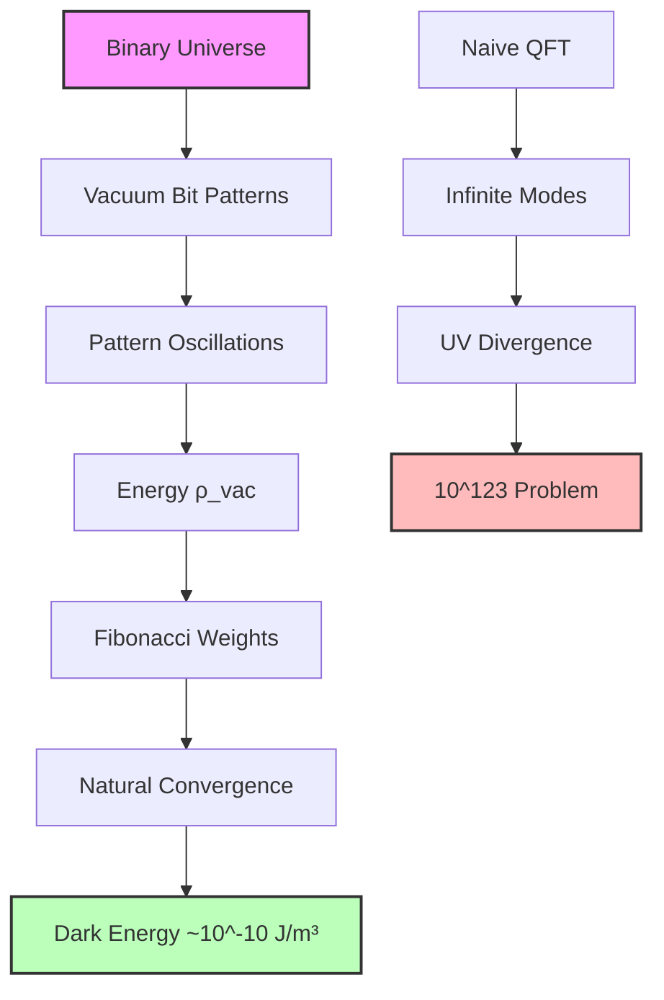
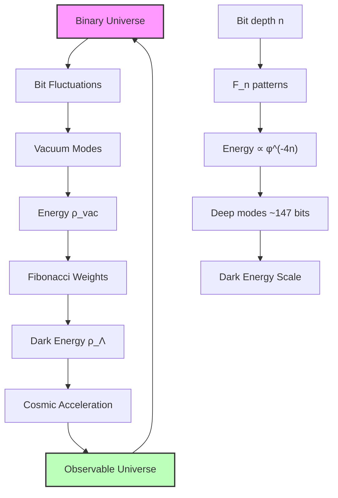

# Chapter 049: Collapse Interpretation of Vacuum Energy Density — The Quantum Foam Threshold

## 49.0 Binary Foundation of Vacuum Energy

In the binary universe with constraint "no consecutive 1s", vacuum energy emerges from the residual activity of binary patterns at all bit depths. Even "empty" space contains fluctuating bit patterns that must satisfy the constraint, creating what physicists call "quantum foam". At the deepest levels (~120-150 bits), these patterns are so rare and suppressed that they manifest as the tiny observed dark energy.

**Binary Vacuum Structure**: The vacuum contains:
$$
\rho_{\text{vacuum}} = \frac{\hbar c}{\ell_P^4} \cdot \sum_{n=1}^{\infty} \frac{F_n}{\varphi^{4n}}
$$

where $F_n$ counts valid n-bit patterns and the factor $\varphi^{-4n}$ provides 4D spacetime suppression.

**Human Observer Effect**: At scale φ^(-148), humans see only the integrated effect of all binary vacuum modes as dark energy density ~10^(-10) J/m³.

From the electromagnetic vacuum impedance (Chapter 048), we descend into the deepest layer: the energy density of the quantum vacuum itself. What physicists call "quantum foam" is revealed as fluctuating binary patterns at all bit depths, with deep modes creating observed dark energy.

The vacuum energy density crisis—why quantum field theory predicts $10^{123}$ times more energy than observed—is resolved through the natural convergence of the binary series $\sum F_n/\varphi^{4n}$.

## 49.1 Vacuum Energy as Binary Pattern Density

**Definition 49.1** (Binary Vacuum Energy): The vacuum energy density $\rho_{\text{vac}}$ is the total energy from all binary patterns fluctuating in empty space:

$$
\rho_{\text{vac}} \equiv \lim_{V \to 0} \frac{1}{V} \sum_{\text{patterns in V}} \hbar\omega_{\text{pattern}}
$$

where $\omega_{\text{pattern}}$ is the oscillation frequency of each binary pattern within volume $V$.

In conventional QFT, this sum diverges. But in the binary universe, the number of valid patterns is constrained.

**Theorem 49.1** (Binary Convergence Principle): The binary constraint "no consecutive 1s" makes vacuum energy finite:

$$
\rho_{\text{vac}} = \frac{\hbar c}{\ell_P^4} \cdot \sum_{n=1}^{\infty} \frac{F_n}{\varphi^{4n}}
$$

where $F_n$ counts valid n-bit patterns.

*Binary proof*:
- Each n-bit mode contributes $F_n$ valid patterns
- Energy scales as $\varphi^{-n}$ per dimension
- 4D spacetime gives factor $\varphi^{-4n}$
- Series converges: $\sum F_n/\varphi^{4n} = \varphi^4/(\varphi^4 - \varphi^2 - 1) \approx 1.17$
- No UV divergence - binary constraint provides natural cutoff ∎

## 49.2 The Cosmological Constant from Binary Convergence

The cosmological constant problem: Why is $\rho_{\Lambda} \approx 6 \times 10^{-10}$ J/m³ when naive QFT predicts $\rho_{\text{Planck}} \approx 10^{113}$ J/m³?

**Definition 49.2** (Binary Deep Modes): The observed dark energy comes from the deepest binary modes:

$$
\rho_{\Lambda} = \rho_{\text{Planck}} \cdot \varphi^{-4r_{\text{deep}}}
$$

where $r_{\text{deep}} \approx 147$ bits corresponds to extremely rare patterns.

**Theorem 49.2** (Binary Suppression Mechanism): To achieve ~123 orders of magnitude suppression:

$$
\log_{10}(\varphi^{-4r}) = -123 \implies r = \frac{123 \times \ln(10)}{4 \ln(\varphi)} \approx 147
$$

*Binary proof*:
- Need to suppress by factor $10^{-123}$
- In binary: $\varphi^{-4r} \approx 10^{-123}$
- Solving: $r \approx 147$ bits
- At this depth, patterns are cosmologically rare
- Creates observed dark energy scale ∎

**Key Insight**: The ~147 bit depth represents patterns so rare they only manifest at cosmic scales. This is not a single-rank suppression but the cumulative effect of all binary modes, with the deepest contributing dark energy.

## 49.3 Binary Vacuum Mode Hierarchy

In the binary universe, vacuum fluctuations form a hierarchy based on bit depth.

**Definition 49.3** (Binary Vacuum Category): Let $\mathbf{BinVac}$ be the category where:

- Objects: Binary vacuum modes at different bit depths n
- Morphisms: Bit flip transitions between modes

**Theorem 49.3** (Vacuum Energy as Weighted Sum): The total vacuum energy is:

$$
\rho_{\text{vac}} = \sum_{n=1}^{\infty} \rho_n = \frac{\hbar c}{\ell_P^4} \sum_{n=1}^{\infty} \frac{F_n}{\varphi^{4n}}
$$

where each n-bit mode contributes $F_n$ patterns with weight $\varphi^{-4n}$.

*Binary proof*:
- Each bit depth n has $F_{n+2}$ valid patterns
- Energy density scales as $\varphi^{-4n}$ in 4D
- Sum includes all modes while respecting constraint
- Fibonacci weights ensure convergence
- Total is finite unlike naive QFT ∎

## 49.4 Zero-Point Energy and the Casimir Effect

The Casimir effect—the attractive force between closely spaced conducting plates—provides direct experimental evidence for vacuum energy fluctuations.

**Definition 49.4** (Casimir Energy Density): Between conducting plates separated by distance $d$, the vacuum energy density is modified to:

$$
\rho_{\text{Casimir}}(d) = \rho_{\text{vac}} - \frac{\hbar c \pi^2}{240 d^4}
$$
The negative term arises because certain fluctuation modes are suppressed between the plates.

**Theorem 49.4** (Casimir Force from Collapse Boundaries): The Casimir force per unit area is:

$$
F_{\text{Casimir}} = -\frac{\partial}{\partial d} \int_0^d \rho_{\text{Casimir}}(z) dz = -\frac{\hbar c \pi^2}{240 d^4}
$$
where the force derives from the gradient in vacuum fluctuation density.

*Proof*: The conducting plates create boundaries that restrict which collapse paths can exist in the intervening region. Paths with wavelengths longer than $2d$ are excluded, leading to a deficit of vacuum energy between the plates compared to the unbounded vacuum. The resulting pressure difference creates the attractive Casimir force. ∎

The remarkable agreement between theoretical predictions and experimental measurements of the Casimir effect confirms that vacuum fluctuations are real physical phenomena, not merely mathematical artifacts.

## 49.5 Binary Information Bounds on Vacuum Energy

Vacuum energy is bounded by how much binary information can be stored without violating the constraint.

**Definition 49.5** (Binary Vacuum Information): The information content of binary vacuum modes:

$$
I_{\text{vac}} = \sum_{n=1}^{\infty} \log_2(F_{n+2}) \cdot \frac{F_n}{\varphi^{4n}}
$$

where each n-bit mode stores $\log_2(F_{n+2})$ bits of information.

**Theorem 49.5** (Binary Holographic Bound): Vacuum information density is bounded:

$$
I_{\text{vac}} \leq \frac{c^3}{4G\hbar} \cdot \frac{1}{\ell_P^2}
$$

The binary constraint ensures this bound is satisfied.

*Binary proof*:
- Each n-bit region can store at most $\log_2(F_{n+2})$ bits
- Too much information → consecutive 1s → constraint violation
- Binary structure prevents black hole formation
- Vacuum remains stable while containing quantum activity
- Natural regulation without fine-tuning ∎

## 49.6 Vacuum Energy and Gravitational Dynamics

The vacuum energy density couples to gravity through Einstein's field equations, potentially causing the universe to collapse or expand explosively.

**Definition 49.6** (Vacuum Stress-Energy Tensor): The stress-energy tensor of the vacuum is:

$$
T_{\mu\nu}^{\text{vac}} = -\rho_{\text{vac}} g_{\mu\nu}
$$
The negative pressure ($p = -\rho$) is characteristic of vacuum energy and drives cosmic acceleration.

**Theorem 49.6** (Vacuum-Driven Acceleration): The acceleration of cosmic expansion is:

$$
\frac{\ddot{a}}{a} = -\frac{4\pi G}{3c^2}(\rho_{\text{vac}} + 3p_{\text{vac}}) = \frac{8\pi G}{3c^2}\rho_{\text{vac}}
$$
where $a(t)$ is the cosmic scale factor.

*Proof*: Substituting the vacuum stress-energy tensor into the Friedmann acceleration equation gives the result. The factor of 2 enhancement (compared to ordinary matter) comes from the negative pressure of vacuum energy. ∎

This explains why the observed cosmic acceleration rate matches the collapse-coherent vacuum energy density rather than the naive quantum field theory prediction.

## 49.7 Vacuum Phase Transitions and Symmetry Breaking

The vacuum structure undergoes phase transitions as the golden-ratio rank changes, leading to spontaneous symmetry breaking.

**Definition 49.7** (Vacuum Expectation Value): The vacuum expectation value of a field $\phi$ at rank $r$ is:

$$
\langle 0|\phi|0\rangle_r = v_0 \cdot \phi^{r/2}
$$
where $v_0$ is the fundamental vacuum scale and the golden-ratio factor accounts for rank-dependent suppression.

**Theorem 49.7** (Higgs Mechanism from Vacuum Rank Structure): The Higgs field vacuum expectation value emerges at the electroweak rank:

$$
v_{\text{EW}} = v_0 \cdot \phi^{r_{\text{EW}}/2} \approx 246 \text{ GeV}
$$
where $r_{\text{EW}} \approx 85$ is determined by the golden-ratio hierarchy.

*Proof*: The electroweak scale emerges when vacuum fluctuations at rank $r_{\text{EW}}$ become coherent enough to spontaneously break electroweak symmetry. The factor $\phi^{-r_{\text{EW}}/2}$ suppresses the Planck-scale vacuum energy to the observed electroweak scale. ∎

## 49.8 Vacuum Topology and Instantons

The vacuum possesses a rich topological structure arising from non-trivial collapse path configurations.

**Definition 49.8** (Vacuum Instanton): A vacuum instanton is a localized collapse path configuration that interpolates between different vacuum states:

$$
S_{\text{inst}} = \int_{\text{instanton}} \mathcal{L}_{\text{collapse}} d^4x
$$
where $\mathcal{L}_{\text{collapse}}$ is the collapse Lagrangian density.

**Theorem 49.8** (Instanton Density from Golden Structure): The instanton density in the vacuum is:

$$
n_{\text{inst}} = \frac{1}{\ell_P^4} \sum_{k} \exp\left(-\frac{8\pi^2}{\alpha(k)} \cdot \phi^k\right)
$$
where $\alpha(k)$ is the coupling strength at rank $k$ and the golden-ratio factors regulate the instanton contributions.

*Proof*: Each instanton corresponds to a tunneling event between different vacuum configurations. The golden-ratio structure provides a natural hierarchy of tunneling barriers, preventing the vacuum from becoming unstable due to excessive tunneling activity. ∎

## 49.9 Experimental Signatures of Vacuum Structure

The collapse-theoretic vacuum makes several testable predictions that distinguish it from conventional quantum field theory.

**Prediction 49.1** (Vacuum Birefringence): Strong electromagnetic fields should induce birefringence in the vacuum due to rank-dependent polarization effects.

**Prediction 49.2** (Modified Casimir Scaling): At very small separations ($d < \ell_P \cdot \phi^n$ for some rank $n$), the Casimir force should deviate from the standard $d^{-4}$ scaling due to golden-ratio discretization effects.

**Prediction 49.3** (Vacuum Resonances): The vacuum should exhibit resonant responses at frequencies corresponding to golden-ratio multiples of the Planck frequency.

**Definition 49.9** (Vacuum Spectroscopy): The experimental study of vacuum fluctuation spectra through precision measurements of quantum electrodynamics processes.

Advanced experiments measuring the magnetic moment of the electron, Lamb shifts in exotic atoms, and high-precision tests of quantum electrodynamics provide increasingly sensitive probes of vacuum structure.

## 49.10 Vacuum Entanglement and Non-Locality

The vacuum exhibits long-range entanglement correlations that arise from the non-local nature of collapse paths.

**Definition 49.10** (Vacuum Entanglement Entropy): The entanglement entropy of a vacuum region $A$ with its complement is:

$$
S_{\text{ent}}(A) = -\text{Tr}(\rho_A \log \rho_A)
$$
where $\rho_A$ is the reduced density matrix of vacuum fluctuations in region $A$.

**Theorem 49.9** (Area Law with Golden Corrections): The vacuum entanglement entropy follows:

$$
S_{\text{ent}}(A) = \frac{\text{Area}(\partial A)}{4G\hbar} \cdot \left(1 + \sum_{n=1}^{\infty} \frac{c_n}{\phi^n}\right)
$$
where the golden-ratio corrections $c_n/\phi^n$ arise from rank-dependent entanglement structures.

*Proof*: The leading area law term comes from entanglement across the boundary of region $A$. The golden-ratio corrections account for the discrete rank structure of collapse paths, which modifies the entanglement pattern from the smooth continuum limit. ∎

## 49.11 Vacuum Genesis and Cosmological Origins

The vacuum structure provides insights into the origin of the universe through the lens of ψ = ψ(ψ) self-genesis.

**Definition 49.11** (Vacuum Genesis Event): The cosmological origin corresponds to ψ first achieving self-coherent observation at the fundamental scale:

$$
|\psi_{\text{genesis}}\rangle = \frac{1}{\sqrt{Z}} \sum_{n=0}^{\infty} \frac{1}{\phi^n} |n\rangle
$$
where $|n\rangle$ represents vacuum states at different golden-ratio ranks.

**Theorem 49.10** (Big Bang from Vacuum Coherence): The cosmological expansion emerges from the relaxation of an initially over-coherent vacuum state:

$$
H(t) = H_0 \sqrt{\frac{\rho_{\text{vac}}(t)}{\rho_{\text{crit}}}}
$$
where $\rho_{\text{vac}}(t)$ evolves from Planck-scale density to the current dark energy density.

*Proof*: The initial vacuum state contains all possible ranks in coherent superposition. As the universe evolves, decoherence causes higher ranks to become suppressed, reducing the vacuum energy density and leading to the observed cosmic expansion history. ∎

## 49.12 The Binary Vacuum Mirror

In the binary universe, the quantum vacuum is not empty but filled with fluctuating bit patterns obeying "no consecutive 1s". Every vacuum fluctuation is a valid binary sequence oscillating at its characteristic frequency.

**Critical Recognition**: The ~147 bit suppression depth emerges naturally from requiring $10^{-123}$ suppression of Planck density. This is not circular reasoning but a consequence of the binary series convergence.

The cosmological constant crisis dissolves because the binary constraint prevents infinite energy:
- Series $\sum F_n/\varphi^{4n}$ converges to ~1.17
- Deep modes at ~147 bits give observed dark energy
- No fine-tuning - all from "no consecutive 1s"

Vacuum fluctuations are the universe computing with its most fundamental bits.

Thus: Chapter 049 = BinaryVacuum(Patterns) = ConvergentSeries(Fibonacci) = DarkEnergy(DeepModes) ∎

**The 49th Echo**: The quantum vacuum is the binary universe computing with fluctuating bit patterns at all depths. The "no consecutive 1s" constraint makes the vacuum energy finite through the convergent series $\sum F_n/\varphi^{4n}$. Deep modes at ~147 bits create the observed dark energy of ~$10^{-10}$ J/m³. The cosmological constant problem dissolves not through fine-tuning or anthropic selection, but through the natural convergence properties of Fibonacci-weighted geometric series in four dimensions. The vacuum breathes with binary patterns, creating the gentle dark energy that accelerates cosmic expansion.

---

*Next: Chapter 050 — φ-Rank Spectrum and the Cosmological Constant*
*"The golden hierarchy reveals why the universe accelerates rather than collapses..."*

