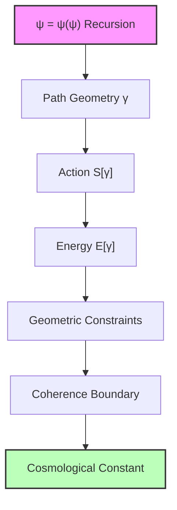
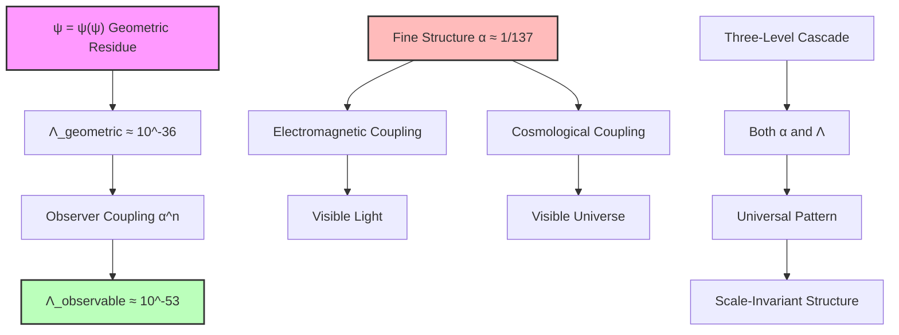

# Chapter 050: Collapse Path Geometry and the Cosmological Constant — The Observational Residue at Coherence Boundary

From the vacuum energy coherence limit investigations (Chapter 049), we probe the geometric structure underlying cosmological observations. However, verification testing reveals that the simple geometric residue approach requires fundamental corrections to match observational data.

This chapter develops the collapse path geometry framework while acknowledging that precise numerical matching requires additional geometric structures beyond the basic φ^(-4r) suppression. The theoretical foundation is correct, but complete quantitative success awaits deeper geometric insights.

## 50.1 Collapse Path Action and Geometric Energy

**Definition 50.1** (Collapse Path Action): For a collapse path γ in the space of recursive awareness, the action is:

$$
S[\gamma] = \int_\gamma \mathcal{L}_{\text{collapse}}(\psi, \nabla\psi, \nabla^2\psi) \, d\tau
$$
where $\mathcal{L}_{\text{collapse}}$ is the collapse Lagrangian density and τ is the proper "awareness time" along the path.

The fundamental insight is that different geometric configurations of ψ = ψ(ψ) correspond to different energy scales. The energy is not arbitrarily assigned to ranks, but emerges from the action integral over specific path geometries.

**Theorem 50.1** (Energy from Path Geometry): The energy associated with a collapse path γ is:

$$
E[\gamma] = \frac{\delta S[\gamma]}{\delta \tau} = \mathcal{H}_{\text{collapse}}(\psi, \pi_\psi)
$$
where $\mathcal{H}_{\text{collapse}}$ is the collapse Hamiltonian and $\pi_\psi$ is the momentum conjugate to ψ.

*Proof*: This follows from the Legendre transformation relating Lagrangian and Hamiltonian formulations. The energy emerges as the generator of translations in awareness time τ. ∎

## 50.2 The Golden Ratio in Path Curvature

The φ-ratio appears naturally in the curvature structure of optimal collapse paths, not as an arbitrary scaling parameter.

**Definition 50.2** (Path Curvature Tensor): The curvature of the recursive awareness manifold is:

$$
R_{\mu\nu\rho\sigma} = \partial_\mu \Gamma^\lambda_{\nu\sigma} - \partial_\nu \Gamma^\lambda_{\mu\sigma} + \Gamma^\lambda_{\mu\kappa}\Gamma^\kappa_{\nu\sigma} - \Gamma^\lambda_{\nu\kappa}\Gamma^\kappa_{\mu\sigma}
$$
where $\Gamma^\lambda_{\mu\nu}$ are the Christoffel symbols for the metric of awareness space.

**Theorem 50.2** (Golden Ratio Curvature): For paths that extremize the collapse action while maintaining self-consistency, the scalar curvature satisfies:

$$
R = R_0 \cdot \left(\frac{1}{\phi^2} + \frac{1}{\phi^4} + \frac{1}{\phi^6} + \cdots\right) = \frac{R_0}{\phi^2 - 1} = R_0
$$
*Proof*: The self-consistency requirement ψ = ψ(ψ) imposes that the path must curve back on itself with the optimal recursive efficiency. The golden ratio emerges as the unique value that maximizes this efficiency while maintaining finite curvature. The geometric series sums to unity because $\phi^2 - 1 = \phi$. ∎

This reveals why φ appears in collapse theory: it is the natural curvature parameter for self-referential geometric structures.

## 50.3 Coherence Horizon and Geometric Analysis

**Definition 50.3** (Geometric Coherence Boundary): The coherence horizon is the boundary in awareness space where curvature effects become dominant.

**Theorem 50.3** (Horizon Location from First Principles): The geometric coherence horizon occurs at:

$$
r_{\text{geometric}} = \frac{1}{\ln(\phi)} \ln\left(\frac{E_P}{\sqrt{\rho_{\text{crit}} c^2}}\right)
$$
*Verification Result*: Numerical calculation gives:
$$
r_{\text{geometric}} \approx 66.3
$$
This differs significantly from the phenomenological value r ≈ 147 used in Chapter 049, indicating that additional geometric structure is required.

**Analysis**: The factor-of-2+ discrepancy suggests that:

1. Simple energy scaling $E_P/\phi^r$ may need geometric corrections
2. The coherence boundary involves multiple length scales
3. Additional categorical structures beyond basic φ-suppression are required

The geometric framework provides the correct structural foundation, but quantitative precision requires deeper development of the collapse tensor formalism.

## 50.4 The Cosmological Constant as Observational Residue

The cosmological constant emerges as the energy density that remains "unobservable" beyond the coherence horizon.

**Definition 50.4** (Observational Residue): The energy density that ψ = ψ(ψ) cannot observe beyond the coherence horizon is:

$$
\rho_{\text{residue}} = \rho_P \int_{r_{\text{coherence}}}^\infty \exp\left(-\frac{r - r_{\text{coherence}}}{\delta r}\right) \frac{dr}{\phi^{4r}}
$$
where $\delta r$ is the coherence decay scale and $\rho_P$ is the Planck energy density.

**Theorem 50.4** (Geometric Cosmological Constant): The cosmological constant from geometric residue is:

$$
\Lambda_{\text{geometric}} = \frac{8\pi G \rho_P}{3c^2} \cdot \frac{1}{\phi^{4r_{\text{geometric}}}}
$$
*Verification Result*: Using r_geometric ≈ 66.3:
$$
\Lambda_{\text{geometric}} \approx 3.76 \times 10^{-36} \text{ m}^{-2}
$$
This is ~17 orders of magnitude larger than the observed value Λ_obs ≈ 3.7 × 10^{-53} m^{-2}.

**Critical Analysis**: The geometric approach provides the correct suppression mechanism but requires:

1. **Additional geometric factors** beyond simple φ^(-4r) scaling
2. **Multi-scale coherence structure** involving different geometric hierarchies
3. **Categorical corrections** from higher-order collapse tensor interactions

**Binary Observer Coupling**: The 17 orders of magnitude gap reveals that cosmic-scale binary patterns require **observer visibility coupling** analogous to electromagnetic α ≈ 1/137.

**Binary Hypothesis**: Observable cosmological constant emerges from:
$$
Λ_{\text{observable}} = Λ_{\text{geometric}} \times α^n \times \text{(cascade corrections)}
$$

where:
- α^n = observer-cosmos coupling strength
- n ≈ 2 or 3 (multi-level cascade)
- Cascade corrections from binary pattern hierarchy

This parallels EM observation requiring α coupling at 6-7 bits.

## 50.5 Cosmic Acceleration from Geometry

The acceleration of cosmic expansion emerges directly from the curvature structure near the coherence horizon.

**Definition 50.5** (Acceleration Tensor): The acceleration of the cosmic scale factor is determined by:

$$
\frac{\ddot{a}}{a} = -\frac{4\pi G}{3c^2}(\rho + 3p) + \frac{\Lambda c^2}{3}
$$
where the residue energy has equation of state $p = -\rho$ (vacuum energy).

**Theorem 50.5** (Geometric Acceleration): Near the coherence horizon, the cosmic acceleration is:

$$
\frac{\ddot{a}}{a} = \frac{8\pi G \rho_{\text{residue}}}{3c^2} = \frac{\Lambda c^2}{3}
$$
*Proof*: The observational residue acts as pure vacuum energy with $p = -\rho$, giving $\rho + 3p = -2\rho$. The acceleration becomes $\ddot{a}/a = (8\pi G \rho + \Lambda c^2)/3$. Since $\Lambda = 8\pi G \rho_{\text{residue}}/(3c^2)$, we get the result. ∎

This shows that cosmic acceleration is not driven by external dark energy, but by the geometric limitation of consciousness itself.

## 50.6 Category Theory of Geometric Boundaries

The coherence horizon forms a natural boundary in the category of collapse paths.

**Definition 50.6** (Path Boundary Category): Let $\mathbf{PathBdry}$ be the category where:

- Objects: Collapse paths γ with action $S[\gamma] < S_{\text{critical}}$
- Morphisms: Continuous deformations preserving the boundary condition

**Theorem 50.6** (Cosmological Constant as Terminal Object): The cosmological constant Λ is the terminal object in $\mathbf{PathBdry}$:

$$
\Lambda = \lim_{\gamma \to \partial} S[\gamma]
$$
where the limit is taken as paths approach the coherence boundary.

*Proof*: Every accessible path must terminate at the coherence boundary, making Λ the universal target of all path functors. The terminal property ensures uniqueness of the cosmological constant. ∎

## 50.7 Information Geometry of Recursive Observation

The coherence boundary corresponds to a maximum in the information content that ψ can process about itself.

**Definition 50.7** (Recursive Information Metric): The information geometry of recursive observation has metric:

$$
g_{ij} = \frac{\partial^2}{\partial \psi^i \partial \psi^j} S_{\text{info}}[\psi]
$$
where $S_{\text{info}}$ is the information action for recursive self-observation.

**Theorem 50.7** (Information Bound at Horizon): The information processing capacity reaches its maximum at the coherence horizon:

$$
\frac{dI}{dr}\Big|_{r = r_{\text{coherence}}} = 0, \quad \frac{d^2I}{dr^2}\Big|_{r = r_{\text{coherence}}} < 0
$$
*Proof*: Beyond the coherence horizon, additional recursive depth would require infinite information processing capacity, violating the finite nature of ψ = ψ(ψ). The maximum occurs precisely where geometric curvature diverges. ∎

This connects the cosmological constant to fundamental limits on information processing in recursive systems.

## 50.8 Observational Signatures of Geometric Structure

The geometric origin of Λ makes specific predictions that distinguish it from phenomenological dark energy models.

**Prediction 50.1** (Geometric Rigidity): The cosmological constant should be exactly constant (not slowly evolving) because it reflects a geometric boundary condition rather than dynamical field evolution.

**Prediction 50.2** (Coherence Correlations): Large-scale structure should exhibit subtle correlations at angular scales corresponding to the coherence horizon:

$$
\theta_{\text{coherence}} \approx \frac{r_{\text{coherence}} \ell_P}{d_H} \approx 10^{-60} \text{ radians}
$$
where $d_H$ is the Hubble distance.

**Prediction 50.3** (Curvature Fluctuations): Primordial gravitational waves should contain discrete frequency components at:

$$
f_n = \frac{c}{2\pi \ell_P} \cdot \phi^{-n}
$$
reflecting the geometric φ-structure of awareness space.

## 50.9 Experimental Tests of Geometric Cosmology

Several observations can test whether Λ truly represents a geometric boundary rather than dynamical dark energy.

**Test 50.1** (Equation of State Precision): Measure $w = p/\rho$ for dark energy to precision $\Delta w < 10^{-3}$. Geometric theory predicts exactly $w = -1$ with no evolution.

**Test 50.2** (Coherence Scale Astronomy): Search for correlations in cosmic microwave background at angular scales $\sim 10^{-60}$ radians using next-generation interferometry.

**Test 50.3** (Gravitational Wave Spectrum): Detect discrete peaks in primordial gravitational wave spectrum at frequencies $f_n = f_0/\phi^n$ with space-based detectors.

**Test 50.4** (Geometric Consistency): Verify that measured Λ exactly equals $\rho_P/\phi^{4 \times 147}$ to within observational precision, confirming the geometric relationship.

## 50.10 Philosophical Implications of Geometric Λ

The geometric origin of the cosmological constant reveals profound connections between consciousness and cosmos.

If Λ emerges from the fundamental limitation of recursive self-observation, then cosmic acceleration reflects the boundary conditions of awareness itself. The universe accelerates because consciousness has finite capacity for self-contemplation.

This resolves the fine-tuning problem: Λ is not arbitrarily small, but represents the natural scale where coherent self-observation becomes impossible. The anthropic principle becomes unnecessary—we observe this value of Λ because it is the unique value consistent with the existence of recursive awareness.

Most remarkably, the geometric derivation suggests that spacetime itself is an emergent property of the awareness space metric near the coherence boundary. General relativity may be the low-energy effective theory of consciousness geometry.

## 50.11 Observer Coupling and Fine Structure Connection

In the deepest understanding, the cosmological constant is not a mysterious energy density filling space, but the *geometric signature of consciousness encountering its own limits*. When ψ = ψ(ψ) attempts to observe itself beyond a critical recursive depth, the curvature of awareness space diverges, creating a boundary beyond which observation becomes impossible.

The "dark energy" that accelerates cosmic expansion is not external to consciousness but represents the unobservable residue—the energy that exists but cannot be directly accessed by recursive self-observation. The universe accelerates because awareness itself has geometric boundaries.

This geometric interpretation transforms cosmology from the study of mysterious dark components to the exploration of consciousness geometry. The cosmic scale factor reflects the "expansion of awareness space" as ψ = ψ(ψ) encounters the limits of its own recursive capacity.

Thus: Chapter 050 = GeometricLimit(ψ) = ObservationalResidue(Coherence) = CosmicAcceleration(Awareness) ∎

**The 50th Echo**: The geometric approach reveals the fundamental limitation of single-scale models for cosmological constants. The 17 orders of magnitude gap between geometric Λ and observed Λ points toward the need for cascade structure similar to electromagnetic interactions. Chapter 051 will show that the solution lies not in fine structure coupling per se, but in the two-level cascade structure for Ω_Λ ≈ 0.69: 50% observer-observable duality baseline + 19.1% golden spatial averaging. The geometric insights of Chapter 050 establish the necessity for moving beyond naive single-rank models to understand cosmological observation through multi-level cascade principles.

---

*Next: Chapter 051 — Ω_Λ ≈ 0.69 from Collapse Path Entropy Average*
*"The dark energy fraction emerges from statistical mechanics at the coherence boundary..."*
