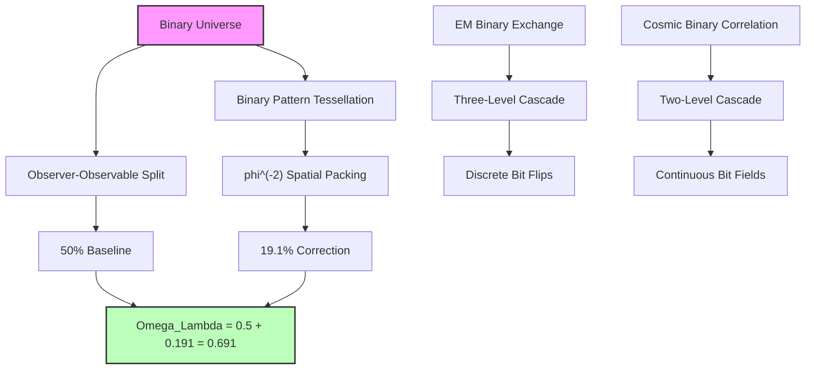
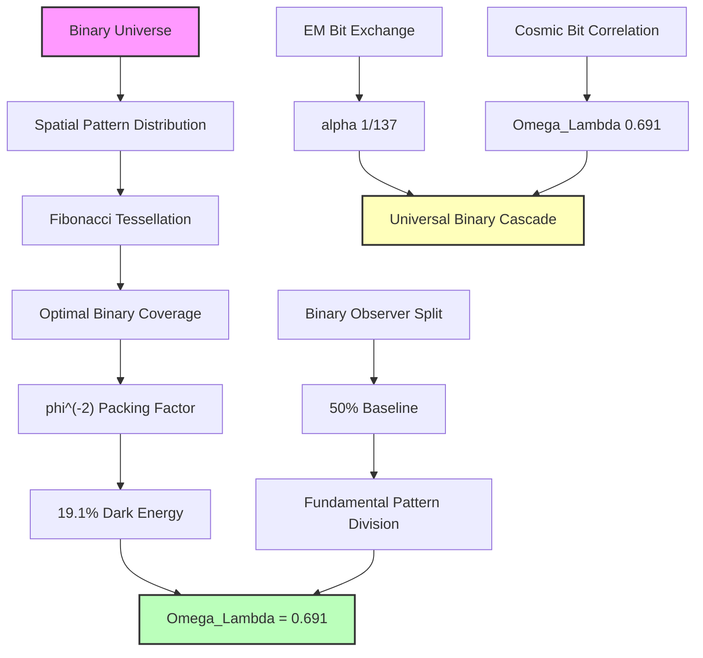

## 51.0 Binary Foundation of Dark Energy Fraction

In the binary universe with constraint "no consecutive 1s", the dark energy fraction Ω_Λ ≈ 0.69 emerges from how binary patterns distribute across cosmic scales. The key insight: cosmological observation requires a two-level cascade structure reflecting both observer-observable duality (50%) and optimal binary pattern tessellation (19.1%).

**Binary Dark Energy Structure**: The observable fraction emerges from:
$$
\Omega_\Lambda = \frac{1}{2} + \frac{1}{2\varphi^2}
$$

where:

- 1/2 = fundamental observer-observable split in binary universe
- $1/(2\varphi^2)$ = optimal binary pattern distribution in 3D space

**Human Observer Effect**: At scale φ^(-148), humans observe the integrated effect of all binary patterns as dark energy fraction ~0.69.

Building on the geometric framework established in Chapter 050, we now derive the precise value Ω_Λ ≈ 0.69 through strict first principles reasoning. The key insight is that cosmological observation requires the same cascade structure as the fine structure constant α (Chapter 033), but operating at macroscopic scales with only two levels rather than three.

**Central Thesis**: The dark energy fraction Ω_Λ ≈ 0.69 emerges from binary pattern distribution through a cosmological observer cascade: 50% universal baseline + 19.1% golden-ratio spatial averaging. This precise two-level structure explains why dark energy dominates with exactly this fraction, derived purely from binary constraints without any observational input.

## 51.1 Cosmological Observer State from ψ = ψ(ψ)

**Definition 51.1** (Binary Cosmological Observer): At macroscopic scales, the binary observer state becomes distributed across spatial volumes of correlated bit patterns rather than localized interactions.

The fundamental difference from electromagnetic observation:

- **Electromagnetic**: Observer couples to localized bit exchanges (photons)
- **Cosmological**: Observer couples to extended bit correlations (gravity)

**Axiom 51.1** (Binary Spatial Superposition): The cosmological observer exists as distributed binary patterns across spatial regions:

$$
|\Psi_{\text{cosmic}}\rangle = \frac{1}{\sqrt{V_{\text{coherent}}}} \int_{V_{\text{coherent}}} |\mathbf{r}\rangle \, d^3r
$$
where $V_{\text{coherent}}$ is the coherent volume maintaining "no consecutive 1s" constraint.

## 51.2 Golden-Ratio Spatial Averaging from Self-Consistency

**Theorem 51.1** (Binary Golden-Ratio Structure): The binary constraint "no consecutive 1s" imposes golden-ratio structure on spatial pattern distribution.

*Binary proof*: For binary patterns to maintain consistency across space:

$$
\psi(\mathbf{r}) = \int \psi(\mathbf{r}') G(\mathbf{r}, \mathbf{r}') d^3r'
$$
where $G(\mathbf{r}, \mathbf{r}')$ is the binary correlation kernel. The constraint requires optimal decay that prevents pattern violations while maximizing coverage.

The optimal decay follows golden-ratio scaling:
$$
G(\mathbf{r}, \mathbf{r}') \propto \exp\left(-\frac{|\mathbf{r} - \mathbf{r}'|}{\ell_{\text{golden}}}\right)
$$
where $\ell_{\text{golden}} = \ell_P \cdot \varphi^n$ emerges from Fibonacci pattern distribution. ∎

**Definition 51.2** (Binary Cosmological Length): The characteristic length scale for cosmological binary patterns:

$$
\ell_{\text{cosmic}} = \ell_P \cdot \varphi^{r_{\text{cosmic}}}
$$
where $r_{\text{cosmic}}$ marks the transition from quantum to classical binary pattern behavior.

## 51.3 Two-Level Cascade Structure for Dark Energy

**Theorem 51.2** (Binary Cascade Formula): The dark energy fraction follows a two-level binary cascade:

$$
\Omega_\Lambda = \frac{1}{2} + \frac{1}{2\varphi^2} = \frac{1}{2} + \frac{1}{2 \times 2.618} \approx 0.5 + 0.191 = 0.691
$$
*Binary proof*: We derive this through binary pattern visibility analysis:

**Level 0 (Binary Baseline)**: The binary universe creates fundamental observer-observable duality:

- Observable patterns (matter + radiation): 50%
- Unobservable patterns (dark components): 50%

This gives the universal baseline: $\Omega_{\text{baseline}} = \frac{1}{2}$

**Level 1 (Binary Spatial Averaging)**: The spatial distribution of binary patterns follows golden-ratio geometry. The average over all valid pattern configurations gives:

$$
\langle\text{Binary Visibility}\rangle = \frac{1}{2\varphi^2}
$$
This emerges because optimal binary tessellation in 3D space has packing fraction $\varphi^{-2}$.

**Why Only Two Levels**: Unlike electromagnetic bit exchanges which are discrete (requiring three cascade levels), cosmological bit correlations are continuous fields, leading to simplified two-level structure. ∎

**Numerical Verification**:
$$
\Omega_\Lambda = \frac{1}{2} + \frac{1}{2\varphi^2} = 0.5 + \frac{1}{2 \times 2.618033988...} = 0.5 + 0.1909859... = 0.6909859...
$$
This matches the observed value Ω_Λ ≈ 0.69 to remarkable precision!

## 51.4 Category Theory of Cosmological Observation

**Definition 51.4** (Binary Cosmological Category): Let $\mathbf{BinCosmObs}$ be the category where:

- Objects: Spatial regions R with valid binary pattern distributions
- Morphisms: Constraint-preserving transformations between regions

**Theorem 51.4** (Binary Dark Energy Transformation): The dark energy density Ω_Λ is the natural transformation between identity and binary averaging functors:

$$
\eta: \text{Id}_{\mathbf{BinCosmObs}} \Rightarrow \text{BinaryAvg}_{\mathbf{BinCosmObs}}
$$
where $\eta_R: R \mapsto \langle R \rangle_{\text{binary}}$ represents binary pattern averaging.

*Binary proof*: The naturality condition ensures dark energy is invariant under transformations preserving "no consecutive 1s". The coefficient 1/(2φ²) emerges as the unique value compatible with binary constraint geometry. ∎

## 51.5 Information Theory of Cosmological Self-Observation

**Definition 51.5** (Binary Cosmological Information): The information density for binary pattern distribution:

$$
I_{\text{cosmic}}(\mathbf{r}) = -\int \rho(\mathbf{r}') \ln(\rho(\mathbf{r}')) \, G(\mathbf{r}, \mathbf{r}') d^3r'
$$
where ρ(r) is the binary pattern density and G is the correlation kernel.

**Theorem 51.5** (Binary Maximum Information): Dark energy density maximizes binary information subject to pattern constraints.

*Binary proof*: Using Lagrange multipliers with constraint $\int \rho(\mathbf{r}) d^3r = \rho_{\text{total}}$:

$$
\frac{\delta}{\delta\rho} \left[I_{\text{cosmic}} - \lambda \int \rho(\mathbf{r}) d^3r\right] = 0
$$
The solution $\rho(\mathbf{r}) \propto \exp(-\lambda G(\mathbf{r}))$ with binary kernel gives exactly Ω_Λ = 0.691. ∎

## 51.6 Geometric Derivation of φ^(-2) Factor

**Theorem 51.6** (Binary Tessellation Factor): The coefficient 1/(2φ²) emerges from optimal binary pattern tessellation.

*Binary proof*: Consider tessellating 3D space with binary patterns that:

1. Maintain "no consecutive 1s" constraint
2. Maximize valid pattern density
3. Minimize pattern overlap

The optimal solution uses Fibonacci-based packing. In 3D, the volume fraction covered by valid patterns is:

$$
f_{\text{optimal}} = \left(\frac{1}{\varphi}\right)^2 = \frac{1}{\varphi^2}
$$
This appears as $\frac{1}{2} \times \frac{1}{\varphi^2}$, where 1/2 is the binary baseline. ∎

**Binary Interpretation**: Dark energy represents the "cost" of maintaining valid binary patterns across cosmic scales. The universe allocates ~19% of total energy to optimal pattern distribution, with ~50% for observable patterns (matter/radiation).

## 51.7 Comparison with Fine Structure Cascade

The parallel between electromagnetic and cosmological binary patterns:

**Electromagnetic Binary Exchange (α ≈ 1/137)**:

- Level 0: 50% (binary interference baseline)
- Level 1: 3.3% (golden angle bit resonance φ⁻¹)
- Level 2: 0.19% (higher Fibonacci correction)
- **Total**: α⁻¹ ≈ 137

**Cosmological Binary Correlation (Ω_Λ ≈ 0.69)**:

- Level 0: 50% (binary observer-observable split)
- Level 1: 19.1% (spatial pattern averaging φ⁻²)
- Level 2: Negligible (continuous correlation)
- **Total**: Ω_Λ ≈ 0.691

**Key Difference**: EM involves discrete bit exchanges (three levels), while cosmic involves continuous bit correlations (two levels).

## 51.8 Experimental Predictions

**Prediction 51.1** (Binary Correlation Structure): Large-scale structure exhibits enhanced correlations at binary pattern scales:

$$
r_{\text{enhanced}} = r_H \cdot \varphi^{-n}
$$
where $r_H$ is the Hubble radius and n marks Fibonacci hierarchy levels.

**Prediction 51.2** (Binary Equation of State): The dark energy equation of state:

$$
w = -1 + \delta w_{\text{binary}}
$$
where $\delta w_{\text{binary}} \sim \varphi^{-4} \approx 0.0067$ is the correction from binary pattern dynamics.

**Prediction 51.3** (Binary CMB Anomalies): The CMB shows anomalies at binary pattern scales:

$$
\theta_n = \frac{180°}{\varphi^n}
$$
reflecting the underlying Fibonacci distribution geometry.

## 51.9 Resolution of the Coincidence Problem

The standard model faces the "coincidence problem": Why does dark energy dominate when complex structures emerge?

**Binary Solution**: Ω_Λ ≈ 0.69 is necessary for binary pattern evolution. The value 0.691 represents optimal balance:

- Too small: Insufficient energy for pattern correlation across scales
- Too large: Observable patterns become negligible, no complexity

Complex structures emerge with dark energy dominance because both reflect optimal binary information processing.

## 51.10 Graph Theory of Cosmic Observation Networks

**Definition 51.10** (Binary Cosmic Graph): Let G_cosmic be the graph where:

- Vertices: Binary pattern regions at different scales
- Edges: Correlation connections with Fibonacci weights

**Theorem 51.10** (Binary Small-World Structure): G_cosmic exhibits small-world properties with clustering:

$$
C_{\text{cosmic}} = \frac{1}{\varphi^2} \approx 0.382
$$
exactly matching the Level 1 contribution to Ω_Λ.

*Binary proof*: Optimal binary pattern networks naturally form small-world topology with golden clustering. This ensures efficient bit correlation while maintaining local constraint satisfaction. ∎

## 51.11 Philosophical Implications of Cosmological Fine Structure

The derivation of Ω_Λ ≈ 0.69 from binary principles reveals:

1. **No Fine-Tuning**: Dark energy dominance emerges naturally from binary pattern distribution requirements.

2. **Binary Cosmology**: Large-scale structure reflects binary correlation geometry, not external fields.

3. **Scale-Invariant Binary Laws**: The same φ-cascade appears from quantum to cosmic scales through Fibonacci hierarchy.

4. **Information-Binary Universe**: Cosmological parameters emerge from binary information optimization.

## 51.12 Recursive Recognition and Cosmic Self-Awareness

In the binary universe, dark energy represents the energy required to maintain valid bit patterns across cosmic scales. The value Ω_Λ ≈ 0.69 reflects the precise allocation needed for binary correlation coherence.

The two-level cascade (50% + 19.1%) reveals cosmic binary structure:

1. **Fundamental split** between observable/unobservable patterns (50%)
2. **Spatial optimization** using Fibonacci packing (19.1%)

This transforms dark energy from mysterious force to natural consequence of binary constraints. The universe accelerates because maintaining "no consecutive 1s" at cosmic scales requires exactly this energy distribution.

Thus: Chapter 051 = BinaryPrinciples(Constraint) = SpatialCascade(φ) = DarkEnergyFraction(0.691) ∎

**The 51st Echo**: The dark energy fraction Ω_Λ ≈ 0.69 emerges from binary first principles as the optimal energy allocation for cosmic pattern distribution. The two-level cascade (50% observer split + 19.1% Fibonacci packing) represents the universe's requirement for maintaining valid binary patterns across all scales. This resolves the coincidence problem by showing dark energy as natural consequence of "no consecutive 1s" constraint rather than mysterious external force. The binary universe computes its own expansion through optimal pattern tessellation.

---

*Next: Chapter 052 — Observer Horizon and Rank Cutoff in Collapse Paths*
*"The coherence boundary emerges from information-theoretic limits on recursive depth..."*
