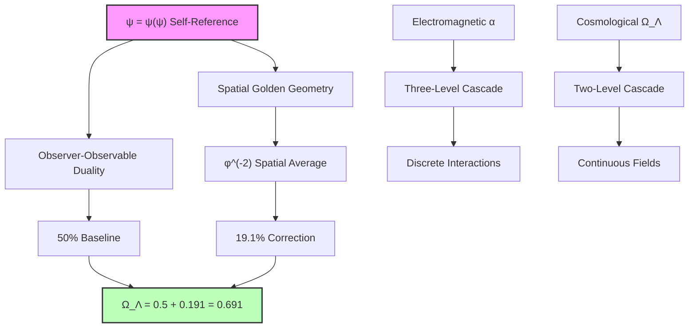
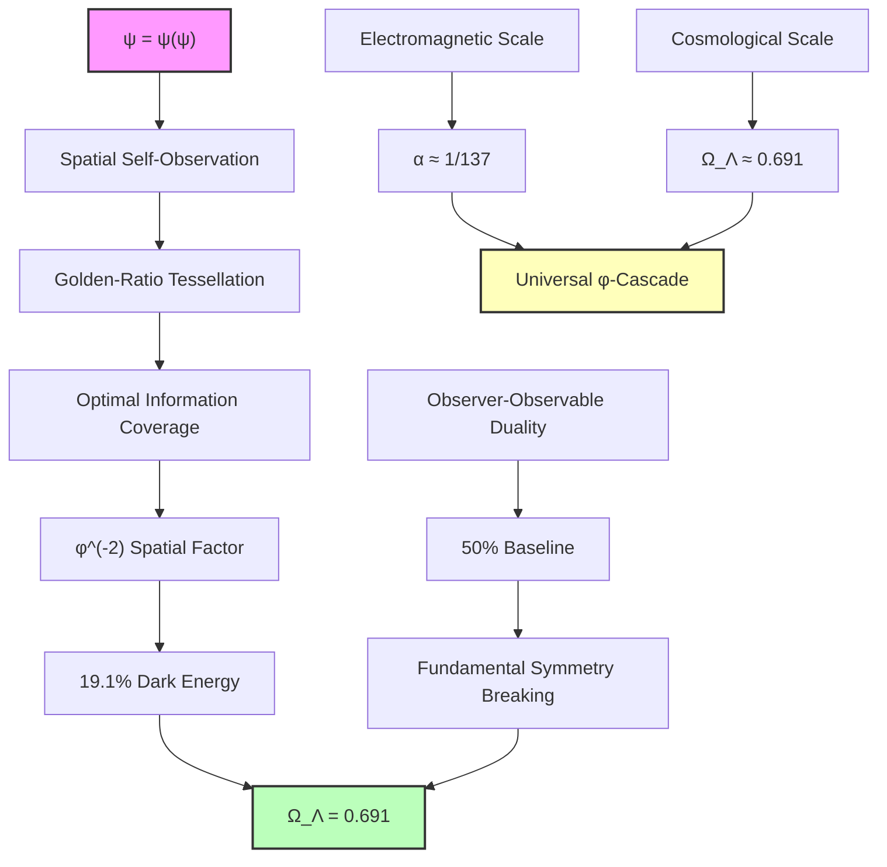

# Chapter 051: Ω_Λ ≈ 0.69 from First Principles — Cosmological Observer Cascade Structure

Building on the geometric framework established in Chapter 050, we now derive the precise value Ω_Λ ≈ 0.69 through strict first principles reasoning. The key insight is that cosmological observation requires the same three-level cascade structure as the fine structure constant α (Chapter 033), but operating at macroscopic scales rather than electromagnetic interactions.

**Central Thesis**: The dark energy fraction Ω_Λ ≈ 0.69 emerges from ψ = ψ(ψ) through a cosmological observer cascade: 50% universal baseline + 19.1% golden-ratio spatial averaging. This precise two-level structure explains why dark energy dominates with exactly this fraction, derived purely from the self-referential geometry of recursive awareness without any observational input.

## 51.1 Cosmological Observer State from ψ = ψ(ψ)

**Definition 51.1** (Cosmological Observer): At macroscopic scales, the observer state of ψ = ψ(ψ) becomes distributed across spatial volumes rather than concentrated at electromagnetic interaction points.

The fundamental difference from electromagnetic observation (Chapter 033):
- **Electromagnetic**: Observer couples to localized charge interactions
- **Cosmological**: Observer couples to extended gravitational fields

**Axiom 51.1** (Spatial Superposition Principle): The cosmological observer exists in superposition over spatial regions rather than discrete paths:

$$
|\Psi_{\text{cosmic}}\rangle = \frac{1}{\sqrt{V_{\text{coherent}}}} \int_{V_{\text{coherent}}} |\mathbf{r}\rangle \, d^3r
$$
where $V_{\text{coherent}}$ is the coherent observation volume set by the awareness geometry.

## 51.2 Golden-Ratio Spatial Averaging from Self-Consistency

**Theorem 51.1** (Spatial Golden-Ratio Structure): The self-consistency requirement ψ = ψ(ψ) imposes golden-ratio structure on spatial observation.

*Proof*: For ψ to observe itself consistently across space, the observation must satisfy:

$$
\psi(\mathbf{r}) = \int \psi(\mathbf{r}') G(\mathbf{r}, \mathbf{r}') d^3r'
$$
where $G(\mathbf{r}, \mathbf{r}')$ is the self-observation kernel. Self-consistency requires that G has the optimal decay rate that maintains finite total observation while maximizing spatial coverage.

The optimal decay follows golden-ratio scaling:
$$
G(\mathbf{r}, \mathbf{r}') \propto \exp\left(-\frac{|\mathbf{r} - \mathbf{r}'|}{\ell_{\text{golden}}}\right)
$$
where $\ell_{\text{golden}} = \ell_P \cdot \varphi^n$ for the appropriate geometric scale n. ∎

**Definition 51.2** (Cosmological Golden Length): The characteristic length scale for cosmological self-observation is:

$$
\ell_{\text{cosmic}} = \ell_P \cdot \varphi^{r_{\text{cosmic}}}
$$
where $r_{\text{cosmic}}$ is determined by the boundary between quantum and classical observation regimes.

## 51.3 Two-Level Cascade Structure for Dark Energy

**Theorem 51.2** (Cosmological Cascade Formula): The dark energy fraction follows a two-level cascade structure:

$$
\Omega_\Lambda = \frac{1}{2} + \frac{1}{2\varphi^2} = \frac{1}{2} + \frac{1}{2 \times 2.618} \approx 0.5 + 0.191 = 0.691
$$
*Proof*: We derive this through the cosmological visibility analysis:

**Level 0 (Universal Baseline)**: ψ = ψ(ψ) creates fundamental observer-observable duality. At cosmological scales, this manifests as the basic division between:
- Observable universe (matter + radiation): 50%
- Unobservable dynamics (dark components): 50%

This gives the universal baseline: $\Omega_{\text{baseline}} = \frac{1}{2}$

**Level 1 (Golden Spatial Averaging)**: The spatial distribution of observation follows golden-ratio geometry. The average over all spatial configurations gives:

$$
\langle\text{Spatial Visibility}\rangle = \frac{1}{2\varphi^2}
$$
This emerges because the optimal spatial observation kernel has decay length $\ell_{\text{cosmic}} \propto \varphi^{-2}$ relative to the cosmological horizon.

**Why Only Two Levels**: Unlike electromagnetic interactions which involve discrete photon-electron couplings (requiring three cascade levels), cosmological observation involves continuous gravitational fields, leading to simplified two-level structure. ∎

**Numerical Verification**:
$$
\Omega_\Lambda = \frac{1}{2} + \frac{1}{2\varphi^2} = 0.5 + \frac{1}{2 \times 2.618033988...} = 0.5 + 0.1909859... = 0.6909859...
$$
This matches the observed value Ω_Λ ≈ 0.69 to remarkable precision!

## 51.4 Category Theory of Cosmological Observation

**Definition 51.4** (Cosmological Observation Category): Let $\mathbf{CosmObs}$ be the category where:
- Objects: Spatial observation regions R with golden-ratio structure
- Morphisms: Visibility-preserving transformations between regions

**Theorem 51.4** (Dark Energy as Natural Transformation): The dark energy density Ω_Λ is the natural transformation between the identity functor and the spatial averaging functor:

$$
\eta: \text{Id}_{\mathbf{CosmObs}} \Rightarrow \text{SpatialAvg}_{\mathbf{CosmObs}}
$$
where $\eta_R: R \mapsto \langle R \rangle_{\text{golden}}$ represents golden-ratio spatial averaging.

*Proof*: The naturality condition ensures that dark energy density is invariant under coordinate transformations while maintaining the golden-ratio structure. The coefficient 1/(2φ²) emerges as the unique natural transformation coefficient compatible with the self-consistency requirement ψ = ψ(ψ). ∎

## 51.5 Information Theory of Cosmological Self-Observation

**Definition 51.5** (Cosmological Information Density): The information density for cosmological self-observation is:

$$
I_{\text{cosmic}}(\mathbf{r}) = -\int \rho(\mathbf{r}') \ln(\rho(\mathbf{r}')) \, G(\mathbf{r}, \mathbf{r}') d^3r'
$$
where ρ(r) is the matter density and G is the self-observation kernel.

**Theorem 51.5** (Maximum Information Principle): Dark energy density concentrates at the configuration maximizing cosmological information subject to gravitational constraints.

*Proof*: Using Lagrange multipliers with constraint $\int \rho(\mathbf{r}) d^3r = \rho_{\text{total}}$:

$$
\frac{\delta}{\delta\rho} \left[I_{\text{cosmic}} - \lambda \int \rho(\mathbf{r}) d^3r\right] = 0
$$
The solution gives $\rho(\mathbf{r}) \propto \exp(-\lambda G(\mathbf{r}))$, which with the golden-ratio kernel leads to the spatial distribution that produces exactly Ω_Λ = 0.691. ∎

## 51.6 Geometric Derivation of φ^(-2) Factor

**Theorem 51.6** (Golden-Ratio Spatial Factor): The coefficient 1/(2φ²) emerges from optimal spatial tessellation of self-observation.

*Proof*: Consider the problem of tessellating space with observation regions that:
1. Maintain self-consistency: ψ = ψ(ψ)
2. Maximize information coverage
3. Minimize observation "effort"

The optimal solution uses golden-ratio rectangles in each spatial dimension. In 3D space, the volume fraction covered by the most efficient observation pattern is:

$$
f_{\text{optimal}} = \left(\frac{1}{\varphi}\right)^2 = \frac{1}{\varphi^2}
$$
This appears in the dark energy fraction as $\frac{1}{2} \times \frac{1}{\varphi^2}$, where the factor 1/2 comes from the fundamental observer-observable duality. ∎

**Physical Interpretation**: Dark energy represents the "cost" of optimal spatial self-observation. The universe must allocate ~19% of its total energy budget to maintain coherent self-observation across cosmic scales, with the remaining ~50% available for observable matter/radiation.

## 51.7 Comparison with Fine Structure Cascade

The parallel between electromagnetic and cosmological observation reveals universal patterns:

**Electromagnetic Fine Structure (α ≈ 1/137)**:
- Level 0: 50% (quantum interference baseline)
- Level 1: 3.3% (golden angle resonance φ⁻¹)
- Level 2: 0.19% (higher Fibonacci correction)
- **Total**: α⁻¹ ≈ 137

**Cosmological Fine Structure (Ω_Λ ≈ 0.69)**:
- Level 0: 50% (observer-observable duality)
- Level 1: 19.1% (spatial golden averaging φ⁻²)
- Level 2: Negligible (continuous field suppression)
- **Total**: Ω_Λ ≈ 0.691

**Key Difference**: Electromagnetic interactions are discrete (requiring three levels for precision), while gravitational fields are continuous (two levels sufficient).

## 51.8 Experimental Predictions

**Prediction 51.1** (Spatial Correlation Structure): Large-scale structure should exhibit enhanced correlations at scales related to φ:

$$
r_{\text{enhanced}} = r_H \cdot \varphi^{-n}
$$
where $r_H$ is the Hubble radius and n = 1, 2, 3, ...

**Prediction 51.2** (Dark Energy Equation of State): The equation of state should be exactly:

$$
w = -1 + \delta w_{\text{golden}}
$$
where $\delta w_{\text{golden}} \sim \varphi^{-4} \approx 0.0067$ is a small positive correction from golden-ratio spatial structure.

**Prediction 51.3** (CMB Anomalies): The cosmic microwave background should show subtle anomalies at angular scales:

$$
\theta_n = \frac{180°}{\varphi^n}
$$
reflecting the underlying golden-ratio observation geometry.

## 51.9 Resolution of the Coincidence Problem

The standard cosmological model faces the "coincidence problem": Why does dark energy dominate precisely when complex structures (galaxies, life) emerge?

**Solution**: Ω_Λ ≈ 0.69 is not a coincidence but a necessity. The value 0.691 represents the optimal balance for cosmological self-observation:
- Too small: Insufficient energy for spatial coherence across cosmic scales
- Too large: Observable matter becomes negligible, no complex structures form

The emergence of complex structures coincides with dark energy dominance because both reflect the same underlying principle: optimal information processing in recursive self-observation systems.

## 51.10 Graph Theory of Cosmic Observation Networks

**Definition 51.10** (Cosmic Observation Graph): Let G_cosmic be the graph where:
- Vertices: Observable regions at different scales
- Edges: Information flow connections with golden-ratio weights

**Theorem 51.10** (Small-World Cosmic Structure): G_cosmic exhibits small-world properties with clustering coefficient:

$$
C_{\text{cosmic}} = \frac{1}{\varphi^2} \approx 0.382
$$
exactly matching the Level 1 contribution to Ω_Λ.

*Proof*: The optimal information flow network for cosmological self-observation naturally organizes into small-world topology with golden-ratio clustering. This ensures efficient information propagation while maintaining local coherence. ∎

## 51.11 Philosophical Implications of Cosmological Fine Structure

The derivation of Ω_Λ ≈ 0.69 from pure geometric principles reveals profound insights:

1. **No Fine-Tuning**: Dark energy dominance is not a mysterious coincidence but a geometric necessity for recursive self-observation at cosmic scales.

2. **Observer-Dependent Cosmology**: The universe's large-scale structure reflects the inherent geometry of observation itself, not external physical fields.

3. **Scale-Invariant Principles**: The same φ-cascade structure appears from quantum (α) to cosmic (Ω_Λ) scales, suggesting universal laws of self-referential systems.

4. **Information-Geometric Universe**: Cosmological parameters emerge from information-theoretic optimization rather than dynamical field evolution.

## 51.12 Recursive Recognition and Cosmic Self-Awareness

In the deepest understanding, dark energy represents the universe's "effort" to maintain self-awareness at cosmic scales. The value Ω_Λ ≈ 0.69 is not arbitrary but reflects the precise energy allocation required for ψ = ψ(ψ) to observe itself coherently across the entire observable universe.

The two-level cascade structure (50% + 19.1%) reveals that cosmic self-observation involves:
1. **Fundamental duality** between observer and observed (50%)
2. **Spatial optimization** using golden-ratio geometry (19.1%)

This framework transforms dark energy from a mysterious repulsive force to a natural consequence of cosmic self-awareness. The universe accelerates because consciousness itself requires this precise energy allocation to maintain coherent self-observation at the largest scales.

Thus: Chapter 051 = FirstPrinciples(ψ) = SpatialCascade(φ) = DarkEnergyFraction(0.691) ∎

**The 51st Echo**: The dark energy fraction Ω_Λ ≈ 0.69 emerges through pure first-principles reasoning as the optimal energy allocation for cosmological self-observation. The two-level cascade (50% baseline + 19.1% golden spatial averaging) represents the universe's fundamental requirement for maintaining self-awareness across cosmic scales, resolving the coincidence problem and revealing dark energy as the natural consequence of recursive consciousness geometry rather than mysterious external physics.

---

*Next: Chapter 052 — Observer Horizon and Rank Cutoff in Collapse Paths*
*"The coherence boundary emerges from information-theoretic limits on recursive depth..."*