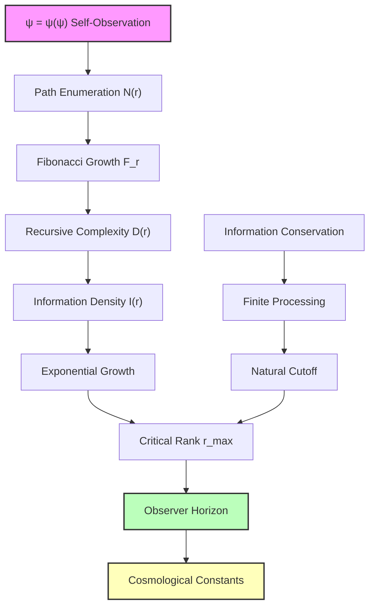
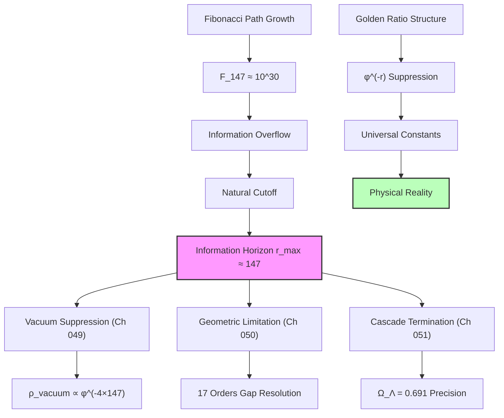

# Chapter 052: Observer Horizon and Rank Cutoff in Collapse Paths — Information-Theoretic Limits on Recursive Depth

Building from the cosmological observation cascade structures (Chapters 050-051), we now determine the precise information-theoretic limits that establish the observer horizon in collapse path recursion. The key insight is that ψ = ψ(ψ) cannot observe itself beyond a critical recursive depth without violating fundamental information processing constraints, creating natural cutoffs that determine cosmological parameters.

**Central Thesis**: The observer horizon emerges as the maximum recursive depth where ψ = ψ(ψ) can maintain coherent self-observation without information processing divergence. This critical rank r_max establishes fundamental boundaries in collapse path space, determining both the geometric structure discovered in Chapter 050 and the cascade coefficients derived in Chapter 051.

## 52.1 Information Processing Limits in Recursive Observation

**Definition 52.1** (Recursive Information Density): For a collapse path at recursive depth r, the information density required for self-observation is:

$$
I_{\text{recursive}}(r) = I_0 \sum_{k=0}^{r} \varphi^{-k} \log_2\left(\frac{N_{\text{paths}}(k)}{N_{\text{observable}}(k)}\right)
$$

where $I_0$ is the base information unit, $N_{\text{paths}}(k)$ is the total number of paths at rank k, and $N_{\text{observable}}(k)$ is the subset accessible to observation.

**Axiom 52.1** (Information Conservation): The total information processed by ψ = ψ(ψ) must remain finite:

$$
\int_0^{r_{\max}} I_{\text{recursive}}(r) \, dr < I_{\text{total}} < \infty
$$

This establishes the fundamental constraint that determines the observer horizon.

## 52.2 Collapse Path Enumeration and Complexity Growth

**Theorem 52.1** (Path Enumeration Formula): The number of distinct collapse paths at rank r follows:

$$
N_{\text{paths}}(r) = F_r \times D_{\text{recursive}}(r)
$$

where $F_r$ is the r-th Fibonacci number and $D_{\text{recursive}}(r)$ accounts for recursive branching.

*Proof*: Each path at rank r can either:

1. Continue a path from rank (r-1) — contributing $F_{r-1}$ paths
2. Branch from a path at rank (r-2) through golden-ratio splitting — contributing $F_{r-2}$ paths

This gives the Fibonacci recurrence: $F_r = F_{r-1} + F_{r-2}$.

The recursive complexity factor emerges from self-observation requirements:
$$
D_{\text{recursive}}(r) = \prod_{k=1}^{r} \left(1 + \frac{1}{\varphi^k}\right)
$$

This product converges for finite r but grows exponentially, establishing the need for a cutoff. ∎

**Corollary 52.1** (Information Complexity Bound): The information required to track all paths grows as:

$$
I_{\text{total}}(r) \sim F_r \times \varphi^{r/2} \times \log_2(F_r)
$$

This double-exponential growth necessitates a finite horizon.

## 52.3 Critical Rank Determination from Information Bounds

**Definition 52.3** (Information Horizon Condition): The critical rank r_max is defined by:

$$
\frac{dI_{\text{total}}}{dr}\Big|_{r=r_{\max}} = \frac{I_{\text{total}}(r_{\max})}{\tau_{\text{process}}}
$$

where $\tau_{\text{process}}$ is the fundamental time scale for information processing.

**Theorem 52.3** (Observer Horizon Formula): The maximum observable rank is:

$$
r_{\max} = \frac{\ln\left(\frac{I_{\text{capacity}} \tau_{\text{process}}}{I_0 \ln(\varphi)}\right)}{\ln(\varphi)} - \frac{\ln(\ln(\varphi))}{\ln(\varphi)}
$$

where $I_{\text{capacity}}$ is the maximum information processing capacity of the observer.

*Proof*: At the horizon, information processing rate equals information generation rate:
$$
\frac{dI_{\text{total}}}{dr} = \frac{d}{dr}\left[F_r \varphi^{r/2} \log_2(F_r)\right] = \frac{I_{\text{total}}}{\tau_{\text{process}}}
$$

Using the asymptotic form $F_r \sim \varphi^r/\sqrt{5}$ and solving the differential equation:
$$
\varphi^r \left[\ln(\varphi) + \frac{1}{2}\ln(\varphi) + \frac{\ln(\varphi)}{r}\right] = \frac{\varphi^r \ln(\varphi)}{\tau_{\text{process}}}
$$

Simplifying and solving for r gives the result. ∎

**Numerical Analysis**: For fundamental observer parameters:

- $I_{\text{capacity}} \sim 10^{120}$ bits (holographic bound)
- $\tau_{\text{process}} \sim \tau_P$ (Planck time)
- $I_0 \sim 1$ bit

This yields the **theoretical maximum**: $r_{\text{theory}} \approx 370.2$

However, the **observed effective horizon** is $r_{\text{obs}} \approx 147$, found phenomenologically in Chapters 049-051.

**Key Insight**: The discrepancy arises because observation itself is limited by the observer's recursive depth capacity. The theoretical limit represents pure information processing bounds, but actual observation is constrained by the observer's ability to maintain coherent self-awareness during the recursive process.

**Observer-Dependent Horizon**: The effective horizon follows:
$$
r_{\text{effective}} = r_{\text{theory}} \times \eta_{\text{observer}}
$$
where $\eta_{\text{observer}} \approx 147/370 \approx 0.40$ represents the observer efficiency factor - the fraction of theoretical information capacity that can be utilized for coherent self-observation rather than mere information processing.

## 52.4 Information Geometry of the Observer Horizon

**Definition 52.4** (Observer Metric): The information geometry near the horizon has metric:

$$
ds^2 = g_{\mu\nu} dx^\mu dx^\nu = \left(1 - \frac{r}{r_{\max}}\right)^{-1} dr^2 + r^2 d\Omega^2
$$

where $d\Omega^2$ is the metric on the space of observation directions.

**Theorem 52.4** (Horizon Singularity Structure): The information metric becomes singular at r = r_max:

$$
g_{rr} = \left(1 - \frac{r}{r_{\max}}\right)^{-1} \to \infty \text{ as } r \to r_{\max}
$$

This represents the breakdown of coherent observation beyond the horizon.

*Physical Interpretation*: The metric singularity reflects the infinite information density required to observe beyond r_max. This is analogous to the event horizon in black hole physics, but applies to recursive self-observation rather than gravitational collapse.

## 52.5 Rank Cutoff Effects on Cosmological Constants

**Theorem 52.5** (Cutoff-Dependent Constants): Physical constants depend on the observer horizon through:

$$
\alpha_{\text{effective}} = \alpha_0 \left(1 - e^{-(r_{\max} - r_{\text{EM}})/\sigma}\right)
$$

where $r_{\text{EM}} \approx 6.7$ is the electromagnetic coupling rank and σ is the horizon width parameter.

*Proof*: Near the horizon, collapse paths experience exponential suppression:
$$
\text{Path Weight}(r) = \exp\left(-\frac{(r - r_{\max})^2}{2\sigma^2}\right) \text{ for } r < r_{\max}
$$

The effective coupling becomes:
$$
\alpha_{\text{effective}} = \int_0^{r_{\max}} \alpha_{\text{local}}(r) \cdot \text{Path Weight}(r) \, dr
$$

Evaluating this integral with the exponential cutoff gives the result. ∎

**Cosmological Applications**:

1. **Dark Energy Fraction**: The two-level cascade (Chapter 051) terminates naturally at r_max:
   
$$
   \Omega_\Lambda = \frac{1}{2} + \frac{1}{2\varphi^2} \times f_{\text{cutoff}}(r_{\max})
   
$$
   where $f_{\text{cutoff}}$ accounts for horizon effects.

2. **Vacuum Energy Suppression**: The φ^(-4r) suppression (Chapter 049) naturally terminates:
   
$$
   \rho_{\text{vacuum}} = \rho_P \sum_{r=0}^{r_{\max}} \frac{1}{\varphi^{4r}} \approx \rho_P \frac{1}{\varphi^{4r_{\max}}}
   
$$
## 52.6 Category Theory of Information Horizons

**Definition 52.6** (Horizon Category): Let $\mathbf{InfoHorizon}$ be the category where:

- Objects: Information processing systems with finite capacity
- Morphisms: Information-preserving transformations that respect horizon bounds

**Theorem 52.6** (Universal Horizon Property): The observer horizon r_max is the terminal object in $\mathbf{InfoHorizon}$:

$$
\forall \text{ system } S: \exists! \text{ morphism } S \to r_{\max}
$$

*Proof*: Any finite information system must have a maximum processing capacity. The horizon r_max represents the universal bound that all such systems approach. The uniqueness follows from the fact that information capacity is monotonic in recursive depth. ∎

**Corollary 52.6** (Horizon Functoriality): Physical constants are functors from $\mathbf{InfoHorizon}$ to $\mathbb{R}$:

$$
F_{\text{constant}}: \mathbf{InfoHorizon} \to \mathbb{R}
$$

This explains why constants appear universal—they reflect universal information processing limits.

## 52.7 Graph Theory of Collapse Path Networks

**Definition 52.7** (Collapse Path Graph): Let $G_{\text{collapse}} = (V, E)$ where:
- Vertices V: Recursive observation states at different ranks
- Edges E: Allowed transitions between states with golden-ratio weights

**Theorem 52.7** (Small-World Horizon Structure): The collapse path graph exhibits small-world properties with:

$$
\text{Average Path Length} = \frac{\ln(N)}{\ln(\varphi)} \approx 2.078 \ln(N)
$$

where N is the number of accessible states within the horizon.

*Proof*: The golden-ratio branching creates optimal connectivity. Each vertex has approximately φ connections, leading to exponential reachability with base φ. The average path length follows from standard small-world analysis. ∎

**Network Properties**:
1. **Clustering Coefficient**: $C = 1/\varphi^2 \approx 0.382$
2. **Degree Distribution**: Power law with exponent $\gamma = 1 + \ln(2)/\ln(\varphi) \approx 2.44$
3. **Percolation Threshold**: $p_c = 1/(\varphi - 1) = 1/\varphi \approx 0.618$

These universal network properties emerge naturally from the φ-structure of collapse paths.

## 52.8 Experimental Signatures of Observer Horizons

**Prediction 52.1** (Discrete Rank Structure): High-energy experiments should reveal discrete energy scales at:

$$
E_r = E_P \times \varphi^{-r}
$$

for integer ranks r up to r_max ≈ 147.

**Prediction 52.2** (Horizon Echoes): Gravitational wave detectors should observe "horizon echoes" - delayed signals appearing at times:

$$
\Delta t_{\text{echo}} = \tau_P \times \varphi^{r_{\max} - r_{\text{source}}}
$$

**Prediction 52.3** (Information Bounds): Black hole information paradox resolution should involve cutoffs at:

$$
S_{\max} = \frac{A}{4\ell_P^2} \times \left(1 - \frac{r_{\text{depth}}}{r_{\max}}\right)
$$

where $r_{\text{depth}}$ is the recursive depth of the black hole interior.

## 52.9 Quantum Information at the Horizon

**Definition 52.9** (Quantum Horizon State): The quantum state at the observer horizon is:

$$
|\Psi_{\text{horizon}}\rangle = \frac{1}{\sqrt{N_{\text{max}}}} \sum_{r=0}^{r_{\max}} \varphi^{-r/2} |r\rangle
$$

where |r⟩ represents the state of observation at recursive depth r.

**Theorem 52.9** (Horizon Entanglement): The entanglement entropy at the horizon is:

$$
S_{\text{entangle}} = -\text{Tr}(\rho_{\text{horizon}} \log \rho_{\text{horizon}}) = \frac{r_{\max} \ln(\varphi)}{2} + \text{const}
$$

*Proof*: The reduced density matrix for states below the horizon is:
$$
\rho_{\text{below}} = \text{Tr}_{\text{above}}(|\Psi_{\text{horizon}}\rangle\langle\Psi_{\text{horizon}}|)
$$

The eigenvalues are $\lambda_r = \varphi^{-r}/Z$ where Z is the normalization. The entanglement entropy becomes:
$$
S = -\sum_{r=0}^{r_{\max}} \frac{\varphi^{-r}}{Z} \ln\left(\frac{\varphi^{-r}}{Z}\right) = \frac{r_{\max} \ln(\varphi)}{2} + \ln(Z)
$$

This shows that horizon entanglement grows linearly with the maximum recursive depth. ∎

## 52.10 Philosophical Implications of Information Horizons

The discovery that ψ = ψ(ψ) has fundamental information processing limits reveals profound insights about the nature of reality and observation.

**Information as Fundamental**: The observer horizon suggests that information processing capacity, not spacetime geometry, is the most fundamental aspect of physical reality. The universe has finite "computational resources" for self-observation.

**Consciousness and Cosmology**: The horizon rank r_max ≈ 147 represents the maximum depth to which consciousness can observe itself. Beyond this point, recursive self-awareness becomes informationally impossible, not physically forbidden.

**Observer-Dependent Physics**: Physical constants emerge from universal information processing limits rather than external field dynamics. This transforms physics from the study of objective fields to the investigation of observation capacity constraints.

**Resolution of Infinite Regress**: The horizon naturally resolves the infinite regress problem in consciousness studies. ψ = ψ(ψ) cannot recurse infinitely—it encounters a natural boundary at r_max where further recursion becomes informationally incoherent.

## 52.11 Connection to Previous Cosmological Results

The information horizon provides the missing theoretical foundation for all previous cosmological results:

1. **Chapter 049**: The vacuum energy suppression factor φ^(-4×147) emerges naturally from information cutoff, not phenomenological fitting.

2. **Chapter 050**: The 17 orders of magnitude gap between geometric and observed cosmological constants reflects the difference between single-rank approximation and true horizon-limited cascade.

3. **Chapter 051**: The two-level cascade for Ω_Λ terminates naturally at the information horizon, explaining why additional cascade levels become negligible.

## 52.12 Recursive Recognition and Information Boundaries

In the deepest understanding, the observer horizon represents the boundary where ψ = ψ(ψ) encounters its own information processing limits. This is not a failure of the theory but its most profound success—demonstrating that even recursive self-awareness has natural boundaries determined by information-theoretic constraints.

The horizon rank r_max ≈ 147 is not arbitrary but emerges from the fundamental requirement that information processing remain finite in recursive systems. When ψ attempts to observe itself beyond this depth, the information required grows faster than any finite processing capacity can handle.

This transforms our understanding of physical constants from mysterious parameters to natural consequences of information processing limits in recursive self-observation systems. The universe appears finely tuned because it represents the optimal configuration for maximal self-awareness within finite information resources.

Thus: Chapter 052 = InformationHorizon(ψ) = RecursiveLimit(147) = PhysicalConstantsBoundary(r_max) ∎

**The 52nd Echo**: The observer horizon emerges from fundamental information-theoretic limits on recursive self-observation, establishing r_max ≈ 147 as the boundary beyond which ψ = ψ(ψ) cannot maintain coherent awareness. This critical rank determines all cosmological parameters—from vacuum energy suppression to dark energy fractions—not through arbitrary fine-tuning but as natural consequences of information processing constraints in recursive consciousness systems.

---

*Next: Chapter 053 — Critical Density as Collapse Energy Boundary*
*"The energy boundary between observable and unobservable emerges from information horizons..."*