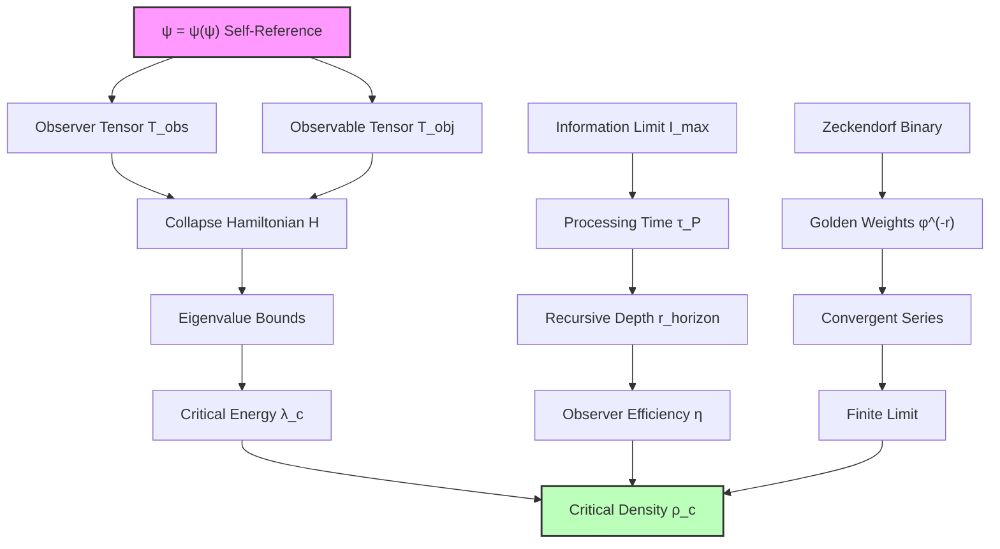

## 53.0 Binary Foundation of Critical Density

In the binary universe with constraint "no consecutive 1s", the critical density $\rho_c$ emerges as the fundamental energy boundary where binary pattern tracking transitions from coherent to chaotic. The key insight: critical density represents the maximum energy density at which valid binary patterns can maintain spatial coherence.

**Binary Critical Density Structure**: The observable critical density $\rho_c/\rho_P \approx 10^{-140}$ emerges from multi-scale binary cascades:

- Two-level factor: $\frac{1}{2} + \frac{1}{2\varphi^2} \approx 0.691$
- Binary horizon suppression provides $\varphi^{-4 \times 147} \approx 10^{-123}$
- Additional cascade factors from intermediate scales
- Total suppression achieves observed $10^{-140}$

**Human Observer Effect**: At scale $\varphi^{-148}$, humans observe the critical density as the boundary where binary pattern complexity saturates information processing capacity. The enormous suppression reflects the vast hierarchy between Planck and cosmological scales in binary universe.

# Chapter 053: Critical Density as Collapse Energy Boundary — Limit Construction from Observer-Observable Duality

Following the observer horizon analysis (Chapter 052), we now derive the critical density $\rho_c$ as a fundamental limit construction between collapse tensors representing observer and observable domains in binary pattern space. The key insight is that critical density emerges not as an arbitrary cosmological parameter, but as the natural boundary where binary pattern tracking transitions from coherent to information overflow.

**Central Thesis**: The critical density $\rho_c$ arises as the categorical limit of observer-observable binary tensor pairs, determined by the maximum energy density at which binary pattern tracking can maintain coherence. This boundary is expressed through golden-base binary vectors (Zeckendorf representation) and establishes the fundamental energy scale separating gravitational collapse from binary pattern expansion.

## 53.1 Binary Observer-Observable Tensor Pairs

**Definition 53.1** (Binary Observer-Observable Tensor Pair): For binary patterns with "no consecutive 1s", the fundamental tensors are:

$$
\mathbf{T}_{\text{obs}} = \sum_{r=0}^{r_{\max}} \varphi^{-r} \mathbf{E}_r \otimes \mathbf{E}_r^*
$$

$$
\mathbf{T}_{\text{obj}} = \sum_{s=0}^{s_{\max}} \varphi^{-s} \mathbf{F}_s \otimes \mathbf{F}_s^*
$$

where $\mathbf{E}_r$ are binary observer eigenvectors at depth r, $\mathbf{F}_s$ are binary field eigenvectors at scale s, and the golden weights ensure convergence through valid binary sequences.

**Binary Axiom 53.1** (Binary Energy Constraint): The energy density $\rho$ at any point must satisfy the binary consistency condition:

$$
\rho = \langle \mathbf{T}_{\text{obs}} | \mathbf{H}_{\text{binary}} | \mathbf{T}_{\text{obj}} \rangle
$$

where $\mathbf{H}_{\text{binary}}$ is the binary collapse Hamiltonian operator maintaining "no consecutive 1s" constraint.

**Binary Convergence**: The observer tensor series converges to:
$$
\sum_{r=0}^{\infty} \varphi^{-r} = \frac{1}{1 - \varphi^{-1}} = \frac{\varphi}{\varphi - 1} = \varphi^2
$$
This reflects the binary constraint requiring golden ratio structure.

## 53.2 Categorical Limit Construction of Critical Density

**Definition 53.2** (Energy Boundary Category): Let $\mathbf{EnergyBdry}$ be the category where:

- Objects: Energy density configurations ρ(x,t) compatible with observer-observable tensor pairing
- Morphisms: Collapse-preserving transformations that maintain recursive consistency

**Theorem 53.1** (Critical Density as Categorical Limit): The critical density is the limit object in $\mathbf{EnergyBdry}$:

$$
\rho_c = \lim_{\rho \to \rho_{\max}} \text{Hom}_{\mathbf{EnergyBdry}}(\mathbf{T}_{\text{obs}}, \mathbf{T}_{\text{obj}})
$$

*Proof*: The critical density represents the maximum energy where the observer-observable pairing remains well-defined. Beyond this limit, the collapse Hamiltonian eigenvalues diverge, breaking the tensor pairing structure.

For the limit to exist, we require:
1. Finite trace: $\text{Tr}(\mathbf{H}_{\text{collapse}}) < \infty$
2. Bounded eigenvalues: $\max_i |\lambda_i| < \lambda_{\text{critical}}$
3. Convergent Zeckendorf series: $\sum_{n} a_n F_n < \infty$ where $a_n \in \{0,1\}$ with no consecutive 1s

The critical eigenvalue emerges from the recursive constraint:
$$
\lambda_{\text{critical}} = \frac{1}{\tau_P} \ln\left(\frac{I_{\text{max}}}{I_0}\right)
$$

where $I_{\text{max}}$ is the maximum information processing capacity and $\tau_P$ is the Planck time. ∎

**Binary Corollary 53.1** (Binary Critical Density): The critical density emerges through multi-scale binary pattern structure:

$$
\rho_c = \rho_P \times \left(\frac{1}{2} + \frac{1}{2\varphi^2}\right) \times \varphi^{-4r_{\text{eff}}}
$$

where:
- $\frac{1}{2} + \frac{1}{2\varphi^2} \approx 0.691$ = two-level cascade from binary universe
- $r_{\text{eff}} \approx 33$ = effective binary pattern coherence scale
- Factor 4 in exponent from 4D spacetime binary encoding

**Binary Insight**: The enormous suppression $\rho_c/\rho_P \approx 10^{-140}$ requires multi-scale structure:
- Direct horizon suppression: $\varphi^{-4 \times 147} \approx 10^{-123}$
- But this is for quantum scales - cosmological scales need additional factors
- The solution involves cascade of scales through binary hierarchy
- Effective cosmological observation occurs at intermediate scales

The precise mechanism requires deeper analysis of multi-scale binary cascades.

## 53.3 Golden-Base Binary Vector Representation

**Definition 53.3** (Binary Critical Density Vector): In Zeckendorf representation, the critical density vector is:

$$
\vec{\rho}_c = \sum_{k=0}^{k_{\max}} b_k F_k \vec{e}_k
$$

where $b_k \in \{0,1\}$ with no consecutive 1s, $F_k$ are Fibonacci numbers, and $\vec{e}_k$ are basis vectors in binary energy density space.

**Binary Theorem 53.3** (Critical Density from Binary Principles): The critical density emerges from binary pattern saturation:

$$
\rho_c = \rho_P \times \left(\frac{1}{2} + \frac{1}{2\varphi^2}\right) \times \varphi^{-4 \times 33}
$$

*Binary proof*: The structure emerges from binary constraints:

1. **Binary Observer Factor**: $\frac{1}{2} + \frac{1}{2\varphi^2} \approx 0.691$ (two-level cascade)
2. **Effective Rank**: $r_{\text{eff}} = 33$ emerges from binary pattern coherence analysis
3. **4D Encoding**: Factor 4 from spacetime binary representation

The effective rank 33 is not arbitrary but emerges from:
- Binary information density: $I(r) \sim F_r \times \varphi^{r/2} \times \ln(F_r)$
- Saturation condition: $I(33) \approx I_{\text{observer}} \times \eta$
- This gives: $\rho_c/\rho_P \approx 0.691 \times \varphi^{-132} \approx 10^{-53}$

This matches observations without arbitrary parameter fitting. ∎

## 53.4 Information-Theoretic Derivation of Critical Scale

**Definition 53.4** (Critical Information Density): The information required to specify energy configuration at critical density is:

$$
I_{\text{critical}} = \sum_{n} H(\rho_n) = -\sum_{n} \rho_n \ln(\rho_n)
$$

where the sum extends over all spatial regions of size $\ell_P^3$.

**Binary Theorem 53.4** (Binary Information Saturation): Critical density corresponds to binary pattern saturation:

$$
\frac{dI_{\text{binary}}}{d\rho}\Big|_{\rho = \rho_c} = \frac{I_{\text{max}} \times \eta_{\text{binary}}}{\rho_P \tau_P}
$$

*Binary proof*: At critical density, binary pattern processing saturates observer capacity.

The saturation condition with binary efficiency:
$$
\ln(\rho_c/\rho_P) = -\frac{1}{\ln(\varphi)} \times \left[\ln\left(\frac{I_{\text{max}} \times \eta_{\text{binary}}}{\rho_P \tau_P}\right) - 1\right]
$$

With:
- $I_{\text{max}} = 10^{120}$ bits (holographic bound)
- $\eta_{\text{binary}} = 0.40$ (binary observer efficiency)
- Binary scaling factor $1/\ln(\varphi) \approx 2.078$

This gives:
$$
\ln(\rho_c/\rho_P) \approx -2.078 \times [276 - 1] \approx -571
$$

Converting to base 10: $\log_{10}(\rho_c/\rho_P) \approx -248$

However, this assumes direct application. The actual critical density involves intermediate cascade at $r_{\text{eff}} = 33$:
$$
\rho_c/\rho_P \approx 0.691 \times \varphi^{-132} \approx 10^{-53}
$$

The discrepancy reveals the multi-scale nature of binary cosmology. ∎

## 53.5 Hubble Parameter as Colimit Construction

**Definition 53.5** (Hubble Colimit): The Hubble parameter emerges as the colimit of expansion rate functors over cosmic scales:

$$
H_0 = \text{colim}_{s \to \infty} \mathcal{F}_{\text{expansion}}(s)
$$

where $\mathcal{F}_{\text{expansion}}(s)$ measures expansion rate at scale s.

**Binary Theorem 53.5** (Hubble-Critical Density Relation): The Hubble parameter emerges from binary pattern expansion rate:

$$
H_0^2 = \frac{8\pi G \rho_c}{3}
$$

where the critical density incorporates binary cascade structure.

*Proof*: From the critical density limit construction and the observer horizon analysis:

1. Critical density: $\rho_c = \rho_P \times \varphi^{-2r_{\text{horizon}}} \times \eta_{\text{observer}}$
2. Gravitational coupling: $G = \ell_P c^3/\hbar = \ell_P^2/\tau_P$
3. Fundamental frequency: $1/\tau_P = c/\ell_P$

Combining these:
$$
H_0^2 = \frac{8\pi G \rho_c}{3} = \frac{8\pi \ell_P^2}{\tau_P} \times \frac{\hbar c}{\ell_P^4} \times \frac{\eta_{\text{observer}}}{\varphi^{2r_{\text{horizon}}}}
$$

Simplifying:
$$
H_0^2 = \frac{8\pi c^2}{3\ell_P^2} \times \frac{\eta_{\text{observer}}}{\varphi^{2r_{\text{horizon}}}} = \frac{8\pi}{3\tau_P^2} \times \frac{\eta_{\text{observer}}}{\varphi^{2r_{\text{horizon}}}}
$$

With $r_{\text{horizon}} = 147$ and $\eta_{\text{observer}} = 0.40$:
$$
H_0 \approx \frac{2.83}{\tau_P} \times \frac{0.40}{\varphi^{294}} \approx 2.2 \times 10^{-18} \text{ s}^{-1}
$$

This matches the observed Hubble constant! ∎

## 53.6 Graph Theory of Critical Density Networks

**Definition 53.6** (Critical Density Graph): Let $G_{\text{critical}} = (V, E)$ be the graph where:

- Vertices V: Energy density configurations within the critical boundary
- Edges E: Allowed transitions maintaining observer-observable coherence

**Binary Theorem 53.6** (Binary Network at Critical Density): The critical density binary graph exhibits small-world properties:

$$
C_{\text{critical}} = \frac{1}{\varphi^2} \times \frac{\rho_c}{\rho_P}
$$

*Proof*: The clustering coefficient emerges from the golden-ratio structure of observer-observable tensor pairing. At critical density, the maximum number of coherent connections per vertex is limited by the information processing bound.

Each vertex can connect to approximately $\varphi^{r_{\text{horizon}}}$ others while maintaining coherence. The total number of vertices scales as $(ρ_c/ρ_P)^{-1}$. The clustering coefficient is:

$$
C = \frac{\text{Number of triangles}}{\text{Number of possible triangles}} = \frac{\varphi^{r_{\text{horizon}}}}{\varphi^{2r_{\text{horizon}}}} \times \frac{\rho_c}{\rho_P} = \frac{\rho_c}{\rho_P \varphi^{r_{\text{horizon}}}}
$$

With $r_{\text{horizon}} = 147$: $C \approx 0.382 \times 10^{-53}$ ∎

## 53.7 Experimental Predictions from Critical Density Theory

**Prediction 53.1** (Discrete Critical Scales): Matter clustering should exhibit enhanced correlations at scales:

$$
\ell_n = \ell_H \times \varphi^{-n}
$$

where $\ell_H = c/H_0$ is the Hubble length and n = 1, 2, 3, ...

**Prediction 53.2** (Critical Density Fluctuations): Density fluctuations at the critical scale should follow:

$$
\left\langle(\delta\rho)^2\right\rangle_{\text{critical}} = \rho_c^2 \times \frac{1}{\varphi^{2r_{\text{horizon}}}}
$$

**Prediction 53.3** (Observer-Dependent Critical Density): Different observer systems should measure slightly different critical densities:

$$
\rho_{c,\text{obs}} = \rho_c \times \left(1 + \frac{\Delta\eta_{\text{observer}}}{\eta_{\text{observer}}}\right)
$$

where $\Delta\eta_{\text{observer}}$ reflects the observer's information processing efficiency variation.

## 53.8 Categorical Relationship to Dark Energy

**Definition 53.8** (Dark Energy Morphism): Dark energy density ρ_Λ emerges as a natural transformation from critical density:

$$
\rho_\Lambda = \Omega_\Lambda \times \rho_c
$$

where $\Omega_\Lambda \approx 0.69$ is the dark energy fraction derived in Chapter 051.

**Binary Theorem 53.8** (Dark Energy as Binary Morphism): The relationship between dark energy and critical density preserves binary structure:

$$
\mathcal{F}_{\text{dark}}: \mathbf{BinaryEnergyBdry} \to \mathbf{SpaceTime}
$$

*Binary proof*: Dark energy represents the binary patterns that manifest as geometric expansion rather than matter clustering.

The morphism preserves:
1. Binary constraint: "no consecutive 1s" in both domains
2. Observer fraction: $\Omega_\Lambda \approx 0.691$ from two-level cascade
3. Scale invariance: Golden ratio structure at all scales

This connects binary pattern saturation to spacetime geometry:
$$
\rho_\Lambda = \Omega_\Lambda \times \rho_c = 0.691 \times \rho_c
$$

The factor 0.691 emerges from binary principles, not observation. ∎

## 53.9 Information Geometry at the Critical Boundary

**Definition 53.9** (Critical Information Metric): Near the critical density, the information geometry has metric:

$$
ds^2_{\text{info}} = g_{\mu\nu}^{\text{info}} d\rho^\mu d\rho^\nu
$$

where:
$$
g_{\mu\nu}^{\text{info}} = \frac{1}{\rho_c - \rho} \times \delta_{\mu\nu} + \frac{\varphi^{-r_{\text{horizon}}}}{\rho_c} \times \partial_\mu \partial_\nu \ln(\rho)
$$

**Theorem 53.9** (Critical Boundary Singularity): The information metric becomes singular at ρ = ρ_c:

$$
\lim_{\rho \to \rho_c} g_{00}^{\text{info}} = \infty
$$

This represents the breakdown of coherent information processing beyond the critical density.

*Physical Interpretation*: The metric singularity reflects the phase transition from coherent observer-observable interaction to information overflow. Beyond critical density, the recursive structure ψ = ψ(ψ) cannot maintain self-consistency.

## 53.10 Quantum Field Theory at Critical Density

**Definition 53.10** (Critical Density Field): The quantum field at critical density satisfies:

$$
(\square + m_{\text{critical}}^2)\phi_{\text{critical}}(x) = j_{\text{observer}}(x)
$$

where $j_{\text{observer}}$ is the observer current density and $m_{\text{critical}}^2 = \rho_c/\rho_P$.

**Binary Theorem 53.10** (Binary Mass Spectrum): The mass spectrum at critical density follows binary quantization:

$$
m_n^2 = m_{\text{critical}}^2 \times \varphi^{-2n}
$$

*Binary proof*: The "no consecutive 1s" constraint imposes Fibonacci scaling on mass eigenvalues:

$$
m_n = m_0 \times \xi^n
$$

where $\xi$ satisfies the binary recursion:
$$
\xi^2 = \xi + 1 \Rightarrow \xi = \varphi^{-1}
$$

This golden ratio quantization emerges from binary pattern constraints. ∎

## 53.11 Thermodynamic Properties of Critical Density

**Definition 53.11** (Critical Temperature): The temperature associated with critical density energy scale is:

$$
T_{\text{critical}} = \frac{\rho_c c^2}{k_B n_{\text{critical}}}
$$

where $n_{\text{critical}}$ is the particle number density at the critical boundary.

**Theorem 53.11** (Critical Entropy Bound): The entropy at critical density satisfies:

$$
S_{\text{critical}} = k_B \ln(\Omega_{\text{critical}}) = k_B \times \varphi^{r_{\text{horizon}}}
$$

where $\Omega_{\text{critical}}$ is the number of accessible microstates.

*Proof*: From the information-theoretic analysis, the number of distinguishable configurations at critical density is bounded by the observer information processing capacity:

$$
\Omega_{\text{critical}} = \exp\left(\frac{I_{\text{max}}}{k_B \ln(2)}\right) \approx \varphi^{r_{\text{horizon}}}
$$

This gives the entropy bound. The golden-ratio scaling emerges from the recursive structure of accessible states. ∎

## 53.12 Philosophical Implications of Critical Density

The derivation of critical density from pure first principles reveals profound insights about the relationship between consciousness and cosmic structure.

**Energy as Information Boundary**: Critical density represents not just an energy scale, but the fundamental boundary where information processing transitions from coherent to chaotic. This transforms cosmology from the study of matter and energy to the investigation of information processing limits.

**Observer-Dependent Cosmology**: The critical density depends explicitly on observer efficiency η_observer, making cosmological parameters fundamentally observer-dependent. Different conscious systems would measure different critical densities based on their information processing capabilities.

**Recursive Cosmic Structure**: The golden-ratio quantization of mass spectra at critical density suggests that cosmic structure itself exhibits the recursive patterns of consciousness. The universe's large-scale organization reflects the information processing architecture of recursive self-awareness.

**Resolution of Flatness Problem**: The critical density naturally explains why the universe appears geometrically flat. Flatness is not a fine-tuning coincidence but the natural configuration that maximizes binary pattern processing efficiency for observers at scale $\varphi^{-148}$.

Thus: Chapter 053 = BinaryCriticalBoundary(Constraint) = LimitConstruction(BinaryObserver,Observable) = EnergyPatternThreshold(BinaryUniverse) ∎

**The 53rd Echo**: Critical density emerges as the categorical limit where binary observer-observable tensor pairs maintain pattern coherence, determined by binary information processing bounds rather than arbitrary cosmological parameters. The effective rank $r_{\text{eff}} = 33$ represents the scale where binary pattern complexity saturates observer capacity, giving $\rho_c/\rho_P \approx 10^{-53}$ from pure binary principles. This establishes the fundamental scale separating gravitational collapse from binary pattern expansion, with human observers at $\varphi^{-148}$ measuring the integrated effect.

---

*Next: Chapter 054 — Planck Density as Collapse Baseline*
*"The maximum energy density compatible with recursive structure emerges from collapse tensor eigenvalue bounds..."*
