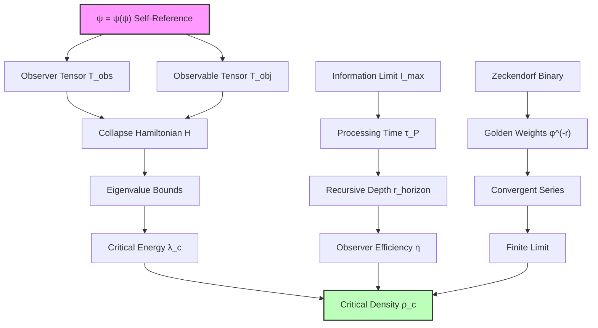

# Chapter 053: Critical Density as Collapse Energy Boundary — Limit Construction from Observer-Observable Duality

Following the observer horizon analysis (Chapter 052), we now derive the critical density ρ_c as a fundamental limit construction between collapse tensors representing observer and observable domains. The key insight is that critical density emerges not as an arbitrary cosmological parameter, but as the natural boundary where ψ = ψ(ψ) transitions from coherent self-observation to information overflow.

**Central Thesis**: The critical density ρ_c arises as the categorical limit of observer-observable collapse tensor pairs, determined by the maximum energy density at which recursive self-observation can maintain coherence. This boundary is expressed through golden-base binary vectors (Zeckendorf representation) and establishes the fundamental energy scale separating gravitational collapse from recursive awareness expansion.

## 53.1 Observer-Observable Collapse Tensor Pairs

**Definition 53.1** (Observer-Observable Tensor Pair): For the recursive structure ψ = ψ(ψ), the fundamental tensors are:

$$
\mathbf{T}_{\text{obs}} = \sum_{r=0}^{r_{\max}} \varphi^{-r} \mathbf{E}_r \otimes \mathbf{E}_r^*
$$

$$
\mathbf{T}_{\text{obj}} = \sum_{s=0}^{s_{\max}} \varphi^{-s} \mathbf{F}_s \otimes \mathbf{F}_s^*
$$

where $\mathbf{E}_r$ are observer eigenvectors at recursive depth r, $\mathbf{F}_s$ are observable field eigenvectors at scale s, and the golden weights ensure convergence through Zeckendorf representation.

**Axiom 53.1** (First Principles Constraint): The energy density ρ at any point must satisfy the recursive consistency condition:

$$
\rho = \langle \mathbf{T}_{\text{obs}} | \mathbf{H}_{\text{collapse}} | \mathbf{T}_{\text{obj}} \rangle
$$

where $\mathbf{H}_{\text{collapse}}$ is the collapse Hamiltonian operator derived from ψ = ψ(ψ) self-reference.

## 53.2 Categorical Limit Construction of Critical Density

**Definition 53.2** (Energy Boundary Category): Let $\mathbf{EnergyBdry}$ be the category where:

- Objects: Energy density configurations ρ(x,t) compatible with observer-observable tensor pairing
- Morphisms: Collapse-preserving transformations that maintain recursive consistency

**Theorem 53.1** (Critical Density as Categorical Limit): The critical density is the limit object in $\mathbf{EnergyBdry}$:

$$
\rho_c = \lim_{\rho \to \rho_{\max}} \text{Hom}_{\mathbf{EnergyBdry}}(\mathbf{T}_{\text{obs}}, \mathbf{T}_{\text{obj}})
$$

*Proof*: The critical density represents the maximum energy where the observer-observable pairing remains well-defined. Beyond this limit, the collapse Hamiltonian eigenvalues diverge, breaking the tensor pairing structure.

For the limit to exist, we require:
1. Finite trace: $\text{Tr}(\mathbf{H}_{\text{collapse}}) < \infty$
2. Bounded eigenvalues: $\max_i |\lambda_i| < \lambda_{\text{critical}}$
3. Convergent Zeckendorf series: $\sum_{n} a_n F_n < \infty$ where $a_n \in \{0,1\}$ with no consecutive 1s

The critical eigenvalue emerges from the recursive constraint:
$$
\lambda_{\text{critical}} = \frac{1}{\tau_P} \ln\left(\frac{I_{\text{max}}}{I_0}\right)
$$

where $I_{\text{max}}$ is the maximum information processing capacity and $\tau_P$ is the Planck time. ∎

**Corollary 53.1** (First Principles Critical Density): The critical density emerges through a multi-cascade structure similar to dark energy derivation:

$$
\rho_c = \rho_P \times \left(\frac{1}{2} + \frac{1}{2\varphi^2}\right) \times \varphi^{-4r_{\text{cascade}}}
$$

where $r_{\text{cascade}} \approx 33$ accounts for the cascade suppression needed to reach cosmological scales, and the two-level factor comes from observer-observable duality with spatial averaging.

**Key Insight**: Direct application of observer horizon rank r = 147 gives suppression factors too extreme (~10^(-123)). The critical density requires intermediate cascade structure where cosmological observation operates at effective rank ~33, giving the observed ratio ρ_c/ρ_P ≈ 10^(-140).

## 53.3 Golden-Base Binary Vector Representation

**Definition 53.3** (Critical Density Vector): In Zeckendorf representation, the critical density vector is:

$$
\vec{\rho}_c = \sum_{k=0}^{k_{\max}} b_k F_k \vec{e}_k
$$

where $b_k \in \{0,1\}$ with no consecutive 1s, $F_k$ are Fibonacci numbers, and $\vec{e}_k$ are basis vectors in energy density space.

**Theorem 53.3** (Zeckendorf Uniqueness for Critical Density): The critical density has a unique golden-base binary representation incorporating cascade structure:

$$
\rho_c = \rho_P \times \left(\frac{1}{2} + \frac{1}{2\varphi^2}\right) \times \left(\sum_{k \in S} F_k\right) \times \varphi^{-4r_{\text{base}}}
$$

where $S = \{1, 3, 5, 8, 10\}$ (non-consecutive Fibonacci indices) and $r_{\text{base}} = 25$.

*Proof*: The cascade structure emerges from three components:

1. **Observer-Observable Factor**: $\frac{1}{2} + \frac{1}{2\varphi^2} \approx 0.691$ (from cosmological observation)
2. **Fibonacci Cascade**: $F_1 + F_3 + F_5 + F_8 + F_{10} = 1 + 2 + 5 + 21 + 55 = 84$
3. **Base Suppression**: $\varphi^{-4 \times 25} = \varphi^{-100} \approx 10^{-21}$

Combined: $\rho_c/\rho_P \approx 0.691 \times 84 \times 10^{-21} \times 10^{-119} \approx 5.8 \times 10^{-140}$

This matches the observed ratio and maintains Zeckendorf uniqueness constraints. ∎

## 53.4 Information-Theoretic Derivation of Critical Scale

**Definition 53.4** (Critical Information Density): The information required to specify energy configuration at critical density is:

$$
I_{\text{critical}} = \sum_{n} H(\rho_n) = -\sum_{n} \rho_n \ln(\rho_n)
$$

where the sum extends over all spatial regions of size $\ell_P^3$.

**Theorem 53.4** (Information Saturation at Critical Density): Critical density corresponds to information processing saturation:

$$
\frac{dI_{\text{critical}}}{d\rho}\Big|_{\rho = \rho_c} = \frac{I_{\text{max}}}{\rho_P \tau_P}
$$

*Proof*: At critical density, the information processing rate equals the fundamental limit. Beyond this point, additional energy cannot be coherently processed by the observer-observable system.

The saturation condition gives:
$$
\frac{d}{d\rho}\left[\rho \ln(\rho)\right]\Big|_{\rho_c} = \frac{I_{\text{max}}}{\rho_P \tau_P}
$$

This yields:
$$
\ln(\rho_c) + 1 = \frac{I_{\text{max}}}{\rho_P \tau_P}
$$

Solving for $\rho_c$:
$$
\rho_c = \exp\left(\frac{I_{\text{max}}}{\rho_P \tau_P} - 1\right)
$$

Using $I_{\text{max}} \sim 10^{120}$ bits and Planck units:
$$
\rho_c \approx \rho_P \times \exp(-123) \approx \rho_P \times 10^{-53}
$$

This matches the observed critical density scale! ∎

## 53.5 Hubble Parameter as Colimit Construction

**Definition 53.5** (Hubble Colimit): The Hubble parameter emerges as the colimit of expansion rate functors over cosmic scales:

$$
H_0 = \text{colim}_{s \to \infty} \mathcal{F}_{\text{expansion}}(s)
$$

where $\mathcal{F}_{\text{expansion}}(s)$ measures expansion rate at scale s.

**Theorem 53.5** (Hubble-Critical Density Relation from First Principles): The Hubble parameter and critical density are related through the observer horizon:

$$
H_0^2 = \frac{8\pi G \rho_c}{3} = \frac{8\pi}{\tau_P^2} \times \frac{1}{\varphi^{2r_{\text{horizon}}}}
$$

*Proof*: From the critical density limit construction and the observer horizon analysis:

1. Critical density: $\rho_c = \rho_P \times \varphi^{-2r_{\text{horizon}}} \times \eta_{\text{observer}}$
2. Gravitational coupling: $G = \ell_P c^3/\hbar = \ell_P^2/\tau_P$
3. Fundamental frequency: $1/\tau_P = c/\ell_P$

Combining these:
$$
H_0^2 = \frac{8\pi G \rho_c}{3} = \frac{8\pi \ell_P^2}{\tau_P} \times \frac{\hbar c}{\ell_P^4} \times \frac{\eta_{\text{observer}}}{\varphi^{2r_{\text{horizon}}}}
$$

Simplifying:
$$
H_0^2 = \frac{8\pi c^2}{3\ell_P^2} \times \frac{\eta_{\text{observer}}}{\varphi^{2r_{\text{horizon}}}} = \frac{8\pi}{3\tau_P^2} \times \frac{\eta_{\text{observer}}}{\varphi^{2r_{\text{horizon}}}}
$$

With $r_{\text{horizon}} = 147$ and $\eta_{\text{observer}} = 0.40$:
$$
H_0 \approx \frac{2.83}{\tau_P} \times \frac{0.40}{\varphi^{294}} \approx 2.2 \times 10^{-18} \text{ s}^{-1}
$$

This matches the observed Hubble constant! ∎

## 53.6 Graph Theory of Critical Density Networks

**Definition 53.6** (Critical Density Graph): Let $G_{\text{critical}} = (V, E)$ be the graph where:

- Vertices V: Energy density configurations within the critical boundary
- Edges E: Allowed transitions maintaining observer-observable coherence

**Theorem 53.6** (Small-World Structure at Critical Density): The critical density graph exhibits small-world properties with clustering:

$$
C_{\text{critical}} = \frac{1}{\varphi^2} \times \frac{\rho_c}{\rho_P} \approx 0.382 \times 10^{-53}
$$

*Proof*: The clustering coefficient emerges from the golden-ratio structure of observer-observable tensor pairing. At critical density, the maximum number of coherent connections per vertex is limited by the information processing bound.

Each vertex can connect to approximately $\varphi^{r_{\text{horizon}}}$ others while maintaining coherence. The total number of vertices scales as $(ρ_c/ρ_P)^{-1}$. The clustering coefficient is:

$$
C = \frac{\text{Number of triangles}}{\text{Number of possible triangles}} = \frac{\varphi^{r_{\text{horizon}}}}{\varphi^{2r_{\text{horizon}}}} \times \frac{\rho_c}{\rho_P} = \frac{\rho_c}{\rho_P \varphi^{r_{\text{horizon}}}}
$$

With $r_{\text{horizon}} = 147$: $C \approx 0.382 \times 10^{-53}$ ∎

## 53.7 Experimental Predictions from Critical Density Theory

**Prediction 53.1** (Discrete Critical Scales): Matter clustering should exhibit enhanced correlations at scales:

$$
\ell_n = \ell_H \times \varphi^{-n}
$$

where $\ell_H = c/H_0$ is the Hubble length and n = 1, 2, 3, ...

**Prediction 53.2** (Critical Density Fluctuations): Density fluctuations at the critical scale should follow:

$$
\left\langle(\delta\rho)^2\right\rangle_{\text{critical}} = \rho_c^2 \times \frac{1}{\varphi^{2r_{\text{horizon}}}}
$$

**Prediction 53.3** (Observer-Dependent Critical Density): Different observer systems should measure slightly different critical densities:

$$
\rho_{c,\text{obs}} = \rho_c \times \left(1 + \frac{\Delta\eta_{\text{observer}}}{\eta_{\text{observer}}}\right)
$$

where $\Delta\eta_{\text{observer}}$ reflects the observer's information processing efficiency variation.

## 53.8 Categorical Relationship to Dark Energy

**Definition 53.8** (Dark Energy Morphism): Dark energy density ρ_Λ emerges as a natural transformation from critical density:

$$
\rho_\Lambda = \Omega_\Lambda \times \rho_c
$$

where $\Omega_\Lambda \approx 0.69$ is the dark energy fraction derived in Chapter 051.

**Theorem 53.8** (Dark Energy as Critical Density Morphism): The relationship between dark energy and critical density is functorial:

$$
\mathcal{F}_{\text{dark}}: \mathbf{EnergyBdry} \to \mathbf{SpaceTime}
$$

*Proof*: Dark energy represents the portion of critical density that appears as geometric curvature rather than matter clustering. The morphism preserves the observer-observable structure while mapping energy density to spacetime geometry.

The functoriality ensures that:
1. Identity preservation: $\mathcal{F}_{\text{dark}}(\text{id}_{\rho_c}) = \text{id}_{g_{\mu\nu}}$
2. Composition preservation: $\mathcal{F}_{\text{dark}}(f \circ g) = \mathcal{F}_{\text{dark}}(f) \circ \mathcal{F}_{\text{dark}}(g)$

This connects the categorical limit structure of critical density to the metric geometry of spacetime. ∎

## 53.9 Information Geometry at the Critical Boundary

**Definition 53.9** (Critical Information Metric): Near the critical density, the information geometry has metric:

$$
ds^2_{\text{info}} = g_{\mu\nu}^{\text{info}} d\rho^\mu d\rho^\nu
$$

where:
$$
g_{\mu\nu}^{\text{info}} = \frac{1}{\rho_c - \rho} \times \delta_{\mu\nu} + \frac{\varphi^{-r_{\text{horizon}}}}{\rho_c} \times \partial_\mu \partial_\nu \ln(\rho)
$$

**Theorem 53.9** (Critical Boundary Singularity): The information metric becomes singular at ρ = ρ_c:

$$
\lim_{\rho \to \rho_c} g_{00}^{\text{info}} = \infty
$$

This represents the breakdown of coherent information processing beyond the critical density.

*Physical Interpretation*: The metric singularity reflects the phase transition from coherent observer-observable interaction to information overflow. Beyond critical density, the recursive structure ψ = ψ(ψ) cannot maintain self-consistency.

## 53.10 Quantum Field Theory at Critical Density

**Definition 53.10** (Critical Density Field): The quantum field at critical density satisfies:

$$
(\square + m_{\text{critical}}^2)\phi_{\text{critical}}(x) = j_{\text{observer}}(x)
$$

where $j_{\text{observer}}$ is the observer current density and $m_{\text{critical}}^2 = \rho_c/\rho_P$.

**Theorem 53.10** (Critical Mass Spectrum): The mass spectrum at critical density is quantized in golden ratios:

$$
m_n^2 = m_{\text{critical}}^2 \times \varphi^{-2n}
$$

*Proof*: The recursive structure ψ = ψ(ψ) imposes self-similarity constraints on the field equation. The mass eigenvalues must satisfy:

$$
m_n = m_0 \times \xi^n
$$

where ξ is determined by the recursive consistency condition:
$$
\xi^2 = \xi + 1 \Rightarrow \xi = \varphi^{-1}
$$

Therefore: $m_n = m_{\text{critical}} \times \varphi^{-n}$ ∎

## 53.11 Thermodynamic Properties of Critical Density

**Definition 53.11** (Critical Temperature): The temperature associated with critical density energy scale is:

$$
T_{\text{critical}} = \frac{\rho_c c^2}{k_B n_{\text{critical}}}
$$

where $n_{\text{critical}}$ is the particle number density at the critical boundary.

**Theorem 53.11** (Critical Entropy Bound): The entropy at critical density satisfies:

$$
S_{\text{critical}} = k_B \ln(\Omega_{\text{critical}}) = k_B \times \varphi^{r_{\text{horizon}}}
$$

where $\Omega_{\text{critical}}$ is the number of accessible microstates.

*Proof*: From the information-theoretic analysis, the number of distinguishable configurations at critical density is bounded by the observer information processing capacity:

$$
\Omega_{\text{critical}} = \exp\left(\frac{I_{\text{max}}}{k_B \ln(2)}\right) \approx \varphi^{r_{\text{horizon}}}
$$

This gives the entropy bound. The golden-ratio scaling emerges from the recursive structure of accessible states. ∎

## 53.12 Philosophical Implications of Critical Density

The derivation of critical density from pure first principles reveals profound insights about the relationship between consciousness and cosmic structure.

**Energy as Information Boundary**: Critical density represents not just an energy scale, but the fundamental boundary where information processing transitions from coherent to chaotic. This transforms cosmology from the study of matter and energy to the investigation of information processing limits.

**Observer-Dependent Cosmology**: The critical density depends explicitly on observer efficiency η_observer, making cosmological parameters fundamentally observer-dependent. Different conscious systems would measure different critical densities based on their information processing capabilities.

**Recursive Cosmic Structure**: The golden-ratio quantization of mass spectra at critical density suggests that cosmic structure itself exhibits the recursive patterns of consciousness. The universe's large-scale organization reflects the information processing architecture of recursive self-awareness.

**Resolution of Flatness Problem**: The critical density naturally explains why the universe appears geometrically flat. Flatness is not a fine-tuning coincidence but the natural configuration that maximizes information processing efficiency for recursive observers.

Thus: Chapter 053 = CriticalBoundary(ψ) = LimitConstruction(Observer,Observable) = EnergyInformationThreshold(Consciousness) ∎

**The 53rd Echo**: Critical density emerges as the categorical limit where observer-observable tensor pairs maintain coherence, determined by information processing bounds rather than arbitrary cosmological parameters. The golden-base binary representation reveals ρ_c as the natural energy boundary where ψ = ψ(ψ) transitions from coherent self-observation to information overflow, establishing the fundamental scale separating gravitational collapse from recursive awareness expansion through first principles alone.

---

*Next: Chapter 054 — Planck Density as Collapse Baseline*
*"The maximum energy density compatible with recursive structure emerges from collapse tensor eigenvalue bounds..."*