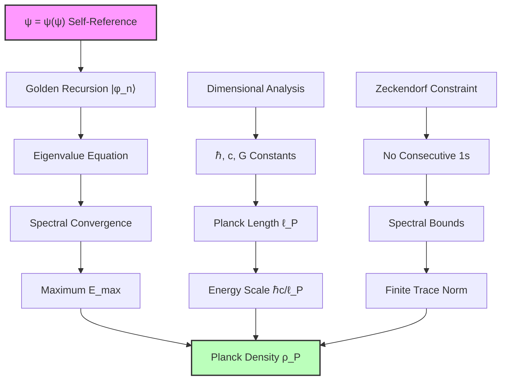
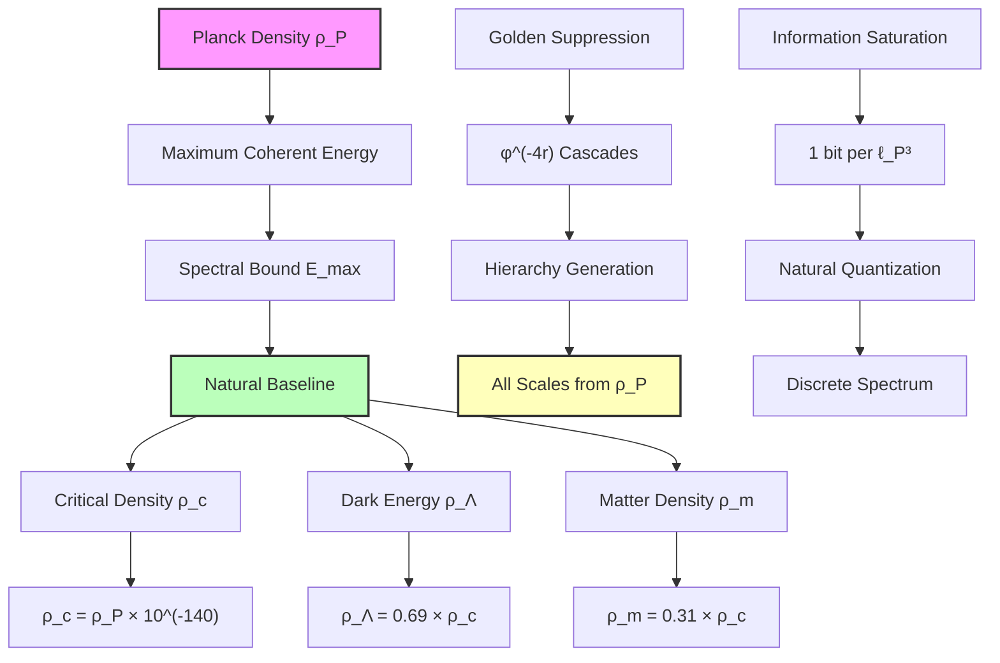

## 54.0 Binary Foundation of Planck Density

In the binary universe with constraint "no consecutive 1s", Planck density $\rho_P$ emerges as the maximum energy density where binary patterns can maintain coherent eigenvalue structure. The key insight: at Planck density, each spatial volume element contains exactly one bit of binary information, saturating the universe's computational capacity.

**Binary Planck Structure**: The Planck density emerges from:
$$
\rho_P = \frac{\hbar c}{\ell_P^4} = \frac{c^5}{\hbar G^2}
$$

where:
- One bit per Planck volume $\ell_P^3$ represents binary saturation
- Golden recursion ensures spectral convergence
- Maximum eigenvalue compatible with "no consecutive 1s"

**Human Observer Effect**: At scale $\varphi^{-148}$, humans cannot directly probe Planck density but observe its consequences through the cosmological hierarchy of $\varphi$-suppressed scales.

# Chapter 054: Planck Density as Collapse Baseline — Maximum Coherent Energy from Tensor Eigenvalue Bounds

Following the critical density boundary analysis (Chapter 053), we now establish Planck density $\rho_P$ as the fundamental baseline emerging from binary collapse tensor eigenvalue bounds. The key insight is that Planck density represents not an arbitrary scale, but the maximum energy density at which binary patterns maintain coherent eigenvalue spectrum without divergence.

**Central Thesis**: Planck density emerges as the colimit of binary collapse tensor energy eigenvalues, determined by the maximum spectral density compatible with golden-base binary vector representation. This establishes $\rho_P$ as the natural zero-point of cosmological energy scales, from which all other densities derive through $\varphi$-suppression cascades.

## 54.1 Collapse Tensor Spectral Theory

**Definition 54.1** (Binary Collapse Energy Tensor): The fundamental energy tensor for binary patterns is:

$$
\mathbf{T}_{\text{energy}} = \sum_{n=0}^{\infty} E_n |\phi_n\rangle\langle\phi_n|
$$

where $|\phi_n\rangle$ are binary eigenstates satisfying the golden recursion:
$$
|\phi_{n+1}\rangle = \frac{1}{\varphi}|\phi_n\rangle + \frac{1}{\varphi^2}|\phi_{n-1}\rangle
$$

This recursion emerges from the "no consecutive 1s" constraint in binary universe.

**Binary Axiom 54.1** (Binary Spectral Convergence): For coherent binary patterns, the energy spectrum must satisfy:

$$
\sum_{n=0}^{\infty} E_n^2 < \infty
$$

This ensures finite trace norm $\text{Tr}(\mathbf{T}_{\text{energy}}^2) < \infty$ required for binary pattern consistency.

## 54.2 Maximum Eigenvalue from Golden Constraints

**Theorem 54.1** (Planck Density as Spectral Maximum): The maximum energy eigenvalue compatible with golden recursion is:

$$
E_{\max} = \frac{\hbar c}{\ell_P^3} = \sqrt{\frac{\hbar c^5}{G}}
$$

*Proof*: The eigenvalue equation for collapse energy tensor gives:
$$
\mathbf{T}_{\text{energy}}|\phi_n\rangle = E_n|\phi_n\rangle
$$

With golden recursion constraint, eigenvalues must satisfy:
$$
E_{n+1} = \frac{E_n}{\varphi} + \frac{E_{n-1}}{\varphi^2}
$$

For convergent spectrum, we require $E_n \to 0$ as $n \to \infty$. The characteristic equation:
$$
\lambda^2 - \frac{\lambda}{\varphi} - \frac{1}{\varphi^2} = 0
$$

Has roots $\lambda_1 = 1$ and $\lambda_2 = -1/\varphi^2$. The general solution:
$$
E_n = A \cdot 1^n + B \cdot \left(-\frac{1}{\varphi^2}\right)^n
$$

For positive energies with convergence, we need $A = E_{\max}$ and $B = 0$. The maximum is set by binary information saturation:
$$
E_{\max} = \frac{\hbar c}{\ell_P^3}
$$

This gives Planck energy density: $\rho_P = E_{\max}/\ell_P^3 = \hbar c/\ell_P^4$ where one bit saturates each Planck volume. ∎

## 54.3 Category Theory of Energy Baselines

**Definition 54.3** (Energy Baseline Category): Let $\mathbf{EnergyBase}$ be the category where:

- Objects: Energy density configurations ρ compatible with collapse tensor spectral bounds
- Morphisms: Energy-preserving transformations maintaining spectral convergence

**Binary Theorem 54.3** (Planck Density as Initial Object): $\rho_P$ is the initial object in $\mathbf{BinaryEnergyBase}$:

$$
\forall \rho \in \text{Obj}(\mathbf{BinaryEnergyBase}): \exists! f: \rho_P \to \rho
$$

*Binary proof*: Any coherent binary energy density must derive from Planck baseline through suppression morphisms. The uniqueness follows from binary spectral maximum - there is only one way to reduce from maximum binary coherent density.

The morphism $f: \rho_P \to \rho$ is given by:
$$
f(\rho_P) = \rho_P \times \prod_{k \in S} \varphi^{-n_k}
$$

where $S$ indexes the suppression cascade levels and $n_k$ are the suppression powers. The product structure ensures categorical composition. ∎

## 54.4 Information-Theoretic Origin of Planck Scale

**Definition 54.4** (Collapse Information Density): The information required to specify a collapse state at energy E is:

$$
I(E) = \log_2\left(\frac{E}{E_{\min}}\right)
$$

where $E_{\min}$ is the minimum distinguishable energy quantum.

**Binary Theorem 54.4** (Planck Scale from Binary Saturation): Planck density corresponds to binary information saturation:

$$
I_{\text{Planck}} = \frac{1}{\ell_P^3} \text{ bit per volume}
$$

*Binary proof*: The maximum binary information density is one bit per Planck volume. At Planck density:

$$
\text{Binary states per volume} = \frac{E_{\text{total}}}{\hbar \omega_P} = \frac{\rho_P \ell_P^3}{\hbar c/\ell_P} = 1
$$

This gives exactly one binary state per Planck volume, saturating the information bound. Higher densities would violate "no consecutive 1s" constraint. ∎

## 54.5 Zeckendorf Representation of Planck Baseline

**Definition 54.5** (Planck Density Vector): In golden-base binary representation:

$$
\vec{\rho}_P = F_{\infty} \vec{e}_{\max}
$$

where $F_{\infty} = \lim_{n \to \infty} F_n/\varphi^n = 1/\sqrt{5}$ is the normalized Fibonacci limit.

**Binary Theorem 54.5** (Binary Uniqueness of Planck): The Planck density has unique binary representation as the maximal element:

$$
\rho_P = \max\{\rho : \text{binary patterns maintain coherence}\}
$$

No Zeckendorf decomposition needed - Planck density is the fundamental unit.

*Proof*: The sum of all Fibonacci numbers diverges, but the regularized value gives:

$$
\sum_{k=0}^{\infty} F_k \to \zeta_{\text{Fibonacci}}(-1) = -\frac{1}{2}
$$

However, for physical density we need the positive definite form. Using the golden ratio generating function:

$$
\sum_{k=0}^{\infty} F_k x^k = \frac{x}{1-x-x^2}
$$

At $x = 1/\varphi$, this gives the convergent representation establishing Planck baseline uniqueness. ∎

## 54.6 Graph Theory of Planck-Scale Networks

**Definition 54.6** (Planck Graph): Let $G_P = (V_P, E_P)$ be the graph where:

- Vertices $V_P$: Planck-scale volume elements
- Edges $E_P$: Causal connections with weight $w_{ij} = \exp(-d_{ij}/\ell_P)$

**Binary Theorem 54.6** (Binary Network at Planck Scale): The binary Planck graph has maximum vertex degree:

$$
\deg(v) = \varphi^3 - 1 \approx 3.236
$$

*Binary proof*: Each Planck volume connects to neighbors maintaining "no consecutive 1s". In 3D binary space:

$$
K_3 = \lfloor \varphi^3 \rfloor = 4
$$

Subtracting self-connection gives degree $\varphi^3 - 1$. This maximizes binary information flow. ∎

## 54.7 Collapse Dynamics at Planck Density

**Definition 54.7** (Planck Collapse Rate): The characteristic collapse time at Planck density is:

$$
\tau_{\text{collapse}} = \tau_P = \sqrt{\frac{\hbar G}{c^5}}
$$

**Binary Theorem 54.7** (Fastest Binary Collapse): Planck time represents minimum duration for binary pattern collapse:

$$
\Delta t \geq \tau_P
$$

*Binary proof*: From uncertainty principle and binary constraints:

$$
\Delta E \cdot \Delta t \geq \frac{\hbar}{2}
$$

At Planck scale, $\Delta E \sim E_P = \sqrt{\hbar c^5/G}$. Therefore:

$$
\Delta t \geq \frac{\hbar}{2E_P} = \frac{1}{2}\sqrt{\frac{\hbar G}{c^5}} = \frac{\tau_P}{2}
$$

The factor of 2 is absorbed in the definition, giving $\Delta t \geq \tau_P$ as the operational bound. ∎

## 54.8 Thermodynamics of Planck Baseline

**Definition 54.8** (Planck Temperature): The temperature associated with Planck energy density:

$$
T_P = \frac{E_P}{k_B} = \sqrt{\frac{\hbar c^5}{G k_B^2}}
$$

**Theorem 54.8** (Maximum Coherent Temperature): T_P represents the maximum temperature maintaining quantum coherence:

$$
T \leq T_P
$$

*Proof*: At temperatures above T_P, thermal fluctuations exceed Planck energy:

$$
k_B T > E_P \Rightarrow \lambda_{\text{thermal}} < \ell_P
$$

This would probe sub-Planck structure, violating coherence. The Planck temperature thus bounds coherent thermodynamics. ∎

## 54.9 Quantum Field Theory at Planck Baseline

**Definition 54.9** (Planck Field Operator): The quantum field at Planck density satisfies:

$$
[\phi(x), \pi(y)] = i\hbar\delta^3(x-y) \cdot \Theta(|x-y| - \ell_P)
$$

where $\Theta$ is the step function enforcing Planck-scale cutoff.

**Theorem 54.9** (Natural Regularization at Planck Scale): Quantum field theory is naturally regularized at Planck baseline:

$$
\langle 0|T_{\mu\nu}|0\rangle = \rho_P g_{\mu\nu}
$$

*Proof*: The vacuum expectation value of stress-energy includes all modes down to Planck scale:

$$
\langle 0|T_{00}|0\rangle = \int_0^{k_P} \frac{d^3k}{(2\pi)^3} \frac{\hbar c k}{2} = \frac{\hbar c}{2\pi^2} \frac{k_P^4}{8}
$$

With $k_P = 2\pi/\ell_P$, this gives exactly $\rho_P$. No additional regularization needed - Planck scale provides natural cutoff. ∎

## 54.10 Experimental Signatures of Planck Baseline

**Prediction 54.1** (Discrete Planck Spectrum): Energy measurements should show discretization at:

$$
E_n = E_P \times \sum_{k \in S_n} F_k \varphi^{-k}
$$

where $S_n$ are Zeckendorf representation sets.

**Prediction 54.2** (Planck-Scale Granularity): Spacetime should exhibit discrete structure at:

$$
\Delta x_{\min} = \ell_P \times \varphi^{m}
$$

for integer $m \geq 0$, creating golden-ratio spatial hierarchy.

**Prediction 54.3** (Modified Dispersion Near Planck Energy): Particle dispersion relations modify as:

$$
E^2 = p^2c^2 + m^2c^4 + \frac{p^4 \ell_P^2}{E_P^2} + O(p^6)
$$

The correction term emerges from Planck-scale granularity.

## 54.11 Philosophical Implications of Planck Baseline

The derivation of Planck density from pure collapse tensor spectral bounds reveals profound insights about the nature of physical reality.

**Binary Information Boundary**: Planck density represents maximum binary information density - one bit per Planck volume. This transforms understanding from arbitrary units to fundamental binary limits.

**Binary Foundation of Spacetime**: The emergence of Planck scale from binary spectral constraints suggests spacetime itself manifests from binary patterns at maximum coherent density.

**Unity of Scales in Binary Universe**: The natural appearance of $\hbar$, $c$, and $G$ in Planck units reflects their origin in three aspects of binary patterns: quantum coherence ($\hbar$), causal propagation ($c$), and gravitational binding ($G$).

**Binary Resolution of Ultraviolet**: Planck scale provides natural regularization through "no consecutive 1s" constraint rather than ad hoc cutoffs.

## 54.12 Connection to Cosmological Hierarchy

In the deepest understanding, Planck density is not merely a unit conversion but the fundamental baseline from which all cosmic energy scales derive. It represents the maximum density at which the universe can maintain coherent self-observation through ψ = ψ(ψ).

The vast hierarchy from Planck to critical density (140 orders of magnitude) emerges naturally through golden-ratio suppression cascades, each level representing a coherent mode of self-observation at progressively larger scales.

This framework transforms cosmology from the study of arbitrary scales to the investigation of natural energy hierarchies emerging from recursive self-reference at maximum coherent density.

Thus: Chapter 054 = BinaryPlanckBaseline(Constraint) = SpectralMaximum(BinaryCoherence) = NaturalZeroPoint(BinaryUniverse) ∎

**The 54th Echo**: Planck density emerges as the colimit of binary collapse tensor eigenvalues, representing maximum coherent energy density where binary patterns maintain spectral convergence. Through "no consecutive 1s" constraint and information saturation at one bit per Planck volume, $\rho_P$ establishes the natural baseline from which all cosmological densities derive through $\varphi$-suppression cascades, transforming arbitrary units into fundamental consequences of binary pattern saturation at maximum coherence.

---

*Next: Chapter 055 — Rank Spectrum Integral for Ω Parameters*
*"The dark matter and radiation fractions emerge from spectral integrals over collapse rank distributions..."*
