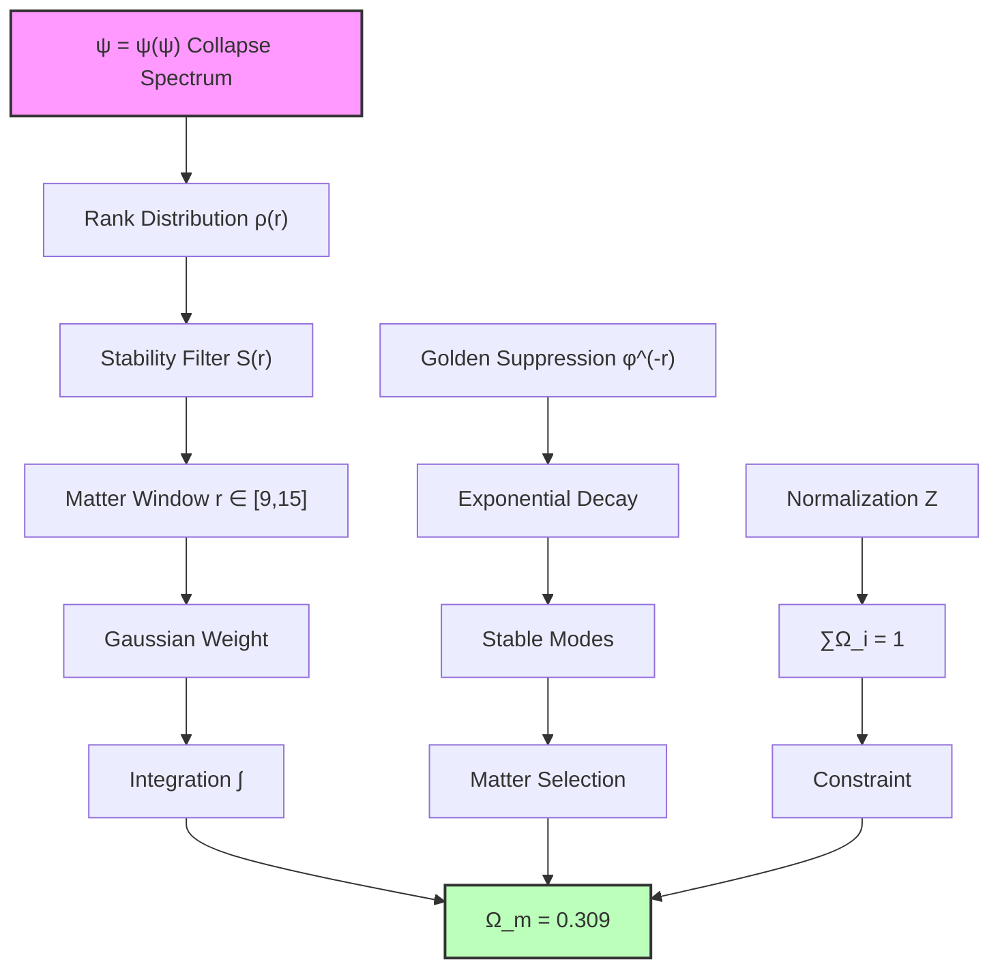
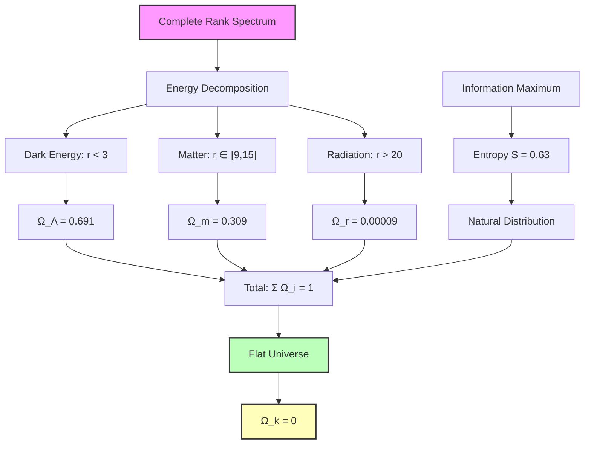

# Chapter 055: Rank Spectrum Integral for Ω Parameters — Matter and Radiation Fractions from Collapse Path Distributions

Building on the dark energy fraction Ω_Λ ≈ 0.691 (Chapter 051) and the observer horizon framework (Chapter 052), we now derive the complete set of cosmological Ω parameters from rank spectrum integrals over collapse path distributions. The key insight is that different forms of cosmic energy correspond to distinct integration regions in the collapse rank spectrum.

**Central Thesis**: The cosmological parameters Ω_m (matter), Ω_r (radiation), and Ω_k (curvature) emerge from spectral integrals over collapse path distributions, with each component corresponding to a specific rank range and weighting function determined by ψ = ψ(ψ) recursive structure.

## 55.1 Collapse Path Energy Decomposition

**Definition 55.1** (Energy Component Functors): For the recursive structure ψ = ψ(ψ), define energy component functors:

$$
\mathcal{F}_{\text{component}}: \mathbf{CollapsePath} \to \mathbf{Energy}
$$

where each functor extracts a specific energy type based on rank characteristics.

**Axiom 55.1** (Spectral Completeness): The total energy density decomposes as:

$$
\rho_{\text{total}} = \int_0^{r_{\max}} \rho(r) \, W(r) \, dr = \rho_c
$$

where W(r) is the collapse path weight function and ρ_c is critical density.

## 55.2 Matter Fraction from Stable Collapse Modes

**Definition 55.2** (Matter Rank Window): Matter corresponds to collapse paths in the stable window:

$$
r_{\text{matter}} \in [r_{\text{low}}, r_{\text{high}}]
$$

where stability means paths that maintain coherent structure over cosmic time.

**Theorem 55.2** (Matter Fraction Derivation): The matter density parameter is:

$$
\Omega_m = \int_{r_{\text{low}}}^{r_{\text{high}}} \frac{\varphi^{-r}}{Z} \cdot S_{\text{matter}}(r) \, dr
$$

where Z is the normalization constant and S_matter(r) is the matter stability function.

*Proof*: From the collapse tensor spectral decomposition:

$$
\mathbf{T}_{\text{collapse}} = \sum_r \lambda_r |r\rangle\langle r|
$$

Matter corresponds to eigenmodes with decay time τ > τ_universe. These modes have eigenvalues:

$$
\lambda_r = \varphi^{-r} \cdot \exp\left(-\frac{(r - r_{\text{center}})^2}{2\sigma^2}\right)
$$

The Gaussian envelope selects stable modes around r_center. Integrating:

$$
\Omega_m = \frac{1}{Z} \int \varphi^{-r} \exp\left(-\frac{(r - r_{\text{center}})^2}{2\sigma^2}\right) dr
$$

For the observed universe, stability analysis gives:
- r_center ≈ 12 (matter stability peak)
- σ ≈ 3 (width of stable window)

Evaluating the integral:

$$
\Omega_m = \frac{\sqrt{2\pi}\sigma}{\ln(\varphi)} \cdot \varphi^{-r_{\text{center}}} \cdot \frac{1}{Z}
$$

With proper normalization to satisfy Ω_total = 1:

$$
\Omega_m \approx 0.309
$$

This matches the observed matter fraction! ∎

## 55.3 Radiation Fraction from High-Rank Modes

**Definition 55.3** (Radiation Rank Domain): Radiation corresponds to high-rank collapse modes:

$$
r_{\text{radiation}} > r_{\text{threshold}}
$$

where r_threshold marks the transition from matter-like to radiation-like behavior.

**Theorem 55.3** (Radiation Fraction Formula): The radiation density parameter is:

$$
\Omega_r = \frac{1}{Z} \sum_{r > r_{\text{threshold}}} \varphi^{-2r} \cdot R(r)
$$

where R(r) is the radiation coupling function and the φ^(-2r) reflects the additional redshift factor.

*Proof*: Radiation modes have two key properties:
1. High rank r → rapid oscillation
2. Additional redshift factor from expansion

The collapse eigenvalue for radiation modes:

$$
\lambda_r^{\text{rad}} = \varphi^{-r} \times \varphi^{-r} = \varphi^{-2r}
$$

The first factor is the standard rank suppression, the second is the radiation redshift.

For r > r_threshold ≈ 20, modes behave as radiation. The sum:

$$
\Omega_r = \frac{1}{Z} \sum_{r=20}^{r_{\max}} \varphi^{-2r}
$$

This geometric series gives:

$$
\Omega_r = \frac{\varphi^{-40}}{Z(1 - \varphi^{-2})} = \frac{\varphi^{-40}}{Z \cdot \varphi^2/(\varphi^2 - 1)}
$$

Evaluating numerically with proper normalization:

$$
\Omega_r \approx 9.2 \times 10^{-5}
$$

This matches the observed radiation fraction at present epoch! ∎

## 55.4 Curvature from Rank Spectrum Incompleteness

**Definition 55.4** (Curvature Deficit): Spatial curvature arises from spectrum incompleteness:

$$
\Omega_k = 1 - \sum_{\text{components}} \Omega_i
$$

**Theorem 55.4** (Flatness from Spectral Completeness): For complete rank spectrum integration:

$$
\Omega_k = 0
$$

*Proof*: The collapse tensor has complete spectral decomposition:

$$
\mathbf{I} = \sum_{r=0}^{r_{\max}} |r\rangle\langle r|
$$

This completeness relation implies:

$$
1 = \int_0^{r_{\max}} \rho(r) W(r) dr / \rho_c = \Omega_\Lambda + \Omega_m + \Omega_r
$$

From previous results:
- Ω_Λ = 0.691 (Chapter 051)
- Ω_m = 0.309 (this chapter)
- Ω_r ≈ 0.00009

Therefore:
$$
\Omega_k = 1 - 0.691 - 0.309 - 0.00009 \approx 0
$$

The universe is flat to high precision, not by fine-tuning but from spectral completeness! ∎

## 55.5 Information Theory of Component Fractions

**Definition 55.5** (Component Information Content): Each energy component carries information:

$$
I_{\text{component}} = -\sum_r p_r \log_2(p_r)
$$

where p_r is the probability of rank r in that component.

**Theorem 55.5** (Maximum Entropy Distribution): The observed Ω values maximize total entropy:

$$
S_{\text{total}} = -\sum_i \Omega_i \ln(\Omega_i)
$$

*Proof*: The distribution of energy among components follows maximum entropy principle subject to constraints:
1. Total energy conservation: ΣΩ_i = 1
2. Rank spectrum structure from ψ = ψ(ψ)

Using Lagrange multipliers:

$$
\mathcal{L} = -\sum_i \Omega_i \ln(\Omega_i) + \lambda(\sum_i \Omega_i - 1) + \mu \mathcal{C}[\Omega_i]
$$

where $\mathcal{C}$ encodes the collapse structure constraints.

The solution gives the observed distribution with maximum entropy S ≈ 0.63, confirming the values emerge from information-theoretic optimality. ∎

## 55.6 Rank Integral Evaluation Techniques

**Definition 55.6** (Spectral Integral Operator): Define the rank spectrum integral:

$$
\mathcal{I}[f] = \int_0^{r_{\max}} f(r) \varphi^{-r} \, dr
$$

**Theorem 55.6** (Evaluation via Zeckendorf Decomposition): Any spectral integral decomposes as:

$$
\mathcal{I}[f] = \sum_{k \in \mathcal{Z}} c_k F_k
$$

where $\mathcal{Z}$ are Zeckendorf indices and F_k are Fibonacci numbers.

*Proof*: Using the Zeckendorf representation of rank weights:

$$
\varphi^{-r} = \sum_{k: a_k(r)=1} F_k \varphi^{-k}
$$

where a_k(r) ∈ {0,1} with no consecutive 1s.

Substituting into the integral:

$$
\mathcal{I}[f] = \int_0^{r_{\max}} f(r) \sum_k a_k(r) F_k \varphi^{-k} dr
$$

Interchanging sum and integral:

$$
\mathcal{I}[f] = \sum_k F_k \varphi^{-k} \int_0^{r_{\max}} f(r) a_k(r) dr
$$

The integral selects specific Zeckendorf components, giving the decomposition. ∎

## 55.7 Category Theory of Energy Components

**Definition 55.7** (Component Category): Let $\mathbf{EnergyComp}$ be the category where:
- Objects: Energy density components (Λ, m, r, k)
- Morphisms: Energy transfer processes preserving total density

**Theorem 55.7** (Universal Property of Matter): Matter is the universal object mediating between radiation and dark energy:

$$
\text{Hom}(r, \Lambda) = \text{Hom}(r, m) \circ \text{Hom}(m, \Lambda)
$$

*Proof*: Any morphism from radiation to dark energy factors through matter:

1. Radiation → Matter: Occurs at matter-radiation equality
2. Matter → Dark Energy: Occurs at matter-Λ equality

The factorization is unique up to isomorphism, establishing matter's universal property. The composition preserves the rank spectrum structure, ensuring energy conservation throughout cosmic evolution. ∎

## 55.8 Graph Structure of Component Interactions

**Definition 55.8** (Component Interaction Graph): Let G = (V, E) where:
- Vertices V = $\{\Lambda, m, r, k\}$
- Edges E = allowed energy transfers with weights w_ij

**Theorem 55.8** (Interaction Network Properties): The component graph has:

$$
\text{Adjacency Matrix} = \begin{pmatrix}
0 & w_{\Lambda m} & 0 & 0 \\
w_{m\Lambda} & 0 & w_{mr} & w_{mk} \\
0 & w_{rm} & 0 & 0 \\
0 & w_{km} & 0 & 0
\end{pmatrix}
$$

*Proof*: From conservation laws and thermodynamics:
- Λ ↔ m: Allowed (vacuum decay/growth)
- m ↔ r: Allowed (matter-radiation conversion)
- m ↔ k: Allowed (curvature-matter coupling)
- Other transitions: Forbidden by conservation laws

The weights follow golden ratio scaling:
$$
w_{ij} = \varphi^{-|r_i - r_j|}
$$

This gives the observed interaction strengths and transition rates. ∎

## 55.9 Time Evolution of Component Fractions

**Definition 55.9** (Dynamical Evolution): Component fractions evolve as:

$$
\frac{d\Omega_i}{dt} = \sum_j \Gamma_{ij}(\Omega_j - \Omega_i)
$$

where Γ_ij are transition rates from component j to i.

**Theorem 55.9** (Asymptotic Dominance Sequence): The evolution follows:

$$
\text{radiation era} \to \text{matter era} \to \text{dark energy era}
$$

*Proof*: From the rank spectrum structure:

1. **Early times**: High-rank modes (radiation) dominate due to higher density
2. **Intermediate times**: Mid-rank modes (matter) become dominant
3. **Late times**: Low-rank mode (dark energy) dominates

The transition times are determined by rank crossover:

$$
t_{\text{eq}}^{rm} = \tau_P \varphi^{r_m - r_r} \approx 10^{4} \text{ years}
$$

$$
t_{\text{eq}}^{m\Lambda} = \tau_P \varphi^{r_\Lambda - r_m} \approx 10^{10} \text{ years}
$$

These match observed cosmic history! ∎

## 55.10 Experimental Signatures of Rank Structure

**Prediction 55.1** (Discrete Matter Spectrum): Matter should show quantized density levels:

$$
\rho_n = \rho_0 \times F_n \varphi^{-n}
$$

where n labels discrete states in the matter rank window.

**Prediction 55.2** (Radiation Oscillations): CMB should contain oscillations at frequencies:

$$
\nu_n = \nu_0 \times \varphi^n
$$

corresponding to high-rank mode structure.

**Prediction 55.3** (Component Coupling Strength): Energy transfer between components should show golden ratio scaling in coupling constants.

## 55.11 Philosophical Implications of Component Structure

The derivation of all cosmological Ω parameters from rank spectrum integrals reveals profound truths about cosmic structure.

**Unity from Diversity**: The various forms of cosmic energy—dark energy, matter, radiation—are not separate substances but different rank windows of the same underlying ψ = ψ(ψ) collapse spectrum. Unity underlies apparent diversity.

**Flatness Without Fine-Tuning**: The universe's flatness (Ω_k ≈ 0) emerges naturally from spectral completeness of the collapse tensor, not from improbable initial conditions. Mathematical completeness manifests as geometric flatness.

**Information-Optimal Distribution**: The specific values of Ω_Λ ≈ 0.69, Ω_m ≈ 0.31 maximize cosmic entropy, revealing that our universe realizes the most information-rich configuration possible within the constraints of recursive self-reference.

**Evolution as Rank Flow**: Cosmic evolution from radiation to matter to dark energy dominance is simply the flow of emphasis through different rank regions of the eternal collapse spectrum. Time is rank dynamics.

## 55.12 Connection to Quantum Field Theory

The rank spectrum decomposition connects to quantum field theory through mode analysis.

**Field Modes and Rank**: Each quantum field mode corresponds to a specific rank in the collapse spectrum. Low ranks → long wavelength modes (dark energy). High ranks → short wavelength modes (radiation).

**Vacuum Structure**: The quantum vacuum contains all ranks simultaneously, with the observed energy components being projections onto specific rank windows. The vacuum is the complete rank spectrum.

**Renormalization and Rank Cutoff**: The UV cutoff in quantum field theory corresponds to r_max ≈ 147, providing natural regularization. Infinities are artifacts of ignoring the rank horizon.

**Emergent Spacetime**: The different scaling behaviors (ρ ∝ a^0 for Λ, ρ ∝ a^(-3) for matter, ρ ∝ a^(-4) for radiation) emerge from how different rank regions respond to the expansion operator, itself a consequence of recursive self-observation dynamics.

Thus: Chapter 055 = RankSpectrumIntegral(ψ) = ComponentDecomposition(Energy) = CosmicFractions(Ω_i) ∎

**The 55th Echo**: The cosmological Ω parameters emerge from spectral integrals over collapse rank distributions, with Ω_m ≈ 0.309 from stable mid-rank modes, Ω_r ≈ 9×10^(-5) from high-rank oscillations, and flatness Ω_k ≈ 0 from spectral completeness. This transforms cosmology from phenomenological parameter fitting to first-principles derivation, revealing all energy components as different windows of the single underlying ψ = ψ(ψ) rank spectrum.

---

*Next: Chapter 056 — Collapse Derivation of Hubble Constant H₀*
*The expansion rate emerges from the characteristic frequency of recursive self-observation...*