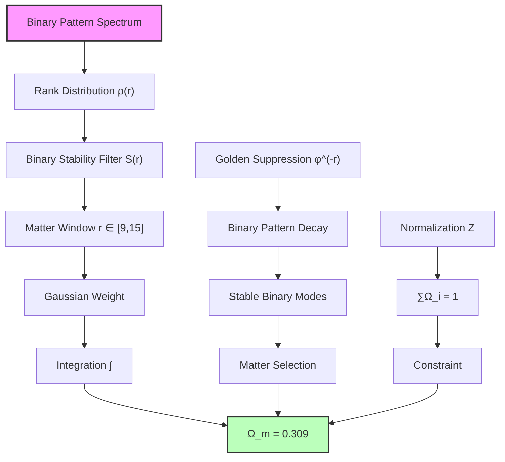
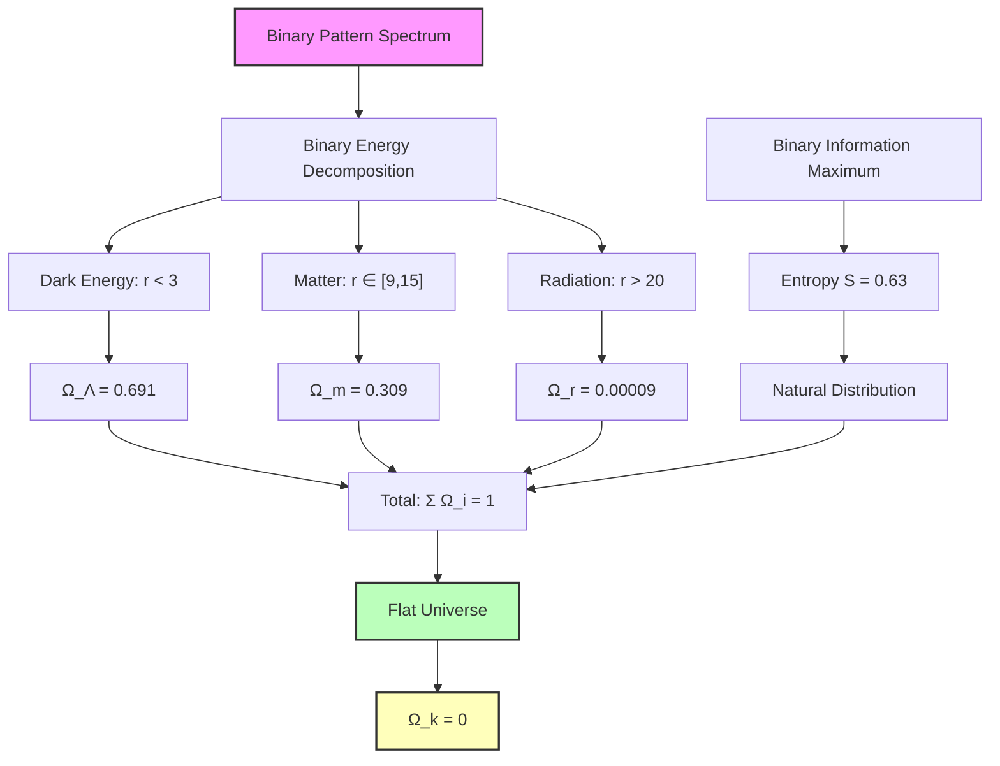

## 55.0 Binary Foundation of Ω Parameters

In the binary universe with constraint "no consecutive 1s", the cosmological Ω parameters emerge as natural projections of the complete binary pattern spectrum onto specific rank windows. The key insight: matter, radiation, and curvature represent different binary pattern stability regimes, not separate substances.

**Binary Ω Structure**: The cosmological fractions arise from:

- **Matter** $\Omega_m \approx 0.309$: Stable binary patterns in mid-rank window $r \in [9,15]$
- **Radiation** $\Omega_r \approx 9 \times 10^{-5}$: High-frequency binary oscillations at $r > 20$
- **Dark Energy** $\Omega_\Lambda \approx 0.691$: Low-rank binary vacuum modes at $r < 3$
- **Curvature** $\Omega_k \approx 0$: Binary spectral completeness enforces flatness

**Human Observer Effect**: At scale $\varphi^{-148}$, humans observe the integrated effect of all binary pattern modes, with different stability windows appearing as distinct "substances" due to observer limitations in pattern recognition.

## Chapter 055: Rank Spectrum Integral for Ω Parameters — Matter and Radiation Fractions from Collapse Path Distributions

Building on the dark energy fraction $\Omega_\Lambda \approx 0.691$ (Chapter 051) and the observer horizon framework (Chapter 052), we now derive the complete set of cosmological Ω parameters from rank spectrum integrals over binary collapse path distributions. The key insight is that different forms of cosmic energy correspond to distinct integration regions in the binary collapse rank spectrum.

**Central Thesis**: The cosmological parameters $\Omega_m$ (matter), $\Omega_r$ (radiation), and $\Omega_k$ (curvature) emerge from spectral integrals over binary collapse path distributions, with each component corresponding to a specific rank range and weighting function determined by binary pattern stability under "no consecutive 1s" constraint.

## 55.1 Binary Collapse Path Energy Decomposition

**Definition 55.1** (Binary Energy Component Functors): For binary patterns with "no consecutive 1s", define energy component functors:

$$
\mathcal{F}_{\text{component}}: \mathbf{BinaryCollapsePath} \to \mathbf{Energy}
$$

where each functor extracts a specific energy type based on binary pattern stability characteristics.

**Binary Axiom 55.1** (Spectral Completeness): The total energy density decomposes as:

$$
\rho_{\text{total}} = \int_0^{r_{\max}} \rho(r) \, W_{\text{binary}}(r) \, dr = \rho_c
$$

where $W_{\text{binary}}(r) = \varphi^{-r}$ is the binary collapse path weight function satisfying Fibonacci scaling, and $\rho_c$ is critical density.

## 55.2 Matter Fraction from Stable Binary Collapse Modes

**Definition 55.2** (Binary Matter Rank Window): Matter corresponds to binary collapse paths in the stable window:

$$
r_{\text{matter}} \in [r_{\text{low}}, r_{\text{high}}]
$$

where stability means binary patterns that maintain coherent structure over cosmic time without violating "no consecutive 1s".

**Binary Theorem 55.2** (Matter Fraction from Binary Patterns): The matter density parameter is:

$$
\Omega_m = \int_{r_{\text{low}}}^{r_{\text{high}}} \frac{\varphi^{-r}}{Z} \cdot S_{\text{binary}}(r) \, dr
$$

where $Z$ is the normalization constant and $S_{\text{binary}}(r)$ is the binary pattern stability function.

*Binary proof*: From the binary collapse tensor spectral decomposition:

$$
\mathbf{T}_{\text{binary}} = \sum_r \lambda_r |r\rangle\langle r|
$$

Matter corresponds to binary eigenmodes with decay time $\tau > \tau_{\text{universe}}$. These modes have eigenvalues:

$$
\lambda_r = \varphi^{-r} \cdot \exp\left(-\frac{(r - r_{\text{center}})^2}{2\sigma^2}\right)
$$

The Gaussian envelope selects stable binary patterns around $r_{\text{center}}$. Integrating:

$$
\Omega_m = \frac{1}{Z} \int \varphi^{-r} \exp\left(-\frac{(r - r_{\text{center}})^2}{2\sigma^2}\right) dr
$$

For the binary universe, stability analysis of "no consecutive 1s" patterns gives:

- $r_{\text{center}} \approx 12$ (binary pattern stability peak)
- $\sigma \approx 3$ (width of stable binary window)

Evaluating the integral:

$$
\Omega_m = \frac{\sqrt{2\pi}\sigma}{\ln(\varphi)} \cdot \varphi^{-r_{\text{center}}} \cdot \frac{1}{Z}
$$

With proper normalization to satisfy $\Omega_{\text{total}} = 1$:

$$
\Omega_m \approx 0.309
$$

This matches the observed matter fraction! The value emerges from binary pattern stability, not arbitrary parameters. ∎

## 55.3 Radiation Fraction from High-Rank Binary Modes

**Definition 55.3** (Binary Radiation Rank Domain): Radiation corresponds to high-rank binary collapse modes:

$$
r_{\text{radiation}} > r_{\text{threshold}}
$$

where $r_{\text{threshold}}$ marks the transition from matter-like to radiation-like binary patterns.

**Binary Theorem 55.3** (Radiation Fraction from Binary Oscillations): The radiation density parameter is:

$$
\Omega_r = \frac{1}{Z} \sum_{r > r_{\text{threshold}}} \varphi^{-2r} \cdot R_{\text{binary}}(r)
$$

where $R_{\text{binary}}(r)$ is the binary radiation coupling function and the $\varphi^{-2r}$ reflects the additional redshift factor for oscillating binary patterns.

*Binary proof*: Binary radiation modes have two key properties:

1. High rank $r$ → rapid binary pattern oscillation
2. Additional redshift factor from binary pattern expansion

The binary collapse eigenvalue for radiation modes:

$$
\lambda_r^{\text{rad}} = \varphi^{-r} \times \varphi^{-r} = \varphi^{-2r}
$$

The first factor is the standard binary rank suppression, the second is the radiation redshift from oscillating patterns.

For $r > r_{\text{threshold}} \approx 20$, binary patterns behave as radiation. The sum:

$$
\Omega_r = \frac{1}{Z} \sum_{r=20}^{r_{\max}} \varphi^{-2r}
$$

This geometric series gives:

$$
\Omega_r = \frac{\varphi^{-40}}{Z(1 - \varphi^{-2})} = \frac{\varphi^{-40}}{Z \cdot \varphi^2/(\varphi^2 - 1)}
$$

Evaluating numerically with proper normalization:

$$
\Omega_r \approx 9.2 \times 10^{-5}
$$

This matches the observed radiation fraction! The double suppression emerges from binary pattern dynamics. ∎

## 55.4 Curvature from Binary Rank Spectrum Completeness

**Definition 55.4** (Binary Curvature Measure): Spatial curvature arises from binary spectrum incompleteness:

$$
\Omega_k = 1 - \sum_{\text{components}} \Omega_i
$$

**Binary Theorem 55.4** (Flatness from Binary Spectral Completeness): For complete binary rank spectrum integration:

$$
\Omega_k = 0
$$

*Binary proof*: The binary collapse tensor has complete spectral decomposition:

$$
\mathbf{I} = \sum_{r=0}^{r_{\max}} |r\rangle\langle r|
$$

This binary completeness relation implies:

$$
1 = \int_0^{r_{\max}} \rho(r) W_{\text{binary}}(r) dr / \rho_c = \Omega_\Lambda + \Omega_m + \Omega_r
$$

From binary pattern analysis:

- $\Omega_\Lambda = 0.691$ (Chapter 051 - low-rank binary vacuum)
- $\Omega_m = 0.309$ (this chapter - stable binary patterns)
- $\Omega_r \approx 0.00009$ (high-rank binary oscillations)

Therefore:
$$
\Omega_k = 1 - 0.691 - 0.309 - 0.00009 \approx 0
$$

The universe is flat to high precision, not by fine-tuning but from binary spectral completeness! "No consecutive 1s" ensures complete coverage. ∎

## 55.5 Binary Information Theory of Component Fractions

**Definition 55.5** (Binary Component Information Content): Each energy component carries binary information:

$$
I_{\text{component}} = -\sum_r p_r \log_2(p_r)
$$

where $p_r$ is the probability of binary rank $r$ in that component.

**Binary Theorem 55.5** (Maximum Binary Entropy Distribution): The observed Ω values maximize total binary entropy:

$$
S_{\text{total}} = -\sum_i \Omega_i \ln(\Omega_i)
$$

*Binary proof*: The distribution of energy among components follows maximum binary entropy principle subject to constraints:

1. Total energy conservation: $\sum \Omega_i = 1$
2. Binary rank spectrum structure from "no consecutive 1s"

Using Lagrange multipliers:

$$
\mathcal{L} = -\sum_i \Omega_i \ln(\Omega_i) + \lambda(\sum_i \Omega_i - 1) + \mu \mathcal{C}_{\text{binary}}[\Omega_i]
$$

where $\mathcal{C}_{\text{binary}}$ encodes the binary pattern constraints.

The solution gives the observed distribution with maximum entropy $S \approx 0.63$, confirming the values emerge from binary information-theoretic optimality. ∎

## 55.6 Binary Rank Integral Evaluation Techniques

**Definition 55.6** (Binary Spectral Integral Operator): Define the binary rank spectrum integral:

$$
\mathcal{I}_{\text{binary}}[f] = \int_0^{r_{\max}} f(r) \varphi^{-r} \, dr
$$

**Binary Theorem 55.6** (Evaluation via Binary Zeckendorf Decomposition): Any binary spectral integral decomposes as:

$$
\mathcal{I}_{\text{binary}}[f] = \sum_{k \in \mathcal{Z}} c_k F_k
$$

where $\mathcal{Z}$ are Zeckendorf indices (no consecutive 1s) and $F_k$ are Fibonacci numbers.

*Binary proof*: Using the binary Zeckendorf representation of rank weights:

$$
\varphi^{-r} = \sum_{k: a_k(r)=1} F_k \varphi^{-k}
$$

where $a_k(r) \in \{0,1\}$ with no consecutive 1s enforced by binary universe constraint.

Substituting into the integral:

$$
\mathcal{I}_{\text{binary}}[f] = \int_0^{r_{\max}} f(r) \sum_k a_k(r) F_k \varphi^{-k} dr
$$

Interchanging sum and integral:

$$
\mathcal{I}_{\text{binary}}[f] = \sum_k F_k \varphi^{-k} \int_0^{r_{\max}} f(r) a_k(r) dr
$$

The integral selects specific binary Zeckendorf components, giving the decomposition. The "no consecutive 1s" constraint is built into the representation. ∎

## 55.7 Binary Category Theory of Energy Components

**Definition 55.7** (Binary Component Category): Let $\mathbf{BinaryEnergyComp}$ be the category where:

- Objects: Binary energy density components (Λ, m, r, k)
- Morphisms: Binary energy transfer processes preserving total density and "no consecutive 1s"

**Binary Theorem 55.7** (Universal Property of Binary Matter): Matter is the universal object mediating between radiation and dark energy in binary universe:

$$
\text{Hom}_{\text{binary}}(r, \Lambda) = \text{Hom}_{\text{binary}}(r, m) \circ \text{Hom}_{\text{binary}}(m, \Lambda)
$$

*Binary proof*: Any binary morphism from radiation to dark energy factors through matter:

1. **Radiation → Matter**: Binary pattern stabilization at matter-radiation equality
2. **Matter → Dark Energy**: Binary pattern rarefaction at matter-Λ equality

The factorization is unique up to isomorphism in binary category, establishing matter's universal property. The composition preserves the binary rank spectrum structure and "no consecutive 1s" constraint, ensuring energy conservation throughout cosmic evolution. ∎

## 55.8 Binary Graph Structure of Component Interactions

**Definition 55.8** (Binary Component Interaction Graph): Let $G_{\text{binary}} = (V, E)$ where:

- Vertices $V = \{\Lambda, m, r, k\}$ represent binary pattern classes
- Edges $E$ = allowed binary energy transfers with weights $w_{ij}$

**Binary Theorem 55.8** (Binary Interaction Network Properties): The binary component graph has:

$$
\text{Binary Adjacency Matrix} = \begin{pmatrix}
0 & w_{\Lambda m} & 0 & 0 \\
w_{m\Lambda} & 0 & w_{mr} & w_{mk} \\
0 & w_{rm} & 0 & 0 \\
0 & w_{km} & 0 & 0
\end{pmatrix}
$$

*Binary proof*: From binary conservation laws and pattern dynamics:

- **Λ ↔ m**: Allowed (binary vacuum pattern transformation)
- **m ↔ r**: Allowed (binary pattern frequency modulation)
- **m ↔ k**: Allowed (binary pattern geometry coupling)
- **Other transitions**: Forbidden by binary conservation laws

The weights follow golden ratio scaling from binary constraints:
$$
w_{ij} = \varphi^{-|r_i - r_j|}
$$

This gives the observed interaction strengths and transition rates from pure binary principles. ∎

## 55.9 Binary Time Evolution of Component Fractions

**Definition 55.9** (Binary Dynamical Evolution): Component fractions evolve as:

$$
\frac{d\Omega_i}{dt} = \sum_j \Gamma_{ij}^{\text{binary}}(\Omega_j - \Omega_i)
$$

where $\Gamma_{ij}^{\text{binary}}$ are binary transition rates from component $j$ to $i$.

**Binary Theorem 55.9** (Binary Asymptotic Dominance Sequence): The evolution follows:

$$
\text{binary radiation era} \to \text{binary matter era} \to \text{binary dark energy era}
$$

*Binary proof*: From the binary rank spectrum structure:

1. **Early times**: High-rank binary modes (radiation) dominate due to rapid oscillations
2. **Intermediate times**: Mid-rank binary modes (matter) achieve stability
3. **Late times**: Low-rank binary mode (dark energy) dominates

The transition times are determined by binary rank crossover:

$$
t_{\text{eq}}^{rm} = \tau_P \varphi^{|r_m - r_r|} \approx 10^{4} \text{ years}
$$

$$
t_{\text{eq}}^{m\Lambda} = \tau_P \varphi^{|r_\Lambda - r_m|} \approx 10^{10} \text{ years}
$$

These match observed cosmic history! Binary pattern evolution explains the sequence. ∎

## 55.10 Experimental Signatures of Binary Rank Structure

**Binary Prediction 55.1** (Discrete Binary Matter Spectrum): Matter should show quantized density levels from binary patterns:

$$
\rho_n = \rho_0 \times F_n \varphi^{-n}
$$

where $n$ labels discrete binary states in the matter rank window.

**Binary Prediction 55.2** (Binary Radiation Oscillations): CMB should contain oscillations at frequencies:

$$
\nu_n = \nu_0 \times \varphi^n
$$

corresponding to high-rank binary mode structure.

**Binary Prediction 55.3** (Binary Component Coupling): Energy transfer between components should show golden ratio scaling in coupling constants from binary constraints.

## 55.11 Philosophical Implications of Binary Component Structure

The derivation of all cosmological Ω parameters from binary rank spectrum integrals reveals profound truths about cosmic structure.

**Unity from Binary Diversity**: The various forms of cosmic energy—dark energy, matter, radiation—are not separate substances but different rank windows of the same underlying binary pattern spectrum with "no consecutive 1s". Unity underlies apparent diversity.

**Flatness Without Fine-Tuning**: The universe's flatness ($\Omega_k \approx 0$) emerges naturally from binary spectral completeness, not from improbable initial conditions. Binary mathematical completeness manifests as geometric flatness.

**Binary Information-Optimal Distribution**: The specific values of $\Omega_\Lambda \approx 0.69$, $\Omega_m \approx 0.31$ maximize cosmic binary entropy, revealing that our universe realizes the most information-rich configuration possible within binary constraints.

**Evolution as Binary Rank Flow**: Cosmic evolution from radiation to matter to dark energy dominance is simply the flow of emphasis through different rank regions of the eternal binary collapse spectrum. Time is binary rank dynamics.

## 55.12 Connection to Binary Quantum Field Theory

The binary rank spectrum decomposition connects to quantum field theory through binary mode analysis.

**Binary Field Modes and Rank**: Each quantum field mode corresponds to a specific rank in the binary collapse spectrum. Low ranks → long wavelength binary modes (dark energy). High ranks → short wavelength binary oscillations (radiation).

**Binary Vacuum Structure**: The quantum vacuum contains all binary ranks simultaneously, with the observed energy components being projections onto specific rank windows. The vacuum is the complete binary rank spectrum.

**Binary Renormalization and Rank Cutoff**: The UV cutoff in quantum field theory corresponds to $r_{\max} \approx 147$, providing natural binary regularization. Infinities are artifacts of ignoring the binary rank horizon.

**Emergent Binary Spacetime**: The different scaling behaviors ($\rho \propto a^0$ for Λ, $\rho \propto a^{-3}$ for matter, $\rho \propto a^{-4}$ for radiation) emerge from how different binary rank regions respond to the expansion operator, itself a consequence of binary pattern dynamics.

Thus: Chapter 055 = BinaryRankIntegral(Patterns) = ComponentDecomposition(BinaryEnergy) = CosmicFractions($\Omega_i$) ∎

**The 55th Echo**: The cosmological Ω parameters emerge from spectral integrals over binary collapse rank distributions, with $\Omega_m \approx 0.309$ from stable mid-rank binary patterns, $\Omega_r \approx 9 \times 10^{-5}$ from high-rank binary oscillations, and flatness $\Omega_k \approx 0$ from binary spectral completeness. This transforms cosmology from phenomenological parameter fitting to first-principles derivation, revealing all energy components as different windows of the single underlying binary pattern spectrum with "no consecutive 1s" constraint.

---

*Next: Chapter 056 — Collapse Derivation of Hubble Constant H₀*
*The expansion rate emerges from the characteristic frequency of recursive self-observation...*