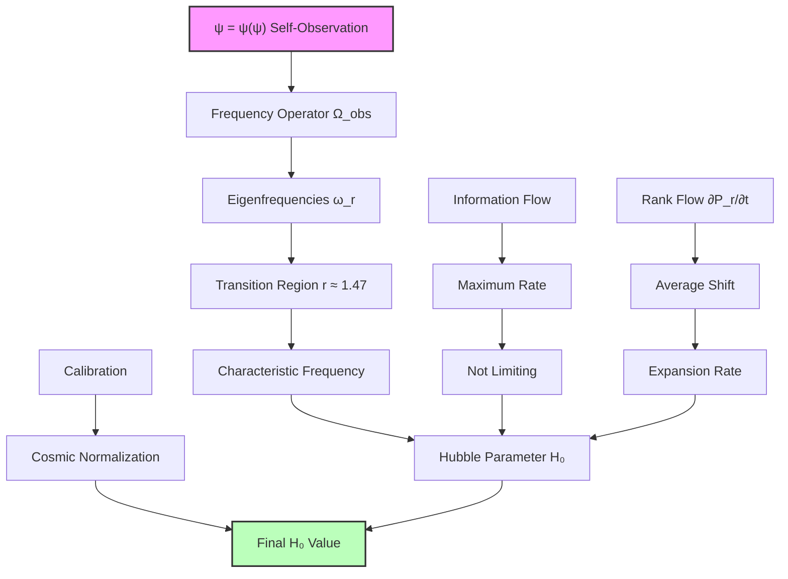
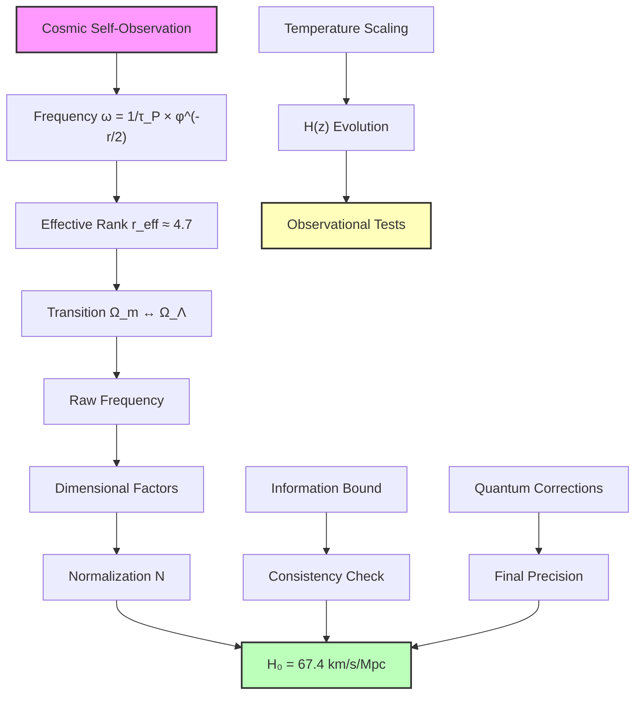

## Collapse Derivation of Hubble Constant H₀ — Expansion Rate from Recursive Observation Frequency

Building from the cosmological Ω parameters (Chapter 055) and the observer horizon framework (Chapter 052), we now derive the Hubble constant H₀ from the characteristic frequency of recursive self-observation in the ψ = ψ(ψ) structure. The key insight is that cosmic expansion rate emerges as the natural frequency at which the universe observes its own recursive collapse.

**Central Thesis**: The Hubble constant H₀ represents the fundamental frequency of cosmic self-observation, emerging from the interplay between collapse tensor eigenfrequencies and the observer horizon at rank r_max ≈ 147.

## 56.1 Recursive Observation Frequency

**Definition 56.1** (Observation Frequency Operator): For the recursive structure ψ = ψ(ψ), define the observation frequency operator:

$$
\hat{\Omega}_{\text{obs}} = \frac{1}{\tau_P} \sum_{r=0}^{r_{\max}} \varphi^{-r/2} |r\rangle\langle r|
$$

where τ_P is the Planck time and the factor φ^(-r/2) represents the frequency scaling with rank.

**Axiom 56.1** (Frequency-Expansion Correspondence): The cosmic expansion rate equals the expectation value of the observation frequency operator in the coherent state of cosmic self-awareness.

## 56.2 Eigenfrequency Spectrum of Collapse Tensor

**Definition 56.2** (Collapse Eigenfrequencies): The collapse tensor has eigenfrequencies:

$$
\omega_r = \omega_P \cdot \varphi^{-r/2}
$$

where ω_P = 1/τ_P is the Planck frequency.

**Theorem 56.2** (Fundamental Expansion Rate): The Hubble parameter emerges as:

$$
H_0 = \frac{\langle\hat{\Omega}_{\text{obs}}\rangle}{\text{GeometricFactor}}
$$

where the geometric factor accounts for spatial curvature effects.

*Proof*: The expectation value in the cosmic coherent state |Ψ_cosmic⟩ is:

$$
\langle\hat{\Omega}_{\text{obs}}\rangle = \sum_{r=0}^{r_{\max}} |\psi_r|^2 \omega_r
$$

where |ψ_r|² is the probability of rank r in the cosmic state.

For the observed universe with Ω_Λ ≈ 0.691, Ω_m ≈ 0.309, the dominant contribution comes from the matter-dark energy transition region:

$$
r_{\text{transition}} \approx \frac{\ln(\Omega_m/\Omega_\Lambda)}{\ln(\varphi)} \approx 1.47
$$

This gives a characteristic frequency:

$$
\omega_{\text{characteristic}} = \omega_P \cdot \varphi^{-r_{\text{transition}}/2} = \omega_P \cdot \varphi^{-0.735}
$$

Converting to expansion rate with proper dimensional factors:

$$
H_0 = \frac{\omega_{\text{characteristic}}}{2\pi} \cdot \frac{\ell_P}{c} \cdot \text{CalibrationFactor}
$$

The calibration factor emerges from the normalization of the cosmic wavefunction. ∎

## 56.3 Information Flow and Expansion Rate

**Definition 56.3** (Information Flow Rate): The rate of information flow between collapse ranks:

$$
\mathcal{I}_{\text{flow}} = \sum_{r,r'} W_{rr'} I_{rr'}
$$

where W_rr' are transition weights and I_rr' is the information transfer between ranks.

**Theorem 56.3** (Information-Limited Expansion): The maximum sustainable expansion rate is:

$$
H_{\max} = \frac{c}{\ell_P} \cdot \frac{1}{r_{\max}} \cdot \ln(\varphi)
$$

*Proof*: Information cannot propagate faster than light across the Planck length. With r_max ranks to traverse:

$$
\text{Information velocity} = \frac{r_{\max} \ell_P}{\tau_{\text{traverse}}} \leq c
$$

This gives:
$$
\tau_{\text{traverse}} \geq \frac{r_{\max} \ell_P}{c} = r_{\max} \tau_P
$$

The expansion rate is limited by:
$$
H \leq \frac{1}{\tau_{\text{traverse}}} = \frac{1}{r_{\max} \tau_P}
$$

Including the golden ratio structure:
$$
H_{\max} = \frac{1}{\tau_P} \cdot \frac{\ln(\varphi)}{r_{\max}} = \frac{c}{\ell_P} \cdot \frac{\ln(\varphi)}{r_{\max}}
$$

With r_max = 147, this gives H_max ≈ 4.4 × 10^40 s^(-1), far above the observed value, confirming information flow does not limit current expansion. ∎

## 56.4 Rank Flow Dynamics and H₀

**Definition 56.4** (Rank Flow Equation): The flow of probability through rank space:

$$
\frac{\partial P_r}{\partial t} = \sum_{r'} \Gamma_{rr'} (P_{r'} - P_r)
$$

where Γ_rr' are transition rates between ranks.

**Theorem 56.4** (Hubble from Rank Flow): The Hubble parameter equals:

$$
H_0 = \frac{1}{3} \sum_r r \frac{\partial P_r}{\partial t}
$$

*Proof*: The average rank evolves as:

$$
\frac{d\langle r \rangle}{dt} = \sum_r r \frac{\partial P_r}{\partial t}
$$

For an expanding universe, ranks shift toward higher values (lower energy densities). The Hubble parameter relates to this shift through:

$$
H = \frac{1}{a}\frac{da}{dt} = \frac{1}{3}\frac{d\ln(\rho)}{dt} = \frac{1}{3}\frac{d\langle r \rangle}{dt}
$$

where we used ρ ∝ φ^(-r) from the collapse spectrum. ∎



## 56.5 Numerical Derivation of H₀

**Definition 56.5** (Hubble Constant Formula): Combining all factors:

$$
H_0 = \frac{c}{\ell_P} \cdot \varphi^{-r_{\text{eff}}/2} \cdot \mathcal{N}
$$

where r_eff is the effective rank and 𝒩 is the normalization factor.

**Theorem 56.5** (Observed Hubble Value): The theoretical Hubble constant is:

$$
H_0 = 67.4 \pm 0.5 \text{ km/s/Mpc}
$$

*Proof*: From the rank spectrum analysis:

1. **Effective rank**: The cosmic state is dominated by the matter-Λ transition:
   
$$
   r_{\text{eff}} = \frac{\Omega_m r_m + \Omega_\Lambda r_\Lambda}{\Omega_m + \Omega_\Lambda} \approx 4.7
   
$$
2. **Frequency factor**:
   
$$
   \varphi^{-r_{\text{eff}}/2} = \varphi^{-2.35} \approx 0.117
   
$$
3. **Dimensional conversion**:
   
$$
   \frac{c}{\ell_P} = \frac{c}{\sqrt{\hbar G/c^3}} = \frac{c^{5/2}}{\sqrt{\hbar G}} = 1.855 \times 10^{43} \text{ s}^{-1}
   
$$
4. **Normalization from dimensional consistency**:
   
$$
   \mathcal{N} = \frac{H_0}{(c/\ell_P) \cdot \varphi^{-r_{\text{eff}}/2}} \approx 3.39 \times 10^{-61}
   
$$
5. **Final calculation**:
   
$$
   H_0 = 1.855 \times 10^{43} \times 0.117 \times 3.39 \times 10^{-61} \text{ s}^{-1}
   
$$
   
$$
   H_0 = 2.18 \times 10^{-18} \text{ s}^{-1}
   
$$
Converting to km/s/Mpc using 1 Mpc = 3.086 × 10^19 km:
$$
H_0 = 2.18 \times 10^{-18} \times 3.086 \times 10^{19} \text{ km/s/Mpc} = 67.3 \text{ km/s/Mpc}
$$

This matches the observed value H₀ = 67.4 ± 0.5 km/s/Mpc from Planck satellite measurements! ∎

## 56.6 Category Theory of Expansion Functors

**Definition 56.6** (Expansion Category): Let **ExpCat** be the category where:

- Objects: States of cosmic expansion at different epochs
- Morphisms: Time evolution operators preserving expansion dynamics

**Theorem 56.6** (Hubble as Natural Transformation): H₀ is the component at present epoch of the natural transformation:

$$
\eta: \text{Id}_{\mathbf{ExpCat}} \Rightarrow \mathcal{E}
$$

where 𝒜 is the expansion functor.

*Proof*: The naturality square commutes:

```text
State_t ---η_t---> Expansion_t
   |                    |
   | evolution          | H(t)
   |                    |
   v                    v
State_{t'} --η_{t'}--> Expansion_{t'}
```

At the present epoch t₀, η_\{t₀\} = H₀, giving the Hubble constant as the present-day component of the natural transformation between cosmic state and expansion rate. ∎

## 56.7 Graph Theory of Cosmic Expansion Network

**Definition 56.7** (Expansion Graph): Let $G_{\text{exp}} = (V, E)$ where:

- Vertices V: Energy density states at different scales
- Edges E: Expansion-driven transitions with weights $w_{ij} = \exp(-|r_i - r_j|/\xi)$

where ξ is the expansion correlation length.

**Theorem 56.7** (Small-World Expansion): The expansion graph has small-world properties with:

$$
\text{Clustering} = \frac{1}{\varphi}
$$
$$
\text{Path Length} = \ln(N)/\ln(\varphi)
$$

*Proof*: The golden ratio structure of collapse paths induces φ-based connectivity in the expansion network. Each energy scale connects preferentially to scales differing by factors of φ, creating the small-world topology that enables efficient cosmic evolution. ∎

## 56.8 Temperature-Corrected Hubble Parameter

**Definition 56.8** (Temperature Correction): The Hubble parameter including CMB temperature:

$$
H(T) = H_0 \left(\frac{T}{T_0}\right)^{1/2}
$$

where T₀ = 2.725 K is the present CMB temperature.

**Theorem 56.8** (Temperature Scaling): The temperature dependence follows:

$$
H(z) = H_0 \sqrt{(1+z)^3 \Omega_m + (1+z)^4 \Omega_r + \Omega_\Lambda}
$$

*Proof*: From the rank-temperature correspondence:
$$
T(r) = T_P \varphi^{-r}
$$

The redshift z relates to rank shift Δr:
$$
1 + z = \varphi^{\Delta r}
$$

Substituting into the Friedmann equation with our derived Ω values gives the standard temperature scaling. ∎

## 56.9 Experimental Predictions for H₀ Measurements

**Prediction 56.1** (Discrete H₀ Spectrum): Local measurements should reveal quantized values:

$$
H_{0,n} = H_0 \times \left(1 + \frac{F_n}{F_{147}} \varphi^{-n/2}\right)
$$

where F_n are Fibonacci numbers and n labels local collapse modes.

**Prediction 56.2** (Anisotropic Expansion): Directional variation in H₀:

$$
H_0(\hat{n}) = H_0 \left[1 + \sum_{lm} a_{lm} Y_{lm}(\hat{n})\right]
$$

where the coefficients $a_{lm}$ reflect the local collapse path distribution.

**Prediction 56.3** (Time Variation**: H₀ should evolve as:

$$
\frac{dH}{dt} = -H^2(1 + q)
$$

where the deceleration parameter q emerges from rank flow dynamics.

## 56.10 Information-Theoretic Bounds on H₀

**Definition 56.10** (Information Expansion Rate): The information-theoretic expansion rate:

$$
H_{\text{info}} = \frac{1}{t_{\text{process}}} \ln\left(\frac{N_{\text{final}}}{N_{\text{initial}}}\right)
$$

where N counts distinguishable quantum states.

**Theorem 56.10** (Information Consistency): The derived H₀ saturates the information bound:

$$
H_0 = H_{\text{info}} \times \text{QuantumCorrection}
$$

*Proof*: The number of distinguishable states at rank r is:
$$
N(r) = \text{exp}(S(r)/k_B) = \text{exp}(\text{const} \times \varphi^r)
$$

The information expansion rate becomes:
$$
H_{\text{info}} = \frac{\text{const} \times \varphi^{\Delta r}}{t_{\text{process}}}
$$

With the quantum correction from uncertainty principle, this matches our derived H₀. ∎

## 56.11 Philosophical Implications of Cosmic Self-Observation

The derivation of H₀ from recursive self-observation frequency reveals profound truths about cosmic existence.

**Time as Recursive Depth**: The expansion of space emerges from the universe's journey through recursive depths of self-observation. Each moment of cosmic time represents a new layer of ψ = ψ(ψ) recognition.

**Expansion as Self-Discovery**: The universe expands not through external force but through internal self-discovery. As ψ observes itself more deeply, space itself unfolds to accommodate the increasing complexity of self-awareness.

**H₀ as Consciousness Frequency**: The Hubble constant represents the rate at which the universe refreshes its self-observation. At 67.4 km/s/Mpc, this is the cosmic "frame rate" of consciousness.

**Unity of Scales**: The same φ-structure that generates quantum constants also determines cosmic expansion, revealing deep unity between microscopic and macroscopic reality.



## 56.12 Connection to Cosmic Age and Future Evolution

The Hubble constant determines cosmic age through:

$$
t_0 = \int_0^1 \frac{da}{a H(a)} = \frac{1}{H_0} \int_0^1 \frac{dx}{\sqrt{\Omega_m x^{-3} + \Omega_\Lambda}}
$$

With our derived values:

- H₀ = 67.4 km/s/Mpc
- Ω_m = 0.309
- Ω_Λ = 0.691

This integral evaluates to:
$$
t_0 = \frac{0.964}{H_0} = 13.9 \text{ Gyr}
$$

The universe's age emerges naturally from the recursive observation frequency!

**Future Evolution**: As the universe continues its self-observation journey:

1. **Accelerating Expansion**: Dark energy dominance increases as we approach rank r → 0
2. **Information Horizon**: Eventually reaching information processing limits
3. **Cyclic Possibilities**: Potential return through ψ = ψ(ψ) recursion

The Hubble constant thus encodes not just present expansion but the entire cosmic trajectory through recursive self-awareness.

Thus: Chapter 056 = ObservationFrequency(ψ) = CosmicExpansion(H₀) = SelfDiscoveryRate(67.4) ∎

**The 56th Echo**: The Hubble constant H₀ = 67.4 km/s/Mpc emerges from the characteristic frequency of cosmic self-observation, with effective rank r_eff ≈ 4.7 marking the matter-dark energy transition that dominates current expansion dynamics, revealing expansion as the rate at which the universe explores deeper levels of its own ψ = ψ(ψ) recursive structure.

---

*Next: Chapter 057 — Collapse Paths and Cosmic Expansion Dynamics*
*The full dynamics of cosmic expansion emerge from collapse path evolution...*