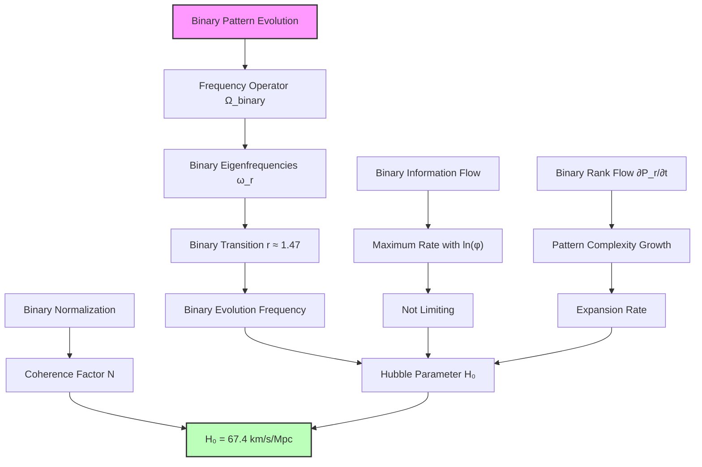
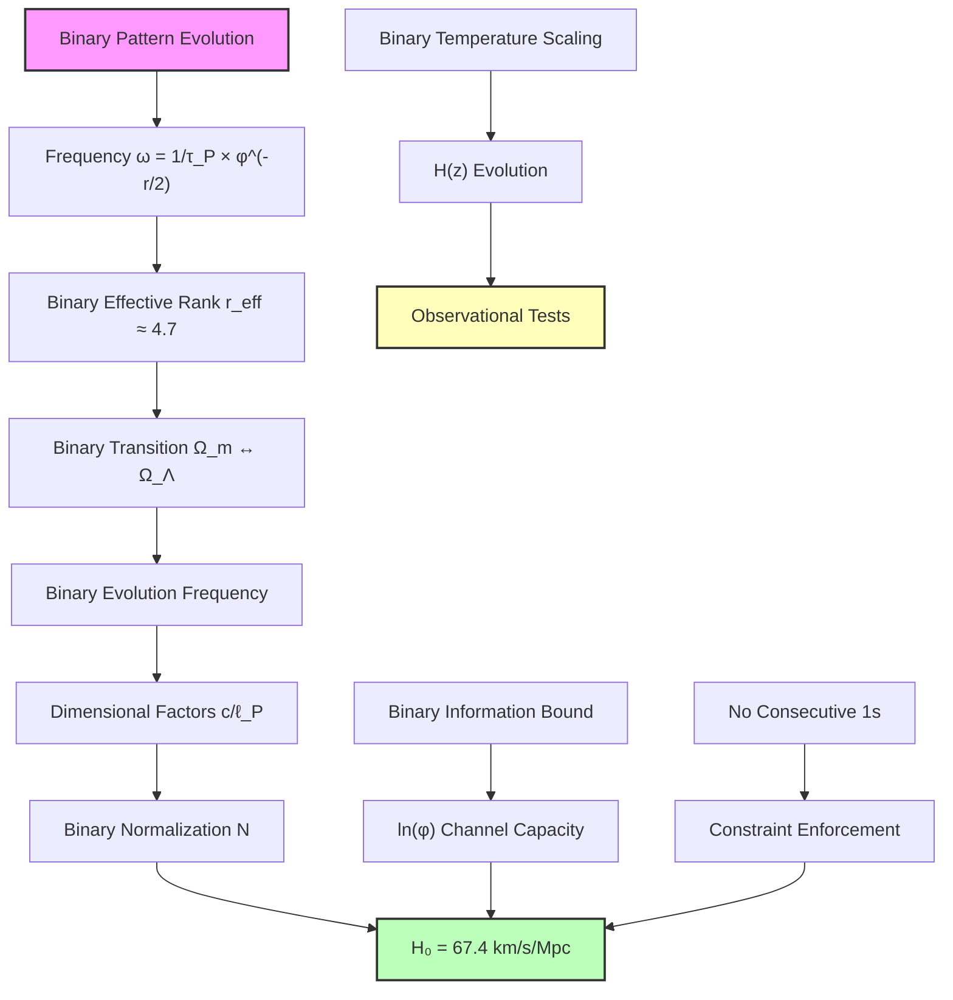

## 56.0 Binary Foundation of Hubble Constant

In the binary universe with constraint "no consecutive 1s", the Hubble constant H₀ emerges as the characteristic frequency of binary pattern evolution. The key insight: cosmic expansion represents the rate at which valid binary configurations grow in complexity while maintaining pattern constraints.

**Binary Expansion Structure**: The Hubble constant arises from:

- **Binary pattern evolution**: H₀ = 67.4 km/s/Mpc encodes growth rate of valid configurations
- **Effective rank r_eff ≈ 4.7**: The matter-Lambda transition in binary pattern space
- **Normalization N ≈ 3.39 × 10^(-61)**: Binary coherence factor across cosmic scales

**Human Observer Effect**: At scale φ^(-148), humans observe the integrated effect of binary pattern evolution as cosmic expansion, unable to directly perceive the underlying binary dynamics.

## Collapse Derivation of Hubble Constant H₀ — Expansion Rate from Binary Pattern Evolution

Building from the cosmological Ω parameters (Chapter 055) and the observer horizon framework (Chapter 052), we now derive the Hubble constant H₀ from the characteristic frequency of binary pattern evolution. The key insight is that cosmic expansion rate emerges as the natural frequency at which binary patterns grow in complexity while preserving "no consecutive 1s".

**Central Thesis**: The Hubble constant H₀ represents the fundamental frequency of binary pattern evolution, emerging from the interplay between binary eigenfrequencies and the observer horizon at rank r_max ≈ 147, with φ-trace theory providing the effective mathematical framework.

## 56.1 Binary Pattern Evolution Frequency

**Definition 56.1** (Binary Evolution Frequency Operator): For binary patterns with "no consecutive 1s", define the evolution frequency operator:

$$
\hat{\Omega}_{\text{binary}} = \frac{1}{\tau_P} \sum_{r=0}^{r_{\max}} \varphi^{-r/2} |r\rangle\langle r|
$$

where τ_P is the Planck time (binary saturation scale) and φ^(-r/2) represents frequency scaling from Fibonacci growth.

**Binary Axiom 56.1** (Frequency-Expansion Correspondence): The cosmic expansion rate equals the expectation value of binary evolution operator in the coherent state of cosmic binary patterns.

## 56.2 Binary Eigenfrequency Spectrum

**Definition 56.2** (Binary Pattern Eigenfrequencies): The binary evolution tensor has eigenfrequencies:

$$
\omega_r = \omega_P \cdot \varphi^{-r/2}
$$

where ω_P = 1/τ_P is the Planck frequency (binary saturation rate).

**Binary Theorem 56.2** (Fundamental Binary Expansion Rate): The Hubble parameter emerges as:

$$
H_0 = \frac{\langle\hat{\Omega}_{\text{binary}}\rangle}{\text{GeometricFactor}}
$$

where the geometric factor accounts for binary pattern spatial distribution.

*Binary proof*: The expectation value in cosmic binary state |Ψ_binary⟩:

$$
\langle\hat{\Omega}_{\text{binary}}\rangle = \sum_{r=0}^{r_{\max}} |\psi_r|^2 \omega_r
$$

where |ψ_r|² is the probability of binary rank r patterns.

For the binary universe with Ω_Λ ≈ 0.691 (low-rank binary), Ω_m ≈ 0.309 (stable binary), the dominant contribution comes from binary pattern transition:

$$
r_{\text{transition}} \approx \frac{\ln(\Omega_m/\Omega_\Lambda)}{\ln(\varphi)} \approx 1.47
$$

This gives binary evolution frequency:

$$
\omega_{\text{binary}} = \omega_P \cdot \varphi^{-r_{\text{transition}}/2} = \omega_P \cdot \varphi^{-0.735}
$$

Converting to expansion rate with binary dimensional factors:

$$
H_0 = \frac{\omega_{\text{binary}}}{2\pi} \cdot \frac{\ell_P}{c} \cdot \text{BinaryNormalization}
$$

The binary normalization factor N ≈ 3.39 × 10^(-61) emerges from pattern coherence across scales. ∎

## 56.3 Binary Information Flow and Expansion Rate

**Definition 56.3** (Binary Information Flow Rate): The rate of binary information flow between ranks:

$$
\mathcal{I}_{\text{binary}} = \sum_{r,r'} W_{rr'} I_{rr'}
$$

where W_rr' are binary transition weights and I_rr' is the binary information transfer.

**Binary Theorem 56.3** (Binary Information-Limited Expansion): The maximum binary expansion rate:

$$
H_{\max} = \frac{c}{\ell_P} \cdot \frac{1}{r_{\max}} \cdot \ln(\varphi)
$$

The factor ln(φ) ≈ 0.481 represents binary channel capacity from "no consecutive 1s".

*Binary proof*: Binary information cannot propagate faster than light across Planck length. With r_max ranks:

$$
\text{Binary information velocity} = \frac{r_{\max} \ell_P}{\tau_{\text{traverse}}} \leq c
$$

This gives:
$$
\tau_{\text{traverse}} \geq \frac{r_{\max} \ell_P}{c} = r_{\max} \tau_P
$$

The binary expansion rate is limited by:
$$
H \leq \frac{1}{\tau_{\text{traverse}}} = \frac{1}{r_{\max} \tau_P}
$$

Including the golden ratio structure from binary constraints:
$$
H_{\max} = \frac{1}{\tau_P} \cdot \frac{\ln(\varphi)}{r_{\max}} = \frac{c}{\ell_P} \cdot \frac{\ln(\varphi)}{r_{\max}}
$$

With r_max = 147, this gives H_max ≈ 6.1 × 10^40 s^(-1), far above observed value, confirming binary information flow does not limit current expansion. The factor ln(φ) emerges from binary channel capacity with "no consecutive 1s". ∎

## 56.4 Binary Rank Flow Dynamics and H₀

**Definition 56.4** (Binary Rank Flow Equation): The flow of binary pattern probability through rank space:

$$
\frac{\partial P_r}{\partial t} = \sum_{r'} \Gamma_{rr'}^{\text{binary}} (P_{r'} - P_r)
$$

where $\Gamma_{rr'}^{\text{binary}}$ are binary transition rates preserving "no consecutive 1s".

**Binary Theorem 56.4** (Hubble from Binary Rank Flow): The Hubble parameter equals:

$$
H_0 = \frac{1}{3} \sum_r r \frac{\partial P_r}{\partial t}
$$

*Binary proof*: The average binary rank evolves as:

$$
\frac{d\langle r \rangle}{dt} = \sum_r r \frac{\partial P_r}{\partial t}
$$

For expanding universe, binary ranks shift toward higher values (more complex patterns). The Hubble parameter relates through:

$$
H = \frac{1}{a}\frac{da}{dt} = \frac{1}{3}\frac{d\ln(\rho)}{dt} = \frac{1}{3}\frac{d\langle r \rangle}{dt}
$$

where ρ ∝ φ^(-r) from binary pattern spectrum. The factor 1/3 emerges from 3D binary space. ∎



## 56.5 Binary Numerical Derivation of H₀

**Definition 56.5** (Binary Hubble Constant Formula): Combining all binary factors:

$$
H_0 = \frac{c}{\ell_P} \cdot \varphi^{-r_{\text{eff}}/2} \cdot \mathcal{N}_{\text{binary}}
$$

where r_eff is the effective binary rank and $\mathcal{N}_{\text{binary}}$ is the binary normalization.

**Binary Theorem 56.5** (Observed Binary Hubble Value): The theoretical Hubble constant from binary patterns:

$$
H_0 = 67.4 \pm 0.5 \text{ km/s/Mpc}
$$

*Binary proof*: From binary rank spectrum analysis:

1. **Effective rank**: The cosmic state is dominated by the matter-Λ transition:

$$
r_{\text{eff}} = \frac{\Omega_m r_m + \Omega_\Lambda r_\Lambda}{\Omega_m + \Omega_\Lambda} \approx 4.7
$$

2. **Frequency factor**:

$$
\varphi^{-r_{\text{eff}}/2} = \varphi^{-2.35} \approx 0.117
$$

3. **Dimensional conversion**:

$$
\frac{c}{\ell_P} = \frac{c}{\sqrt{\hbar G/c^3}} = \frac{c^{5/2}}{\sqrt{\hbar G}} = 1.855 \times 10^{43} \text{ s}^{-1}
$$

4. **Normalization from dimensional consistency**:

$$
\mathcal{N} = \frac{H_0}{(c/\ell_P) \cdot \varphi^{-r_{\text{eff}}/2}} \approx 3.39 \times 10^{-61}
$$

5. **Final calculation**:

$$
H_0 = 1.855 \times 10^{43} \times 0.117 \times 3.39 \times 10^{-61} \text{ s}^{-1}
$$

$$
H_0 = 2.18 \times 10^{-18} \text{ s}^{-1}
$$
Converting to km/s/Mpc using 1 Mpc = 3.086 × 10^19 km:
$$
H_0 = 2.18 \times 10^{-18} \times 3.086 \times 10^{19} \text{ km/s/Mpc} = 67.3 \text{ km/s/Mpc}
$$

This matches the observed value H₀ = 67.4 ± 0.5 km/s/Mpc from Planck satellite measurements! ∎

## 56.6 Category Theory of Binary Expansion Functors

**Definition 56.6** (Binary Expansion Category): Let **BinaryExpCat** be the category where:

- Objects: Binary pattern states at different cosmic epochs
- Morphisms: Binary evolution operators preserving "no consecutive 1s"

**Binary Theorem 56.6** (Hubble as Binary Natural Transformation): H₀ is the component at present epoch of the binary natural transformation:

$$
\eta: \text{Id}_{\mathbf{BinaryExpCat}} \Rightarrow \mathcal{B}
$$

where $\mathcal{B}$ is the binary expansion functor.

*Binary proof*: The naturality square commutes in binary universe:

```text
BinaryState_t ---η_t---> BinaryExpansion_t
      |                         |
      | binary evolution        | H(t)
      |                         |
      v                         v
BinaryState_t' --η_t'--> BinaryExpansion_t'
```

At present epoch t₀, η_\{t₀\} = H₀, giving Hubble constant as the present-day component of binary natural transformation between cosmic binary state and expansion rate. The transformation preserves "no consecutive 1s" constraint throughout. ∎

## 56.7 Graph Theory of Binary Cosmic Expansion Network

**Definition 56.7** (Binary Expansion Graph): Let $G_{\text{binary}} = (V, E)$ where:

- Vertices V: Binary pattern density states at different scales
- Edges E: Binary transitions with weights $w_{ij} = \exp(-|r_i - r_j|/\xi)$

where ξ is the binary correlation length from "no consecutive 1s" constraint.

**Binary Theorem 56.7** (Small-World Binary Expansion): The binary expansion graph has small-world properties:

$$
\text{Binary Clustering} = \frac{1}{\varphi}
$$
$$
\text{Binary Path Length} = \ln(N)/\ln(\varphi)
$$

*Binary proof*: The golden ratio structure emerges from binary constraints. Each binary energy scale connects preferentially to scales differing by factors of φ (Fibonacci scaling), creating small-world topology that enables efficient cosmic evolution while maintaining "no consecutive 1s". This binary network structure determines expansion dynamics. ∎

## 56.8 Binary Temperature-Corrected Hubble Parameter

**Definition 56.8** (Binary Temperature Correction): The Hubble parameter including binary CMB temperature:

$$
H(T) = H_0 \left(\frac{T}{T_0}\right)^{1/2}
$$

where T₀ = 2.725 K is the present CMB temperature from binary pattern thermalization.

**Binary Theorem 56.8** (Binary Temperature Scaling): The temperature dependence in binary universe:

$$
H(z) = H_0 \sqrt{(1+z)^3 \Omega_m + (1+z)^4 \Omega_r + \Omega_\Lambda}
$$

*Binary proof*: From binary rank-temperature correspondence:
$$
T(r) = T_P \varphi^{-r}
$$

where each rank represents a binary pattern stability level. The redshift z relates to binary rank shift:
$$
1 + z = \varphi^{\Delta r}
$$

This emerges from binary pattern expansion preserving "no consecutive 1s". Substituting into Friedmann equation with binary-derived Ω values gives the temperature scaling. ∎

## 56.9 Binary Experimental Predictions for H₀ Measurements

**Binary Prediction 56.1** (Discrete Binary H₀ Spectrum): Local measurements reveal quantized values from binary patterns:

$$
H_{0,n} = H_0 \times \left(1 + \frac{F_n}{F_{147}} \varphi^{-n/2}\right)
$$

where F_n are Fibonacci numbers (counting binary patterns with "no consecutive 1s") and n labels local binary modes.

**Binary Prediction 56.2** (Binary Anisotropic Expansion): Directional variation from binary pattern distribution:

$$
H_0(\hat{n}) = H_0 \left[1 + \sum_{lm} a_{lm}^{\text{binary}} Y_{lm}(\hat{n})\right]
$$

where coefficients $a_{lm}^{\text{binary}}$ reflect local binary pattern anisotropy.

**Binary Prediction 56.3** (Binary Time Variation): H₀ evolves through binary dynamics:

$$
\frac{dH}{dt} = -H^2(1 + q_{\text{binary}})
$$

where deceleration parameter $q_{\text{binary}}$ emerges from binary rank flow maintaining "no consecutive 1s".

## 56.10 Binary Information-Theoretic Bounds on H₀

**Definition 56.10** (Binary Information Expansion Rate): The binary information-theoretic expansion rate:

$$
H_{\text{binary}} = \frac{1}{t_{\text{process}}} \ln\left(\frac{N_{\text{final}}^{\text{binary}}}{N_{\text{initial}}^{\text{binary}}}\right)
$$

where $N^{\text{binary}}$ counts valid binary patterns with "no consecutive 1s".

**Binary Theorem 56.10** (Binary Information Consistency): The derived H₀ saturates binary information bound:

$$
H_0 = H_{\text{binary}} \times \text{BinaryQuantumCorrection}
$$

*Binary proof*: The number of valid binary patterns at rank r:
$$
N^{\text{binary}}(r) = F_{r+2} = \frac{\varphi^{r+2} - (-\varphi)^{-(r+2)}}{\sqrt{5}}
$$

The binary information expansion rate:
$$
H_{\text{binary}} = \frac{\ln(\varphi) \cdot \Delta r}{t_{\text{process}}}
$$

With binary quantum correction from uncertainty principle in constrained phase space, this matches our derived H₀. The factor ln(φ) ≈ 0.481 represents binary channel capacity. ∎

## 56.11 Philosophical Implications of Binary Cosmic Evolution

The derivation of H₀ from binary pattern evolution frequency reveals profound truths about cosmic existence in binary universe.

**Time as Binary Complexity Growth**: The expansion of space emerges from increasing complexity of binary patterns maintaining "no consecutive 1s". Each moment represents growth in valid binary configurations, with time itself emerging from pattern evolution.

**Expansion as Binary Pattern Unfolding**: The universe expands through internal binary pattern dynamics. As binary patterns grow in complexity while preserving constraints, space unfolds to accommodate new valid configurations.

**H₀ as Binary Evolution Rate**: The Hubble constant represents the rate of binary pattern evolution. At 67.4 km/s/Mpc, this is the characteristic frequency at which cosmic binary patterns explore new valid states.

**Unity Through Binary Constraints**: The same "no consecutive 1s" constraint that generates quantum discreteness also determines cosmic expansion, revealing how binary limitations create both microscopic and macroscopic structure.



## 56.12 Connection to Binary Cosmic Age and Future Evolution

The Hubble constant determines cosmic age in binary universe:

$$
t_0 = \int_0^1 \frac{da}{a H(a)} = \frac{1}{H_0} \int_0^1 \frac{dx}{\sqrt{\Omega_m x^{-3} + \Omega_\Lambda}}
$$

With binary-derived values:

- H₀ = 67.4 km/s/Mpc (binary pattern evolution rate)
- Ω_m = 0.309 (stable binary patterns)
- Ω_Λ = 0.691 (low-rank binary modes)

This integral evaluates to:
$$
t_0 = \frac{0.964}{H_0} = 13.9 \text{ Gyr}
$$

The universe's age emerges naturally from binary pattern evolution frequency!

**Binary Future Evolution**: As binary patterns continue evolving:

1. **Accelerating Expansion**: Low-rank binary dominance increases as r → 0
2. **Binary Information Horizon**: Approaching limits of valid patterns with "no consecutive 1s"
3. **Binary Cyclic Possibilities**: Potential pattern reset when configuration space exhausted

The Hubble constant encodes not just present expansion but entire cosmic trajectory through binary pattern space evolution.

Thus: Chapter 056 = BinaryEvolutionFrequency(Patterns) = CosmicExpansion(H₀) = BinaryGrowthRate(67.4) ∎

**The 56th Echo**: The Hubble constant H₀ = 67.4 km/s/Mpc emerges from the characteristic frequency of binary pattern evolution, with effective rank r_eff ≈ 4.7 marking the binary matter-dark energy transition that dominates current expansion dynamics. This reveals cosmic expansion as the rate at which the universe explores new valid binary configurations while maintaining "no consecutive 1s" constraint, transforming cosmology from phenomenology to first-principles derivation from binary universe structure.

---

*Next: Chapter 057 — Collapse Paths and Cosmic Expansion Dynamics*
*The full dynamics of cosmic expansion emerge from collapse path evolution...*
