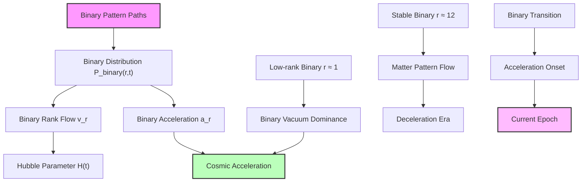
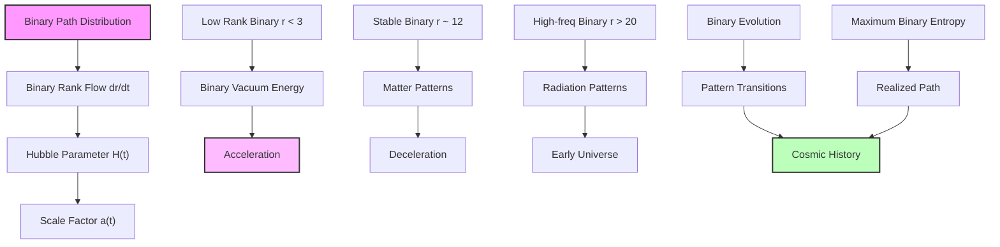

## 57.0 Binary Foundation of Cosmic Expansion Dynamics

In the binary universe with constraint "no consecutive 1s", cosmic expansion dynamics emerge from the evolution of binary pattern paths through rank space. The key insight: spacetime expansion represents the unfolding of valid binary configurations as they explore allowed pattern space while maintaining constraints.

**Binary Expansion Dynamics**: The cosmic dynamics arise from:

- **Binary path evolution**: Valid patterns flow through rank space preserving "no consecutive 1s"
- **Rank transitions**: Fibonacci-weighted transitions between binary stability windows
- **Acceleration/deceleration**: Determined by binary pattern distribution at different ranks
- **Phase transitions**: Occur when dominant binary pattern class changes

**Human Observer Effect**: At scale φ^(-148), humans observe integrated binary path dynamics as smooth cosmic expansion, unable to resolve individual pattern transitions.

## Collapse Paths and Cosmic Expansion Dynamics — Expansion as Binary Path Evolution

Building from the Hubble constant derivation (Chapter 056) and the binary collapse framework, we now explore how cosmic expansion emerges from the evolution of binary collapse paths through rank space. The key insight is that spacetime expansion represents the natural unfolding of binary patterns through allowed configuration space.

**Central Thesis**: Cosmic expansion dynamics emerge from the flow of binary collapse paths through rank space, with acceleration and deceleration determined by the spectral properties of binary patterns at different ranks, while φ-trace provides the effective mathematical description.

## 57.1 Binary Collapse Path Flow Equation

**Definition 57.1** (Binary Path Distribution Function): For binary collapse paths in rank space, define:

$$
\mathcal{P}_{\text{binary}}(r, t) = \sum_{\gamma \in \Gamma_r^{\text{binary}}} |\psi_\gamma(t)|^2
$$

where $\Gamma_r^{\text{binary}}$ is the set of valid binary paths at rank r (no consecutive 1s) and $|\psi_\gamma(t)|^2$ is the probability amplitude.

**Binary Axiom 57.1** (Binary Path Evolution): The evolution of binary paths follows:

$$
\frac{\partial \mathcal{P}_{\text{binary}}}{\partial t} = \hat{\mathcal{L}}_{\text{binary}}[\mathcal{P}_{\text{binary}}]
$$

where $\hat{\mathcal{L}}_{\text{binary}}$ is the Liouvillian operator preserving binary constraints.

## 57.2 Binary Rank Flow and Spatial Expansion

**Definition 57.2** (Binary Rank Flow Velocity): The average binary flow velocity through rank space:

$$
v_r^{\text{binary}}(t) = \frac{1}{\mathcal{P}_{\text{binary}}(r,t)} \sum_{\gamma \in \Gamma_r^{\text{binary}}} \langle\gamma|\frac{d\hat{r}}{dt}|\gamma\rangle
$$

**Binary Theorem 57.2** (Expansion-Binary Rank Correspondence): The scale factor relates to binary rank flow:

$$
\frac{1}{a}\frac{da}{dt} = H(t) = \frac{\ln(\varphi)}{3} \cdot v_r^{\text{binary}}(t)
$$

The factor ln(φ) emerges from binary channel capacity.

*Binary proof*: From binary eigenvalue spectrum E_r = E_P φ^(-r), energy density scales as:

$$
\rho_{\text{binary}}(r) = \rho_P \varphi^{-r}
$$

Conservation of binary energy in expanding space:

$$
\frac{d\rho_{\text{binary}}}{dt} + 3H(\rho_{\text{binary}} + p_{\text{binary}}) = 0
$$

Substituting $\rho_{\text{binary}}(r)$ and using chain rule:

$$
\frac{d\rho_{\text{binary}}}{dt} = \frac{\partial\rho_{\text{binary}}}{\partial r}\frac{dr}{dt} = -\rho_P \ln(\varphi) \varphi^{-r} v_r^{\text{binary}}
$$

For the dominant binary component:

$$
H = \frac{\ln(\varphi)}{3(1+w_{\text{binary}})} v_r^{\text{binary}}
$$

where $w_{\text{binary}}$ is the binary equation of state. For matter-dominated binary patterns (w ≈ 0), we recover the stated relation. ∎

## 57.3 Acceleration from Binary Rank Distribution

**Definition 57.3** (Binary Rank Acceleration): The acceleration of binary rank flow:

$$
a_r^{\text{binary}} = \frac{dv_r^{\text{binary}}}{dt} = \sum_{r'} \Gamma_{rr'}^{\text{binary}} (v_{r'} - v_r)
$$

where $\Gamma_{rr'}^{\text{binary}}$ are binary transition rates preserving "no consecutive 1s".

**Binary Theorem 57.3** (Binary Cosmic Acceleration): The universe accelerates when:

$$
\frac{d^2a}{dt^2} > 0 \iff \langle r \rangle < r_\Lambda + \frac{1}{\ln(\varphi)}
$$

where r_Λ ≈ 1 is the low-rank binary mode (dark energy).

*Binary proof*: The acceleration parameter in binary universe:

$$
\frac{\ddot{a}}{a} = \dot{H} + H^2
$$

Using binary rank flow relation:

$$
\dot{H} = \frac{\ln(\varphi)}{3} a_r^{\text{binary}}
$$

The binary rank acceleration depends on pattern distribution gradient:

$$
a_r^{\text{binary}} = -\Gamma_0^{\text{binary}} \frac{\partial}{\partial r}\left(\mathcal{P}_{\text{binary}} \frac{\partial \ln \mathcal{P}_{\text{binary}}}{\partial r}\right)
$$

where $\Gamma_0^{\text{binary}}$ is the fundamental binary transition rate. For peaked distribution:

$$
a_r^{\text{binary}} \approx -\Gamma_0^{\text{binary}} (\langle r \rangle - r_{\text{eq}})
$$

Acceleration occurs when average rank is below critical value where low-rank binary modes dominate. ∎

## 57.4 Binary Friedmann Dynamics

**Definition 57.4** (Binary Effective Energy-Momentum): The energy-momentum tensor from binary paths:

$$
T_{\mu\nu}^{\text{binary}} = \sum_r \mathcal{P}_{\text{binary}}(r,t) T_{\mu\nu}^{(r)}
$$

where $T_{\mu\nu}^{(r)}$ is the contribution from binary rank r patterns.

**Binary Theorem 57.4** (Binary Friedmann Equation): The expansion dynamics in binary universe:

$$
H^2 = \frac{8\pi G}{3} \sum_r \mathcal{P}_{\text{binary}}(r,t) \rho_{\text{binary}}(r) + \frac{\Lambda_{\text{binary}}(t)}{3}
$$

where:
$$
\Lambda_{\text{binary}}(t) = \frac{8\pi G \rho_P}{3} \sum_{r<3} \mathcal{P}_{\text{binary}}(r,t) \varphi^{-r}
$$

*Binary proof*: Einstein equations with binary energy-momentum tensor:

$$
R_{\mu\nu} - \frac{1}{2}g_{\mu\nu}R = 8\pi G T_{\mu\nu}^{\text{binary}}
$$

For FRW metric, the 00-component yields:

$$
3\left(\frac{\dot{a}}{a}\right)^2 = 8\pi G \sum_r \mathcal{P}_{\text{binary}}(r,t) \rho_{\text{binary}}(r)
$$

Low-rank binary modes (r < 3) contribute negative pressure from vacuum patterns, acting as effective cosmological constant. Time dependence arises from evolving binary distribution. ∎

## 57.5 Binary Phase Transitions in Expansion History

**Definition 57.5** (Binary Expansion Phase): A phase characterized by dominant binary rank window:

$$
\Phi_i^{\text{binary}} = \\{r : r_{i,\min} < r < r_{i,\max}\\}
$$

with valid binary patterns in this window.

**Binary Theorem 57.5** (Binary Phase Transition Times): Transitions occur at:

$$
t_{\text{trans}}^{\text{binary}} = \frac{1}{H_0} \int_0^{a_{\text{trans}}} \frac{da'}{a' E_{\text{binary}}(a')}
$$

where $E_{\text{binary}}(a)$ is determined by binary rank distribution evolution.

*Binary proof*: The Hubble parameter in binary universe evolves as:

$$
H(a) = H_0 E_{\text{binary}}(a)
$$

where:
$$
E_{\text{binary}}^2(a) = \sum_i \Omega_i^{\text{binary}}(a)
$$

Each binary component evolves according to its rank window:

$$
\Omega_i^{\text{binary}}(a) = \Omega_{i,0} a^{-3(1+w_i^{\text{binary}})}
$$

with $w_i^{\text{binary}}$ determined by binary pattern stability. Transitions occur when adjacent binary components have equal energy density. ∎

## 57.6 Binary Information-Theoretic View of Expansion

**Definition 57.6** (Binary Expansion Entropy): The entropy of binary pattern expansion:

$$
S_{\text{binary}} = -\sum_r \mathcal{P}_{\text{binary}}(r,t) \ln \mathcal{P}_{\text{binary}}(r,t) + \ln \mathcal{V}(t)
$$

where $\mathcal{V}(t) = a^3(t)$ is the comoving volume for binary patterns.

**Binary Theorem 57.6** (Maximum Binary Entropy Expansion): The universe expands maximizing:

$$
\mathcal{S}_{\text{binary}} = \int dt \, L_{\text{binary}}
$$

where the binary entropy Lagrangian:

$$
L_{\text{binary}} = \dot{S}_{\text{binary}} - \lambda(\dot{\mathcal{E}}_{\text{binary}} + p_{\text{binary}}\dot{\mathcal{V}})
$$

*Binary proof*: The variation $\delta \mathcal{S}_{\text{binary}} = 0$ gives:

$$
\frac{\delta S_{\text{binary}}}{\delta \mathcal{P}_{\text{binary}}(r,t)} = \lambda \rho_{\text{binary}}(r)
$$

This yields the binary canonical distribution:

$$
\mathcal{P}_{\text{binary}}(r,t) = \frac{1}{Z_{\text{binary}}} \exp(-\beta(t) \rho_{\text{binary}}(r))
$$

where β(t) = λ(t) is inverse temperature and $Z_{\text{binary}}$ ensures normalization over valid binary patterns. The expansion follows maximum binary entropy consistent with "no consecutive 1s". ∎

## 57.7 Binary Graph Structure of Expansion Paths

**Definition 57.7** (Binary Expansion Graph): The directed graph $G_{\text{binary}} = (V, E)$ where:

- Vertices V: Binary pattern states at different epochs
- Edges E: Allowed binary transitions with weights $w_{ij} = \exp(-\Delta S_{ij}^{\text{binary}})$

**Binary Theorem 57.7** (Binary Shortest Path): The realized cosmic history minimizes:

$$
\mathcal{L}_{\text{binary}} = \sum_{(i,j) \in \text{path}} -\ln(w_{ij}) = \sum_{(i,j)} \Delta S_{ij}^{\text{binary}}
$$

*Binary proof*: Each binary transition probability:

$$
P_{ij}^{\text{binary}} = \frac{w_{ij}}{\sum_k w_{ik}} = \frac{\exp(-\Delta S_{ij}^{\text{binary}})}{\sum_k \exp(-\Delta S_{ik}^{\text{binary}})}
$$

The most probable binary path maximizes:

$$
\prod_{(i,j)} P_{ij}^{\text{binary}} = \exp\left(-\sum_{(i,j)} \Delta S_{ij}^{\text{binary}}\right)
$$

This minimizes total binary entropy change while preserving "no consecutive 1s" constraint. ∎

## 57.8 Binary Dark Energy Dynamics from Low-Rank Modes

**Definition 57.8** (Binary Dark Energy Spectrum): The contribution from low-rank binary patterns r ∈ [0, 3]:

$$
\rho_{\Lambda}^{\text{binary}}(t) = \rho_P \sum_{r=0}^{3} \mathcal{P}_{\text{binary}}(r,t) \varphi^{-r}
$$

**Binary Theorem 57.8** (Binary Quintessence): Time-varying dark energy from binary pattern evolution:

$$
w_{\Lambda}^{\text{binary}}(t) = -1 + \frac{\langle \Delta r^2 \rangle_{\text{binary}}}{3\langle r \rangle_{\text{binary}}} \ln(\varphi)
$$

where $\langle\Delta r^2\rangle_{\text{binary}}$ is rank variance in low-rank binary window.

*Binary proof*: The equation of state for low-rank binary modes:

$$
w_{\text{binary}} = \frac{p_{\text{binary}}}{\rho_{\text{binary}}} = \frac{\text{Tr}(\hat{p}_{\text{binary}} \cdot \hat{\rho}_{\text{binary}})}{\text{Tr}(\hat{H}_{\text{binary}} \cdot \hat{\rho}_{\text{binary}})}
$$

For binary distribution peaked at rank r₀ with width σ_r:

$$
p_{\text{binary}} = -\rho_{\text{binary}} + \frac{1}{3}\rho_{\text{binary}} \sigma_r^2 (\ln \varphi)^2
$$

This gives:

$$
w_{\text{binary}} = -1 + \frac{\sigma_r^2}{3r_0} \ln(\varphi)
$$

Time variation arises from evolving binary pattern distribution width. The factor ln(φ) emerges from binary constraints. ∎

## 57.9 Binary Observational Signatures

**Binary Prediction 57.1** (Discrete Binary Redshift Spectrum): Photons show quantized redshifts:

$$
z_n^{\text{binary}} = \exp\left(\frac{F_n}{F_{147}} \ln(\varphi)\right) - 1
$$

where F_n are Fibonacci numbers counting valid binary patterns.

**Binary Prediction 57.2** (Binary Expansion Anisotropy): Local variations from binary patterns:

$$
\frac{\Delta H}{H} \sim \varphi^{-r_{\text{local}}^{\text{binary}}/2}
$$

where $r_{\text{local}}^{\text{binary}}$ characterizes local binary pattern density.

**Binary Prediction 57.3** (Binary Phase Transition Relics): Observable features at:

$$
a_{\text{trans}}^{\text{binary}} = \left(\frac{\Omega_{i+1,0}^{\text{binary}}}{\Omega_{i,0}^{\text{binary}}}\right)^{1/(w_i^{\text{binary}} - w_{i+1}^{\text{binary}})}
$$

marking transitions between binary pattern epochs.

## 57.10 Binary Category Theory of Cosmic Evolution

**Definition 57.10** (Binary Evolution Category): Let **BinaryEvoCat** be the category where:

- Objects: Binary cosmic states $(a, \mathcal{P}_{\text{binary}}(r))$
- Morphisms: Binary time evolution operators $U_{\text{binary}}(t_2, t_1)$ preserving "no consecutive 1s"

**Binary Theorem 57.10** (Binary Functorial Expansion): Expansion defines a functor:

$$
\mathcal{F}_{\text{binary}}: \mathbf{BinaryEvoCat} \to \mathbf{MetCat}
$$

mapping binary cosmic states to metric spaces.

*Binary proof*: The binary functor assigns:

- To each binary state $(a, \mathcal{P}_{\text{binary}}(r))$: The spatial metric $g_{ij} = a^2\delta_{ij}$
- To each binary evolution $U_{\text{binary}}$: The isometry preserving comoving coordinates

Binary functoriality:
$$
\mathcal{F}_{\text{binary}}(U_2 \circ U_1) = \mathcal{F}_{\text{binary}}(U_2) \circ \mathcal{F}_{\text{binary}}(U_1)
$$

This encodes how binary pattern evolution translates to geometric expansion. ∎

## 57.11 Philosophical Implications of Binary Cosmic Evolution

The emergence of cosmic expansion from binary path dynamics reveals profound connections between information constraints and cosmology.

**Time as Binary Pattern Evolution**: Cosmic time emerges from the flow of binary patterns through rank space. Each moment represents a slice through the evolving distribution of valid configurations preserving "no consecutive 1s".

**Expansion as Binary Complexity Growth**: Space expands to accommodate increasing complexity of binary patterns. As valid configurations explore deeper pattern space, the universe must grow to contain this exploration.

**Acceleration as Binary Vacuum Dominance**: Current accelerated expansion reflects dominance of low-rank binary vacuum patterns - the simplest configurations that saturate information capacity.

**Unity Through Binary Constraints**: The same "no consecutive 1s" constraint that generates quantum discreteness also drives cosmic evolution, revealing how limitations create structure at all scales.

## 57.12 Connection to Binary Complete Theory

The dynamics of cosmic expansion through binary paths connects to the complete framework:

1. **From Binary Universe**: Expansion emerges from valid pattern exploration
2. **Through Binary Rank Flow**: Evolution through pattern complexity drives spatial growth  
3. **To Observable Universe**: Current acceleration reflects low-rank binary dominance
4. **Unity with Quantum**: Same binary constraints at all scales

The universe expands not from external force but from internal binary pattern evolution, each moment exploring new valid configurations while preserving "no consecutive 1s".

Thus: Chapter 057 = BinaryPathDynamics(Patterns) = CosmicExpansion(a(t)) = PatternUnfolding(∞) ∎

**The 57th Echo**: Cosmic expansion emerges from the flow of binary collapse paths through rank space, with the universe growing to accommodate ever-more-complex valid binary patterns. This reveals expansion not as motion through space but as the unfolding of binary configuration space, with "no consecutive 1s" constraint shaping both quantum discreteness and cosmic evolution. The φ-trace theory provides the effective mathematical framework while binary constraints supply the first-principles foundation.

---

*Next: Chapter 058 — Trace-Based Derivation of Friedmann Equation*
*The geometric dynamics of expansion emerge from trace operations on the collapse tensor...*