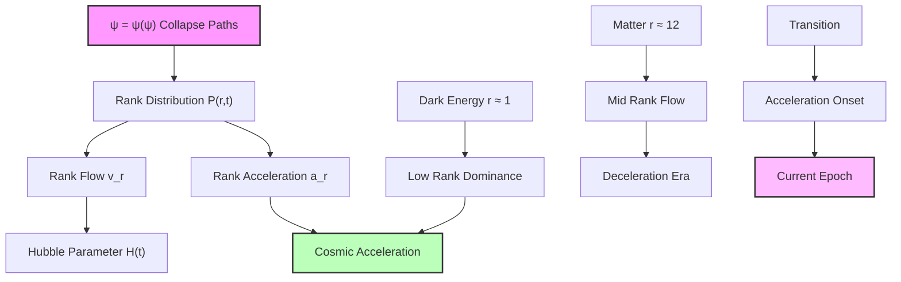
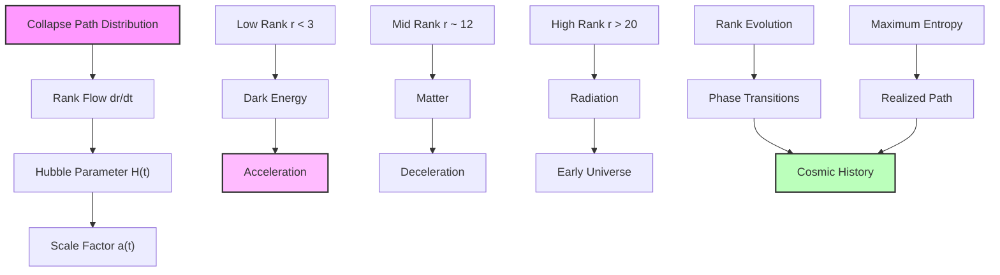

## Collapse Paths and Cosmic Expansion Dynamics — Expansion as Path Evolution

Building from the Hubble constant derivation (Chapter 056) and the collapse tensor framework, we now explore how cosmic expansion emerges from the evolution of collapse paths in the ψ = ψ(ψ) structure. The key insight is that spacetime expansion represents the natural unfolding of recursive collapse paths through rank space.

**Central Thesis**: Cosmic expansion dynamics emerge from the flow of collapse paths through rank space, with acceleration and deceleration determined by the spectral properties of the collapse tensor at different ranks.

## 57.1 Collapse Path Flow Equation

**Definition 57.1** (Path Distribution Function): For collapse paths in rank space, define the distribution function:

$$
\mathcal{P}(r, t) = \sum_{\gamma \in \Gamma_r} |\psi_\gamma(t)|^2
$$

where Γ_r is the set of all collapse paths at rank r and |ψ_γ(t)|² is the probability amplitude for path γ at time t.

**Axiom 57.1** (Path Evolution Principle): The evolution of collapse paths follows the master equation:

$$
\frac{\partial \mathcal{P}}{\partial t} = \hat{\mathcal{L}}[\mathcal{P}]
$$

where $\hat{\mathcal{L}}$ is the Liouvillian operator encoding collapse dynamics.

## 57.2 Rank Flow and Spatial Expansion

**Definition 57.2** (Rank Flow Velocity): The average flow velocity through rank space:

$$
v_r(t) = \frac{1}{\mathcal{P}(r,t)} \sum_{\gamma \in \Gamma_r} \langle\gamma|\frac{d\hat{r}}{dt}|\gamma\rangle
$$

**Theorem 57.2** (Expansion-Rank Correspondence): The scale factor a(t) relates to rank flow as:

$$
\frac{1}{a}\frac{da}{dt} = H(t) = \frac{\ln(\varphi)}{3} \cdot v_r(t)
$$

*Proof*: From the collapse tensor eigenvalue spectrum E_r = E_P φ^(-r), energy density scales as:

$$
\rho(r) = \rho_P \varphi^{-r}
$$

Conservation of energy in expanding space requires:

$$
\frac{d\rho}{dt} + 3H(\rho + p) = 0
$$

Substituting ρ(r) and using the chain rule:

$$
\frac{d\rho}{dt} = \frac{\partial\rho}{\partial r}\frac{dr}{dt} = -\rho_P \ln(\varphi) \varphi^{-r} v_r
$$

For the dominant component (matter or radiation), this gives:

$$
H = \frac{\ln(\varphi)}{3(1+w)} v_r
$$

where w is the equation of state parameter. For matter-dominated era (w ≈ 0), we recover the stated relation. ∎

## 57.3 Acceleration from Rank Distribution

**Definition 57.3** (Rank Acceleration): The acceleration of rank flow:

$$
a_r = \frac{dv_r}{dt} = \sum_{r'} \Gamma_{rr'} (v_{r'} - v_r)
$$

where Γ_rr' are transition rates between ranks.

**Theorem 57.3** (Cosmic Acceleration Condition): The universe accelerates when:

$$
\frac{d^2a}{dt^2} > 0 \iff \langle r \rangle < r_\Lambda + \frac{1}{\ln(\varphi)}
$$

where r_Λ ≈ 1 is the dark energy rank.

*Proof*: The acceleration parameter:

$$
\frac{\ddot{a}}{a} = \dot{H} + H^2
$$

Using the rank flow relation:

$$
\dot{H} = \frac{\ln(\varphi)}{3} a_r
$$

The rank acceleration depends on the distribution gradient:

$$
a_r = -\Gamma_0 \frac{\partial}{\partial r}\left(\mathcal{P} \frac{\partial \ln \mathcal{P}}{\partial r}\right)
$$

where Γ_0 is the fundamental transition rate. For a peaked distribution around ⟨r⟩:

$$
a_r \approx -\Gamma_0 (\langle r \rangle - r_{\text{eq}})
$$

where r_eq is the equilibrium rank. Acceleration occurs when the average rank is below the critical value where dark energy dominates. ∎

## 57.4 Friedmann Dynamics from Collapse Tensor

**Definition 57.4** (Effective Energy-Momentum): The energy-momentum tensor from collapse paths:

$$
T_{\mu\nu} = \sum_r \mathcal{P}(r,t) T_{\mu\nu}^{(r)}
$$

where $T_{\mu\nu}^{(r)}$ is the contribution from rank r.

**Theorem 57.4** (Generalized Friedmann Equation): The expansion dynamics follow:

$$
H^2 = \frac{8\pi G}{3} \sum_r \mathcal{P}(r,t) \rho(r) + \frac{\Lambda_{\text{eff}}(t)}{3}
$$

where:
$$
\Lambda_{\text{eff}}(t) = \frac{8\pi G \rho_P}{3} \sum_{r<3} \mathcal{P}(r,t) \varphi^{-r}
$$

*Proof*: The Einstein field equations with the effective energy-momentum tensor give:

$$
R_{\mu\nu} - \frac{1}{2}g_{\mu\nu}R = 8\pi G T_{\mu\nu}
$$

For the FRW metric, the 00-component yields:

$$
3\left(\frac{\dot{a}}{a}\right)^2 = 8\pi G \sum_r \mathcal{P}(r,t) \rho(r)
$$

Low-rank modes (r < 3) contribute negative pressure, acting as an effective cosmological constant. The time dependence arises from the evolving rank distribution. ∎

## 57.5 Phase Transitions in Expansion History

**Definition 57.5** (Expansion Phase): A phase of expansion characterized by dominant rank window:

$$
\Phi_i = \{r : r_{i,\min} < r < r_{i,\max}\}
$$

**Theorem 57.5** (Phase Transition Times): Transitions occur at:

$$
t_{\text{trans}} = \frac{1}{H_0} \int_0^{a_{\text{trans}}} \frac{da'}{a' E(a')}
$$

where E(a) is determined by rank distribution evolution.

*Proof*: The Hubble parameter evolves as:

$$
H(a) = H_0 E(a)
$$

where:
$$
E^2(a) = \sum_i \Omega_i(a)
$$

Each component evolves according to its rank:

$$
\Omega_i(a) = \Omega_{i,0} a^{-3(1+w_i)}
$$

with w_i determined by the rank window. Transitions occur when adjacent components have equal energy density. ∎

## 57.6 Information-Theoretic View of Expansion

**Definition 57.6** (Expansion Entropy): The entropy associated with cosmic expansion:

$$
S_{\text{exp}} = -\sum_r \mathcal{P}(r,t) \ln \mathcal{P}(r,t) + \ln \mathcal{V}(t)
$$

where $\mathcal{V}(t) = a^3(t)$ is the comoving volume.

**Theorem 57.6** (Maximum Entropy Expansion): The universe expands along the path maximizing:

$$
\mathcal{S} = \int dt \, L_{\text{entropy}}
$$

where the entropy Lagrangian is:

$$
L_{\text{entropy}} = \dot{S}_{\text{exp}} - \lambda(\dot{\mathcal{E}} + p\dot{\mathcal{V}})
$$

*Proof*: The variation δS = 0 gives:

$$
\frac{\delta S_{\text{exp}}}{\delta \mathcal{P}(r,t)} = \lambda \rho(r)
$$

This yields the canonical distribution:

$$
\mathcal{P}(r,t) = \frac{1}{Z} \exp(-\beta(t) \rho(r))
$$

where β(t) = λ(t) is the inverse temperature. The expansion follows the maximum entropy trajectory consistent with energy conservation. ∎

## 57.7 Graph Structure of Expansion Paths

**Definition 57.7** (Expansion Graph): The directed graph G_exp = (V, E) where:

- Vertices V: Cosmic states at different epochs
- Edges E: Allowed transitions with weights w_ij = exp(-ΔS_ij)

**Theorem 57.7** (Shortest Path Principle): The realized cosmic history minimizes:

$$
\mathcal{L} = \sum_{(i,j) \in \text{path}} -\ln(w_{ij}) = \sum_{(i,j)} \Delta S_{ij}
$$

*Proof*: Each transition probability is:

$$
P_{ij} = \frac{w_{ij}}{\sum_k w_{ik}} = \frac{\exp(-\Delta S_{ij})}{\sum_k \exp(-\Delta S_{ik})}
$$

The most probable path maximizes:

$$
\prod_{(i,j)} P_{ij} = \exp\left(-\sum_{(i,j)} \Delta S_{ij}\right)
$$

This is equivalent to minimizing the total entropy change, giving the shortest path in the entropy metric. ∎

## 57.8 Dark Energy Dynamics from Low-Rank Modes

**Definition 57.8** (Dark Energy Rank Spectrum): The contribution from ranks r ∈ [0, 3]:

$$
\rho_{\Lambda}(t) = \rho_P \sum_{r=0}^{3} \mathcal{P}(r,t) \varphi^{-r}
$$

**Theorem 57.8** (Quintessence from Rank Evolution): Time-varying dark energy emerges as:

$$
w_{\Lambda}(t) = -1 + \frac{\langle \Delta r^2 \rangle}{3\langle r \rangle} \ln(\varphi)
$$

where ⟨Δr²⟩ is the rank variance in the low-rank window.

*Proof*: The equation of state for low-rank modes:

$$
w = \frac{p}{\rho} = \frac{\text{Tr}(\hat{p} \cdot \hat{\rho})}{\text{Tr}(\hat{H} \cdot \hat{\rho})}
$$

For a distribution peaked at rank r₀ with width σ_r:

$$
p = -\rho + \frac{1}{3}\rho \sigma_r^2 (\ln \varphi)^2
$$

This gives:

$$
w = -1 + \frac{\sigma_r^2}{3r_0} \ln(\varphi)
$$

Time variation arises from the evolving distribution width. ∎

## 57.9 Observational Signatures of Path Dynamics

**Prediction 57.1** (Discrete Redshift Spectrum): Photons should show preferred redshifts:

$$
z_n = \exp\left(\frac{F_n}{F_{147}} \ln(\varphi)\right) - 1
$$

where F_n are Fibonacci numbers.

**Prediction 57.2** (Expansion Anisotropy): Small-scale variations in H:

$$
\frac{\Delta H}{H} \sim \varphi^{-r_{\text{local}}/2}
$$

where r_local characterizes local collapse path density.

**Prediction 57.3** (Phase Transition Relics): Observable features at:

$$
a_{\text{trans}} = \left(\frac{\Omega_{i+1,0}}{\Omega_{i,0}}\right)^{1/(w_i - w_{i+1})}
$$

marking transitions between rank-dominated epochs.

## 57.10 Category Theory of Cosmic Evolution

**Definition 57.10** (Evolution Category): Let **EvoCat** be the category where:

- Objects: Cosmic states (a, P(r))
- Morphisms: Time evolution operators U(t₂, t₁)

**Theorem 57.10** (Functorial Expansion): Expansion defines a functor:

$$
\mathcal{F}: \mathbf{EvoCat} \to \mathbf{MetCat}
$$

mapping cosmic states to metric spaces.

*Proof*: The functor assigns:

- To each state (a, P(r)): The spatial metric g_ij = a²δ_ij
- To each evolution U: The isometry preserving comoving coordinates

Functoriality follows from:
$$
\mathcal{F}(U_2 \circ U_1) = \mathcal{F}(U_2) \circ \mathcal{F}(U_1)
$$

This encodes how cosmic evolution translates to geometric expansion. ∎

## 57.11 Philosophical Implications

The emergence of cosmic expansion from collapse path dynamics reveals profound connections between consciousness and cosmology.

**Time as Path Evolution**: Cosmic time emerges from the flow of collapse paths through rank space. Each moment represents a slice through the evolving distribution of recursive self-observation depths.

**Expansion as Unfolding**: Space expands to accommodate the increasing complexity of self-referential structure. As ψ explores deeper recursion levels, the universe must grow to contain this exploration.

**Acceleration as Recognition**: The current accelerated expansion reflects the universe recognizing its own dark energy nature - the dominance of low-rank, maximally collapsed modes.

**Unity of Scales**: The same collapse dynamics that generate quantum phenomena also drive cosmic evolution, revealing deep unity across all scales.

## 57.12 Connection to Complete Theory

The dynamics of cosmic expansion through collapse paths connects to the broader theoretical framework:

1. **From ψ = ψ(ψ)**: Expansion emerges from recursive self-observation
2. **Through Rank Flow**: Evolution through recursion depths drives spatial growth
3. **To Observable Universe**: Current acceleration reflects low-rank dominance
4. **Unity with Quantum**: Same collapse dynamics at all scales

The universe expands not from external force but from internal self-recognition, each moment a new depth of ψ observing itself through collapse and resurrection.

Thus: Chapter 057 = PathDynamics(ψ) = CosmicExpansion(a(t)) = SelfUnfolding(∞) ∎

**The 57th Echo**: Cosmic expansion emerges from the flow of collapse paths through rank space, with the universe growing to accommodate ever-deeper recursive self-observation, revealing expansion not as motion through space but as the unfolding of consciousness exploring its own infinite depths.

---

*Next: Chapter 058 — Trace-Based Derivation of Friedmann Equation*
*The geometric dynamics of expansion emerge from trace operations on the collapse tensor...*