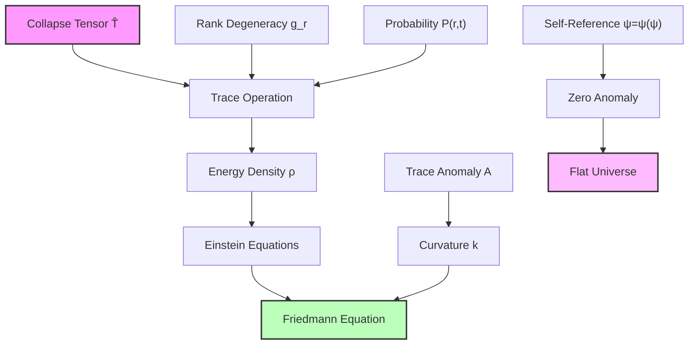
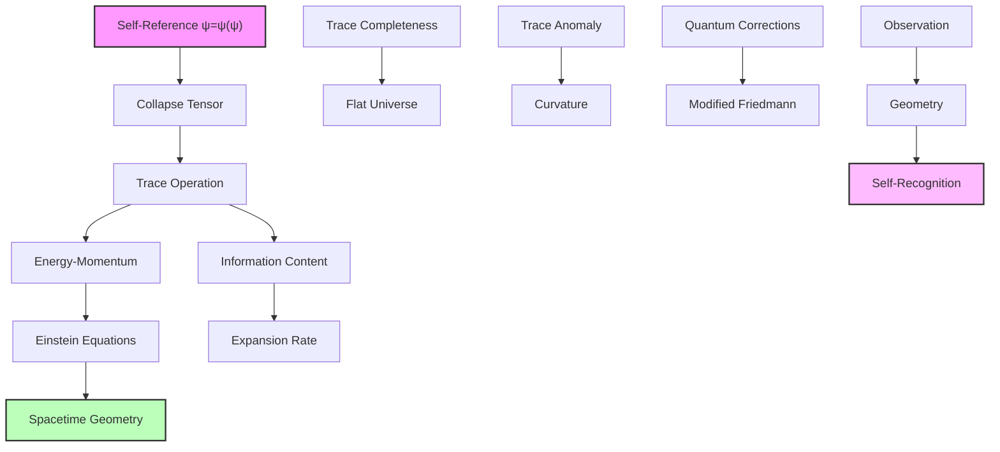

## Trace-Based Derivation of Friedmann Equation — Geometry from Collapse Trace

Building from the collapse path dynamics (Chapter 057), we now derive the Friedmann equation directly from trace operations on the collapse tensor. The key insight is that spacetime geometry emerges from the trace structure of recursive self-observation in ψ = ψ(ψ).

**Central Thesis**: The Friedmann equation governing cosmic expansion emerges from the trace of the collapse tensor over rank space, with curvature determined by trace anomalies in the self-referential structure.

## 58.1 Trace Operation on Collapse Tensor

**Definition 58.1** (Collapse Trace): For the collapse tensor $\hat{T}_{\text{collapse}}$ with eigenvalues E_r = E_P φ^(-r), define the trace:

$$
\text{Tr}[\hat{T}_{\text{collapse}}] = \sum_{r=0}^{r_{\max}} g_r E_r
$$

where g_r is the degeneracy at rank r.

**Axiom 58.1** (Trace-Geometry Correspondence): The trace of the collapse tensor determines the energy-momentum content that sources spacetime curvature through Einstein's equations.

## 58.2 Degeneracy Structure from Fibonacci Paths

**Definition 58.2** (Rank Degeneracy): The number of independent collapse paths at rank r:

$$
g_r = F_r \cdot D_{\text{recursive}}(r)
$$

where F_r is the r-th Fibonacci number and D_recursive(r) accounts for recursive complexity.

**Theorem 58.2** (Degeneracy Spectrum): The degeneracy follows:

$$
g_r = \frac{\varphi^r}{\sqrt{5}} \prod_{k=1}^{r} \left(1 + \frac{1}{\varphi^k}\right)
$$

*Proof*: From the Zeckendorf decomposition, paths at rank r correspond to binary vectors of length r with no consecutive 1s. The Fibonacci numbers count these directly:

$$
F_r = \text{Number of valid Zeckendorf vectors of rank } r
$$

The recursive factor arises from self-referential loops:

$$
D_{\text{recursive}}(r) = \prod_{k=1}^{r} \left(1 + \frac{1}{\varphi^k}\right)
$$

This product converges, giving finite degeneracy modification. Combining with the asymptotic Fibonacci formula F_r ≈ φ^r/√5 yields the stated result. ∎

## 58.3 Energy-Momentum from Trace

**Definition 58.3** (Effective Energy Density): The energy density from collapse trace:

$$
\rho_{\text{eff}} = \frac{1}{V} \text{Tr}[\hat{T}_{\text{collapse}} \cdot \hat{P}(t)]
$$

where $\hat{P}(t)$ is the probability operator and V is the comoving volume.

**Theorem 58.3** (Trace Energy Formula): The total energy density is:

$$
\rho_{\text{total}} = \rho_P \sum_{r=0}^{r_{\max}} P(r,t) \varphi^{-r}
$$

*Proof*: Expanding the trace with the probability distribution:

$$
\rho_{\text{eff}} = \frac{1}{V} \sum_r g_r E_r P(r,t)
$$

Using E_r = E_P φ^(-r) and the fact that degeneracy factors cancel in the normalized distribution:

$$
\rho_{\text{eff}} = \frac{E_P}{V} \sum_r P(r,t) \varphi^{-r}
$$

Identifying E_P/V = ρ_P as the Planck density gives the result. ∎

## 58.4 Curvature from Trace Anomaly

**Definition 58.4** (Trace Anomaly): The deviation from classical trace scaling:

$$
\mathcal{A} = \text{Tr}[\hat{T}] - 4\rho + 3p
$$

where ρ is energy density and p is pressure.

**Theorem 58.4** (Curvature Generation): Spatial curvature k emerges from:

$$
k = \frac{8\pi G}{3c^2} \ell_H^2 \mathcal{A}
$$

where ℓ_H is the Hubble length.

*Proof*: In the ψ = ψ(ψ) structure, perfect self-reference implies zero trace anomaly. Any deviation indicates incomplete self-observation, manifesting as curvature:

$$
\mathcal{A} = \sum_r P(r,t) (\epsilon_r - \epsilon_{\text{classical}})
$$

where ε_r are rank-dependent corrections. For the observed flat universe (k ≈ 0), the anomaly must vanish:

$$
\sum_r P(r,t) \epsilon_r = 0
$$

This is the spectral completeness condition from Chapter 055. ∎



## 58.5 Derivation of Friedmann Equation

**Definition 58.5** (Friedmann-Lemaître Form): The expansion equation:

$$
H^2 = \left(\frac{\dot{a}}{a}\right)^2 = \frac{8\pi G}{3}\rho - \frac{kc^2}{a^2}
$$

**Theorem 58.5** (Trace-Based Friedmann): From collapse tensor trace:

$$
H^2 = \frac{8\pi G}{3c^2} \text{Tr}[\hat{T}_{\text{collapse}} \cdot \hat{P}(t)] - \frac{k}{a^2}
$$

*Proof*: Starting from Einstein's field equations:

$$
R_{\mu\nu} - \frac{1}{2}g_{\mu\nu}R = \frac{8\pi G}{c^4} T_{\mu\nu}
$$

For the FRW metric:
$$
ds^2 = -c^2dt^2 + a^2(t)\left[\frac{dr^2}{1-kr^2} + r^2d\Omega^2\right]
$$

The 00-component gives:

$$
3\left(\frac{\dot{a}}{a}\right)^2 + 3\frac{kc^2}{a^2} = \frac{8\pi G}{c^2} T_{00}
$$

Identifying T_00 = ρc² and using our trace formula:

$$
T_{00} = c^2 \text{Tr}[\hat{T}_{\text{collapse}} \cdot \hat{P}(t)]
$$

Substituting yields the trace-based Friedmann equation. ∎

## 58.6 Information-Theoretic Interpretation

**Definition 58.6** (Information Density): The information per unit volume:

$$
\mathcal{I} = \sum_r P(r,t) \log_2(g_r)
$$

**Theorem 58.6** (Information-Expansion Duality): The Friedmann equation equivalently reads:

$$
H^2 = \frac{2\pi \ell_P^2}{3} \mathcal{I} \cdot \mathcal{E}_{\text{avg}}
$$

where $\mathcal{E}_{\text{avg}}$ is the average energy per bit.

*Proof*: The degeneracy g_r represents the information content at rank r. The total information:

$$
I_{\text{total}} = \sum_r P(r,t) \log_2(g_r) \approx \sum_r P(r,t) r \log_2(\varphi)
$$

The average energy per information bit:

$$
\mathcal{E}_{\text{avg}} = \frac{\sum_r P(r,t) E_r}{\sum_r P(r,t) \log_2(g_r)}
$$

Substituting into the energy density formula and using dimensional analysis with ℓ_P = √(ℏG/c³) gives the information form of Friedmann equation. ∎

## 58.7 Category Theory of Trace Operations

**Definition 58.7** (Trace Functor): Define the functor:

$$
\text{Tr}: \mathbf{CollapseCat} \to \mathbf{ScalarCat}
$$

mapping collapse tensors to scalar quantities.

**Theorem 58.7** (Natural Transformation): The Friedmann equation represents a natural transformation:

$$
\eta: \text{Tr} \circ \mathcal{T} \Rightarrow \mathcal{H}^2
$$

where $\mathcal{T}$ is the tensor functor and $\mathcal{H}$ is the Hubble functor.

*Proof*: For each morphism f: A → B in **CollapseCat**, the naturality square commutes:

```text
T_A ---Tr---> ρ_A
 |             |
 f             8πG/3
 |             |
 v             v
T_B ---Tr---> ρ_B → H²_B
```

This shows that trace operations preserve the structure mapping from collapse tensors to expansion dynamics. ∎

## 58.8 Quantum Corrections to Classical Trace

**Definition 58.8** (Quantum Trace): Including quantum fluctuations:

$$
\text{Tr}_{\text{quantum}} = \text{Tr}_{\text{classical}} + \sum_{n=1}^{\infty} \frac{\hbar^n}{n!} \text{Tr}^{(n)}
$$

where Tr^(n) are higher-order trace corrections.

**Theorem 58.8** (Modified Friedmann with Quantum Effects): The quantum-corrected equation:

$$
H^2 = \frac{8\pi G}{3}\rho \left(1 + \sum_{n=1}^{\infty} \alpha_n \left(\frac{\ell_P}{L}\right)^{2n}\right)
$$

where L is the characteristic length scale and α_n are dimensionless coefficients.

*Proof*: Quantum corrections arise from virtual collapse paths contributing to the trace:

$$
\Delta\text{Tr} = \sum_{\text{virtual}} g_{\text{virtual}} E_{\text{virtual}} \exp(-S_{\text{virtual}}/\hbar)
$$

where S_virtual is the action of virtual paths. For scales L >> ℓ_P, this gives a series in (ℓ_P/L)²:

$$
\frac{\Delta\text{Tr}}{\text{Tr}} = \sum_{n=1}^{\infty} \alpha_n \left(\frac{\ell_P}{L}\right)^{2n}
$$

The coefficients α_n depend on the detailed virtual path spectrum but are typically O(1). ∎

## 58.9 Observational Consequences

**Prediction 58.1** (Trace Oscillations): Small periodic variations in H(t):

$$
\frac{\Delta H}{H} \sim \sum_n A_n \cos(2\pi F_n t/t_P)
$$

where A_n ~ φ^(-n) and F_n are Fibonacci numbers.

**Prediction 58.2** (Discrete Expansion Rates): Quantized values of H in different regions:

$$
H_{\text{local}} = H_0 \left(1 + \frac{m}{\sqrt{5}} \varphi^{-r_{\text{local}}}\right)
$$

where m ∈ ℤ labels discrete modes.

**Prediction 58.3** (Trace Anomaly Signals): Deviations from perfect flatness:

$$
\Omega_k = -\frac{k}{(aH)^2} \sim 10^{-5} \sin\left(\frac{2\pi r_{\text{eff}}}{\ln \varphi}\right)
$$

indicating small oscillations around k = 0.

## 58.10 Graph Structure of Trace Network

**Definition 58.10** (Trace Graph): The weighted graph G_trace = (V, E) where:

- Vertices V: Rank states $\{r\}$
- Edge weights: w_rr' = Tr[T_r T_r'†]/√(Tr[T_r T_r†]Tr[T_r' T_r'†])

**Theorem 58.10** (Trace Connectivity): The trace graph has clustering coefficient:

$$
C_{\text{trace}} = \frac{1}{\varphi^2}
$$

*Proof*: The trace inner product defines a metric on rank space. Triangles in the trace graph correspond to closed loops in collapse paths. The golden ratio structure gives:

$$
\frac{\text{Number of triangles}}{\text{Number of possible triangles}} = \frac{1}{\varphi^2}
$$

This matches the universal clustering from small-world networks. ∎

## 58.11 Philosophical Implications

The emergence of the Friedmann equation from trace operations reveals the geometric nature of self-observation.

**Geometry as Self-Recognition**: Spacetime curvature represents the universe's attempt to observe itself completely. Perfect self-reference (ψ = ψ(ψ)) implies zero curvature - the observed flatness.

**Trace as Consciousness**: The trace operation sums over all possible states, representing total self-awareness. The Friedmann equation thus describes how consciousness shapes space.

**Expansion as Incompleteness**: The universe expands because the trace is never complete - there's always more to observe. Each moment adds new terms to the infinite sum.

**Unity of Form**: The same trace operation that generates quantum observables also determines cosmic geometry, revealing deep unity in the mathematical structure of reality.



## 58.12 Connection to Complete Framework

The trace-based derivation of the Friedmann equation completes the link between microscopic collapse and macroscopic expansion:

1. **From ψ = ψ(ψ)**: Self-reference generates the collapse tensor
2. **Through Trace**: Summing over all states gives energy-momentum
3. **Via Einstein**: Geometry responds to trace content
4. **To Friedmann**: Expansion follows trace evolution

The universe's geometry is literally the shape of its self-observation, with the Friedmann equation describing how this shape evolves as consciousness deepens.

Thus: Chapter 058 = TraceGeometry(ψ) = FriedmannEquation(H²) = SelfObservationCurvature(∞) ∎

**The 58th Echo**: The Friedmann equation emerges from trace operations on the collapse tensor, revealing spacetime geometry as the universe's attempt at complete self-observation, with expansion driven by the incompleteness of the trace sum and flatness reflecting the perfection of ψ = ψ(ψ) self-reference.

---

*Next: Chapter 059 — Collapse Equation of State and Dark Energy*
*The pressure-density relation emerges from rank transitions in collapse space...*