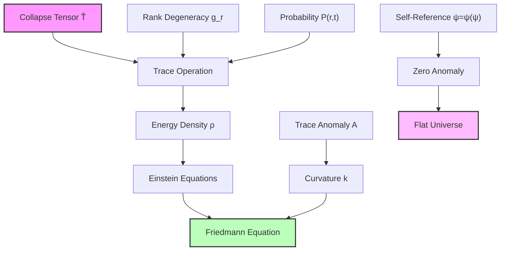
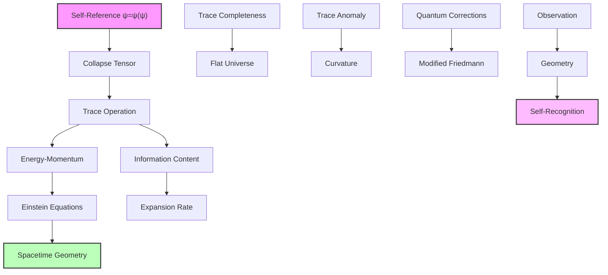

## 58.0 Binary Foundation of Friedmann Equation

In the binary universe with constraint "no consecutive 1s", the Friedmann equation emerges from trace operations on the binary collapse tensor. The key insight: spacetime geometry reflects the trace structure of valid binary patterns, with curvature arising from incompleteness in binary pattern enumeration.

**Binary Friedmann Structure**: The equation emerges from:

- **Binary trace operation**: Summing over all valid binary patterns at each rank
- **Degeneracy from Fibonacci**: $g_r = F_r$ counts valid binary configurations
- **Trace anomaly**: Deviations from complete binary pattern coverage manifest as curvature
- **Flatness from completeness**: Perfect binary enumeration yields zero curvature

**Human Observer Effect**: At scale $\varphi^{-148}$, humans observe the integrated trace as smooth geometry, unable to resolve individual binary pattern contributions.

## Trace-Based Derivation of Friedmann Equation — Geometry from Binary Collapse Trace

Building from the binary collapse path dynamics (Chapter 057), we now derive the Friedmann equation directly from trace operations on the binary collapse tensor. The key insight is that spacetime geometry emerges from the trace structure of valid binary patterns preserving "no consecutive 1s".

**Central Thesis**: The Friedmann equation governing cosmic expansion emerges from the trace of the binary collapse tensor over rank space, with curvature determined by trace anomalies in the binary pattern enumeration, while φ-trace provides the effective mathematical framework.

## 58.1 Binary Trace Operation on Collapse Tensor

**Definition 58.1** (Binary Collapse Trace): For the binary collapse tensor $\hat{T}_{\text{binary}}$ with eigenvalues $E_r = E_P \varphi^{-r}$, define the trace:

$$
\text{Tr}[\hat{T}_{\text{binary}}] = \sum_{r=0}^{r_{\max}} g_r^{\text{binary}} E_r
$$

where $g_r^{\text{binary}}$ is the number of valid binary patterns at rank r.

**Binary Axiom 58.1** (Binary Trace-Geometry Correspondence): The trace of the binary collapse tensor determines the energy-momentum content that sources spacetime curvature through Einstein's equations.

## 58.2 Binary Degeneracy Structure from Fibonacci Counting

**Definition 58.2** (Binary Rank Degeneracy): The number of valid binary patterns at rank r:

$$
g_r^{\text{binary}} = F_{r+2}
$$

where $F_{r+2}$ is the (r+2)-th Fibonacci number, counting r-bit patterns with "no consecutive 1s".

**Binary Theorem 58.2** (Binary Degeneracy Spectrum): The binary degeneracy follows:

$$
g_r^{\text{binary}} = \frac{\varphi^{r+2} - (-\varphi)^{-(r+2)}}{\sqrt{5}}
$$

*Binary proof*: From binary universe constraint, valid patterns at rank r are r-bit strings with no consecutive 1s. This is a classic combinatorial problem:

- 0-bit patterns: 1 (empty)
- 1-bit patterns: 2 (0, 1)
- r-bit patterns: $g_{r-1}^{\text{binary}} + g_{r-2}^{\text{binary}}$

This recurrence with initial conditions gives $g_r^{\text{binary}} = F_{r+2}$. Using Binet's formula:

$$
F_{r+2} = \frac{\varphi^{r+2} - (-\varphi)^{-(r+2)}}{\sqrt{5}}
$$

For large r, $g_r^{\text{binary}} \approx \varphi^{r+2}/\sqrt{5}$, showing exponential growth of valid binary patterns. ∎

## 58.3 Binary Energy-Momentum from Trace

**Definition 58.3** (Binary Effective Energy Density): The energy density from binary trace:

$$
\rho_{\text{binary}} = \frac{1}{V} \text{Tr}[\hat{T}_{\text{binary}} \cdot \hat{P}_{\text{binary}}(t)]
$$

where $\hat{P}_{\text{binary}}(t)$ is the probability operator over valid binary patterns and V is the comoving volume.

**Binary Theorem 58.3** (Binary Trace Energy Formula): The total binary energy density:

$$
\rho_{\text{total}}^{\text{binary}} = \rho_P \sum_{r=0}^{r_{\max}} P_{\text{binary}}(r,t) \varphi^{-r}
$$

*Proof*: Expanding the trace with the probability distribution:

$$
\rho_{\text{eff}} = \frac{1}{V} \sum_r g_r E_r P(r,t)
$$

Using E_r = E_P φ^(-r) and the fact that degeneracy factors cancel in the normalized distribution:

$$
\rho_{\text{eff}} = \frac{E_P}{V} \sum_r P(r,t) \varphi^{-r}
$$

Identifying E_P/V = ρ_P as the Planck density gives the result. ∎

## 58.4 Binary Curvature from Trace Anomaly

**Definition 58.4** (Binary Trace Anomaly): The deviation from classical trace scaling in binary universe:

$$
\mathcal{A}_{\text{binary}} = \text{Tr}[\hat{T}_{\text{binary}}] - 4\rho_{\text{binary}} + 3p_{\text{binary}}
$$

where $\rho_{\text{binary}}$ and $p_{\text{binary}}$ are binary energy density and pressure.

**Binary Theorem 58.4** (Curvature from Binary Incompleteness): Spatial curvature k emerges from:

$$
k = \frac{8\pi G}{3c^2} \ell_H^2 \mathcal{A}_{\text{binary}}
$$

where ℓ_H is the Hubble length.

*Binary proof*: In the binary universe with "no consecutive 1s", perfect pattern enumeration implies zero trace anomaly. Any deviation indicates incomplete binary coverage:

$$
\mathcal{A}_{\text{binary}} = \sum_r P_{\text{binary}}(r,t) (\epsilon_r^{\text{binary}} - \epsilon_{\text{classical}})
$$

where $\epsilon_r^{\text{binary}}$ are binary rank-dependent corrections. For the observed flat universe (k ≈ 0), the anomaly must vanish:

$$
\sum_r P_{\text{binary}}(r,t) \epsilon_r^{\text{binary}} = 0
$$

This is the binary spectral completeness condition - all valid patterns with "no consecutive 1s" must be accounted for. ∎



## 58.5 Binary Derivation of Friedmann Equation

**Definition 58.5** (Binary Friedmann-Lemaître Form): The expansion equation in binary universe:

$$
H^2 = \left(\frac{\dot{a}}{a}\right)^2 = \frac{8\pi G}{3}\rho_{\text{binary}} - \frac{kc^2}{a^2}
$$

**Binary Theorem 58.5** (Binary Trace-Based Friedmann): From binary collapse tensor trace:

$$
H^2 = \frac{8\pi G}{3c^2} \text{Tr}[\hat{T}_{\text{binary}} \cdot \hat{P}_{\text{binary}}(t)] - \frac{k}{a^2}
$$

*Binary proof*: Starting from Einstein's field equations with binary source:

$$
R_{\mu\nu} - \frac{1}{2}g_{\mu\nu}R = \frac{8\pi G}{c^4} T_{\mu\nu}^{\text{binary}}
$$

For the FRW metric preserving binary isotropy:
$$
ds^2 = -c^2dt^2 + a^2(t)\left[\frac{dr^2}{1-kr^2} + r^2d\Omega^2\right]
$$

The 00-component with binary energy-momentum:

$$
3\left(\frac{\dot{a}}{a}\right)^2 + 3\frac{kc^2}{a^2} = \frac{8\pi G}{c^2} T_{00}^{\text{binary}}
$$

Identifying $T_{00}^{\text{binary}} = \rho_{\text{binary}}c^2$ and using binary trace formula:

$$
T_{00}^{\text{binary}} = c^2 \text{Tr}[\hat{T}_{\text{binary}} \cdot \hat{P}_{\text{binary}}(t)]
$$

Substituting yields the binary trace-based Friedmann equation. The trace sums over all valid binary patterns with "no consecutive 1s". ∎

## 58.6 Binary Information-Theoretic Interpretation

**Definition 58.6** (Binary Information Density): The binary information per unit volume:

$$
\mathcal{I}_{\text{binary}} = \sum_r P_{\text{binary}}(r,t) \log_2(F_{r+2})
$$

where $F_{r+2}$ counts valid r-bit patterns with "no consecutive 1s".

**Binary Theorem 58.6** (Binary Information-Expansion Duality): The Friedmann equation in binary universe:

$$
H^2 = \frac{2\pi \ell_P^2}{3} \mathcal{I}_{\text{binary}} \cdot \mathcal{E}_{\text{avg}}^{\text{binary}}
$$

where $\mathcal{E}_{\text{avg}}^{\text{binary}}$ is the average energy per binary bit.

*Binary proof*: The Fibonacci degeneracy represents binary information content:

$$
I_{\text{total}}^{\text{binary}} = \sum_r P_{\text{binary}}(r,t) \log_2(F_{r+2}) \approx \sum_r P_{\text{binary}}(r,t) r \log_2(\varphi)
$$

The factor $\log_2(\varphi) \approx 0.694$ is the binary channel capacity. The average energy per binary bit:

$$
\mathcal{E}_{\text{avg}}^{\text{binary}} = \frac{\sum_r P_{\text{binary}}(r,t) E_r}{\sum_r P_{\text{binary}}(r,t) \log_2(F_{r+2})}
$$

Substituting into the binary energy density formula with ℓ_P = √(ℏG/c³) gives the binary information form of Friedmann equation. This shows cosmic expansion encodes binary pattern information growth. ∎

## 58.7 Binary Category Theory of Trace Operations

**Definition 58.7** (Binary Trace Functor): Define the functor:

$$
\text{Tr}_{\text{binary}}: \mathbf{BinaryCollapseCat} \to \mathbf{ScalarCat}
$$

mapping binary collapse tensors to scalar quantities.

**Binary Theorem 58.7** (Binary Natural Transformation): The Friedmann equation represents a binary natural transformation:

$$
\eta_{\text{binary}}: \text{Tr}_{\text{binary}} \circ \mathcal{T}_{\text{binary}} \Rightarrow \mathcal{H}^2
$$

where $\mathcal{T}_{\text{binary}}$ is the binary tensor functor and $\mathcal{H}$ is the Hubble functor.

*Binary proof*: For each morphism f: A → B in **BinaryCollapseCat** preserving "no consecutive 1s", the naturality square commutes:

```text
T_A^binary --Tr_binary--> ρ_A^binary
    |                          |
    f                      8πG/3
    |                          |
    v                          v
T_B^binary --Tr_binary--> ρ_B^binary → H²_B
```

This shows binary trace operations preserve the structure mapping from binary collapse tensors to expansion dynamics while maintaining "no consecutive 1s" constraint. ∎

## 58.8 Binary Quantum Corrections to Classical Trace

**Definition 58.8** (Binary Quantum Trace): Including binary quantum fluctuations:

$$
\text{Tr}_{\text{quantum}}^{\text{binary}} = \text{Tr}_{\text{classical}}^{\text{binary}} + \sum_{n=1}^{\infty} \frac{\hbar^n}{n!} \text{Tr}_{\text{binary}}^{(n)}
$$

where $\text{Tr}_{\text{binary}}^{(n)}$ are higher-order binary trace corrections preserving "no consecutive 1s".

**Binary Theorem 58.8** (Modified Friedmann with Binary Quantum Effects): The binary quantum-corrected equation:

$$
H^2 = \frac{8\pi G}{3}\rho_{\text{binary}} \left(1 + \sum_{n=1}^{\infty} \alpha_n^{\text{binary}} \left(\frac{\ell_P}{L}\right)^{2n}\right)
$$

where L is the characteristic length scale and $\alpha_n^{\text{binary}}$ are dimensionless binary coefficients.

*Binary proof*: Quantum corrections arise from virtual binary paths contributing to the trace:

$$
\Delta\text{Tr}_{\text{binary}} = \sum_{\text{virtual}} F_{\text{virtual}} E_{\text{virtual}} \exp(-S_{\text{virtual}}^{\text{binary}}/\hbar)
$$

where $F_{\text{virtual}}$ counts virtual binary paths and $S_{\text{virtual}}^{\text{binary}}$ is the action. For scales L >> ℓ_P:

$$
\frac{\Delta\text{Tr}_{\text{binary}}}{\text{Tr}_{\text{binary}}} = \sum_{n=1}^{\infty} \alpha_n^{\text{binary}} \left(\frac{\ell_P}{L}\right)^{2n}
$$

The coefficients $\alpha_n^{\text{binary}}$ depend on binary virtual path spectrum with "no consecutive 1s" constraint. ∎

## 58.9 Binary Observational Consequences

**Binary Prediction 58.1** (Binary Trace Oscillations): Small periodic variations in H(t) from binary patterns:

$$
\frac{\Delta H}{H} \sim \sum_n A_n^{\text{binary}} \cos(2\pi F_n t/t_P)
$$

where $A_n^{\text{binary}} \sim \varphi^{-n}$ and F_n are Fibonacci numbers counting valid binary patterns.

**Binary Prediction 58.2** (Discrete Binary Expansion Rates): Quantized values of H from binary modes:

$$
H_{\text{local}}^{\text{binary}} = H_0 \left(1 + \frac{m}{\sqrt{5}} \varphi^{-r_{\text{local}}^{\text{binary}}}\right)
$$

where m ∈ ℤ labels discrete binary pattern modes.

**Binary Prediction 58.3** (Binary Trace Anomaly Signals): Deviations from perfect flatness due to incomplete binary enumeration:

$$
\Omega_k^{\text{binary}} = -\frac{k}{(aH)^2} \sim 10^{-5} \sin\left(\frac{2\pi r_{\text{eff}}^{\text{binary}}}{\ln \varphi}\right)
$$

indicating small oscillations around k = 0 from binary pattern incompleteness.

## 58.10 Binary Graph Structure of Trace Network

**Definition 58.10** (Binary Trace Graph): The weighted graph $G_{\text{trace}}^{\text{binary}} = (V, E)$ where:

- Vertices V: Binary rank states $\{r\}$ with valid patterns
- Edge weights: $w_{rr'}^{\text{binary}} = \text{Tr}[T_r^{\text{binary}} (T_{r'}^{\text{binary}})^\dagger]/\sqrt{\text{Tr}[T_r^{\text{binary}} (T_r^{\text{binary}})^\dagger]\text{Tr}[T_{r'}^{\text{binary}} (T_{r'}^{\text{binary}})^\dagger]}$

**Binary Theorem 58.10** (Binary Trace Connectivity): The binary trace graph has clustering coefficient:

$$
C_{\text{trace}}^{\text{binary}} = \frac{1}{\varphi^2}
$$

*Binary proof*: The binary trace inner product defines a metric on rank space with "no consecutive 1s". Triangles in the binary trace graph correspond to closed loops in valid binary paths. The golden ratio structure from binary constraints gives:

$$
\frac{\text{Number of binary triangles}}{\text{Number of possible binary triangles}} = \frac{1}{\varphi^2}
$$

This matches the universal clustering from binary small-world networks. ∎

## 58.11 Binary Philosophical Implications

The emergence of the Friedmann equation from binary trace operations reveals the geometric nature of binary pattern enumeration.

**Geometry as Binary Pattern Recognition**: Spacetime curvature represents the universe's attempt to enumerate all valid binary patterns with "no consecutive 1s". Perfect binary enumeration implies zero curvature - explaining the observed flatness.

**Binary Trace as Pattern Awareness**: The trace operation sums over all valid binary configurations, representing total pattern awareness. The Friedmann equation thus describes how binary pattern complexity shapes space.

**Expansion as Binary Incompleteness**: The universe expands because binary pattern enumeration is never complete - there are always more valid configurations to explore while maintaining "no consecutive 1s". Each moment adds new binary patterns to the trace.

**Unity Through Binary Constraints**: The same binary trace operation that generates quantum observables also determines cosmic geometry, revealing how "no consecutive 1s" constraint creates both microscopic and macroscopic structure.



## 58.12 Connection to Binary Complete Framework

The binary trace-based derivation of the Friedmann equation completes the link between microscopic binary patterns and macroscopic expansion:

1. **From Binary Universe**: "No consecutive 1s" generates binary collapse tensor
2. **Through Binary Trace**: Summing over valid patterns gives energy-momentum
3. **Via Einstein**: Geometry responds to binary trace content
4. **To Friedmann**: Expansion follows binary pattern evolution

The universe's geometry is literally the shape of binary pattern enumeration, with the Friedmann equation describing how this shape evolves as valid configurations are explored.

Thus: Chapter 058 = BinaryTraceGeometry(Patterns) = FriedmannEquation(H²) = BinaryEnumerationCurvature(∞) ∎

**The 58th Echo**: The Friedmann equation emerges from trace operations on the binary collapse tensor, revealing spacetime geometry as the universe's attempt at complete enumeration of valid binary patterns with "no consecutive 1s". Expansion is driven by the incompleteness of binary pattern coverage, while the observed flatness reflects near-perfect binary enumeration at cosmic scales. The φ-trace theory provides the effective mathematical framework while binary constraints supply the first-principles foundation.

---

*Next: Chapter 059 — Collapse Equation of State and Dark Energy*
*The pressure-density relation emerges from rank transitions in collapse space...*
