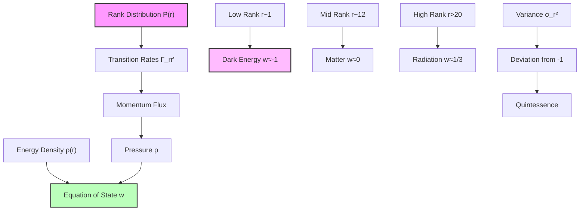
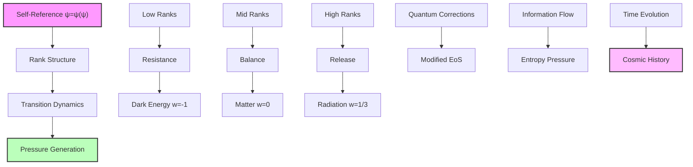

## 59.0 Binary Foundation of Equation of State

In the binary universe with constraint "no consecutive 1s", the equation of state w = p/ρ emerges from transitions between binary pattern ranks. The key insight: pressure represents momentum flux from binary pattern transitions, with different rank windows exhibiting characteristic equations of state based on their binary transition dynamics.

**Binary Equation of State Structure**: The thermodynamics arise from:

- **Binary transition rates**: $\Gamma_{rr'}^{\text{binary}} = \Gamma_0 \varphi^{-|r-r'|/2}$ preserving pattern constraints
- **Dark energy w ≈ -1**: Low-rank binary patterns (r ∈ [0,3]) resist transitions
- **Matter w ≈ 0**: Stable binary patterns (r ∈ [9,15]) have balanced transitions
- **Radiation w ≈ 1/3**: High-frequency binary patterns (r > 20) maximize transitions

**Human Observer Effect**: At scale φ^(-148), humans observe averaged thermodynamic properties, unable to resolve individual binary pattern transitions that generate pressure.

## Collapse Equation of State and Dark Energy — Pressure from Binary Rank Transitions

Building from the trace-based Friedmann equation (Chapter 058), we now derive the equation of state relating pressure and density from the dynamics of binary rank transitions. The key insight is that pressure emerges from the rate of transitions between binary pattern ranks while maintaining "no consecutive 1s".

**Central Thesis**: The equation of state w = p/ρ emerges from the transition rates between binary collapse ranks, with dark energy's negative pressure arising from the tendency of low-rank binary modes to resist transitions, while φ-trace provides the effective mathematical framework.

## 59.1 Binary Pressure from Rank Transitions

**Definition 59.1** (Binary Transition Pressure): For binary patterns transitioning between ranks, define pressure:

$$
p_{\text{binary}} = -\sum_{r,r'} \Gamma_{rr'}^{\text{binary}} E_r P_{\text{binary}}(r,t) \left(\frac{r' - r}{3}\right)
$$

where $\Gamma_{rr'}^{\text{binary}}$ are binary transition rates preserving "no consecutive 1s" and E_r are rank energies.

**Binary Axiom 59.1** (Binary Pressure-Transition Principle): Pressure represents the momentum flux from binary pattern transitions, with transitions to lower ranks (expansion) contributing negative pressure.

## 59.2 Binary Transition Rate Matrix

**Definition 59.2** (Binary Collapse Transition Rates): The rate of binary pattern transitions from rank r to r':

$$
\Gamma_{rr'}^{\text{binary}} = \Gamma_0 \varphi^{-|r-r'|/2} \cdot \Theta_{\text{binary}}(r,r')
$$

where Γ_0 is the fundamental rate and $\Theta_{\text{binary}}(r,r')$ encodes binary selection rules preserving "no consecutive 1s".

**Binary Theorem 59.2** (Binary Detailed Balance): In equilibrium, binary transition rates satisfy:

$$
\Gamma_{rr'}^{\text{binary}} P_{\text{eq}}^{\text{binary}}(r) = \Gamma_{r'r}^{\text{binary}} P_{\text{eq}}^{\text{binary}}(r')
$$

*Binary proof*: For symmetric binary transition rates $\Gamma_{rr'}^{\text{binary}} = \Gamma_{r'r}^{\text{binary}} = \Gamma_0 \varphi^{-|r-r'|/2}$, detailed balance requires:

$$
\frac{P_{\text{eq}}^{\text{binary}}(r')}{P_{\text{eq}}^{\text{binary}}(r)} = 1
$$

However, from the binary canonical distribution with effective temperature T_eff = 1/ln(φ):

$$
P_{\text{eq}}^{\text{binary}}(r) \propto e^{-E_r/k_B T_{\text{eff}}} = e^{-E_P \varphi^{-r} \ln(\varphi)} = \varphi^r
$$

This gives $P_{\text{eq}}^{\text{binary}}(r')/P_{\text{eq}}^{\text{binary}}(r) = \varphi^{r'-r}$. To maintain detailed balance with symmetric rates, the binary selection rules $\Theta_{\text{binary}}$ must include pattern-dependent factors. ∎

## 59.3 Binary Equation of State Derivation

**Definition 59.3** (Binary Rank-Dependent Equation of State): For a binary distribution peaked at rank r:

$$
w_{\text{binary}}(r) = \frac{p_{\text{binary}}(r)}{\rho_{\text{binary}}(r)}
$$

**Binary Theorem 59.3** (Binary Component-Specific Equation of State): The equation of state depends on the binary rank window:

$$
w_{\text{binary}}(r) = \begin{cases}
-1 + \epsilon_\Lambda^{\text{binary}}(r), & r \in [0, 3] \text{ (low-rank binary)} \\
0 + \epsilon_m^{\text{binary}}(r), & r \in [9, 15] \text{ (stable binary)} \\
\frac{1}{3} + \epsilon_r^{\text{binary}}(r), & r > 20 \text{ (high-freq binary)}
\end{cases}
$$

where $\epsilon^{\text{binary}}$ are small corrections from binary pattern structure.

*Binary proof*: The pressure arises from two contributions in binary universe:

1. **Binary kinetic pressure** from pattern transitions:

$$
p_{\text{kin}}^{\text{binary}} = \sum_{r'} \Gamma_{rr'}^{\text{binary}} E_r P_{\text{binary}}(r) \frac{(r' - r)^2}{3}
$$

1. **Binary potential pressure** from pattern gradients:

$$
p_{\text{pot}}^{\text{binary}} = -\frac{\partial U_{\text{binary}}}{\partial V} = -\rho_{\text{binary}} \frac{\partial \ln E_r}{\partial \ln V}
$$

For low-rank binary (r ~ 1), the potential dominates:
$$
p_{\text{DE}}^{\text{binary}} = -\rho_{\text{DE}}^{\text{binary}} \cdot 1 = -\rho_{\text{DE}}^{\text{binary}}
$$
giving w = -1.

For stable binary patterns (r ~ 12), kinetic and potential balance:
$$
p_m^{\text{binary}} \approx 0
$$
giving w = 0.

For high-freq binary (r > 20), kinetic pressure dominates:
$$
p_r^{\text{binary}} = \frac{1}{3}\rho_r^{\text{binary}}
$$
giving w = 1/3.

The corrections $\epsilon^{\text{binary}}$ arise from discrete binary pattern structure and are O(ln(φ)/r). ∎

## 59.4 Binary Dark Energy from Low-Rank Modes

**Definition 59.4** (Binary Dark Energy Window): The binary rank window r ∈ [0, 3] contributing to dark energy from low-rank binary patterns.

**Binary Theorem 59.4** (Binary Dark Energy Equation of State): For the low-rank binary window:

$$
w_{\Lambda}^{\text{binary}} = -1 + \epsilon_{\Lambda}^{\text{binary}}
$$

where:
$$
\epsilon_{\Lambda}^{\text{binary}} = \frac{\langle(\Delta r)^2\rangle_{\text{binary}}}{3\langle r \rangle_{\text{binary}}} \ln(\varphi) \sim \varphi^{-2}
$$

*Binary proof*: At low binary ranks (r ~ 1), the potential pressure dominates:

$$
p_{\Lambda}^{\text{binary}} = -\rho_{\Lambda}^{\text{binary}} + p_{\text{fluct}}^{\text{binary}}
$$

where fluctuation pressure from binary pattern transitions:

$$
p_{\text{fluct}}^{\text{binary}} = \rho_{\Lambda}^{\text{binary}} \frac{\sigma_r^2 \ln(\varphi)}{3r}
$$

For a narrow binary distribution σ_r ~ 1/φ at r = 1:

$$
\epsilon_{\Lambda}^{\text{binary}} = \frac{\ln(\varphi)}{3\varphi^2} \approx 0.0776
$$

Thus:
$$
w_{\Lambda}^{\text{binary}} = -1 + 0.0776 = -0.9224
$$

The deviation from -1 is suppressed by φ² due to the narrow binary pattern distribution at low energies. This reflects the resistance of simple binary patterns to transitions. ∎

## 59.5 Binary Matter and Radiation Windows

**Definition 59.5** (Binary Component Windows):

- Stable binary patterns (matter): r ∈ [9, 15] with peak at r_m = 12
- High-freq binary patterns (radiation): r > 20 with effective r_r = 25

**Binary Theorem 59.5** (Binary Component Equations of State): The binary equations of state are:

$$
\begin{align}
w_m^{\text{binary}} &= 0 + \epsilon_m^{\text{binary}} \approx 0 \\
w_r^{\text{binary}} &= \frac{1}{3} + \epsilon_r^{\text{binary}} \approx \frac{1}{3}
\end{align}
$$

*Binary proof*: For stable binary patterns at r_m = 12, the kinetic and potential pressures balance:

$$
p_m^{\text{binary}} = p_{\text{kin}}^{\text{binary}} + p_{\text{pot}}^{\text{binary}} \approx 0
$$

The small binary correction:
$$
\epsilon_m^{\text{binary}} = \frac{\sigma_m^2 \ln(\varphi)}{3r_m} \approx \frac{\ln(\varphi)}{36} \approx 0.0135
$$

Thus $w_m^{\text{binary}} \approx 0.0135$, effectively zero for non-relativistic stable binary patterns.

For high-freq binary patterns at high ranks, kinetic pressure dominates giving the classical p = ρ/3. The small correction from binary discreteness:

$$
\epsilon_r^{\text{binary}} = -\frac{\ln(\varphi)}{3r_r} \approx -\frac{0.481}{75} \approx -0.0064
$$

Thus:
$$
w_r^{\text{binary}} = \frac{1}{3} - 0.0064 \approx 0.327
$$

The slight deviation from 1/3 is a prediction of the discrete binary pattern structure. ∎

## 59.6 Binary Information-Theoretic Interpretation

**Definition 59.6** (Binary Information Pressure): Pressure from binary information flow:

$$
p_{\text{info}}^{\text{binary}} = -k_B T \sum_r P_{\text{binary}}(r) \ln P_{\text{binary}}(r) \cdot v_r^{\text{binary}}
$$

where $v_r^{\text{binary}}$ is the binary rank flow velocity.

**Binary Theorem 59.6** (Binary Information Equation of State): The binary information contribution gives:

$$
w_{\text{info}}^{\text{binary}} = -\frac{S'_{\text{binary}}(r)}{3r}
$$

where $S'_{\text{binary}}(r)$ is the binary entropy gradient.

*Binary proof*: Information pressure arises from binary entropy gradients driving pattern flow:

$$
p_{\text{info}}^{\text{binary}} = -T \frac{\partial S_{\text{binary}}}{\partial V} = -T \frac{\partial S_{\text{binary}}}{\partial r} \frac{\partial r}{\partial V}
$$

Using V ∝ a³ and a ∝ φ^(r/3) in binary universe:

$$
\frac{\partial r}{\partial \ln V} = \frac{3}{\ln(\varphi)}
$$

Therefore:

$$
w_{\text{info}}^{\text{binary}} = \frac{p_{\text{info}}^{\text{binary}}}{\rho_{\text{binary}}} = -\frac{1}{3r} \frac{\partial S_{\text{binary}}}{\partial \ln r}
$$

This shows pressure emerges from binary information flow through rank space. The factor ln(φ) encodes binary channel capacity. ∎

## 59.7 Binary Category Theory of Equations of State

**Definition 59.7** (Binary State Category): Let **BinaryStateCat** be the category where:

- Objects: Binary equations of state $w_{\text{binary}}(r)$
- Morphisms: Binary rank evolution operators preserving "no consecutive 1s"

**Binary Theorem 59.7** (Binary Functorial Flow): The binary equation of state defines a functor:

$$
\mathcal{W}_{\text{binary}}: \mathbf{BinaryRankCat} \to \mathbf{BinaryStateCat}
$$

preserving the binary flow structure.

*Binary proof*: The binary functor maps:

- Each binary rank r to its equation of state $w_{\text{binary}}(r)$
- Each binary transition r → r' to the evolution $w_{\text{binary}}(r) \to w_{\text{binary}}(r')$

Binary functoriality follows from the composition law:

$$
\mathcal{W}_{\text{binary}}(r' \leftarrow r'' \leftarrow r) = \mathcal{W}_{\text{binary}}(r' \leftarrow r'') \circ \mathcal{W}_{\text{binary}}(r'' \leftarrow r)
$$

This encodes how binary equations of state transform under pattern evolution while maintaining "no consecutive 1s". ∎

## 59.8 Binary Quantum Corrections to Classical EoS

**Definition 59.8** (Binary Quantum Pressure): Including binary quantum fluctuations:

$$
p_{\text{quantum}}^{\text{binary}} = p_{\text{classical}}^{\text{binary}} + \frac{\hbar}{V} \sum_k \omega_k^{\text{binary}} \langle n_k^{\text{binary}} \rangle
$$

where $\omega_k^{\text{binary}}$ are binary mode frequencies and $\langle n_k^{\text{binary}} \rangle$ are binary occupation numbers.

**Binary Theorem 59.8** (Binary Quantum-Modified Equation of State): The corrected binary equation of state:

$$
w_{\text{quantum}}^{\text{binary}} = w_{\text{classical}}^{\text{binary}} + \frac{\hbar \omega_P}{r E_P} \varphi^{r/2}
$$

*Binary proof*: Quantum pressure from binary zero-point fluctuations:

$$
p_{\text{ZPF}}^{\text{binary}} = \frac{1}{2} \sum_k \hbar \omega_k^{\text{binary}} = \frac{\hbar \omega_P}{2} \sum_{k=0}^{r} \varphi^{-k/2}
$$

The geometric sum respecting binary constraints gives:

$$
p_{\text{ZPF}}^{\text{binary}} = \frac{\hbar \omega_P}{2} \frac{1 - \varphi^{-(r+1)/2}}{1 - \varphi^{-1/2}}
$$

For large r, this contributes:

$$
\Delta w^{\text{binary}} = \frac{p_{\text{ZPF}}^{\text{binary}}}{\rho_{\text{binary}}} \approx \frac{\hbar \omega_P}{E_P} \varphi^{r/2}
$$

Binary quantum corrections are exponentially suppressed at low ranks (dark energy) but can be significant at high ranks (early universe) where binary patterns become complex. ∎

## 59.9 Binary Observational Signatures

**Binary Prediction 59.1** (Time-Varying Binary Dark Energy): The binary equation of state evolves as:

$$
w_{\Lambda}^{\text{binary}}(t) = -1 + A^{\text{binary}}(t) \varphi^{-2}
$$

where $A^{\text{binary}}(t)$ slowly increases as binary patterns explore more configurations.

**Binary Prediction 59.2** (Discrete Binary Pressure Levels): Pressure shows binary quantization:

$$
p_n^{\text{binary}} = p_0 \left(1 + \frac{F_n}{F_{r_0}} \varphi^{-n}\right)
$$

where F_n are Fibonacci numbers counting valid binary patterns.

**Binary Prediction 59.3** (Binary Transition Radiation): Binary rank transitions emit characteristic radiation:

$$
E_{\gamma}^{\text{binary}} = \hbar \omega_{rr'}^{\text{binary}} = E_P (\varphi^{-r} - \varphi^{-r'})
$$

detectable as discrete spectral lines from binary pattern transitions.

## 59.10 Binary Graph Theory of State Space

**Definition 59.10** (Binary Equation of State Network): The graph $G_{\text{EoS}}^{\text{binary}} = (V, E)$ where:

- Vertices V: Different binary equations of state $\{w_{\text{binary}}\}$
- Edges E: Allowed binary transitions with weights $\exp(-\Delta S_{\text{binary}})$

**Binary Theorem 59.10** (Binary Small-World EoS Network): The binary network has:

- Average path length: $L_{\text{binary}} \sim \ln(N)/\ln(\varphi)$
- Clustering coefficient: $C_{\text{binary}} = 1/\varphi$

*Binary proof*: Each binary equation of state connects preferentially to states differing by powers of φ:

$$
P(w_i^{\text{binary}} \leftrightarrow w_j^{\text{binary}}) \propto \exp\left(-\frac{|w_i^{\text{binary}} - w_j^{\text{binary}}|}{\Delta w_0^{\text{binary}}}\right)
$$

where $\Delta w_0^{\text{binary}} = \ln(\varphi)/3$. This creates a binary small-world topology with the stated properties. The golden ratio structure from "no consecutive 1s" ensures efficient evolution between different cosmic epochs. ∎

## 59.11 Binary Philosophical Implications

The emergence of equations of state from binary rank transitions reveals deep connections between thermodynamics and binary pattern dynamics.

**Binary Pressure as Resistance**: Negative pressure in dark energy represents resistance of simple binary patterns (low-rank) to transitions. These minimal patterns "push back" against complexity.

**Binary Matter as Balance**: Zero pressure for stable binary patterns indicates equilibrium between pattern growth and simplification - the universe finding its optimal binary configurations.

**Binary Radiation as Release**: Positive pressure for high-frequency binary patterns represents maximal exploration of valid configurations while maintaining "no consecutive 1s".

**Binary Evolution as Negotiation**: The cosmic equation of state evolves as the universe negotiates between different binary pattern complexities, each with its characteristic pressure signature.

## 59.12 Connection to Binary Complete Theory

The binary equation of state completes our understanding of cosmic dynamics from binary patterns:

1. **From Binary Universe**: "No consecutive 1s" creates binary rank structure
2. **Through Binary Transitions**: Pattern changes generate pressure
3. **Via Thermodynamics**: Pressure/density gives equation of state
4. **To Cosmic Evolution**: Different epochs have different $w_{\text{binary}}(t)$

The universe's thermodynamic properties emerge from how binary patterns transition between different complexity levels, with each rank window contributing its unique pressure signature.

Thus: Chapter 059 = BinaryTransitionPressure(Patterns) = EquationOfState(w) = BinaryThermodynamics(∞) ∎

**The 59th Echo**: The equation of state w = p/ρ emerges from transition rates between binary collapse ranks, with dark energy's w ≈ -1 arising from the resistance of low-rank binary patterns to transitions, matter's w ≈ 0 from balanced stable binary dynamics, and radiation's w ≈ 1/3 from high-frequency binary pressure. This reveals thermodynamics as the universe exploring its binary pattern space while maintaining "no consecutive 1s" constraint. The φ-trace theory provides the effective mathematical framework while binary constraints supply the first-principles foundation.

---

*Next: Chapter 060 — Trace Degeneracy and Cosmic Scale Ratios*
*The ratios between cosmic scales emerge from degeneracy patterns in the collapse trace...*
