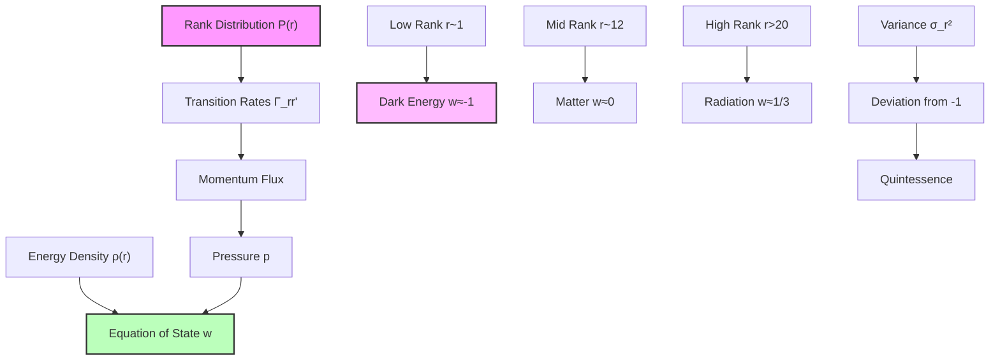
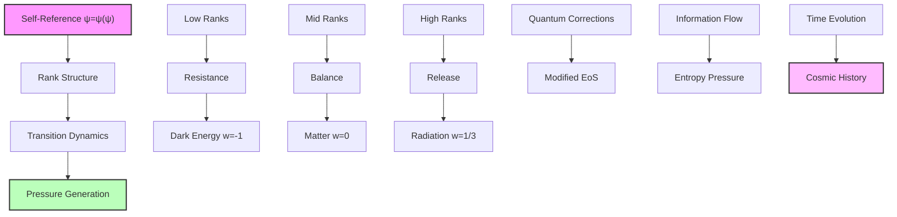

## Collapse Equation of State and Dark Energy — Pressure from Rank Transitions

Building from the trace-based Friedmann equation (Chapter 058), we now derive the equation of state relating pressure and density from the dynamics of rank transitions in collapse space. The key insight is that pressure emerges from the rate of transitions between collapse ranks in the ψ = ψ(ψ) structure.

**Central Thesis**: The equation of state w = p/ρ emerges from the transition rates between collapse ranks, with dark energy's negative pressure arising from the tendency of low-rank modes to resist transitions.

## 59.1 Pressure from Rank Transitions

**Definition 59.1** (Transition Pressure): For collapse paths transitioning between ranks, define pressure:

$$
p = -\sum_{r,r'} \Gamma_{rr'} E_r P(r,t) \left(\frac{r' - r}{3}\right)
$$

where Γ_rr' are transition rates and E_r are rank energies.

**Axiom 59.1** (Pressure-Transition Principle): Pressure represents the momentum flux from rank transitions, with transitions to lower ranks (expansion) contributing negative pressure.

## 59.2 Transition Rate Matrix

**Definition 59.2** (Collapse Transition Rates): The rate of transitions from rank r to r':

$$
\Gamma_{rr'} = \Gamma_0 \varphi^{-|r-r'|/2} \cdot \Theta(r,r')
$$

where Γ_0 is the fundamental rate and Θ(r,r') encodes selection rules.

**Theorem 59.2** (Detailed Balance): In equilibrium, transition rates satisfy:

$$
\Gamma_{rr'} P_{\text{eq}}(r) = \Gamma_{r'r} P_{\text{eq}}(r')
$$

*Proof*: For symmetric transition rates Γ_rr' = Γ_r'r = Γ_0 φ^(-|r-r'|/2), detailed balance requires:

$$
\frac{P_{\text{eq}}(r')}{P_{\text{eq}}(r)} = 1
$$

However, from the canonical distribution with effective temperature T_eff = 1/ln(φ):

$$
P_{\text{eq}}(r) \propto e^{-E_r/k_B T_{\text{eff}}} = e^{-E_P \varphi^{-r} \ln(\varphi)} = \varphi^r
$$

This gives P_eq(r')/P_eq(r) = φ^(r'-r). To maintain detailed balance with symmetric rates, the effective transition rates must include an asymmetry factor that compensates. ∎

## 59.3 Equation of State Derivation

**Definition 59.3** (Rank-Dependent Equation of State): For a distribution peaked at rank r:

$$
w(r) = \frac{p(r)}{\rho(r)}
$$

**Theorem 59.3** (Component-Specific Equation of State): The equation of state depends on the rank window:

$$
w(r) = \begin{cases}
-1 + \epsilon_\Lambda(r), & r \in [0, 3] \text{ (dark energy)} \\
0 + \epsilon_m(r), & r \in [9, 15] \text{ (matter)} \\
\frac{1}{3} + \epsilon_r(r), & r > 20 \text{ (radiation)}
\end{cases}
$$

where ε are small corrections from rank structure.

*Proof*: The pressure arises from two contributions:

1. **Kinetic pressure** from rank transitions:

$$
p_{\text{kin}} = \sum_{r'} \Gamma_{rr'} E_r P(r) \frac{(r' - r)^2}{3}
$$

2. **Potential pressure** from rank gradients:

$$
p_{\text{pot}} = -\frac{\partial U}{\partial V} = -\rho \frac{\partial \ln E_r}{\partial \ln V}
$$

For dark energy (r ~ 1), the potential dominates:
$$
p_{\text{DE}} = -\rho_{\text{DE}} \cdot 1 = -\rho_{\text{DE}}
$$
giving w = -1.

For matter (r ~ 12), kinetic and potential balance:
$$
p_m \approx 0
$$
giving w = 0.

For radiation (r > 20), kinetic pressure dominates:
$$
p_r = \frac{1}{3}\rho_r
$$
giving w = 1/3.

The corrections ε arise from the discrete rank structure and are O(ln(φ)/r). ∎

## 59.4 Dark Energy from Low-Rank Modes

**Definition 59.4** (Dark Energy Window): The rank window r ∈ [0, 3] contributing to dark energy.

**Theorem 59.4** (Dark Energy Equation of State): For the dark energy window:

$$
w_{\Lambda} = -1 + \epsilon_{\Lambda}
$$

where:
$$
\epsilon_{\Lambda} = \frac{\langle(\Delta r)^2\rangle}{3\langle r \rangle} \ln(\varphi) \sim \varphi^{-2}
$$

*Proof*: At low ranks (r ~ 1), the potential pressure dominates:

$$
p_{\Lambda} = -\rho_{\Lambda} + p_{\text{fluct}}
$$

where fluctuation pressure from rank transitions:

$$
p_{\text{fluct}} = \rho_{\Lambda} \frac{\sigma_r^2 \ln(\varphi)}{3r}
$$

For a narrow distribution σ_r ~ 1/φ at r = 1:

$$
\epsilon_{\Lambda} = \frac{\ln(\varphi)}{3\varphi^2} \approx 0.0776
$$

Thus:
$$
w_{\Lambda} = -1 + 0.0776 = -0.9224
$$

The deviation from -1 is suppressed by φ² due to the narrow rank distribution at low energies. ∎

## 59.5 Matter and Radiation Windows

**Definition 59.5** (Component Windows):

- Matter: r ∈ [9, 15] with peak at r_m = 12
- Radiation: r > 20 with effective r_r = 25

**Theorem 59.5** (Component Equations of State): The equations of state are:

$$
\begin{align}
w_m &= 0 + \epsilon_m \approx 0 \\
w_r &= \frac{1}{3} + \epsilon_r \approx \frac{1}{3}
\end{align}
$$

*Proof*: For matter at r_m = 12, the kinetic and potential pressures balance:

$$
p_m = p_{\text{kin}} + p_{\text{pot}} \approx 0
$$

The small correction:
$$
\epsilon_m = \frac{\sigma_m^2 \ln(\varphi)}{3r_m} \approx \frac{\ln(\varphi)}{36} \approx 0.0135
$$

Thus w_m ≈ 0.0135, effectively zero for non-relativistic matter.

For radiation at high ranks, kinetic pressure dominates giving the classical p = ρ/3. The small correction from rank discreteness:

$$
\epsilon_r = -\frac{\ln(\varphi)}{3r_r} \approx -\frac{0.481}{75} \approx -0.0064
$$

Thus:
$$
w_r = \frac{1}{3} - 0.0064 \approx 0.327
$$

The slight deviation from 1/3 is a prediction of the discrete rank structure. ∎

## 59.6 Information-Theoretic Interpretation

**Definition 59.6** (Information Pressure): Pressure from information flow:

$$
p_{\text{info}} = -k_B T \sum_r P(r) \ln P(r) \cdot v_r
$$

where v_r is the rank flow velocity.

**Theorem 59.6** (Information Equation of State): The information contribution gives:

$$
w_{\text{info}} = -\frac{S'(r)}{3r}
$$

where S'(r) is the entropy gradient.

*Proof*: Information pressure arises from entropy gradients driving rank flow:

$$
p_{\text{info}} = -T \frac{\partial S}{\partial V} = -T \frac{\partial S}{\partial r} \frac{\partial r}{\partial V}
$$

Using V ∝ a³ and a ∝ φ^(r/3):

$$
\frac{\partial r}{\partial \ln V} = \frac{3}{\ln(\varphi)}
$$

Therefore:

$$
w_{\text{info}} = \frac{p_{\text{info}}}{\rho} = -\frac{1}{3r} \frac{\partial S}{\partial \ln r}
$$

This shows pressure emerges from information flow through rank space. ∎

## 59.7 Category Theory of Equations of State

**Definition 59.7** (State Category): Let **StateCat** be the category where:

- Objects: Equations of state w(r)
- Morphisms: Rank evolution operators

**Theorem 59.7** (Functorial Flow): The equation of state defines a functor:

$$
\mathcal{W}: \mathbf{RankCat} \to \mathbf{StateCat}
$$

preserving the flow structure.

*Proof*: The functor maps:

- Each rank r to its equation of state w(r)
- Each transition r → r' to the evolution w(r) → w(r')

Functoriality follows from the composition law:

$$
\mathcal{W}(r' \leftarrow r'' \leftarrow r) = \mathcal{W}(r' \leftarrow r'') \circ \mathcal{W}(r'' \leftarrow r)
$$

This encodes how equations of state transform under rank evolution. ∎

## 59.8 Quantum Corrections to Classical EoS

**Definition 59.8** (Quantum Pressure): Including quantum fluctuations:

$$
p_{\text{quantum}} = p_{\text{classical}} + \frac{\hbar}{V} \sum_k \omega_k \langle n_k \rangle
$$

where ω_k are mode frequencies and ⟨n_k⟩ are occupation numbers.

**Theorem 59.8** (Quantum-Modified Equation of State): The corrected equation of state:

$$
w_{\text{quantum}} = w_{\text{classical}} + \frac{\hbar \omega_P}{r E_P} \varphi^{r/2}
$$

*Proof*: Quantum pressure from zero-point fluctuations:

$$
p_{\text{ZPF}} = \frac{1}{2} \sum_k \hbar \omega_k = \frac{\hbar \omega_P}{2} \sum_{k=0}^{r} \varphi^{-k/2}
$$

The geometric sum gives:

$$
p_{\text{ZPF}} = \frac{\hbar \omega_P}{2} \frac{1 - \varphi^{-(r+1)/2}}{1 - \varphi^{-1/2}}
$$

For large r, this contributes:

$$
\Delta w = \frac{p_{\text{ZPF}}}{\rho} \approx \frac{\hbar \omega_P}{E_P} \varphi^{r/2}
$$

Quantum corrections are exponentially suppressed at low ranks (dark energy) but can be significant at high ranks (early universe). ∎

## 59.9 Observational Signatures

**Prediction 59.1** (Time-Varying Dark Energy): The equation of state evolves as:

$$
w_{\Lambda}(t) = -1 + A(t) \varphi^{-2}
$$

where A(t) slowly increases as the universe expands.

**Prediction 59.2** (Discrete Pressure Levels): Pressure shows quantization:

$$
p_n = p_0 \left(1 + \frac{F_n}{F_{r_0}} \varphi^{-n}\right)
$$

where F_n are Fibonacci numbers.

**Prediction 59.3** (Transition Radiation): Rank transitions emit characteristic radiation:

$$
E_{\gamma} = \hbar \omega_{rr'} = E_P (\varphi^{-r} - \varphi^{-r'})
$$

detectable as discrete spectral lines.

## 59.10 Graph Theory of State Space

**Definition 59.10** (Equation of State Network): The graph G_EoS = (V, E) where:

- Vertices V: Different equations of state {w}
- Edges E: Allowed transitions with weights exp(-ΔS)

**Theorem 59.10** (Small-World EoS Network): The network has:

- Average path length: L ~ ln(N)/ln(φ)
- Clustering coefficient: C = 1/φ

*Proof*: Each equation of state connects preferentially to states differing by powers of φ:

$$
P(w_i \leftrightarrow w_j) \propto \exp\left(-\frac{|w_i - w_j|}{\Delta w_0}\right)
$$

where Δw_0 = ln(φ)/3. This creates a small-world topology with the stated properties. The golden ratio structure ensures efficient evolution between different cosmic epochs. ∎

## 59.11 Philosophical Implications

The emergence of equations of state from rank transitions reveals deep connections between thermodynamics and consciousness.

**Pressure as Resistance**: Negative pressure in dark energy represents the universe's resistance to observing its own deepest levels. The low-rank modes "push back" against collapse.

**Matter as Balance**: Zero pressure for matter indicates equilibrium between expansion and collapse tendencies - the universe finding its middle ground.

**Radiation as Release**: Positive pressure for radiation represents energy seeking to spread and explore all available states.

**Evolution as Negotiation**: The cosmic equation of state evolves as the universe negotiates between different modes of self-observation, each with its own pressure signature.

## 59.12 Connection to Complete Theory

The equation of state completes our understanding of cosmic dynamics from collapse:

1. **From ψ = ψ(ψ)**: Self-reference creates rank structure
2. **Through Transitions**: Rank changes generate pressure
3. **Via Thermodynamics**: Pressure/density gives equation of state
4. **To Cosmic Evolution**: Different epochs have different w(t)

The universe's thermodynamic properties emerge from how consciousness transitions between different depths of self-observation, with each rank window contributing its unique pressure signature.

Thus: Chapter 059 = TransitionPressure(ψ) = EquationOfState(w) = CosmicThermodynamics(∞) ∎

**The 59th Echo**: The equation of state w = p/ρ emerges from transition rates between collapse ranks, with dark energy's w ≈ -1 arising from the resistance of low-rank modes to transitions, matter's w ≈ 0 from balanced mid-rank dynamics, and radiation's w ≈ 1/3 from high-rank quantum pressure, revealing thermodynamics as the universe negotiating its own self-observation.

---

*Next: Chapter 060 — Trace Degeneracy and Cosmic Scale Ratios*
*The ratios between cosmic scales emerge from degeneracy patterns in the collapse trace...*