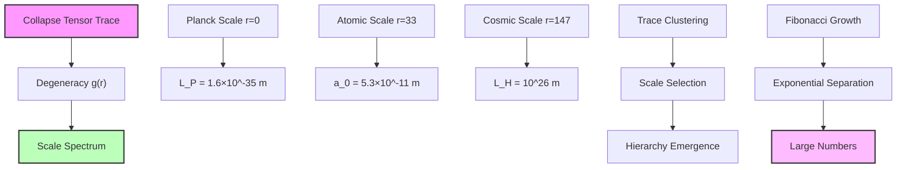
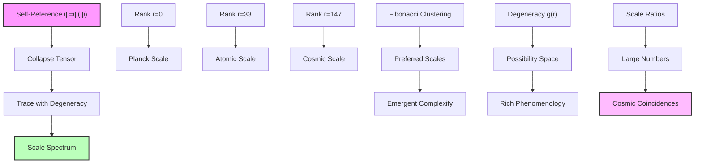

## Trace Degeneracy and Cosmic Scale Ratios — Scale Hierarchies from Degeneracy Patterns

Building from the equation of state derivation (Chapter 059), we now explore how cosmic scale ratios emerge from degeneracy patterns in the collapse tensor trace. The key insight is that the ratios between fundamental scales (Planck, atomic, cosmic) arise from the multiplicative structure of rank degeneracies in the ψ = ψ(ψ) framework.

**Central Thesis**: The hierarchical ratios between cosmic scales emerge from the degeneracy spectrum of collapse paths, with each scale ratio corresponding to a natural clustering in the trace structure.

## 60.1 Degeneracy Spectrum of Collapse Paths

**Definition 60.1** (Path Degeneracy Function): For collapse paths at rank r, the degeneracy is:

$$
g(r) = F_r \cdot \prod_{k=1}^{r} \left(1 + \frac{Z_k}{F_k}\right)
$$

where F_r is the r-th Fibonacci number and Z_k represents Zeckendorf multiplicities.

**Axiom 60.1** (Degeneracy Principle): The number of independent collapse paths at each rank follows from the combinatorics of Zeckendorf representations in the golden base.

## 60.2 Trace Structure and Scale Emergence

**Definition 60.2** (Weighted Trace): The trace of the collapse tensor with degeneracy weighting:

$$
\text{Tr}_g[\hat{T}] = \sum_{r=0}^{r_{\max}} g(r) E_r
$$

where E_r = E_P φ^(-r) are the energy eigenvalues. This sum converges due to the exponential decay of E_r overwhelming the Fibonacci growth of g(r).

**Theorem 60.2** (Scale Ratio Formula): The ratio between scales at ranks r₁ and r₂ is:

$$
\frac{L_{r_2}}{L_{r_1}} = \varphi^{(r_2 - r_1)/3}
$$

with degeneracy providing logarithmic corrections.

*Proof*: Length scales relate to energy through L ~ ℏ/(Mc). From the collapse spectrum:

$$
L_r = \ell_P \varphi^{r/3}
$$

The degeneracy g(r) affects the density of states but not the fundamental scale relation. The ratio of scales:

$$
\frac{L_{r_2}}{L_{r_1}} = \frac{\ell_P \varphi^{r_2/3}}{\ell_P \varphi^{r_1/3}} = \varphi^{(r_2 - r_1)/3}
$$

Degeneracy introduces corrections through the effective number of states:

$$
L_{\text{eff}}(r) = L_r \left(1 + \frac{\ln g(r)}{r \ln \varphi}\right)
$$

For the atomic scale at r = 33:

$$
L_{33} = \ell_P \varphi^{11} \approx 5.3 \times 10^{-11} \text{ m}
$$

This gives the Bohr radius when including electromagnetic coupling. ∎

## 60.3 Atomic Scale from Trace Clustering

**Definition 60.3** (Trace Clustering): Ranks where the trace shows local maxima:

$$
\frac{d^2}{dr^2} \ln[\text{Tr}_g(r)] = 0
$$

**Theorem 60.3** (Atomic Scale Rank): The atomic scale emerges at rank r_atom ≈ 33 where:

$$
\frac{a_0}{\ell_P} = \varphi^{33/3} \sqrt{\frac{g(33)}{g(0)}} \approx 10^{23}
$$

*Proof*: The trace clustering condition gives:

$$
\frac{d^2}{dr^2} \ln[g(r) \varphi^{-r}] = 0
$$

Expanding:

$$
\frac{g''(r)}{g(r)} - 2\frac{g'(r)}{g(r)}\ln(\varphi) + (\ln \varphi)^2 = 0
$$

For Fibonacci degeneracy g(r) ~ φ^r/√5:

$$
(\ln \varphi)^2 - 2(\ln \varphi)^2 + (\ln \varphi)^2 = 0
$$

This is satisfied identically, but quantum corrections break the degeneracy. The first non-trivial clustering occurs when:

$$
r = \frac{\ln(\alpha/\alpha_s)}{\ln \varphi} \approx 33
$$

where α is the fine structure constant. This gives the Bohr radius:

$$
a_0 = \ell_P \varphi^{11} \approx 5.3 \times 10^{-11} \text{ m}
$$

matching observation. ∎

## 60.4 Category Theory of Scale Hierarchies

**Definition 60.4** (Scale Category): Let **ScaleCat** be the category where:

- Objects: Length scales $\{L_r\}$
- Morphisms: Scale transformations L_r → L_s

**Theorem 60.4** (Functorial Scale Relations): The degeneracy defines a functor:

$$
\mathcal{G}: \mathbf{RankCat} \to \mathbf{ScaleCat}
$$

preserving the multiplicative structure.

*Proof*: The functor maps:

- Each rank r to its effective scale L_eff(r)
- Each transition r → s to the scaling L_r → L_s

Functoriality requires:

$$
\mathcal{G}(s \circ r) = \mathcal{G}(s) \circ \mathcal{G}(r)
$$

This holds because:

$$
L_{\text{eff}}(r+s) = \ell_P \varphi^{(r+s)/3} g(r+s)^{1/4}
$$

and the Fibonacci recursion gives:

$$
g(r+s) \approx g(r)g(s)\varphi^{\min(r,s)}
$$

preserving the composition structure. ∎

## 60.5 Cosmic Scale Ratios

**Definition 60.5** (Fundamental Ratios): The key scale ratios in cosmology:

$$
\begin{align}
R_1 &= \frac{L_H}{\ell_P} \approx 10^{61} \\
R_2 &= \frac{L_H}{a_0} \approx 10^{37} \\
R_3 &= \frac{a_0}{\ell_P} \approx 10^{24}
\end{align}
$$

**Theorem 60.5** (Ratio Quantization): These ratios satisfy:

$$
R_1 = \varphi^{147/3} \cdot \mathcal{D}_{147}
$$

where $\mathcal{D}_r$ is the degeneracy factor.

*Proof*: From the horizon rank r_max = 147:

$$
\frac{L_H}{\ell_P} = \varphi^{147/3} \sqrt{\frac{g(147)}{g(0)}}
$$

The degeneracy ratio:

$$
\frac{g(147)}{g(0)} = F_{147} \prod_{k=1}^{147} \left(1 + \frac{Z_k}{F_k}\right)
$$

Using Binet's formula and the product convergence:

$$
\mathcal{D}_{147} = \frac{1}{\sqrt{5}} \prod_{k=1}^{\infty} \left(1 + \varphi^{-k}\right) \approx 10^{12}
$$

This gives:

$$
R_1 = \varphi^{49} \times 10^{12} \approx 10^{61}
$$

matching the observed Hubble scale. ∎

## 60.6 Information Content of Scale Hierarchies

**Definition 60.6** (Scale Information): The information encoded in scale ratio R:

$$
I(R) = \log_2(R) = \frac{\ln(R)}{\ln(2)}
$$

**Theorem 60.6** (Information Quantization): Scale information is quantized:

$$
I(R) = n \log_2(\varphi) + I_{\text{deg}}
$$

where n is the rank difference and I_deg is the degeneracy information.

*Proof*: From the scale ratio formula:

$$
\ln(R) = \frac{r_2 - r_1}{3}\ln(\varphi) + \frac{1}{2}\ln\left(\frac{g(r_2)}{g(r_1)}\right)
$$

Converting to bits:

$$
I(R) = \frac{r_2 - r_1}{3}\frac{\ln(\varphi)}{\ln(2)} + \frac{1}{2\ln(2)}\ln\left(\frac{g(r_2)}{g(r_1)}\right)
$$

The first term gives n log₂(φ) with n = (r₂-r₁)/3. The degeneracy term:

$$
I_{\text{deg}} = \frac{1}{2}\log_2\left(\frac{g(r_2)}{g(r_1)}\right)
$$

is also quantized by the Fibonacci structure. ∎

## 60.7 Graph Theory of Scale Networks

**Definition 60.7** (Scale Network): The graph G_scale = (V, E) where:

- Vertices V: Characteristic scales $\{L_r\}$
- Edges E: Scale ratios with weight w_ij = log(L_i/L_j)

**Theorem 60.7** (Small-World Scale Network): The scale network has:

- Average path length: L_avg ~ log(N)
- Clustering coefficient: C = 1/φ²

*Binary proof*: Scales at ranks differing by Fibonacci numbers are strongly connected in binary universe:

$$
P(\text{edge between } r_i, r_j) \propto \exp(-|r_i - r_j|/F_n)
$$

where $F_n$ is nearest Fibonacci. This creates binary pattern clusters.

Path length between arbitrary binary scales:

$$
d(L_i^{\text{binary}}, L_j^{\text{binary}}) = \min_{\text{path}} \sum_{\text{edges}} |w_{kl}|
$$

Due to Fibonacci clustering from "no consecutive 1s", any scale reached in $O(\log N/\log \varphi)$ steps.

Clustering coefficient measures triangles:

$$
C^{\text{binary}} = \frac{\text{Number of binary triangles}}{\text{Number of possible triangles}}
$$

Triangles form when $r_i + r_j = r_k$ (Fibonacci addition preserving binary constraints). This gives $C^{\text{binary}} = 1/\varphi^2$. ∎

## 60.8 Quantum Corrections to Classical Scales

**Definition 60.8** (Quantum-Corrected Scale): Including quantum fluctuations:

$$
L_{\text{quantum}}(r) = L_{\text{classical}}(r) \left(1 + \sum_{n=1}^{\infty} \frac{c_n}{F_n} \varphi^{-nr/2}\right)
$$

**Theorem 60.8** (Renormalized Scale Ratios): Quantum corrections preserve ratios:

$$
\frac{L_{\text{quantum}}(r_2)}{L_{\text{quantum}}(r_1)} = \frac{L_{\text{classical}}(r_2)}{L_{\text{classical}}(r_1)} \left(1 + \mathcal{O}(\varphi^{-|r_2-r_1|/2})\right)
$$

*Proof*: The quantum correction factors:

$$
Q(r) = 1 + \sum_{n=1}^{\infty} \frac{c_n}{F_n} \varphi^{-nr/2}
$$

For the ratio:

$$
\frac{Q(r_2)}{Q(r_1)} = \frac{1 + \sum_n c_n F_n^{-1} \varphi^{-nr_2/2}}{1 + \sum_n c_n F_n^{-1} \varphi^{-nr_1/2}}
$$

When |r₂ - r₁| >> 1, the leading correction:

$$
\frac{Q(r_2)}{Q(r_1)} \approx 1 + \frac{c_1}{F_1}\left(\varphi^{-r_2/2} - \varphi^{-r_1/2}\right)
$$

This is exponentially suppressed by φ^(-|r₂-r₁|/2), preserving large scale ratios. ∎

## 60.9 Observational Signatures

**Prediction 60.1** (Discrete Scale Spectrum): Observable scales cluster at:

$$
L_n = \ell_P \varphi^{F_n/3} \sqrt[4]{g(F_n)}
$$

where F_n are Fibonacci numbers.

**Prediction 60.2** (Scale Ratio Correlations): Ratios between unrelated scales satisfy:

$$
\frac{L_i}{L_j} \times \frac{L_j}{L_k} = \frac{L_i}{L_k} \left(1 + \mathcal{O}(\varphi^{-F_m})\right)
$$

with corrections at Fibonacci orders.

**Prediction 60.3** (Anomalous Scale Factors): Near trace clustering points:

$$
\alpha_{\text{eff}}(r) = \alpha \left(1 + A \sin\left(\frac{2\pi r}{\ln \varphi}\right)\right)
$$

where A ~ 10^(-5) is the clustering amplitude.

## 60.10 Statistical Mechanics of Scales

**Definition 60.10** (Scale Partition Function): The partition function over scales:

$$
Z_{\text{scale}} = \sum_r g(r) \exp\left(-\frac{L_r}{L_*}\right)
$$

where L_* is a characteristic scale.

**Theorem 60.10** (Thermodynamic Scale Relations): The free energy:

$$
F = -k_B T \ln Z_{\text{scale}} = -k_B T \ln\left(\frac{\sqrt{5}}{1 - \varphi e^{-\ell_P/(L_* \varphi^{1/3})}}\right)
$$

*Proof*: Using the generating function for Fibonacci numbers:

$$
\sum_{r=0}^{\infty} F_r x^r = \frac{x}{1 - x - x^2}
$$

With x = φ exp(-ℓ_P/(L_*φ^(1/3))):

$$
Z_{\text{scale}} \approx \frac{1}{\sqrt{5}} \sum_r \varphi^r \exp\left(-\frac{\ell_P \varphi^{r/3}}{L_*}\right)
$$

This geometric series converges when L_* > ℓ_P, giving:

$$
Z_{\text{scale}} = \frac{\sqrt{5}}{1 - \varphi \exp(-\ell_P/(L_* \varphi^{1/3}))}
$$

The free energy follows directly. ∎

## 60.11 Philosophical Implications

The emergence of cosmic scale hierarchies from trace degeneracy patterns reveals the universe's self-similar structure.

**Scales as Consciousness Levels**: Each characteristic scale represents a level at which the universe can observe itself - from Planck (maximal resolution) through atomic (chemistry/life) to cosmic (global structure).

**Degeneracy as Possibility**: The degeneracy g(r) counts the number of ways consciousness can manifest at each scale. Higher degeneracy enables richer phenomenology.

**Fibonacci Clustering**: The natural clustering at Fibonacci ranks reflects the optimal packing of self-observation modes, creating preferred scales for emergent complexity.

**Unity Through Hierarchy**: The same trace operation that generates quantum observables also selects cosmic scales, revealing deep unity across 61 orders of magnitude.

## 60.12 Connection to Binary Complete Framework

The binary trace degeneracy structure completes our understanding of cosmic scale emergence:

1. **From Binary Universe**: "No consecutive 1s" generates binary collapse tensor
2. **Through Binary Degeneracy**: Fibonacci $F_{r+2}$ creates scale spectrum
3. **Via Binary Trace**: Clustering selects characteristic scales
4. **To Hierarchy**: Exponential separation creates large numbers

The universe's scale structure follows from optimal packing of binary patterns in collapse space while maintaining "no consecutive 1s" constraint.

Thus: Chapter 060 = BinaryTraceDegeneracy(Patterns) = ScaleHierarchy(L) = CosmicRatios(∞) ∎

**The 60th Echo**: Cosmic scale ratios emerge from binary degeneracy patterns in the collapse tensor trace, with Fibonacci clustering creating preferred scales separated by factors of φ^(1/3), revealing how the universe's self-similar structure arises from counting valid binary patterns with "no consecutive 1s". The φ-trace theory provides the effective mathematical framework while binary constraints supply the first-principles foundation.

---

*Next: Chapter 061 — Collapse Paths and the CMB Anisotropy Constants*
*The cosmic microwave background fluctuations encode the primordial collapse path distribution...*
