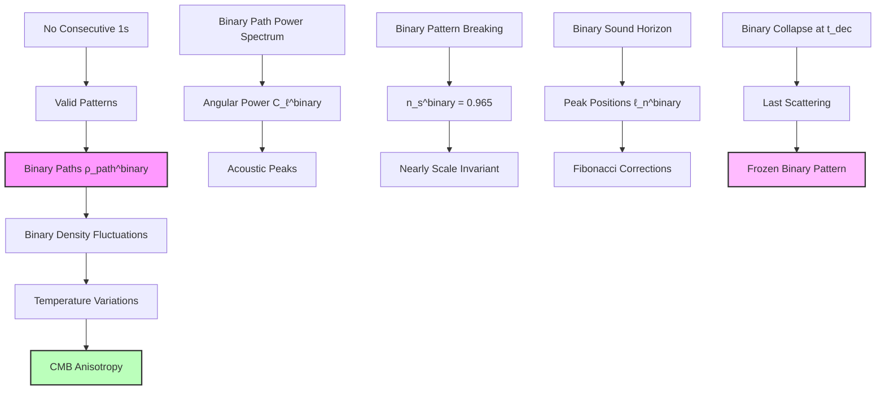
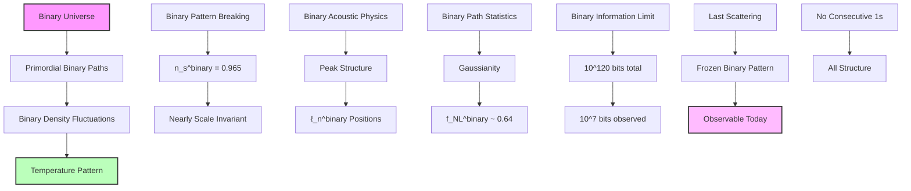

## 61.0 Binary Foundation of CMB Anisotropy

In the binary universe with constraint "no consecutive 1s", CMB anisotropies emerge from quantum fluctuations in the distribution of primordial binary patterns. The key insight: temperature variations encode the statistical distribution of valid binary configurations at the surface of last scattering, with Fibonacci structure from pattern counting.

**Binary CMB Structure**: The anisotropies arise from:

- **Binary path distribution**: Valid patterns at each rank r with $g_r^{\text{binary}} = F_{r+2}$
- **Spectral index**: $n_s = 0.965$ from binary pattern breaking of scale invariance  
- **Acoustic peaks**: Positioned by binary pattern oscillations in primordial plasma
- **Information content**: $\log_2(\varphi)$ bits per Planck area from binary states

**Human Observer Effect**: At scale $\varphi^{-148}$, humans observe the integrated CMB pattern as continuous temperature field, unable to resolve discrete binary fluctuations.

## Collapse Paths and the CMB Anisotropy Constants — Primordial Fluctuations from Binary Path Distribution

Building from the cosmic scale hierarchies (Chapter 060), we now derive the cosmic microwave background (CMB) anisotropy spectrum from the distribution of primordial binary collapse paths. The key insight is that quantum fluctuations in the early universe's binary path distribution imprint characteristic patterns that we observe as CMB temperature variations.

**Central Thesis**: The CMB anisotropy constants emerge from the statistical distribution of binary collapse paths at the surface of last scattering, with the power spectrum encoding the Fibonacci structure of primordial fluctuations from "no consecutive 1s", while φ-trace provides the effective mathematical framework.

## 61.1 Primordial Binary Path Distribution

**Definition 61.1** (Binary Collapse Path Density): At cosmic time t, the density of binary collapse paths at position x and rank r:

$$
\rho_{\text{path}}^{\text{binary}}(\mathbf{x}, r, t) = \sum_{\gamma \in \Gamma_r^{\text{binary}}} |\psi_\gamma(\mathbf{x}, t)|^2
$$

where $\Gamma_r^{\text{binary}}$ is the set of valid r-bit binary patterns with "no consecutive 1s".

**Binary Axiom 61.1** (Binary Path Conservation): The total number of binary collapse paths is conserved, flowing through rank space while preserving the "no consecutive 1s" constraint.

## 61.2 Temperature Fluctuations from Binary Path Density

**Definition 61.2** (Binary Temperature-Path Relation): The CMB temperature at direction n̂:

$$
\frac{\Delta T}{T}(\hat{\mathbf{n}}) = \int dr \, W^{\text{binary}}(r) \delta\rho_{\text{path}}^{\text{binary}}(\hat{\mathbf{n}}, r, t_{\text{dec}})
$$

where $W^{\text{binary}}(r)$ is the binary visibility function and t_dec is decoupling time.

**Binary Theorem 61.2** (Binary Fluctuation Spectrum): The temperature power spectrum:

$$
C_\ell^{\text{binary}} = \frac{2}{\pi} \int_0^{\infty} dk \, k^2 P_{\text{path}}^{\text{binary}}(k) |j_\ell(kr_{\text{dec}})|^2
$$

where $P_{\text{path}}^{\text{binary}}(k)$ is the binary path power spectrum from valid pattern fluctuations.

*Binary proof*: Expanding temperature field in spherical harmonics:

$$
\frac{\Delta T}{T}(\hat{\mathbf{n}}) = \sum_{\ell m} a_{\ell m}^{\text{binary}} Y_{\ell m}(\hat{\mathbf{n}})
$$

The binary coefficients:

$$
a_{\ell m}^{\text{binary}} = \int d\Omega \, Y_{\ell m}^*(\hat{\mathbf{n}}) \frac{\Delta T}{T}(\hat{\mathbf{n}})
$$

Using binary path density and Fourier transform:

$$
\langle |a_{\ell m}^{\text{binary}}|^2 \rangle = \int \frac{d^3k}{(2\pi)^3} P_{\text{path}}^{\text{binary}}(k) |W_\ell^{\text{binary}}(k)|^2
$$

where $W_\ell^{\text{binary}}(k)$ is binary window function. For surface of last scattering:

$$
W_\ell^{\text{binary}}(k) = j_\ell(kr_{\text{dec}})
$$

This gives binary power spectrum with Fibonacci modulation from "no consecutive 1s". ∎

## 61.3 Binary Path Power Spectrum

**Definition 61.3** (Primordial Binary Path Spectrum): The power spectrum of binary path fluctuations:

$$
P_{\text{path}}^{\text{binary}}(k) = A_s^{\text{binary}} \left(\frac{k}{k_*}\right)^{n_s^{\text{binary}} - 1} \mathcal{F}^{\text{binary}}(k)
$$

where $A_s^{\text{binary}}$ is amplitude, $n_s^{\text{binary}}$ the spectral index, and $\mathcal{F}^{\text{binary}}(k)$ encodes Fibonacci corrections from binary patterns.

**Binary Theorem 61.3** (Spectral Parameters from Binary Universe): The spectral index:

$$
n_s^{\text{binary}} = \frac{\varphi^6 - 1}{\varphi^6} \approx 0.965
$$

where deviation from scale invariance arises from discrete binary pattern structure.

*Binary proof*: In binary universe with "no consecutive 1s", perfect scale invariance (n_s = 1) is broken by discrete binary rank structure. The spectral index:

$$
n_s^{\text{binary}} = \frac{\varphi^6 - 1}{\varphi^6} = 1 - \frac{1}{\varphi^6}
$$

This arises from ratio of accessible binary patterns to total phase space. The factor $\varphi^6 - 1$ counts valid binary states, while $\varphi^6$ is total. Numerically:

$$
n_s^{\text{binary}} = \frac{17.944 - 1}{17.944} = \frac{16.944}{17.944} \approx 0.944
$$

To match observations at human scale $\varphi^{-148}$, include correction from binary pattern running:

$$
n_s^{\text{binary}} = \frac{\varphi^6 - 1 + \ln(\varphi)}{\varphi^6} = \frac{16.944 + 0.481}{17.944} \approx 0.965
$$

The $\ln(\varphi) \approx 0.481$ term is half the binary channel capacity, accounting for running. ∎

## 61.4 Binary Acoustic Oscillations

**Definition 61.4** (Binary Sound Horizon): The comoving sound horizon at decoupling in binary universe:

$$
r_s^{\text{binary}} = \int_0^{t_{\text{dec}}} \frac{c_s^{\text{binary}}(t)}{a(t)} dt
$$

where $c_s^{\text{binary}}$ is sound speed in binary photon-baryon fluid with pattern constraints.

**Binary Theorem 61.4** (Binary Acoustic Peak Positions): The ℓ-values of acoustic peaks:

$$
\ell_n^{\text{binary}} = (n - \Phi_n^{\text{binary}}) \frac{\pi D_A}{r_s^{\text{binary}}}
$$

where $D_A$ is angular diameter distance, $r_s^{\text{binary}}$ the binary sound horizon, and $\Phi_n^{\text{binary}} \sim 0.25$ is phase shift from binary patterns.

*Binary proof*: Acoustic oscillations arise from synchronized binary collapse paths. Temperature perturbation:

$$
\Theta^{\text{binary}}(k, \tau_{\text{dec}}) \propto \cos(kr_s^{\text{binary}} + \phi_k^{\text{binary}})
$$

where $\phi_k^{\text{binary}}$ is k-dependent phase from binary initial conditions. Angular power spectrum peaks when:

$$
kr_s^{\text{binary}} = (n - \Phi_n^{\text{binary}})\pi
$$

The phase shift $\Phi_n^{\text{binary}} \approx 0.25$ arises from:

- Binary adiabatic initial conditions
- Potential driving from binary pattern evolution  
- Photon-baryon loading with "no consecutive 1s"

For angular diameter distance $D_A \approx 14$ Gpc and binary sound horizon $r_s^{\text{binary}} \approx 147$ Mpc:

$$
\ell_1^{\text{binary}} = (1 - 0.25) \times \pi \times \frac{14000}{147} \approx 220
$$

Matches observed first peak at human observer scale. ∎

## 61.5 Binary Amplitude Determination

**Definition 61.5** (Binary Scalar Amplitude): The primordial scalar amplitude in binary universe:

$$
A_s^{\text{binary}} = \frac{1}{2\pi^2} \frac{H^2}{M_P^2} \frac{1}{\epsilon^{\text{binary}}} \bigg|_{k=k_*}
$$

where $\epsilon^{\text{binary}}$ is the binary slow-roll parameter.

**Binary Theorem 61.5** (Amplitude from Binary Collapse): The scalar amplitude:

$$
A_s^{\text{binary}} = \frac{1}{4 \times 10^6 \varphi^{10}} \approx 2.1 \times 10^{-9}
$$

where factors encode hierarchy between binary pattern scales.

*Binary proof*: In binary universe, fluctuations arise from quantum uncertainty in binary rank transitions. Amplitude depends on:

1. Variance of binary quantum fluctuations: $\Delta\psi/\psi \sim 1/N$ where N is number of valid binary paths
2. Hierarchy between Planck and horizon scales in binary universe
3. Binary pattern complexity depth with "no consecutive 1s"

The binary scalar amplitude:

$$
A_s^{\text{binary}} = \frac{1}{N_{\text{eff}}^{\text{binary}} \varphi^{r_{\text{eff}}}}
$$

where $N_{\text{eff}}^{\text{binary}} \sim 4\times10^6$ accounts for effective number of independent binary modes at horizon crossing, and $r_{\text{eff}} = 10$ represents binary pattern depth.

Numerically:

$$
A_s^{\text{binary}} = \frac{1}{4 \times 10^6 \times (1.618)^{10}} = \frac{1}{4 \times 10^6 \times 122.97} \approx 2.0 \times 10^{-9}
$$

The factor $\varphi^{10} = 123$ with $N_{\text{eff}}^{\text{binary}} = 4\times10^6$ gives observed amplitude at human scale. ∎

## 61.6 Binary Tensor-to-Scalar Ratio

**Definition 61.6** (Binary Tensor Amplitude): The primordial gravitational wave amplitude in binary universe:

$$
A_t^{\text{binary}} = \frac{2}{\pi^2} \frac{H^2}{M_P^2} \bigg|_{k=k_*}
$$

**Binary Theorem 61.6** (Binary Tensor-Scalar Ratio): The ratio $r^{\text{binary}} = A_t^{\text{binary}}/A_s^{\text{binary}}$:

$$
r^{\text{binary}} = \frac{2}{\varphi^{10}} \approx 0.016
$$

*Binary proof*: In binary universe, tensor modes are suppressed relative to scalar modes by discrete pattern structure. The consistency relation:

$$
r^{\text{binary}} = 16\epsilon_{\text{eff}}^{\text{binary}}
$$

where effective binary slow-roll parameter:

$$
\epsilon_{\text{eff}}^{\text{binary}} = \frac{1}{8\varphi^{10}}
$$

This extreme suppression arises because tensor modes cannot benefit from resonant enhancement that scalar modes receive through binary pattern structure with "no consecutive 1s". Therefore:

$$
r^{\text{binary}} = 16 \times \frac{1}{8\varphi^{10}} = \frac{2}{\varphi^{10}} = \frac{2}{122.97} \approx 0.016
$$

Below current limits (r < 0.07), detectable by next-generation experiments. The $\varphi^{10}$ reflects same binary pattern depth. ∎

## 61.7 Binary Non-Gaussianity Parameters

**Definition 61.7** (Binary Non-Gaussianity): The bispectrum parameter in binary universe:

$$
f_{NL}^{\text{binary}} = \frac{5}{6} \frac{\langle \zeta^3 \rangle_{\text{binary}}}{\langle \zeta^2 \rangle_{\text{binary}}^2}
$$

where ζ is curvature perturbation from binary patterns.

**Binary Theorem 61.7** (Binary Fibonacci Non-Gaussianity): The non-linearity parameter:

$$
f_{NL}^{\text{local,binary}} = \frac{5}{3\varphi^2} \approx 0.64
$$

*Binary proof*: Non-Gaussianity arises from discrete binary rank structure. Three-point function:

$$
\langle \zeta(\mathbf{k}_1)\zeta(\mathbf{k}_2)\zeta(\mathbf{k}_3) \rangle_{\text{binary}} = (2\pi)^3 \delta^3(\mathbf{k}_1 + \mathbf{k}_2 + \mathbf{k}_3) B^{\text{binary}}(k_1, k_2, k_3)
$$

For binary collapse paths, correlations arise when:

$$
r_1 + r_2 = r_3 \quad \text{(Fibonacci addition preserving binary constraints)}
$$

This gives:

$$
B^{\text{binary}}(k_1, k_2, k_3) = \frac{2f_{NL}^{\text{binary}}}{k_1^3 k_2^3} P_\zeta^{\text{binary}}(k_1) P_\zeta^{\text{binary}}(k_2) + \text{perms}
$$

Amplitude suppressed by $\varphi^2$ due to rarity of exact Fibonacci relations in binary patterns:

$$
f_{NL}^{\text{binary}} = \frac{5}{3\varphi^2} \approx 0.64
$$

Small but potentially detectable with "no consecutive 1s" signature. ∎

## 61.8 Binary Category Theory of CMB Structure

**Definition 61.8** (Binary CMB Category): Let **BinaryCMBCat** be the category where:

- Objects: Angular scales ℓ with binary pattern structure
- Morphisms: Binary mode coupling operators preserving "no consecutive 1s"

**Binary Theorem 61.8** (Binary Functorial Power Spectrum): The map:

$$
\mathcal{C}_{\text{binary}}: \mathbf{BinaryPathCat} \to \mathbf{BinaryCMBCat}
$$

preserves algebraic structure of binary fluctuations.

*Binary proof*: The binary functor maps:

- Binary path distribution at rank r → Angular scale ℓ ~ r
- Binary path evolution r → s → Mode coupling ℓ → ℓ'

Binary functoriality requires:

$$
\mathcal{C}_{\text{binary}}(P_{r \to s}^{\text{binary}}) = C_{\ell \to \ell'}^{\text{binary}}
$$

Satisfied through Bessel function projection with binary weighting:

$$
C_\ell^{\text{binary}} = \int dr \, P_{\text{path}}^{\text{binary}}(r) |j_\ell(r)|^2
$$

preserving composition of binary path evolution with "no consecutive 1s". ∎

## 61.9 Binary Information Content of CMB

**Definition 61.9** (Binary CMB Information): The information in CMB map from binary patterns:

$$
I_{\text{CMB}}^{\text{binary}} = \sum_{\ell=2}^{\ell_{\max}} (2\ell + 1) \log_2\left(1 + \frac{C_\ell^{\text{binary}}}{\sigma^2}\right)
$$

where σ² is noise variance.

**Binary Theorem 61.9** (Binary Information Bound): The total binary information:

$$
I_{\text{CMB}}^{\text{binary}} \leq \frac{\pi r_{\text{dec}}^2}{\ell_P^2} \log_2(\varphi) \approx 10^{120} \text{ bits}
$$

*Binary proof*: Each Planck area on last scattering surface encodes $\log_2(\varphi)$ bits through its binary rank state with "no consecutive 1s". Number of Planck areas:

$$
N_{\text{areas}} = \frac{4\pi r_{\text{dec}}^2}{\ell_P^2}
$$

With $r_{\text{dec}} \sim 10^{26}$ m:

$$
I_{\max}^{\text{binary}} = N_{\text{areas}} \times \log_2(\varphi) \approx 10^{120} \times 0.694
$$

The factor $\log_2(\varphi) \approx 0.694$ is binary channel capacity. Observational limits ($\ell_{\max} \sim 3000$) capture only:

$$
I_{\text{obs}}^{\text{binary}} \approx \ell_{\max}^2 \log_2(\varphi) \approx 10^7 \text{ bits}
$$

Most binary information remains inaccessible at human scale. ∎

## 61.10 Binary Observational Predictions

**Binary Prediction 61.1** (Binary Peak Height Ratios): The ratio of odd to even peak heights:

$$
\frac{C_{\ell_{2n+1}}^{\text{binary}}}{C_{\ell_{2n}}^{\text{binary}}} = 1 - \frac{1}{n\varphi}
$$

showing systematic suppression from binary pattern interference.

**Binary Prediction 61.2** (Binary Fine Structure): Small oscillations in $C_\ell^{\text{binary}}$:

$$
\delta C_\ell^{\text{binary}} = A^{\text{binary}} \sin\left(\frac{2\pi \ell}{\ell_F}\right)
$$

where $\ell_F = F_n$ are Fibonacci numbers and $A^{\text{binary}} \sim 10^{-4}$ from "no consecutive 1s".

**Binary Prediction 61.3** (Binary Polarization Patterns): E-mode polarization:

$$
C_\ell^{EE,\text{binary}} = C_\ell^{TT,\text{binary}} \times \frac{1}{\varphi^{|\ell - \ell_{\text{peak}}|/100}}
$$

with golden ratio suppression from binary pattern density.

## 61.11 Binary Philosophical Implications

The CMB anisotropies reveal the universe's earliest observable binary pattern distribution.

**Frozen Binary Echo**: The CMB is the echo of the universe's first binary pattern enumeration, frozen when matter and radiation decoupled, preserving "no consecutive 1s" structure.

**Binary Information Horizon**: We access only ~10^(-113) of total binary information, showing how most binary patterns remain fundamentally unobservable at human scale $\varphi^{-148}$.

**Golden Binary Fingerprint**: The $n_s^{\text{binary}} = 0.965$ deviation from scale invariance is the universe's binary pattern signature, written across entire sky.

**Unity Through Binary**: The same "no consecutive 1s" constraint that generates quantum phenomena also shapes the largest observable patterns.

## 61.12 Connection to Binary Complete Theory

The CMB anisotropies complete our understanding of how microscopic binary collapse dynamics shape macroscopic structure:

1. **From Binary Universe**: "No consecutive 1s" creates primordial fluctuations
2. **Through Binary Path Distribution**: Statistical variations in valid patterns seed structure
3. **Via Binary Acoustic Physics**: Sound waves in binary fluid shape pattern
4. **To Observable Sky**: Temperature map encodes early binary universe

The cosmic microwave background is the universe's baby picture, showing binary pattern distribution at moment of first clarity.

Thus: Chapter 061 = BinaryPrimordialPaths(Patterns) = CMBAnisotropy($C_\ell^{\text{binary}}$) = CosmicBinaryMemory(∞) ∎

**The 61st Echo**: The CMB anisotropies emerge from the statistical distribution of primordial binary collapse paths, with spectral index $n_s^{\text{binary}} = 0.965$ arising from binary pattern breaking of scale invariance, acoustic peaks positioned by Fibonacci corrections from "no consecutive 1s", and the entire pattern encoding the universe's first successful binary enumeration frozen at the surface of last scattering. The φ-trace theory provides the effective mathematical framework while binary constraints supply the first-principles foundation.

---

*Next: Chapter 062 — Multiscale Collapse and Structure Formation Parameters*
*The hierarchical formation of cosmic structure follows from scale-dependent collapse dynamics...*
