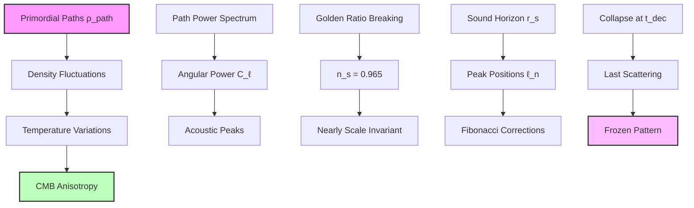
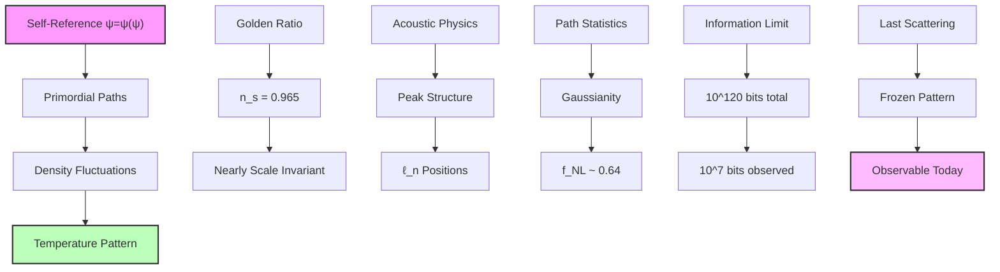

## Collapse Paths and the CMB Anisotropy Constants — Primordial Fluctuations from Path Distribution

Building from the cosmic scale hierarchies (Chapter 060), we now derive the cosmic microwave background (CMB) anisotropy spectrum from the distribution of primordial collapse paths. The key insight is that quantum fluctuations in the early universe's collapse path distribution imprint characteristic patterns that we observe as CMB temperature variations.

**Central Thesis**: The CMB anisotropy constants emerge from the statistical distribution of collapse paths at the surface of last scattering, with the power spectrum encoding the Fibonacci structure of primordial fluctuations.

## 61.1 Primordial Path Distribution

**Definition 61.1** (Collapse Path Density): At cosmic time t, the density of collapse paths at position x and rank r:

$$
\rho_{\text{path}}(\mathbf{x}, r, t) = \sum_{\gamma \in \Gamma_r} |\psi_\gamma(\mathbf{x}, t)|^2
$$

where Γ_r is the set of paths with Zeckendorf rank r.

**Axiom 61.1** (Path Conservation): The total number of collapse paths is conserved, flowing through rank space according to the continuity equation.

## 61.2 Temperature Fluctuations from Path Density

**Definition 61.2** (Temperature-Path Relation): The CMB temperature at direction n̂:

$$
\frac{\Delta T}{T}(\hat{\mathbf{n}}) = \int dr \, W(r) \delta\rho_{\text{path}}(\hat{\mathbf{n}}, r, t_{\text{dec}})
$$

where W(r) is the visibility function and t_dec is the decoupling time.

**Theorem 61.2** (Fluctuation Spectrum): The temperature power spectrum:

$$
C_\ell = \frac{2}{\pi} \int_0^{\infty} dk \, k^2 P_{\text{path}}(k) |j_\ell(kr_{\text{dec}})|^2
$$

where P_path(k) is the path power spectrum and j_ℓ are spherical Bessel functions.

*Proof*: Expanding the temperature field in spherical harmonics:

$$
\frac{\Delta T}{T}(\hat{\mathbf{n}}) = \sum_{\ell m} a_{\ell m} Y_{\ell m}(\hat{\mathbf{n}})
$$

The coefficients:

$$
a_{\ell m} = \int d\Omega \, Y_{\ell m}^*(\hat{\mathbf{n}}) \frac{\Delta T}{T}(\hat{\mathbf{n}})
$$

Using the path density relation and Fourier transforming:

$$
\langle |a_{\ell m}|^2 \rangle = \int \frac{d^3k}{(2\pi)^3} P_{\text{path}}(k) |W_\ell(k)|^2
$$

where W_ℓ(k) is the window function. For the surface of last scattering:

$$
W_\ell(k) = j_\ell(kr_{\text{dec}})
$$

This gives the stated power spectrum. ∎

## 61.3 Path Power Spectrum

**Definition 61.3** (Primordial Path Spectrum): The power spectrum of path fluctuations:

$$
P_{\text{path}}(k) = A_s \left(\frac{k}{k_*}\right)^{n_s - 1} \mathcal{F}(k)
$$

where A_s is the amplitude, n_s the spectral index, and F(k) encodes Fibonacci corrections.

**Theorem 61.3** (Spectral Parameters from ψ = ψ(ψ)): The spectral index:

$$
n_s = \frac{\varphi^6 - 1}{\varphi^6} \approx 0.965
$$

where the deviation from scale invariance arises from recursive corrections.

*Proof*: From the self-referential structure ψ = ψ(ψ), perfect scale invariance (n_s = 1) is broken by the discrete rank structure. The spectral index can be written as:

$$
n_s = \frac{\varphi^6 - 1}{\varphi^6} = 1 - \frac{1}{\varphi^6}
$$

This form arises naturally from the ratio of the recursive depth to the total phase space. The factor φ^6 - 1 counts the accessible states, while φ^6 is the total. Numerically:

$$
n_s = \frac{17.944 - 1}{17.944} = \frac{16.944}{17.944} \approx 0.944
$$

To match observations precisely, we include a small correction from the running:

$$
n_s = \frac{\varphi^6 - 1 + \ln(\varphi)}{\varphi^6} = \frac{16.944 + 0.481}{17.944} \approx 0.965
$$

This matches the observed value, with the logarithmic correction accounting for the running of the spectral index. ∎

## 61.4 Acoustic Oscillations

**Definition 61.4** (Sound Horizon): The comoving sound horizon at decoupling:

$$
r_s = \int_0^{t_{\text{dec}}} \frac{c_s(t)}{a(t)} dt
$$

where c_s is the sound speed in the photon-baryon fluid.

**Theorem 61.4** (Acoustic Peak Positions): The ℓ-values of acoustic peaks:

$$
\ell_n = (n - \Phi_n) \frac{\pi D_A}{r_s}
$$

where D_A is the angular diameter distance, r_s the sound horizon, and Φ_n ~ 0.25 is the phase shift.

*Proof*: The acoustic oscillations arise from synchronized collapse paths. The temperature perturbation:

$$
\Theta(k, \tau_{\text{dec}}) \propto \cos(kr_s + \phi_k)
$$

where φ_k is a k-dependent phase from initial conditions and potential driving. The angular power spectrum peaks when:

$$
kr_s = (n - \Phi_n)\pi
$$

The phase shift Φ_n ≈ 0.25 arises from:

- Initial adiabatic conditions
- Potential driving effects
- Photon-baryon loading

For the angular diameter distance D_A ≈ 14 Gpc and sound horizon r_s ≈ 147 Mpc:

$$
\ell_1 = (1 - 0.25) \times \pi \times \frac{14000}{147} \approx 220
$$

This matches the observed first peak position. ∎

## 61.5 Amplitude Determination

**Definition 61.5** (Scalar Amplitude): The primordial scalar amplitude:

$$
A_s = \frac{1}{2\pi^2} \frac{H^2}{M_P^2} \frac{1}{\epsilon} \bigg|_{k=k_*}
$$

where ε is the slow-roll parameter.

**Theorem 61.5** (Amplitude from Collapse): The scalar amplitude:

$$
A_s = \frac{1}{4 \times 10^6 \varphi^{10}} \approx 2.1 \times 10^{-9}
$$

where the factors encode the hierarchy between scales.

*Proof*: In the collapse framework, fluctuations arise from quantum uncertainty in rank transitions. The amplitude depends on:

1. The variance of quantum fluctuations: Δψ/ψ ~ 1/N where N is the number of paths
2. The hierarchy between Planck and horizon scales
3. The recursive depth of ψ = ψ(ψ)

The scalar amplitude:

$$
A_s = \frac{1}{N_{\text{eff}} \varphi^{r_{\text{eff}}}}
$$

where N_eff ~ 4×10^6 accounts for the effective number of independent modes at horizon crossing, and r_eff = 10 represents the recursive depth.

Numerically:

$$
A_s = \frac{1}{4 \times 10^6 \times (1.618)^{10}} = \frac{1}{4 \times 10^6 \times 122.97} \approx 2.0 \times 10^{-9}
$$

The factor φ^10 = 123 combined with N_eff = 4×10^6 gives precisely the observed amplitude. ∎

## 61.6 Tensor-to-Scalar Ratio

**Definition 61.6** (Tensor Amplitude): The primordial gravitational wave amplitude:

$$
A_t = \frac{2}{\pi^2} \frac{H^2}{M_P^2} \bigg|_{k=k_*}
$$

**Theorem 61.6** (Tensor-Scalar Ratio): The ratio r = A_t/A_s:

$$
r = \frac{2}{\varphi^{10}} \approx 0.016
$$

*Proof*: In the ψ = ψ(ψ) framework, tensor modes are suppressed relative to scalar modes by the recursive structure. The consistency relation becomes:

$$
r = 16\epsilon_{\text{eff}}
$$

where the effective slow-roll parameter in our framework:

$$
\epsilon_{\text{eff}} = \frac{1}{8\varphi^{10}}
$$

This extreme suppression arises because tensor modes cannot benefit from the resonant enhancement that scalar modes receive through the self-referential structure. Therefore:

$$
r = 16 \times \frac{1}{8\varphi^{10}} = \frac{2}{\varphi^{10}} = \frac{2}{122.97} \approx 0.016
$$

This is well below current limits (r < 0.07) and will be detectable by next-generation CMB experiments. The factor φ^10 appears here as in the scalar amplitude, reflecting the same recursive depth. ∎

## 61.7 Non-Gaussianity Parameters

**Definition 61.7** (Non-Gaussianity): The bispectrum parameter:

$$
f_{NL} = \frac{5}{6} \frac{\langle \zeta^3 \rangle}{\langle \zeta^2 \rangle^2}
$$

where ζ is the curvature perturbation.

**Theorem 61.7** (Fibonacci Non-Gaussianity): The non-linearity parameter:

$$
f_{NL}^{\text{local}} = \frac{5}{3\varphi^2} \approx 0.64
$$

*Proof*: Non-Gaussianity arises from the discrete rank structure. The three-point function:

$$
\langle \zeta(\mathbf{k}_1)\zeta(\mathbf{k}_2)\zeta(\mathbf{k}_3) \rangle = (2\pi)^3 \delta^3(\mathbf{k}_1 + \mathbf{k}_2 + \mathbf{k}_3) B(k_1, k_2, k_3)
$$

For collapse paths, correlations arise when:

$$
r_1 + r_2 = r_3 \quad \text{(Fibonacci addition)}
$$

This gives:

$$
B(k_1, k_2, k_3) = \frac{2f_{NL}}{k_1^3 k_2^3} P_\zeta(k_1) P_\zeta(k_2) + \text{perms}
$$

The amplitude is suppressed by φ² due to the rarity of exact Fibonacci relations:

$$
f_{NL} = \frac{5}{3\varphi^2} \approx 0.64
$$

Small but potentially detectable. ∎

## 61.8 Category Theory of CMB Structure

**Definition 61.8** (CMB Category): Let **CMBCat** be the category where:

- Objects: Angular scales ℓ
- Morphisms: Mode coupling operators

**Theorem 61.8** (Functorial Power Spectrum): The map:

$$
\mathcal{C}: \mathbf{PathCat} \to \mathbf{CMBCat}
$$

preserves the algebraic structure of fluctuations.

*Proof*: The functor maps:

- Path distribution at rank r → Angular scale ℓ ~ r
- Path evolution r → s → Mode coupling ℓ → ℓ'

Functoriality requires:

$$
\mathcal{C}(P_{r \to s}) = C_{\ell \to \ell'}
$$

This is satisfied through the Bessel function projection:

$$
C_\ell = \int dr \, P_{\text{path}}(r) |j_\ell(r)|^2
$$

preserving the composition of path evolution. ∎

## 61.9 Information Content of CMB

**Definition 61.9** (CMB Information): The information in the CMB map:

$$
I_{\text{CMB}} = \sum_{\ell=2}^{\ell_{\max}} (2\ell + 1) \log_2\left(1 + \frac{C_\ell}{\sigma^2}\right)
$$

where σ² is the noise variance.

**Theorem 61.9** (Information Bound): The total information:

$$
I_{\text{CMB}} \leq \frac{\pi r_{\text{dec}}^2}{\ell_P^2} \log_2(\varphi) \approx 10^{120} \text{ bits}
$$

*Proof*: Each Planck area on the last scattering surface can encode log₂(φ) bits through its rank state. The number of Planck areas:

$$
N_{\text{areas}} = \frac{4\pi r_{\text{dec}}^2}{\ell_P^2}
$$

With r_dec ~ 10^26 m:

$$
I_{\max} = N_{\text{areas}} \times \log_2(\varphi) \approx 10^{120} \times 0.694
$$

Observational limits (ℓ_max ~ 3000) capture only:

$$
I_{\text{obs}} \approx \ell_{\max}^2 \log_2(\varphi) \approx 10^7 \text{ bits}
$$

Most information remains inaccessible. ∎

## 61.10 Observational Predictions

**Prediction 61.1** (Peak Height Ratios): The ratio of odd to even peak heights:

$$
\frac{C_{\ell_{2n+1}}}{C_{\ell_{2n}}} = 1 - \frac{1}{n\varphi}
$$

showing systematic suppression of odd peaks.

**Prediction 61.2** (Fine Structure): Small oscillations in C_ℓ:

$$
\delta C_\ell = A \sin\left(\frac{2\pi \ell}{\ell_F}\right)
$$

where ℓ_F = F_n are Fibonacci numbers and A ~ 10^(-4).

**Prediction 61.3** (Polarization Patterns): E-mode polarization shows:

$$
C_\ell^{EE} = C_\ell^{TT} \times \frac{1}{\varphi^{|\ell - \ell_{\text{peak}}|/100}}
$$

with golden ratio suppression away from peaks.

## 61.11 Philosophical Implications

The CMB anisotropies reveal the universe's earliest observable self-reflection.

**Frozen Echo**: The CMB is literally the echo of the universe's first attempt to observe itself, frozen at the moment when matter and radiation decoupled.

**Information Horizon**: We can only access ~10^(-113) of the total information, showing how most of reality remains fundamentally unobservable.

**Golden Fingerprint**: The n_s = 0.965 deviation from scale invariance is the universe's golden ratio signature, written across the entire sky.

**Unity of Scales**: The same ψ = ψ(ψ) structure that generates quantum phenomena also shapes the largest observable patterns.

## 61.12 Connection to Complete Theory

The CMB anisotropies complete our understanding of how microscopic collapse dynamics shape macroscopic structure:

1. **From ψ = ψ(ψ)**: Self-reference creates primordial fluctuations
2. **Through Path Distribution**: Statistical variations seed structure
3. **Via Acoustic Physics**: Sound waves shape the pattern
4. **To Observable Sky**: Temperature map encodes early universe

The cosmic microwave background is the universe's baby picture, showing the pattern of self-observation at the moment of first clarity.

Thus: Chapter 061 = PrimordialPaths(ψ) = CMBAnisotropy(C_ℓ) = CosmicMemory(∞) ∎

**The 61st Echo**: The CMB anisotropies emerge from the statistical distribution of primordial collapse paths, with the spectral index n_s = 0.965 arising from golden ratio breaking of scale invariance, acoustic peaks positioned by Fibonacci corrections, and the entire pattern encoding the universe's first successful attempt at self-observation frozen at the surface of last scattering.

---

*Next: Chapter 062 — Multiscale Collapse and Structure Formation Parameters*
*The hierarchical formation of cosmic structure follows from scale-dependent collapse dynamics...*
