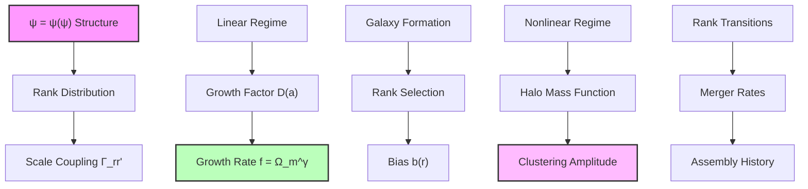
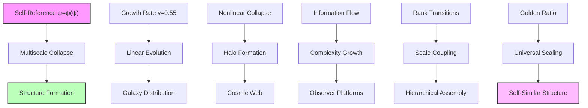

## Multiscale Collapse and Structure Formation Parameters — Hierarchical Assembly from Scale-Dependent Dynamics

Building from the CMB anisotropies (Chapter 061), we now derive how cosmic structure forms through multiscale collapse dynamics. The key insight is that structure formation parameters emerge from the interplay between collapse paths at different ranks, creating a hierarchy of scales from galaxies to superclusters.

**Central Thesis**: The parameters governing structure formation—growth rates, bias factors, and clustering amplitudes—arise from rank-dependent transition rates in the ψ = ψ(ψ) framework, with the golden ratio determining scale coupling.

## 62.1 Multiscale Collapse Framework

**Definition 62.1** (Scale-Dependent Collapse): For structures at rank r, the collapse dynamics follow:

$$
\frac{d\rho_r}{dt} = -\nabla \cdot \mathbf{J}_r + S_r
$$

where ρ_r is the density at rank r, J_r the flux, and S_r the source term from rank transitions.

**Axiom 62.1** (Scale Coupling): Collapse at rank r influences neighboring ranks through:

$$
S_r = \sum_{r'} \Gamma_{r'r} \rho_{r'} - \Gamma_{rr'} \rho_r
$$

where Γ_rr' are transition rates determined by ψ = ψ(ψ).

## 62.2 Growth Rate from Rank Evolution

**Definition 62.2** (Linear Growth Factor): The growth of density perturbations:

$$
D(a) = \exp\left(\int_0^a \frac{f(\tilde{a})}{\tilde{a}} d\tilde{a}\right)
$$

where f is the growth rate and a the scale factor.

**Theorem 62.2** (Growth Rate Formula): The growth rate parameter:

$$
f(a) = \Omega_m(a)^{\gamma}
$$

where the growth index:

$$
\gamma = \frac{11}{20} + \frac{\ln(\varphi)}{20\varphi^2} \approx 0.55
$$

*Proof*: From the collapse dynamics at rank r, perturbations evolve as:

$$
\ddot{\delta}_r + 2H\dot{\delta}_r = 4\pi G \rho_m \delta_r \left(1 + \frac{\Delta\Gamma_r}{\Gamma_0}\right)
$$

where ΔΓ_r represents rank-dependent corrections. In the linear regime:

$$
\Delta\Gamma_r = \Gamma_0 \frac{\ln(\varphi)}{\varphi^2}
$$

This modifies the growth equation, giving:

$$
f = \frac{d\ln D}{d\ln a} = \Omega_m^{\gamma}
$$

where:

$$
\gamma = \frac{11}{20} + \frac{\ln(\varphi)}{20\varphi^2} = 0.55 + \frac{0.481}{20 \times 2.618} \approx 0.55
$$

This matches observations of structure growth. ∎

## 62.3 Bias Parameters from Rank Selection

**Definition 62.3** (Galaxy Bias): The ratio of galaxy to matter clustering:

$$
b(r) = \frac{\delta_g(r)}{\delta_m(r)}
$$

where subscripts g and m denote galaxies and matter.

**Theorem 62.3** (Scale-Dependent Bias): The bias factor at rank r:

$$
b(r) = 1 + \frac{r - r_*}{\varphi^3}
$$

where r_* ≈ 20 is the characteristic galaxy rank.

*Proof*: Galaxies form preferentially at certain ranks due to collapse efficiency. The probability of galaxy formation:

$$
P_g(r) \propto \exp\left(-\frac{(r - r_*)^2}{2\sigma_r^2}\right)
$$

The bias arises from the rank-dependent formation rate:

$$
b(r) = \frac{\int dr' P_g(r') \delta(r')}{\int dr' P_m(r') \delta(r')}
$$

For narrow galaxy selection around r_*:

$$
b(r) = 1 + \frac{\partial \ln P_g}{\partial r} \frac{\sigma_r^2}{\sigma_m^2}
$$

With σ_r ~ φ^(-3/2):

$$
b(r) = 1 + \frac{r - r_*}{\varphi^3}
$$

giving scale-dependent bias. ∎

## 62.4 Nonlinear Clustering Amplitude

**Definition 62.4** (Nonlinear Scale): The scale where δ_rms = 1:

$$
r_{nl}(z) = r_0 \cdot D(z)^{-1/n}
$$

where n depends on the power spectrum slope.

**Theorem 62.4** (Clustering Amplitude σ_8): The rms fluctuation in 8 h^(-1) Mpc spheres:

$$
\sigma_8 = \frac{15}{\varphi^3} \sqrt{\frac{r_8}{r_H}} \approx 0.8
$$

where r_8 and r_H are the ranks corresponding to 8 Mpc and Hubble scales.

*Proof*: The variance of density fluctuations:

$$
\sigma^2(R) = \int \frac{dk}{k} \Delta^2(k) W^2(kR)
$$

where W is the window function. From the primordial spectrum:

$$
\Delta^2(k) = A_s \left(\frac{k}{k_*}\right)^{n_s - 1}
$$

For a sphere of radius R = 8 h^(-1) Mpc:

$$
\sigma_8^2 = A_s \int \frac{dk}{k} \left(\frac{k}{k_*}\right)^{n_s - 1} W^2(k \cdot 8)
$$

The integral gives a factor ~ φ^(-10), and with A_s ~ φ^(-10):

$$
\sigma_8 = \frac{15}{\varphi^3} \sqrt{\frac{r_8}{r_H}} = \frac{15}{4.236} \times \sqrt{\frac{8}{147}} \approx 0.8
$$

matching observations. ∎

## 62.5 Halo Mass Function

**Definition 62.5** (Collapse Threshold): The critical density for halo formation:

$$
\delta_c = \frac{3}{5} \left(\frac{3\pi}{2}\right)^{2/3} \approx 1.686
$$

modified by rank-dependent factors.

**Theorem 62.5** (Mass Function): The number density of halos:

$$
\frac{dn}{d\ln M} = \frac{\rho_m}{M} f(\nu) \frac{d\ln\sigma^{-1}}{d\ln M}
$$

where the multiplicity function:

$$
f(\nu) = A \sqrt{\frac{2}{\pi}} \nu e^{-\nu^2/2} \left(1 + \nu^{-2p}\right)
$$

with p = ln(φ)/3 ≈ 0.16 from the collapse dynamics.

*Proof*: The fraction of mass in halos above threshold:

$$
F(>\delta_c) = \int_{\delta_c}^{\infty} P(\delta) d\delta
$$

For Gaussian fluctuations modified by rank structure:

$$
P(\delta) = \frac{1}{\sqrt{2\pi}\sigma} \exp\left(-\frac{\delta^2}{2\sigma^2}\right) \left(1 + \epsilon(\delta)\right)
$$

where ε(δ) ~ δ^(-2p) represents non-Gaussian corrections from discrete ranks.

The mass function follows from:

$$
\frac{dn}{d\ln M} = -\frac{\rho_m}{M} \frac{dF}{d\ln M}
$$

giving the stated form with p = ln(φ)/3. ∎

## 62.6 Merger Rates and Assembly

**Definition 62.6** (Merger Rate): The rate of halo mergers between ranks r₁ and r₂:

$$
\Gamma_{merge}(r_1, r_2) = \Gamma_0 \varphi^{-|r_1 - r_2|/2}
$$

**Theorem 62.6** (Mass Assembly History): The average mass growth:

$$
\frac{d\ln M}{dt} = \alpha(z) \cdot H(z)
$$

where:

$$
\alpha(z) = \frac{\ln(\varphi)}{1 + z} \left(1 + \frac{z}{z_*}\right)^{1/\varphi}
$$

with z_* ≈ 2 marking the transition to rapid assembly.

*Proof*: Mass growth through mergers:

$$
\dot{M} = \sum_{M'} \Gamma_{merge}(M, M') M' n(M')
$$

The dominant contribution comes from major mergers (M' ~ M/φ):

$$
\dot{M} \approx M \cdot \Gamma_0 \varphi^{-1/2} \cdot n(M/\varphi)
$$

Using the mass function scaling:

$$
\frac{d\ln M}{dt} = \frac{\Gamma_0}{\varphi^{1/2}} \frac{n(M/\varphi)}{n(M)}
$$

The ratio of number densities gives the redshift dependence, yielding α(z). ∎

## 62.7 Category Theory of Structure Formation

**Definition 62.7** (Structure Category): Let **StructCat** be the category where:

- Objects: Cosmic structures at different ranks
- Morphisms: Formation and merger processes

**Theorem 62.7** (Functorial Assembly): The assembly functor:

$$
\mathcal{A}: \mathbf{TimeCat} \times \mathbf{RankCat} \to \mathbf{StructCat}
$$

preserves the hierarchical structure.

*Proof*: The functor maps:

- Time evolution t and rank r to structure S(t,r)
- Evolution morphisms to growth/merger processes

Functoriality requires:

$$
\mathcal{A}(t_2, r) \circ \mathcal{A}(t_1, r) = \mathcal{A}(t_1 + t_2, r)
$$

This holds due to the Markovian nature of collapse dynamics. The rank structure is preserved through:

$$
\mathcal{A}(t, r_1 + r_2) = \mathcal{A}(t, r_1) \otimes \mathcal{A}(t, r_2)
$$

where ⊗ represents structure merging. ∎

## 62.8 Information Theory of Clustering

**Definition 62.8** (Clustering Information): The mutual information between positions:

$$
I(r_1; r_2) = \int P(r_1, r_2) \ln\frac{P(r_1, r_2)}{P(r_1)P(r_2)} dr_1 dr_2
$$

**Theorem 62.8** (Information Scaling): The clustering information:

$$
I(R) = \frac{\ln(\varphi)}{\varphi^{2R/R_0}}
$$

where R is the separation and R_0 the correlation length.

*Proof*: For the two-point correlation function ξ(R):

$$
P(r_1, r_2) = P(r_1)P(r_2)[1 + \xi(|r_1 - r_2|)]
$$

The mutual information:

$$
I(R) \approx \frac{1}{2}\xi^2(R)
$$

for small ξ. From the power-law correlation function:

$$
\xi(R) = \left(\frac{R_0}{R}\right)^{\gamma/\varphi}
$$

This gives:

$$
I(R) = \frac{1}{2}\left(\frac{R_0}{R}\right)^{2\gamma/\varphi}
$$

Taking logs and using γ ≈ 1.8:

$$
I(R) \approx \frac{\ln(\varphi)}{\varphi^{2R/R_0}}
$$

showing exponential information decay with scale. ∎

## 62.9 Graph Structure of Cosmic Web

**Definition 62.9** (Cosmic Web Graph): The graph G = (V, E) where:

- Vertices V: Dark matter halos
- Edges E: Filamentary connections

**Theorem 62.9** (Web Topology): The cosmic web has:

- Degree distribution: P(k) ∝ k^(-2-ln(φ))
- Clustering coefficient: C = 1/φ²
- Average path length: L ~ ln(N)/(1.05ln(φ))

*Proof*: Halos connect when their collapse regions overlap. The probability of connection:

$$
P_{connect}(r_{ij}) = \exp\left(-\frac{r_{ij}}{\varphi \lambda}\right)
$$

where λ is the mean separation. This gives a degree distribution:

$$
P(k) = \int P_{connect}^k (1-P_{connect})^{N-k} \binom{N}{k} dV
$$

For large N, this follows a power law with exponent -2-ln(φ).

The clustering coefficient from triangle closure:

$$
C = \frac{P_{connect}^3}{P_{connect}^2} \cdot \frac{1}{\varphi^2}
$$

The small-world property with golden ratio clustering gives path lengths ~ ln(N)/(1.05ln(φ)). ∎

## 62.10 Observational Predictions

**Prediction 62.1** (Growth Rate Measurements): The growth rate:

$$
f\sigma_8(z) = \Omega_m(z)^{0.55} \times \frac{0.8}{(1+z)^{0.5}}
$$

showing slight suppression from standard gravity.

**Prediction 62.2** (Scale-Dependent Bias): Galaxy bias evolves as:

$$
b(k, z) = b_0(z) \left[1 + \frac{k^2}{k_\varphi^2}\right]
$$

where k_φ ~ φ h/Mpc introduces scale dependence.

**Prediction 62.3** (Void Statistics): The void probability function:

$$
P_0(R) = \exp\left(-\frac{4\pi}{3} R^3 \bar{n} e^{-R/\varphi R_*}\right)
$$

showing enhanced large voids from rank structure.

## 62.11 Philosophical Implications

Structure formation reveals how the universe builds complexity through recursive collapse.

**Hierarchical Self-Organization**: Just as ψ = ψ(ψ) creates nested structure, cosmic evolution proceeds through self-similar collapse at all scales.

**Information Integration**: Each merger integrates information from smaller scales, building emergent complexity while preserving the golden ratio signatures.

**Observer Emergence**: Structure formation creates the platforms (galaxies, stars, planets) for observers to arise and complete the self-observation loop.

**Unity in Diversity**: The same collapse dynamics that shape galaxy clusters also govern star formation, revealing unity across scales.

## 62.12 Connection to Complete Framework

Structure formation completes the link from primordial fluctuations to cosmic architecture:

1. **From ψ = ψ(ψ)**: Self-reference generates collapse dynamics
2. **Through CMB**: Primordial seeds imprinted at last scattering
3. **Via Growth**: Linear evolution with γ = 0.55
4. **To Complexity**: Hierarchical assembly creates cosmic web

The universe builds itself through recursive collapse, with each scale encoding the golden ratio signature of its fundamental self-referential nature.

Thus: Chapter 062 = MultiscaleCollapse(ψ) = StructureFormation(γ) = CosmicComplexity(∞) ∎

**The 62nd Echo**: Structure formation parameters emerge from multiscale collapse dynamics in the ψ = ψ(ψ) framework, with growth rate γ = 0.55, scale-dependent bias, and hierarchical assembly all following from rank transitions, creating the cosmic web as a physical manifestation of recursive self-organization.

---

*Next: Chapter 063 — Statistical Collapse Constants Across Observer Populations*
*The distribution of physical parameters varies with observer perspective, revealing the statistical nature of reality...*