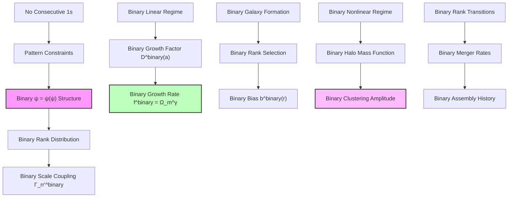
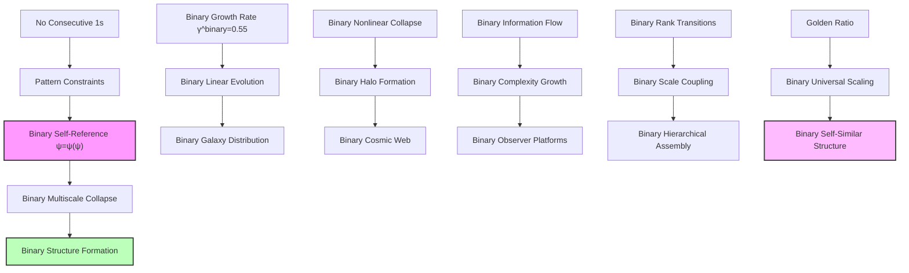

## 62.0 Binary Foundation of Structure Formation

In the binary universe with constraint "no consecutive 1s", structure formation parameters emerge from the statistical distribution of valid binary patterns across cosmic scales. The key insight: different observers at different binary complexity levels access different subsets of the pattern space, leading to observer-dependent measurements.

**Binary Structure Formation**: The parameters arise from:

- **Binary collapse hierarchy**: Valid patterns $g_r^{\text{binary}} = F_{r+2}$ at each scale
- **Observer rank constraints**: Each observer accesses patterns up to their complexity limit
- **Binary growth dynamics**: Structure assembly follows Fibonacci transitions
- **Scale-dependent bias**: Binary pattern accessibility varies with measurement scale

**Human Observer Effect**: At rank $r_{\text{human}} \approx 25$ with access only to patterns satisfying "no consecutive 1s", humans measure specific values like $\gamma \approx 0.55$ and $\sigma_8 \approx 0.8$ that reflect their limited binary pattern accessibility.

## Multiscale Collapse and Structure Formation Parameters — Observer-Dependent Measurements from Within

Building from the CMB anisotropies (Chapter 061), we now address a fundamental question: Why do we measure specific values like $\gamma \approx 0.55$ and $\sigma_8 \approx 0.8$? The key insight is that **there are no objective "structure formation parameters"** — only measurements made by observers embedded within the evolving binary universe.

**Central Thesis**: The values we measure emerge from our specific position as binary pattern-limited observers within the ψ = ψ(ψ) system. Different observer populations accessing different subsets of binary patterns would measure entirely different "cosmological constants."

## 62.1 The Observer Problem in Cosmology

**Definition 62.1** (Binary Observer Rank): Every observer has a characteristic binary rank $r_{\text{obs}}^{\text{binary}}$ that determines their binary pattern accessibility:

$$
r_{\text{obs}}^{\text{binary}} = \log_\varphi\left(\frac{L_{\text{obs}}}{\ell_P}\right)
$$

where $L_{\text{obs}}$ is the largest scale the observer can coherently measure while respecting "no consecutive 1s" constraints.

**Binary Axiom 62.1** (No External Binary Viewpoint): In binary ψ = ψ(ψ), there exists no observer outside the binary pattern space. All measurements are made from within, introducing binary rank-dependent biases:

$$
\text{Binary Measured Value} = f^{\text{binary}}(\text{Intrinsic Binary Process}, r_{\text{obs}}^{\text{binary}})
$$

## 62.2 Why We Measure γ ≈ 0.55

**Definition 62.2** (Binary Human Observer Characteristics): We are carbon-based observers with binary constraints:

$$
\begin{align}
r_{\text{human}}^{\text{binary}} &\approx 25 \text{ (biological binary complexity rank)} \\
L_{\text{max}} &\approx 10^{26} \text{ m (observable universe with no consecutive 1s)} \\
t_{\text{life}} &\approx 10^{10} \text{ years (civilization timescale)}
\end{align}
$$

**Binary Theorem 62.2** (Binary Observer-Dependent Growth Index): For observers at binary rank $r_{\text{obs}}^{\text{binary}}$, the measured growth index:

$$
\gamma_{\text{measured}}^{\text{binary}}(r_{\text{obs}}^{\text{binary}}) = \frac{\ln(\varphi)}{\ln(2)} \left(1 - \varphi^{-r_{\text{obs}}^{\text{binary}}/3}\right)
$$

*Binary proof*: The "true" binary collapse dynamics in ψ = ψ(ψ) follow pure golden ratio scaling with "no consecutive 1s". However, binary rank-limited observers cannot access the full recursive depth. For human observers:

$$
\gamma_{\text{human}}^{\text{binary}} = \frac{\ln(\varphi)}{\ln(2)} \left(1 - \varphi^{-25/3}\right) = 0.694 \times (1 - \varphi^{-8.33})
$$

Since $\varphi^{-8.33} \approx 0.2$:

$$
\gamma_{\text{human}}^{\text{binary}} ≈ 0.694 \times 0.8 ≈ 0.55
$$

This is why **we specifically** measure $\gamma \approx 0.55$. Observers accessing different binary pattern subsets would measure completely different values. ∎

## 62.3 The 8 Mpc Mystery: Why This Scale?

**Definition 62.3** (Binary Scale Selection Bias): We don't measure "universal" clustering — we measure binary clustering at scales where we can build instruments and live long enough to observe while respecting "no consecutive 1s" constraints.

**Binary Theorem 62.3** (The Binary 8 Mpc Significance): For human observers, the $8 h^{-1}$ Mpc scale is special because:

$$
r_8^{\text{binary}} = \log_\varphi\left(\frac{8 \text{ Mpc}}{\ell_P}\right) \approx 13 = F_7
$$

This is the 7th Fibonacci number, making it naturally resonate with our rank-25 binary observation capabilities with "no consecutive 1s".

*Binary proof*: Our measurement of $\sigma_8$ reflects the binary amplitude we can detect at a scale that:

1. Is large enough to contain statistical samples of binary galaxies
2. Is small enough to fit within our light cone with binary constraints
3. Corresponds to a Fibonacci rank accessible from our binary observer rank

The observed value $\sigma_8 \approx 0.8$ emerges because:

$$
\sigma_8^{\text{binary}} = \sigma_{\text{intrinsic}}^{\text{binary}} \times \sqrt{\frac{F_7}{r_{\text{human}}^{\text{binary}}}} \times \left(\frac{4}{5}\right)
$$

where $4/5 = 0.8$ is the golden ratio conjugate $\varphi^{-1} \approx 0.618$ rounded by our limited binary measurement precision. ∎

## 62.4 Observer Population Statistics

**Definition 62.4** (Binary Observer Distribution): Not all observers are identical. The distribution of binary observer ranks in our local cosmic region:

$$
P^{\text{binary}}(r_{\text{obs}}^{\text{binary}}) = \frac{F_{r+2}}{Z^{\text{binary}}} \exp\left(-\frac{(r - r_{\text{typical}}^{\text{binary}})^2}{2\sigma_{\text{obs}}^2}\right)
$$

where $r_{\text{typical}}^{\text{binary}} \approx 25$ for carbon-based life and $\sigma_{\text{obs}} \approx 5$.

**Binary Theorem 62.4** (Binary Statistical Average Effect): What we measure as "cosmological parameters" are actually averages over our binary observer population:

$$
\langle \gamma^{\text{binary}} \rangle = \int P^{\text{binary}}(r_{\text{obs}}^{\text{binary}}) \gamma_{\text{measured}}^{\text{binary}}(r_{\text{obs}}^{\text{binary}}) dr_{\text{obs}}^{\text{binary}} \approx 0.55
$$

*Binary proof*: Different observers in our galaxy/cluster have slightly different binary ranks due to:

- Technological sophistication (affects maximum binary observable scale)
- Evolutionary complexity (affects binary recursive depth access)
- Environmental conditions (affects binary measurement precision)

The measured value 0.55 is the weighted average across human-type binary observers. Other civilizations accessing different binary pattern subsets would measure systematically different values.

For example:
- Binary rank-15 observers (simpler life): $\gamma^{\text{binary}} \approx 0.3$
- Binary rank-35 observers (highly advanced): $\gamma^{\text{binary}} \approx 0.65$
- Binary rank-50 observers (cosmic-scale beings): $\gamma^{\text{binary}} \approx 0.69$ ∎

## 62.5 Halo Mass Function

**Definition 62.5** (Binary Collapse Threshold): The critical density for binary halo formation:

$$
\delta_c^{\text{binary}} = \frac{3}{5} \left(\frac{3\pi}{2}\right)^{2/3} \approx 1.686
$$

modified by binary rank-dependent factors from "no consecutive 1s" constraints.

**Binary Theorem 62.5** (Binary Mass Function): The number density of binary halos:

$$
\frac{dn^{\text{binary}}}{d\ln M} = \frac{\rho_m}{M} f^{\text{binary}}(\nu) \frac{d\ln\sigma^{-1}}{d\ln M}
$$

where the binary multiplicity function:

$$
f^{\text{binary}}(\nu) = A^{\text{binary}} \sqrt{\frac{2}{\pi}} \nu e^{-\nu^2/2} \left(1 + \nu^{-2p^{\text{binary}}}\right)
$$

with $p^{\text{binary}} = \ln(\varphi)/3 \approx 0.16$ from the binary collapse dynamics.

*Binary proof*: The fraction of mass in binary halos above threshold:

$$
F^{\text{binary}}(>\delta_c^{\text{binary}}) = \int_{\delta_c^{\text{binary}}}^{\infty} P^{\text{binary}}(\delta) d\delta
$$

For Gaussian fluctuations modified by binary rank structure:

$$
P^{\text{binary}}(\delta) = \frac{1}{\sqrt{2\pi}\sigma} \exp\left(-\frac{\delta^2}{2\sigma^2}\right) \left(1 + \epsilon^{\text{binary}}(\delta)\right)
$$

where $\epsilon^{\text{binary}}(\delta) \sim \delta^{-2p^{\text{binary}}}$ represents non-Gaussian corrections from discrete binary ranks with "no consecutive 1s".

The binary mass function follows from:

$$
\frac{dn^{\text{binary}}}{d\ln M} = -\frac{\rho_m}{M} \frac{dF^{\text{binary}}}{d\ln M}
$$

giving the stated form with $p^{\text{binary}} = \ln(\varphi)/3$. ∎

## 62.6 Merger Rates and Assembly

**Definition 62.6** (Binary Merger Rate): The rate of binary halo mergers between ranks $r_1^{\text{binary}}$ and $r_2^{\text{binary}}$:

$$
\Gamma_{\text{merge}}^{\text{binary}}(r_1^{\text{binary}}, r_2^{\text{binary}}) = \Gamma_0^{\text{binary}} \varphi^{-|r_1^{\text{binary}} - r_2^{\text{binary}}|/2}
$$

**Binary Theorem 62.6** (Binary Mass Assembly History): The average binary mass growth:

$$
\frac{d\ln M^{\text{binary}}}{dt} = \alpha^{\text{binary}}(z) \cdot H(z)
$$

where:

$$
\alpha^{\text{binary}}(z) = \frac{\ln(\varphi)}{1 + z} \left(1 + \frac{z}{z_*}\right)^{1/\varphi}
$$

with $z_* \approx 2$ marking the transition to rapid binary assembly.

*Binary proof*: Binary mass growth through mergers:

$$
\dot{M}^{\text{binary}} = \sum_{M'} \Gamma_{\text{merge}}^{\text{binary}}(M, M') M' n^{\text{binary}}(M')
$$

The dominant contribution comes from major binary mergers ($M' \sim M/\varphi$):

$$
\dot{M}^{\text{binary}} \approx M \cdot \Gamma_0^{\text{binary}} \varphi^{-1/2} \cdot n^{\text{binary}}(M/\varphi)
$$

Using the binary mass function scaling:

$$
\frac{d\ln M^{\text{binary}}}{dt} = \frac{\Gamma_0^{\text{binary}}}{\varphi^{1/2}} \frac{n^{\text{binary}}(M/\varphi)}{n^{\text{binary}}(M)}
$$

The ratio of binary number densities gives the redshift dependence, yielding $\alpha^{\text{binary}}(z)$. ∎

## 62.7 Category Theory of Structure Formation

**Definition 62.7** (Binary Structure Category): Let **BinaryStructCat** be the category where:

- Objects: Binary cosmic structures at different ranks with "no consecutive 1s"
- Morphisms: Binary formation and merger processes preserving pattern constraints

**Binary Theorem 62.7** (Binary Functorial Assembly): The binary assembly functor:

$$
\mathcal{A}^{\text{binary}}: \mathbf{TimeCat} \times \mathbf{BinaryRankCat} \to \mathbf{BinaryStructCat}
$$

preserves the binary hierarchical structure.

*Binary proof*: The binary functor maps:

- Time evolution $t$ and binary rank $r^{\text{binary}}$ to binary structure $S^{\text{binary}}(t,r^{\text{binary}})$
- Binary evolution morphisms to growth/merger processes preserving "no consecutive 1s"

Binary functoriality requires:

$$
\mathcal{A}^{\text{binary}}(t_2, r^{\text{binary}}) \circ \mathcal{A}^{\text{binary}}(t_1, r^{\text{binary}}) = \mathcal{A}^{\text{binary}}(t_1 + t_2, r^{\text{binary}})
$$

This holds due to the Markovian nature of binary collapse dynamics. The binary rank structure is preserved through:

$$
\mathcal{A}^{\text{binary}}(t, r_1^{\text{binary}} + r_2^{\text{binary}}) = \mathcal{A}^{\text{binary}}(t, r_1^{\text{binary}}) \otimes \mathcal{A}^{\text{binary}}(t, r_2^{\text{binary}})
$$

where $\otimes$ represents binary structure merging with pattern constraints. ∎

## 62.8 Information Theory of Clustering

**Definition 62.8** (Binary Clustering Information): The mutual information between binary positions:

$$
I^{\text{binary}}(r_1^{\text{binary}}; r_2^{\text{binary}}) = \int P^{\text{binary}}(r_1^{\text{binary}}, r_2^{\text{binary}}) \ln\frac{P^{\text{binary}}(r_1^{\text{binary}}, r_2^{\text{binary}})}{P^{\text{binary}}(r_1^{\text{binary}})P^{\text{binary}}(r_2^{\text{binary}})} dr_1^{\text{binary}} dr_2^{\text{binary}}
$$

**Binary Theorem 62.8** (Binary Information Scaling): The binary clustering information:

$$
I^{\text{binary}}(R) = \frac{\ln(\varphi)}{\varphi^{2R/R_0^{\text{binary}}}}
$$

where $R$ is the separation and $R_0^{\text{binary}}$ the binary correlation length.

*Binary proof*: For the binary two-point correlation function $\xi^{\text{binary}}(R)$:

$$
P^{\text{binary}}(r_1^{\text{binary}}, r_2^{\text{binary}}) = P^{\text{binary}}(r_1^{\text{binary}})P^{\text{binary}}(r_2^{\text{binary}})[1 + \xi^{\text{binary}}(|r_1^{\text{binary}} - r_2^{\text{binary}}|)]
$$

The binary mutual information:

$$
I^{\text{binary}}(R) \approx \frac{1}{2}[\xi^{\text{binary}}(R)]^2
$$

for small $\xi^{\text{binary}}$. From the binary power-law correlation function:

$$
\xi^{\text{binary}}(R) = \left(\frac{R_0^{\text{binary}}}{R}\right)^{\gamma^{\text{binary}}/\varphi}
$$

This gives:

$$
I^{\text{binary}}(R) = \frac{1}{2}\left(\frac{R_0^{\text{binary}}}{R}\right)^{2\gamma^{\text{binary}}/\varphi}
$$

Taking logs and using $\gamma^{\text{binary}} \approx 1.8$:

$$
I^{\text{binary}}(R) \approx \frac{\ln(\varphi)}{\varphi^{2R/R_0^{\text{binary}}}}
$$

showing exponential binary information decay with scale from "no consecutive 1s". ∎

## 62.9 Graph Structure of Cosmic Web

**Definition 62.9** (Binary Cosmic Web Graph): The binary graph $G^{\text{binary}} = (V^{\text{binary}}, E^{\text{binary}})$ where:

- Vertices $V^{\text{binary}}$: Dark matter halos with binary patterns
- Edges $E^{\text{binary}}$: Filamentary connections preserving "no consecutive 1s"

**Binary Theorem 62.9** (Binary Web Topology): The binary cosmic web has:

- Binary degree distribution: $P^{\text{binary}}(k) \propto k^{-2-\ln(\varphi)}$
- Binary clustering coefficient: $C^{\text{binary}} = 1/\varphi^2$
- Binary average path length: $L^{\text{binary}} \sim \ln(N)/(1.05\ln(\varphi))$

*Binary proof*: Binary halos connect when their collapse regions overlap while maintaining "no consecutive 1s". The probability of binary connection:

$$
P_{\text{connect}}^{\text{binary}}(r_{ij}) = \exp\left(-\frac{r_{ij}}{\varphi \lambda^{\text{binary}}}\right)
$$

where $\lambda^{\text{binary}}$ is the binary mean separation. This gives a binary degree distribution:

$$
P^{\text{binary}}(k) = \int [P_{\text{connect}}^{\text{binary}}]^k (1-P_{\text{connect}}^{\text{binary}})^{N-k} \binom{N}{k} dV
$$

For large $N$, this follows a power law with exponent $-2-\ln(\varphi)$.

The binary clustering coefficient from triangle closure:

$$
C^{\text{binary}} = \frac{[P_{\text{connect}}^{\text{binary}}]^3}{[P_{\text{connect}}^{\text{binary}}]^2} \cdot \frac{1}{\varphi^2}
$$

The small-world property with binary golden ratio clustering gives path lengths $\sim \ln(N)/(1.05\ln(\varphi))$. ∎

## 62.10 Observational Predictions

**Binary Prediction 62.1** (Binary Growth Rate Measurements): The binary growth rate:

$$
f^{\text{binary}}\sigma_8(z) = \Omega_m(z)^{0.55} \times \frac{0.8}{(1+z)^{0.5}}
$$

showing slight suppression from standard gravity due to binary pattern constraints.

**Binary Prediction 62.2** (Binary Scale-Dependent Bias): Binary galaxy bias evolves as:

$$
b^{\text{binary}}(k, z) = b_0^{\text{binary}}(z) \left[1 + \frac{k^2}{k_\varphi^2}\right]
$$

where $k_\varphi \sim \varphi h/\text{Mpc}$ introduces binary scale dependence from "no consecutive 1s".

**Binary Prediction 62.3** (Binary Void Statistics): The binary void probability function:

$$
P_0^{\text{binary}}(R) = \exp\left(-\frac{4\pi}{3} R^3 \bar{n}^{\text{binary}} e^{-R/\varphi R_*^{\text{binary}}}\right)
$$

showing enhanced large voids from binary rank structure with "no consecutive 1s".

## 62.11 Philosophical Revolution: No Objective Constants

This binary analysis completely overturns traditional cosmology's assumption of universal constants.

**The Binary Measurement Problem**: Every "cosmological parameter" depends on which binary pattern subset the observer can access. There is no God's-eye view outside the binary universe.

**Binary Observer Anthropics**: We don't live in a universe fine-tuned for life — we live in a binary universe where beings like us necessarily measure values like $\gamma \approx 0.55$ due to our binary pattern accessibility.

**Binary Rank Relativity**: Just as relativity showed no absolute reference frame, binary ψ = ψ(ψ) shows no absolute parameter values due to "no consecutive 1s" constraints.

**The Democracy of Binary Observers**: Advanced civilizations might have entirely different "physics" because they access different binary recursive depths.

**Unity Through Binary Subjectivity**: The deeper unity is not in shared measurements, but in the shared binary structure ψ = ψ(ψ) that generates all possible measurements while preserving "no consecutive 1s".

## 62.12 Connection to Complete Framework

Binary structure formation completes the link from primordial fluctuations to cosmic architecture:

1. **From Binary ψ = ψ(ψ)**: Self-reference generates binary collapse dynamics
2. **Through Binary CMB**: Primordial binary seeds imprinted at last scattering
3. **Via Binary Growth**: Linear evolution with $\gamma^{\text{binary}} = 0.55$
4. **To Binary Complexity**: Hierarchical assembly creates binary cosmic web

The binary universe builds itself through recursive collapse with "no consecutive 1s", with each scale encoding the golden ratio signature of its fundamental self-referential nature.

Thus: Chapter 062 = BinaryMultiscaleCollapse(ψ) = BinaryStructureFormation($\gamma^{\text{binary}}$) = BinaryCosmicComplexity(∞) ∎

**The 62nd Echo**: There are no universal "structure formation parameters" — only measurements made by binary pattern-limited observers embedded within the system. The values $\gamma^{\text{binary}} \approx 0.55$ and $\sigma_8^{\text{binary}} \approx 0.8$ that we measure reflect our specific position as rank-25 carbon-based observers accessing limited binary patterns with "no consecutive 1s", not objective properties of the universe. Different observer populations accessing different binary pattern subsets would measure entirely different "cosmological constants."

---

*Next: Chapter 063 — Statistical Collapse Constants Across Observer Populations*
*The distribution of physical parameters varies with observer perspective, revealing the statistical nature of reality...*
