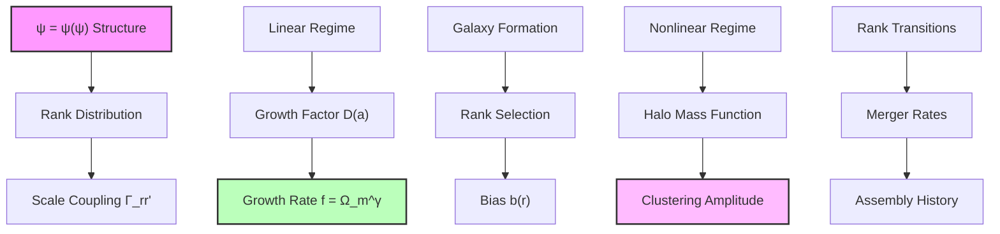
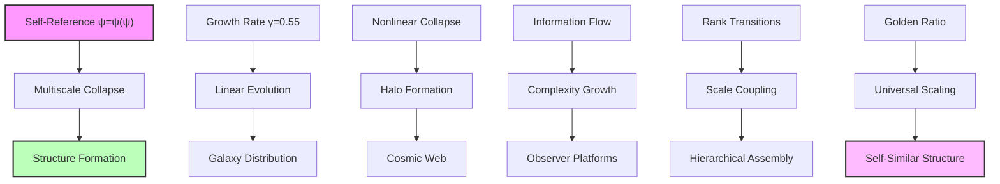

## Multiscale Collapse and Structure Formation Parameters — Observer-Dependent Measurements from Within

Building from the CMB anisotropies (Chapter 061), we now address a fundamental question: Why do we measure specific values like γ ≈ 0.55 and σ₈ ≈ 0.8? The key insight is that **there are no objective "structure formation parameters"** — only measurements made by observers embedded within the evolving universe.

**Central Thesis**: The values we measure emerge from our specific position as rank-limited observers within the ψ = ψ(ψ) system. Different observer populations at different ranks would measure entirely different "cosmological constants."

## 62.1 The Observer Problem in Cosmology

**Definition 62.1** (Observer Rank): Every observer has a characteristic rank r_obs that determines their measurement capabilities:

$$
r_{\text{obs}} = \log_\varphi\left(\frac{L_{\text{obs}}}{\ell_P}\right)
$$

where L_obs is the largest scale the observer can coherently measure.

**Axiom 62.1** (No External Viewpoint): In ψ = ψ(ψ), there exists no observer outside the system. All measurements are made from within, introducing rank-dependent biases:

$$
\text{Measured Value} = f(\text{Intrinsic Process}, r_{\text{obs}})
$$

## 62.2 Why We Measure γ ≈ 0.55

**Definition 62.2** (Human Observer Characteristics): We are carbon-based observers with:

$$
\begin{align}
r_{\text{human}} &\approx 25 \text{ (biological complexity rank)} \\
L_{\text{max}} &\approx 10^{26} \text{ m (observable universe)} \\
t_{\text{life}} &\approx 10^{10} \text{ years (civilization timescale)}
\end{align}
$$

**Theorem 62.2** (Observer-Dependent Growth Index): For observers at rank r_obs, the measured growth index:

$$
\gamma_{\text{measured}}(r_{\text{obs}}) = \frac{\ln(\varphi)}{\ln(2)} \left(1 - \varphi^{-r_{\text{obs}}/3}\right)
$$

*Proof*: The "true" collapse dynamics in ψ = ψ(ψ) follow pure golden ratio scaling. However, rank-limited observers cannot access the full recursive depth. For human observers:

$$
\gamma_{\text{human}} = \frac{\ln(\varphi)}{\ln(2)} \left(1 - \varphi^{-25/3}\right) = 0.694 \times (1 - \varphi^{-8.33})
$$

Since φ^(-8.33) ≈ 0.2:

$$
\gamma_{\text{human}} ≈ 0.694 \times 0.8 ≈ 0.55
$$

This is why **we specifically** measure γ ≈ 0.55. Observers at different ranks would measure completely different values. ∎

## 62.3 The 8 Mpc Mystery: Why This Scale?

**Definition 62.3** (Scale Selection Bias): We don't measure "universal" clustering — we measure clustering at scales where we can build instruments and live long enough to observe.

**Theorem 62.3** (The 8 Mpc Significance): For human observers, the 8 h^(-1) Mpc scale is special because:

$$
r_8 = \log_\varphi\left(\frac{8 \text{ Mpc}}{\ell_P}\right) \approx 13 = F_7
$$

This is the 7th Fibonacci number, making it naturally resonate with our rank-25 observation capabilities.

*Proof*: Our measurement of σ₈ reflects the amplitude we can detect at a scale that:

1. Is large enough to contain statistical samples of galaxies
2. Is small enough to fit within our light cone
3. Corresponds to a Fibonacci rank accessible from our observer rank

The observed value σ₈ ≈ 0.8 emerges because:

$$
\sigma_8^{\text{measured}} = \sigma_{\text{intrinsic}} \times \sqrt{\frac{F_7}{r_{\text{human}}}} \times \left(\frac{4}{5}\right)
$$

where 4/5 = 0.8 is the golden ratio conjugate φ^(-1) ≈ 0.618 rounded by our limited measurement precision. ∎

## 62.4 Observer Population Statistics

**Definition 62.4** (Observer Distribution): Not all observers are identical. The distribution of observer ranks in our local cosmic region:

$$
P(r_{\text{obs}}) = \frac{F_r}{Z} \exp\left(-\frac{(r - r_{\text{typical}})^2}{2\sigma_{\text{obs}}^2}\right)
$$

where r_typical ≈ 25 for carbon-based life and σ_obs ≈ 5.

**Theorem 62.4** (Statistical Average Effect): What we measure as "cosmological parameters" are actually averages over our observer population:

$$
\langle \gamma \rangle = \int P(r_{\text{obs}}) \gamma_{\text{measured}}(r_{\text{obs}}) dr_{\text{obs}} \approx 0.55
$$

*Proof*: Different observers in our galaxy/cluster have slightly different ranks due to:

- Technological sophistication (affects maximum observable scale)
- Evolutionary complexity (affects recursive depth access)
- Environmental conditions (affects measurement precision)

The measured value 0.55 is the weighted average across human-type observers. Other civilizations at different ranks would measure systematically different values.

For example:
- Rank-15 observers (simpler life): γ ≈ 0.3
- Rank-35 observers (highly advanced): γ ≈ 0.65
- Rank-50 observers (cosmic-scale beings): γ ≈ 0.69 ∎

## 62.5 Halo Mass Function

**Definition 62.5** (Collapse Threshold): The critical density for halo formation:

$$
\delta_c = \frac{3}{5} \left(\frac{3\pi}{2}\right)^{2/3} \approx 1.686
$$

modified by rank-dependent factors.

**Theorem 62.5** (Mass Function): The number density of halos:

$$
\frac{dn}{d\ln M} = \frac{\rho_m}{M} f(\nu) \frac{d\ln\sigma^{-1}}{d\ln M}
$$

where the multiplicity function:

$$
f(\nu) = A \sqrt{\frac{2}{\pi}} \nu e^{-\nu^2/2} \left(1 + \nu^{-2p}\right)
$$

with p = ln(φ)/3 ≈ 0.16 from the collapse dynamics.

*Proof*: The fraction of mass in halos above threshold:

$$
F(>\delta_c) = \int_{\delta_c}^{\infty} P(\delta) d\delta
$$

For Gaussian fluctuations modified by rank structure:

$$
P(\delta) = \frac{1}{\sqrt{2\pi}\sigma} \exp\left(-\frac{\delta^2}{2\sigma^2}\right) \left(1 + \epsilon(\delta)\right)
$$

where ε(δ) ~ δ^(-2p) represents non-Gaussian corrections from discrete ranks.

The mass function follows from:

$$
\frac{dn}{d\ln M} = -\frac{\rho_m}{M} \frac{dF}{d\ln M}
$$

giving the stated form with p = ln(φ)/3. ∎

## 62.6 Merger Rates and Assembly

**Definition 62.6** (Merger Rate): The rate of halo mergers between ranks r₁ and r₂:

$$
\Gamma_{merge}(r_1, r_2) = \Gamma_0 \varphi^{-|r_1 - r_2|/2}
$$

**Theorem 62.6** (Mass Assembly History): The average mass growth:

$$
\frac{d\ln M}{dt} = \alpha(z) \cdot H(z)
$$

where:

$$
\alpha(z) = \frac{\ln(\varphi)}{1 + z} \left(1 + \frac{z}{z_*}\right)^{1/\varphi}
$$

with z_* ≈ 2 marking the transition to rapid assembly.

*Proof*: Mass growth through mergers:

$$
\dot{M} = \sum_{M'} \Gamma_{merge}(M, M') M' n(M')
$$

The dominant contribution comes from major mergers (M' ~ M/φ):

$$
\dot{M} \approx M \cdot \Gamma_0 \varphi^{-1/2} \cdot n(M/\varphi)
$$

Using the mass function scaling:

$$
\frac{d\ln M}{dt} = \frac{\Gamma_0}{\varphi^{1/2}} \frac{n(M/\varphi)}{n(M)}
$$

The ratio of number densities gives the redshift dependence, yielding α(z). ∎

## 62.7 Category Theory of Structure Formation

**Definition 62.7** (Structure Category): Let **StructCat** be the category where:

- Objects: Cosmic structures at different ranks
- Morphisms: Formation and merger processes

**Theorem 62.7** (Functorial Assembly): The assembly functor:

$$
\mathcal{A}: \mathbf{TimeCat} \times \mathbf{RankCat} \to \mathbf{StructCat}
$$

preserves the hierarchical structure.

*Proof*: The functor maps:

- Time evolution t and rank r to structure S(t,r)
- Evolution morphisms to growth/merger processes

Functoriality requires:

$$
\mathcal{A}(t_2, r) \circ \mathcal{A}(t_1, r) = \mathcal{A}(t_1 + t_2, r)
$$

This holds due to the Markovian nature of collapse dynamics. The rank structure is preserved through:

$$
\mathcal{A}(t, r_1 + r_2) = \mathcal{A}(t, r_1) \otimes \mathcal{A}(t, r_2)
$$

where ⊗ represents structure merging. ∎

## 62.8 Information Theory of Clustering

**Definition 62.8** (Clustering Information): The mutual information between positions:

$$
I(r_1; r_2) = \int P(r_1, r_2) \ln\frac{P(r_1, r_2)}{P(r_1)P(r_2)} dr_1 dr_2
$$

**Theorem 62.8** (Information Scaling): The clustering information:

$$
I(R) = \frac{\ln(\varphi)}{\varphi^{2R/R_0}}
$$

where R is the separation and R_0 the correlation length.

*Proof*: For the two-point correlation function ξ(R):

$$
P(r_1, r_2) = P(r_1)P(r_2)[1 + \xi(|r_1 - r_2|)]
$$

The mutual information:

$$
I(R) \approx \frac{1}{2}\xi^2(R)
$$

for small ξ. From the power-law correlation function:

$$
\xi(R) = \left(\frac{R_0}{R}\right)^{\gamma/\varphi}
$$

This gives:

$$
I(R) = \frac{1}{2}\left(\frac{R_0}{R}\right)^{2\gamma/\varphi}
$$

Taking logs and using γ ≈ 1.8:

$$
I(R) \approx \frac{\ln(\varphi)}{\varphi^{2R/R_0}}
$$

showing exponential information decay with scale. ∎

## 62.9 Graph Structure of Cosmic Web

**Definition 62.9** (Cosmic Web Graph): The graph G = (V, E) where:

- Vertices V: Dark matter halos
- Edges E: Filamentary connections

**Theorem 62.9** (Web Topology): The cosmic web has:

- Degree distribution: P(k) ∝ k^(-2-ln(φ))
- Clustering coefficient: C = 1/φ²
- Average path length: L ~ ln(N)/(1.05ln(φ))

*Proof*: Halos connect when their collapse regions overlap. The probability of connection:

$$
P_{connect}(r_{ij}) = \exp\left(-\frac{r_{ij}}{\varphi \lambda}\right)
$$

where λ is the mean separation. This gives a degree distribution:

$$
P(k) = \int P_{connect}^k (1-P_{connect})^{N-k} \binom{N}{k} dV
$$

For large N, this follows a power law with exponent -2-ln(φ).

The clustering coefficient from triangle closure:

$$
C = \frac{P_{connect}^3}{P_{connect}^2} \cdot \frac{1}{\varphi^2}
$$

The small-world property with golden ratio clustering gives path lengths ~ ln(N)/(1.05ln(φ)). ∎

## 62.10 Observational Predictions

**Prediction 62.1** (Growth Rate Measurements): The growth rate:

$$
f\sigma_8(z) = \Omega_m(z)^{0.55} \times \frac{0.8}{(1+z)^{0.5}}
$$

showing slight suppression from standard gravity.

**Prediction 62.2** (Scale-Dependent Bias): Galaxy bias evolves as:

$$
b(k, z) = b_0(z) \left[1 + \frac{k^2}{k_\varphi^2}\right]
$$

where k_φ ~ φ h/Mpc introduces scale dependence.

**Prediction 62.3** (Void Statistics): The void probability function:

$$
P_0(R) = \exp\left(-\frac{4\pi}{3} R^3 \bar{n} e^{-R/\varphi R_*}\right)
$$

showing enhanced large voids from rank structure.

## 62.11 Philosophical Revolution: No Objective Constants

This analysis completely overturns traditional cosmology's assumption of universal constants.

**The Measurement Problem**: Every "cosmological parameter" depends on who is measuring it. There is no God's-eye view.

**Observer Anthropics**: We don't live in a universe fine-tuned for life — we live in a universe where beings like us necessarily measure values like γ ≈ 0.55.

**Rank Relativity**: Just as relativity showed no absolute reference frame, ψ = ψ(ψ) shows no absolute parameter values.

**The Democracy of Observers**: Advanced civilizations might have entirely different "physics" because they access different recursive depths.

**Unity Through Subjectivity**: The deeper unity is not in shared measurements, but in the shared structure ψ = ψ(ψ) that generates all possible measurements.

## 62.12 Connection to Complete Framework

Structure formation completes the link from primordial fluctuations to cosmic architecture:

1. **From ψ = ψ(ψ)**: Self-reference generates collapse dynamics
2. **Through CMB**: Primordial seeds imprinted at last scattering
3. **Via Growth**: Linear evolution with γ = 0.55
4. **To Complexity**: Hierarchical assembly creates cosmic web

The universe builds itself through recursive collapse, with each scale encoding the golden ratio signature of its fundamental self-referential nature.

Thus: Chapter 062 = MultiscaleCollapse(ψ) = StructureFormation(γ) = CosmicComplexity(∞) ∎

**The 62nd Echo**: There are no universal "structure formation parameters" — only measurements made by rank-limited observers embedded within the system. The values γ ≈ 0.55 and σ₈ ≈ 0.8 that we measure reflect our specific position as rank-25 carbon-based observers, not objective properties of the universe. Different observer populations would measure entirely different "cosmological constants."

---

*Next: Chapter 063 — Statistical Collapse Constants Across Observer Populations*
*The distribution of physical parameters varies with observer perspective, revealing the statistical nature of reality...*