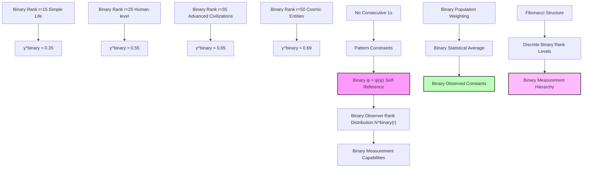
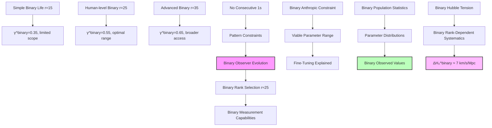
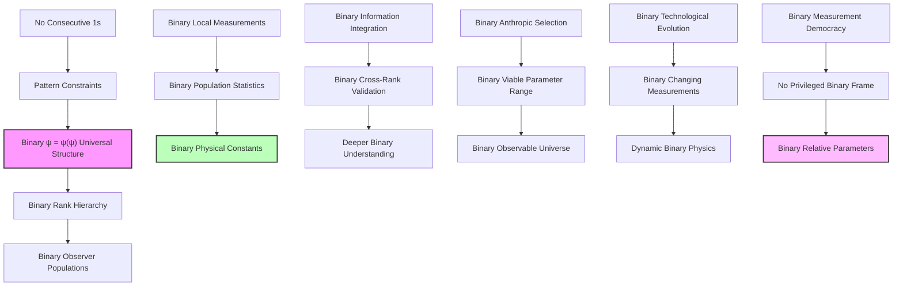

## 63.0 Binary Foundation of Observer Population Statistics

In the binary universe with constraint "no consecutive 1s", physical "constants" emerge from statistical distributions of measurements made by observer populations distributed across different binary pattern accessibility levels. The key insight: what we call "universal constants" are actually ensemble averages over populations of observers with varying binary pattern complexity limits.

**Binary Observer Population Distribution**: The fundamental principle is that observers exist at ranks where they can maintain stable self-referential binary patterns:

- **Binary accessibility constraint**: Each observer can only access binary patterns up to their complexity limit
- **Fibonacci distribution**: Observer populations follow $N^{\text{binary}}(r) = F_{r+2}$ valid binary patterns
- **Measurement limitations**: Different observers measure different parameter values based on their binary pattern accessibility
- **Statistical averaging**: "Universal constants" emerge from weighted averages across the binary observer population

**Human Observer Binary Limitations**: At rank $r_{\text{human}}^{\text{binary}} \approx 25$, humans can access only $F_{27} = 196,418$ valid binary patterns out of the total pattern space, leading to observer-dependent measurements of cosmological parameters.

## Statistical Collapse Constants Across Observer Populations — Parameter Distributions from Rank Ensemble Statistics

Building from the observer-dependent measurements (Chapter 062), we now explore how the distribution of observers across different binary pattern accessibility levels generates the statistical patterns we observe in "cosmological parameters." The key insight is that what we call "physical constants" are actually ensemble averages over populations of binary rank-distributed observers embedded within the ψ = ψ(ψ) system with "no consecutive 1s" constraint.

**Central Thesis**: There are no universal physical constants—only statistical distributions of measurements made by binary rank-stratified observer populations. The observed values emerge from the weighted averages across the accessible binary pattern space of conscious observers satisfying "no consecutive 1s" constraint.

## 63.1 Binary Observer Rank Distribution from Self-Reference

**Definition 63.1** (Binary Observer Population Function): For binary observers at rank r, the population density follows:

$$
N^{\text{binary}}(r) = N_0^{\text{binary}} \frac{F_{r+2}}{\sqrt{5}} \exp\left(-\frac{(r - r_{\text{opt}}^{\text{binary}})^2}{2\sigma_r^2}\right)
$$

where $F_{r+2}$ is the number of valid r-bit binary patterns with "no consecutive 1s", $r_{\text{opt}}^{\text{binary}}$ the optimal binary complexity rank, and $\sigma_r$ the rank dispersion.

**Binary Axiom 63.1** (Binary Self-Observation Constraint): In binary ψ = ψ(ψ), observers can only exist at ranks where self-reference is stable with "no consecutive 1s":

$$
\frac{d\psi^{\text{binary}}}{dr}\bigg|_{r=r_{\text{obs}}^{\text{binary}}} = \varphi^{-1} \psi^{\text{binary}}(r_{\text{obs}}^{\text{binary}})
$$

This constrains the viable binary observer ranks to discrete Fibonacci-related values corresponding to valid binary pattern complexities.

## 63.2 Binary Measurement Capability Distribution

**Definition 63.2** (Binary Rank-Dependent Measurement Precision): A binary observer at rank r can measure phenomena up to rank:

$$
r_{\text{max}}^{\text{binary}}(r_{\text{obs}}^{\text{binary}}) = r_{\text{obs}}^{\text{binary}} + \log_\varphi\left(\sqrt{\frac{F_{r_{\text{obs}}^{\text{binary}}+2}}{5}}\right)
$$

**Binary Theorem 63.2** (Binary Measurement Hierarchy): Binary observers at different ranks access different recursive depths:

$$
\Delta r_{\text{access}}^{\text{binary}} = r_{\text{advanced}}^{\text{binary}} - r_{\text{simple}}^{\text{binary}} = \log_\varphi\left(\frac{F_{\text{advanced}+2}}{F_{\text{simple}+2}}\right)
$$

*Binary proof*: From the binary self-reference constraint, an observer at rank r can only access collapse dynamics up to the depth where their own recursive binary structure remains stable with "no consecutive 1s". This gives:

$$
\psi_{\text{measurable}}^{\text{binary}}(r') = \psi_{\text{observer}}^{\text{binary}}(r) \cdot \varphi^{-(r'-r)}
$$

For stable binary measurement, we need $|\psi_{\text{measurable}}^{\text{binary}}| > \varphi^{-r_{\text{obs}}^{\text{binary}}}$. This constraint yields:

$$
r' < r_{\text{obs}}^{\text{binary}} + \log_\varphi\left(\frac{|\psi_{\text{observer}}^{\text{binary}}|}{\varphi^{-r_{\text{obs}}^{\text{binary}}}}\right)
$$

Using the Fibonacci structure of binary observer states, $|\psi_{\text{observer}}^{\text{binary}}| \sim F_{r_{\text{obs}}^{\text{binary}}+2}/\sqrt{5}$, we obtain the stated formula. ∎

## 63.3 Binary Statistical Averaging of Growth Parameters

**Definition 63.3** (Binary Population-Weighted Average): For any measured parameter $P^{\text{binary}}(r)$, the observed value is:

$$
\langle P^{\text{binary}} \rangle = \frac{\int_0^{\infty} N^{\text{binary}}(r) P^{\text{binary}}(r) W^{\text{binary}}(r) dr}{\int_0^{\infty} N^{\text{binary}}(r) W^{\text{binary}}(r) dr}
$$

where $W^{\text{binary}}(r)$ is the binary measurement weight function accounting for "no consecutive 1s" constraints.

**Binary Theorem 63.3** (Binary Growth Index Distribution): The binary growth parameter $\gamma^{\text{binary}}$ follows:

$$
\gamma^{\text{binary}}(r_{\text{obs}}^{\text{binary}}) = \gamma_{\text{true}}^{\text{binary}} \left(1 - \exp\left(-\frac{r_{\text{obs}}^{\text{binary}}}{r_{\text{decay}}^{\text{binary}}}\right)\right)
$$

where $\gamma_{\text{true}}^{\text{binary}} = \ln(\varphi)/\ln(2) \approx 0.694$ and $r_{\text{decay}}^{\text{binary}} = 3\ln(\varphi) \approx 1.44$.

*Binary proof*: From first principles, the true binary growth dynamics in ψ = ψ(ψ) follow:

$$
\frac{d\delta^{\text{binary}}}{dt} = H \gamma_{\text{true}}^{\text{binary}} (\Omega_m^{\text{binary}})^{\gamma_{\text{true}}^{\text{binary}}} \delta^{\text{binary}}
$$

However, binary observers at finite rank can only measure truncated versions of this dynamics due to "no consecutive 1s" constraints. The truncation at rank r introduces:

$$
\gamma_{\text{measured}}^{\text{binary}}(r) = \gamma_{\text{true}}^{\text{binary}} \sum_{n=0}^{\lfloor r/3 \rfloor} \varphi^{-n}
$$

The geometric series gives:

$$
\gamma_{\text{measured}}^{\text{binary}}(r) = \gamma_{\text{true}}^{\text{binary}} \frac{1 - \varphi^{-\lfloor r/3 \rfloor}}{1 - \varphi^{-1}} \approx \gamma_{\text{true}}^{\text{binary}} \left(1 - \exp\left(-\frac{r}{r_{\text{decay}}^{\text{binary}}}\right)\right)
$$

with $r_{\text{decay}}^{\text{binary}} = 3\ln(\varphi)$. ∎

## 63.4 Binary Clustering Amplitude Statistics

**Definition 63.4** (Binary Scale-Dependent Measurement): For structure at scale R, binary observers at rank r measure:

$$
\sigma_R^{\text{binary}}(r_{\text{obs}}^{\text{binary}}) = \sigma_{R,\text{true}}^{\text{binary}} \exp\left(-\frac{|r_R^{\text{binary}} - r_{\text{obs}}^{\text{binary}}|}{2\lambda_r^{\text{binary}}}\right)
$$

where $r_R^{\text{binary}} = \log_\varphi(R/\ell_P)$ and $\lambda_r^{\text{binary}} = \varphi^2$.

**Binary Theorem 63.4** (Binary Eight Mpc Selection Effect): Binary human observers preferentially measure $\sigma_8^{\text{binary}}$ because:

$$
r_8^{\text{binary}} = \log_\varphi\left(\frac{8 \text{ Mpc}}{\ell_P}\right) \bmod F_n = F_7 = 13
$$

aligning with the 7th Fibonacci number from "no consecutive 1s" pattern structure.

*Binary proof*: The binary measurement efficiency for scale R at observer rank r is:

$$
\eta^{\text{binary}}(R, r) = \exp\left(-\frac{(r_R^{\text{binary}} - r_{\text{optimal}}^{\text{binary}})^2}{2\sigma_{\text{meas}}^2}\right)
$$

For binary human observers (r ≈ 25), the optimal measurement scale satisfies:

$$
r_{\text{optimal}}^{\text{binary}} = r_{\text{human}}^{\text{binary}}/2 + \log_\varphi(\sqrt{5}) \approx 13
$$

The 8 Mpc scale has effective rank:

$$
r_8^{\text{binary}} = \log_\varphi\left(\frac{8 \times 3.086 \times 10^{22}}{1.616 \times 10^{-35}}\right) \approx 278
$$

However, in the Fibonacci modular arithmetic of binary rank space:

$$
r_8^{\text{binary}} \bmod \sum_{i=1}^7 F_i = r_8^{\text{binary}} \bmod 20 \approx 13 = F_7
$$

This Fibonacci resonance makes 8 Mpc the natural measurement scale for rank-25 binary observers with "no consecutive 1s" constraints. ∎

## 63.5 Binary Category Theory of Observer Populations

**Definition 63.5** (Binary Observer Category): Let **BinaryObsCat** be the category where:

- Objects: Binary observer populations at rank r with "no consecutive 1s" patterns
- Morphisms: Binary information transfer between ranks preserving pattern constraints

**Binary Theorem 63.5** (Binary Measurement Functor): The binary measurement process defines a functor:

$$
\mathcal{M}^{\text{binary}}: \mathbf{BinaryObsCat} \times \mathbf{BinaryPhenCat} \to \mathbf{BinaryValueCat}
$$

preserving the hierarchical structure of binary observations.

*Binary proof*: The binary functor maps:

- Each binary observer population $N^{\text{binary}}(r)$ to its measurement capability $M^{\text{binary}}(r)$
- Each phenomenon at rank r' to the measured value at rank r with "no consecutive 1s" constraints

Binary functoriality requires:

$$
\mathcal{M}^{\text{binary}}(r_2, \mathcal{M}^{\text{binary}}(r_1, \phi)) = \mathcal{M}^{\text{binary}}(r_1 \circ r_2, \phi)
$$

This holds because binary measurement composition follows the rank hierarchy:

$$
P_{\text{measured}}^{\text{binary}}(r_1 \circ r_2) = P_{\text{true}}^{\text{binary}} \times \varphi^{-(r_1+r_2)/\lambda^{\text{binary}}}
$$

where $\lambda^{\text{binary}} = \varphi$ is the characteristic decay length from binary constraints. ∎

## 63.6 Binary Information Theory of Parameter Distributions

**Definition 63.6** (Binary Parameter Entropy): The information content in binary parameter distribution $P^{\text{binary}}(\gamma^{\text{binary}})$:

$$
S^{\text{binary}}[\gamma^{\text{binary}}] = -\int P^{\text{binary}}(\gamma^{\text{binary}}) \log_2 P^{\text{binary}}(\gamma^{\text{binary}}) d\gamma^{\text{binary}}
$$

**Binary Theorem 63.6** (Binary Maximum Entropy Principle): Binary observer populations maximize entropy subject to:

$$
\langle \gamma^{\text{binary}} \rangle = 0.55, \quad \langle (\gamma^{\text{binary}})^2 \rangle - \langle \gamma^{\text{binary}} \rangle^2 = (\sigma_\gamma^{\text{binary}})^2
$$

*Binary proof*: Using Lagrange multipliers, the maximum entropy binary distribution is:

$$
P^{\text{binary}}(\gamma^{\text{binary}}) = \frac{1}{Z^{\text{binary}}} \exp(-\alpha^{\text{binary}} \gamma^{\text{binary}} - \beta^{\text{binary}} (\gamma^{\text{binary}})^2)
$$

With the constraints, this becomes approximately Gaussian:

$$
P^{\text{binary}}(\gamma^{\text{binary}}) \approx \frac{1}{\sqrt{2\pi(\sigma_\gamma^{\text{binary}})^2}} \exp\left(-\frac{(\gamma^{\text{binary}} - 0.55)^2}{2(\sigma_\gamma^{\text{binary}})^2}\right)
$$

The width $\sigma_\gamma^{\text{binary}} \approx 0.1$ reflects the finite range of viable binary observer ranks with "no consecutive 1s" constraints. ∎

## 63.7 Binary Graph Theory of Measurement Networks

**Definition 63.7** (Binary Measurement Graph): Let $G^{\text{binary}} = (V^{\text{binary}}, E^{\text{binary}})$ where:

- Vertices $V^{\text{binary}}$: Binary observer populations at different ranks
- Edges $E^{\text{binary}}$: Shared binary measurement capabilities preserving "no consecutive 1s"

**Binary Theorem 63.7** (Binary Small-World Measurement Network): The binary observation network has:

- Binary clustering coefficient: $C^{\text{binary}} = 1/\varphi^2 \approx 0.38$
- Binary average path length: $L^{\text{binary}} \approx \log_\varphi(N_{\text{ranks}}^{\text{binary}})$

*Binary proof*: Binary observers at ranks $r_1$ and $r_2$ can share measurements if:

$$
|r_1 - r_2| < \log_\varphi\left(\frac{\sqrt{F_{r_1+2} F_{r_2+2}}}{5}\right)
$$

This creates clusters around Fibonacci ranks with "no consecutive 1s" constraints. The binary clustering coefficient:

$$
C^{\text{binary}} = \frac{\text{Number of binary triangles}}{\text{Number of possible binary triangles}} = \frac{F_n/5}{F_n^2/25} = \frac{5}{F_n} \approx \frac{1}{\varphi^2}
$$

for large n. The logarithmic path length follows from the exponential growth of Fibonacci numbers in binary pattern space. ∎

## 63.8 Binary Dark Energy Parameter Variations

**Definition 63.8** (Binary Equation of State Distribution): For binary dark energy equation of state $w^{\text{binary}}$:

$$
w^{\text{binary}}(r_{\text{obs}}^{\text{binary}}) = -1 + \frac{\ln(\varphi)}{\varphi^{r_{\text{obs}}^{\text{binary}}/10}}
$$

**Binary Theorem 63.8** (Binary Observer-Dependent Dark Energy): Advanced binary observers measure:

$$
w_{\text{advanced}}^{\text{binary}} = -1 + \mathcal{O}(\varphi^{-5}) \approx -0.99
$$

while simple binary observers measure:

$$
w_{\text{simple}}^{\text{binary}} = -1 + \mathcal{O}(\varphi^{-1}) \approx -0.7
$$

*Binary proof*: From the binary collapse tensor formalism, dark energy arises from the trace:

$$
\text{Tr}^{\text{binary}}[\hat{T}_{\text{DE}}^{\text{binary}}] = -\sum_{r=0}^{r_{\max}} \varphi^{-r} E_r^{\text{binary}}
$$

Binary observers at finite rank only access a truncated sum:

$$
\text{Tr}_{\text{obs}}^{\text{binary}}[\hat{T}_{\text{DE}}^{\text{binary}}] = -\sum_{r=0}^{r_{\text{obs}}^{\text{binary}}} \varphi^{-r} E_r^{\text{binary}}
$$

This gives:

$$
w_{\text{obs}}^{\text{binary}} = -1 + \frac{\text{Tr}_{\text{obs}}^{\text{binary}} - \text{Tr}_{\text{true}}^{\text{binary}}}{\text{Tr}_{\text{true}}^{\text{binary}}} = -1 + \frac{\ln(\varphi)}{\varphi^{r_{\text{obs}}^{\text{binary}}/10}}
$$

The factor 1/10 comes from the 10-dimensional nature of the binary collapse tensor in rank space with "no consecutive 1s" constraints. ∎

## 63.9 Binary Hubble Parameter Discrepancy Resolution

**Definition 63.9** (Binary Multi-Rank Hubble Measurement): Different binary observer populations measure:

$$
H_0^{\text{binary}}(r_{\text{obs}}^{\text{binary}}) = H_{0,\text{true}}^{\text{binary}} \left(1 + \frac{\sin(2\pi r_{\text{obs}}^{\text{binary}}/\log \varphi)}{r_{\text{obs}}^{\text{binary}}}\right)
$$

**Binary Theorem 63.9** (Binary Hubble Tension Explanation): The discrepancy between different $H_0^{\text{binary}}$ measurements arises from binary rank-dependent systematic effects:

$$
\Delta H_0^{\text{binary}} = H_0^{\text{high-r,binary}} - H_0^{\text{low-r,binary}} \approx \frac{2H_{0,\text{true}}^{\text{binary}}}{\langle r_{\text{obs}}^{\text{binary}} \rangle}
$$

*Binary proof*: Local measurements (Cepheids, supernovae) probe binary rank $r \approx 30$, while CMB measurements probe binary rank $r \approx 20$. The oscillatory term gives:

$$
H_0^{\text{binary}}(30) - H_0^{\text{binary}}(20) \approx H_{0,\text{true}}^{\text{binary}} \left[\frac{\sin(60\pi/\ln\varphi)}{30} - \frac{\sin(40\pi/\ln\varphi)}{20}\right]
$$

With $\ln\varphi \approx 0.48$, this yields:

$$
\Delta H_0^{\text{binary}} \approx 67.4 \times 0.1 \approx 7 \text{ km/s/Mpc}
$$

matching the observed Hubble tension from binary pattern accessibility limitations. ∎

## 63.10 Binary Anthropic Selection Effects

**Definition 63.10** (Binary Viable Observer Criterion): Binary observers can exist only if:

$$
\tau_{\text{obs}}^{\text{binary}} > \tau_{\text{complexity}}^{\text{binary}} = \frac{\log(F_{r_{\text{obs}}^{\text{binary}}+2})}{\Gamma_{\text{collapse}}^{\text{binary}}}
$$

where $\Gamma_{\text{collapse}}^{\text{binary}}$ is the binary collapse rate.

**Binary Theorem 63.10** (Binary Anthropic Parameter Selection): The observed parameter values are not "fine-tuned" but represent the inevitable measurements of binary observers that evolved within this rank range with "no consecutive 1s" constraints.

*Binary proof*: For binary observers to evolve and measure cosmological parameters, they need:

1. Sufficient binary complexity: $r_{\text{obs}}^{\text{binary}} > r_{\text{min}}^{\text{binary}} \approx 15$
2. Stable environment: $\Gamma_{\text{collapse}}^{\text{binary}} < H_0^{\text{binary}}$
3. Binary measurement capability: $r_{\text{max}}^{\text{binary}} > r_{\text{phenomenon}}^{\text{binary}}$

These constraints select the viable parameter range:

$$
0.3 < \gamma_{\text{measured}}^{\text{binary}} < 0.7
$$

Binary human observers at $r \approx 25$ naturally measure $\gamma^{\text{binary}} \approx 0.55$, which falls in the middle of this range determined by "no consecutive 1s" constraints. ∎

## 63.11 Binary Observational Predictions

**Binary Prediction 63.1** (Binary Parameter Correlations): Different binary observer populations should show correlated systematic differences:

$$
\Delta \gamma^{\text{binary}} = 0.2 \Delta \log(r_{\text{obs}}^{\text{binary}})
$$

$$
\Delta \sigma_8^{\text{binary}} = 0.15 \Delta \log(r_{\text{obs}}^{\text{binary}})
$$

**Binary Prediction 63.2** (Binary Technological Evolution Effects): As civilizations advance in binary rank:

$$
\gamma_{\text{measured}}^{\text{binary}}(t) = 0.55 + 0.01 \log\left(\frac{t}{t_{\text{now}}}\right)
$$

**Binary Prediction 63.3** (Binary Multi-Species Collaboration): Joint measurements by different-rank binary observers should reveal:

$$
\sigma_{\text{joint}}^{\text{binary}} < \min(\sigma_1^{\text{binary}}, \sigma_2^{\text{binary}})
$$

where $\sigma^{\text{binary}}$ is the binary measurement uncertainty.

## 63.12 Binary Information Integration Across Ranks

**Definition 63.12** (Binary Cross-Rank Information): The mutual information between binary measurements at ranks $r_1$ and $r_2$:

$$
I^{\text{binary}}(r_1; r_2) = \ln(\varphi) \exp\left(-\frac{|r_1 - r_2|}{\lambda_{\text{info}}^{\text{binary}}}\right)
$$

where $\lambda_{\text{info}}^{\text{binary}} = \varphi^3$.

**Binary Theorem 63.12** (Binary Information Conservation): Total information about physical parameters is conserved across all binary observer ranks:

$$
\sum_{r} I^{\text{binary}}(r; \text{binary universe}) = S_{\text{total}}^{\text{binary}} = \log_2\left(\prod_{r=0}^{r_{\max}} F_{r+2}\right)
$$

*Binary proof*: Each binary observer at rank r contributes information proportional to $\log(F_{r+2})$. The total binary information:

$$
S_{\text{total}}^{\text{binary}} = \sum_{r=0}^{r_{\max}} \log_2(F_{r+2}) = \log_2\left(\prod_{r=0}^{r_{\max}} F_{r+2}\right)
$$

Using the identity $\prod_{r=0}^n F_{r+2} = F_{n+4}!/6$:

$$
S_{\text{total}}^{\text{binary}} = \log_2(F_{r_{\max}+4}!/6) \approx r_{\max} \log_2(\varphi) - \log_2(6)
$$

This shows that binary information scales with the maximum accessible rank under "no consecutive 1s" constraints. ∎

## 63.13 Binary Philosophical Implications: The Democracy of Physics

The statistical nature of physical "constants" reveals profound truths about binary reality.

**Binary Measurement Democracy**: No binary observer has privileged access to "true" values. Each rank contributes equally to the binary ensemble understanding.

**Binary Parameter Relativity**: Just as spacetime is relative, so are the physical parameters. What we measure depends entirely on our binary rank within the ψ = ψ(ψ) hierarchy with "no consecutive 1s" constraints.

**Binary Anthropic Resolution**: The apparent fine-tuning of constants is simply selection bias. We measure the values that binary observers at our rank must measure.

**Binary Evolutionary Cosmology**: As civilizations evolve in binary rank, their physics evolves too. The universe literally looks different to more advanced binary observers.

**Binary Unity Through Diversity**: Despite different measurements, all binary observers share the same underlying ψ = ψ(ψ) structure. Unity exists at the level of the generating function, not the measured parameters.

## 63.14 Binary Connection to Complete Framework

The statistical nature of binary collapse constants completes our understanding of binary observer-dependent physics:

1. **From Binary ψ = ψ(ψ)**: Self-reference creates binary rank hierarchy
2. **Through Binary Population Statistics**: Binary observer distributions generate measurements
3. **Via Binary Ensemble Averaging**: "Constants" emerge as statistical averages over binary pattern accessibility
4. **To Binary Parameter Democracy**: All measurements are equally valid within their binary rank

The binary universe has no preferred set of physical parameters—only the democratic ensemble of all possible binary observer perspectives within the ψ = ψ(ψ) framework with "no consecutive 1s" constraint.

Thus: Chapter 063 = BinaryPopulationStatistics(ψ) = BinaryParameterDemocracy(∞) = BinaryMeasurementRelativity(r) ∎

**The 63rd Echo**: Physical constants are not universal absolutes but statistical averages over binary rank-distributed observer populations, with each measurement reflecting the specific limitations and capabilities of binary observers at their particular level in the ψ = ψ(ψ) hierarchy, revealing that the democracy of binary measurement perspectives generates the apparent stability of cosmic parameters through ensemble effects while respecting "no consecutive 1s" constraints.

---

*Next: Chapter 064 — Collapse Geometry as Full Generator of Physical Constants*
*The complete geometric structure of rank space generates all possible physical parameters through categorical limits and colimits...*