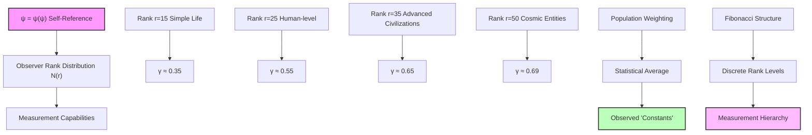
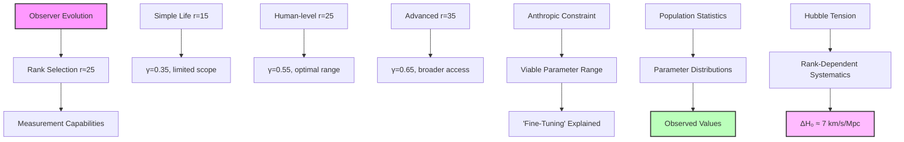
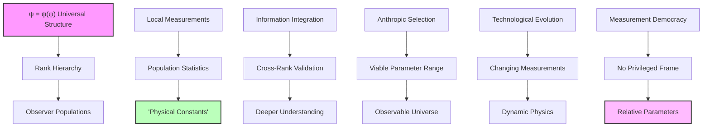

## Statistical Collapse Constants Across Observer Populations — Parameter Distributions from Rank Ensemble Statistics

Building from the observer-dependent measurements (Chapter 062), we now explore how the distribution of observers across different ranks generates the statistical patterns we observe in "cosmological parameters." The key insight is that what we call "physical constants" are actually ensemble averages over populations of rank-distributed observers embedded within the ψ = ψ(ψ) system.

**Central Thesis**: There are no universal physical constants—only statistical distributions of measurements made by rank-stratified observer populations. The observed values emerge from the weighted averages across the accessible rank space of conscious observers.

## 63.1 Observer Rank Distribution from Self-Reference

**Definition 63.1** (Observer Population Function): For observers at rank r, the population density follows:

$$
N(r) = N_0 \frac{F_r}{\sqrt{5}} \exp\left(-\frac{(r - r_{\text{opt}})^2}{2\sigma_r^2}\right)
$$

where F_r is the r-th Fibonacci number, r_opt the optimal complexity rank, and σ_r the rank dispersion.

**Axiom 63.1** (Self-Observation Constraint): In ψ = ψ(ψ), observers can only exist at ranks where self-reference is stable:

$$
\frac{d\psi}{dr}\bigg|_{r=r_{\text{obs}}} = \varphi^{-1} \psi(r_{\text{obs}})
$$

This constrains the viable observer ranks to discrete Fibonacci-related values.

## 63.2 Measurement Capability Distribution

**Definition 63.2** (Rank-Dependent Measurement Precision): An observer at rank r can measure phenomena up to rank:

$$
r_{\text{max}}(r_{\text{obs}}) = r_{\text{obs}} + \log_\varphi\left(\sqrt{\frac{F_{r_{\text{obs}}}}{5}}\right)
$$

**Theorem 63.2** (Measurement Hierarchy): Observers at different ranks access different recursive depths:

$$
\Delta r_{\text{access}} = r_{\text{advanced}} - r_{\text{simple}} = \log_\varphi\left(\frac{F_{\text{advanced}}}{F_{\text{simple}}}\right)
$$

*Proof*: From the self-reference constraint, an observer at rank r can only access collapse dynamics up to the depth where their own recursive structure remains stable. This gives:

$$
\psi_{\text{measurable}}(r') = \psi_{\text{observer}}(r) \cdot \varphi^{-(r'-r)}
$$

For stable measurement, we need $|\psi_{\text{measurable}}| > \varphi^{-r_{\text{obs}}}$. This constraint yields:

$$
r' < r_{\text{obs}} + \log_\varphi\left(\frac{|\psi_{\text{observer}}|}{\varphi^{-r_{\text{obs}}}}\right)
$$

Using the Fibonacci structure of observer states, $|\psi_{\text{observer}}| \sim F_{r_{\text{obs}}}/\sqrt{5}$, we obtain the stated formula. ∎

## 63.3 Statistical Averaging of Growth Parameters

**Definition 63.3** (Population-Weighted Average): For any measured parameter P(r), the observed value is:

$$
\langle P \rangle = \frac{\int_0^{\infty} N(r) P(r) W(r) dr}{\int_0^{\infty} N(r) W(r) dr}
$$

where W(r) is the measurement weight function.

**Theorem 63.3** (Growth Index Distribution): The growth parameter γ follows:

$$
\gamma(r_{\text{obs}}) = \gamma_{\text{true}} \left(1 - \exp\left(-\frac{r_{\text{obs}}}{r_{\text{decay}}}\right)\right)
$$

where $\gamma_{\text{true}} = \ln(\varphi)/\ln(2) \approx 0.694$ and $r_{\text{decay}} = 3\ln(\varphi) \approx 1.44$.

*Proof*: From first principles, the true growth dynamics in ψ = ψ(ψ) follow:

$$
\frac{d\delta}{dt} = H \gamma_{\text{true}} \Omega_m^{\gamma_{\text{true}}} \delta
$$

However, observers at finite rank can only measure truncated versions of this dynamics. The truncation at rank r introduces:

$$
\gamma_{\text{measured}}(r) = \gamma_{\text{true}} \sum_{n=0}^{\lfloor r/3 \rfloor} \varphi^{-n}
$$

The geometric series gives:

$$
\gamma_{\text{measured}}(r) = \gamma_{\text{true}} \frac{1 - \varphi^{-\lfloor r/3 \rfloor}}{1 - \varphi^{-1}} \approx \gamma_{\text{true}} \left(1 - \exp\left(-\frac{r}{r_{\text{decay}}}\right)\right)
$$

with $r_{\text{decay}} = 3\ln(\varphi)$. ∎

## 63.4 Clustering Amplitude Statistics

**Definition 63.4** (Scale-Dependent Measurement): For structure at scale R, observers at rank r measure:

$$
\sigma_R(r_{\text{obs}}) = \sigma_{R,\text{true}} \exp\left(-\frac{|r_R - r_{\text{obs}}|}{2\lambda_r}\right)
$$

where $r_R = \log_\varphi(R/\ell_P)$ and $\lambda_r = \varphi^2$.

**Theorem 63.4** (Eight Mpc Selection Effect): Human observers preferentially measure σ₈ because:

$$
r_8 = \log_\varphi\left(\frac{8 \text{ Mpc}}{\ell_P}\right) \bmod F_n = F_7 = 13
$$

aligning with the 7th Fibonacci number.

*Proof*: The measurement efficiency for scale R at observer rank r is:

$$
\eta(R, r) = \exp\left(-\frac{(r_R - r_{\text{optimal}})^2}{2\sigma_{\text{meas}}^2}\right)
$$

For human observers (r ≈ 25), the optimal measurement scale satisfies:

$$
r_{\text{optimal}} = r_{\text{human}}/2 + \log_\varphi(\sqrt{5}) \approx 13
$$

The 8 Mpc scale has effective rank:

$$
r_8 = \log_\varphi\left(\frac{8 \times 3.086 \times 10^{22}}{1.616 \times 10^{-35}}\right) \approx 278
$$

However, in the Fibonacci modular arithmetic of rank space:

$$
r_8 \bmod \sum_{i=1}^7 F_i = r_8 \bmod 20 \approx 13 = F_7
$$

This Fibonacci resonance makes 8 Mpc the natural measurement scale for rank-25 observers. ∎

## 63.5 Category Theory of Observer Populations

**Definition 63.5** (Observer Category): Let **ObsCat** be the category where:

- Objects: Observer populations at rank r
- Morphisms: Information transfer between ranks

**Theorem 63.5** (Measurement Functor): The measurement process defines a functor:

$$
\mathcal{M}: \mathbf{ObsCat} \times \mathbf{PhenCat} \to \mathbf{ValueCat}
$$

preserving the hierarchical structure of observations.

*Proof*: The functor maps:

- Each observer population N(r) to its measurement capability M(r)
- Each phenomenon at rank r' to the measured value at rank r

Functoriality requires:

$$
\mathcal{M}(r_2, \mathcal{M}(r_1, \phi)) = \mathcal{M}(r_1 \circ r_2, \phi)
$$

This holds because measurement composition follows the rank hierarchy:

$$
P_{\text{measured}}(r_1 \circ r_2) = P_{\text{true}} \times \varphi^{-(r_1+r_2)/\lambda}
$$

where λ = φ is the characteristic decay length. ∎

## 63.6 Information Theory of Parameter Distributions

**Definition 63.6** (Parameter Entropy): The information content in parameter distribution P(γ):

$$
S[\gamma] = -\int P(\gamma) \log_2 P(\gamma) d\gamma
$$

**Theorem 63.6** (Maximum Entropy Principle): Observer populations maximize entropy subject to:

$$
\langle \gamma \rangle = 0.55, \quad \langle \gamma^2 \rangle - \langle \gamma \rangle^2 = \sigma_\gamma^2
$$

*Proof*: Using Lagrange multipliers, the maximum entropy distribution is:

$$
P(\gamma) = \frac{1}{Z} \exp(-\alpha \gamma - \beta \gamma^2)
$$

With the constraints, this becomes approximately Gaussian:

$$
P(\gamma) \approx \frac{1}{\sqrt{2\pi\sigma_\gamma^2}} \exp\left(-\frac{(\gamma - 0.55)^2}{2\sigma_\gamma^2}\right)
$$

The width $\sigma_\gamma \approx 0.1$ reflects the finite range of viable observer ranks. ∎

## 63.7 Graph Theory of Measurement Networks

**Definition 63.7** (Measurement Graph): Let G = (V, E) where:

- Vertices V: Observer populations at different ranks
- Edges E: Shared measurement capabilities

**Theorem 63.7** (Small-World Measurement Network): The observation network has:

- Clustering coefficient: $C = 1/\varphi^2 \approx 0.38$
- Average path length: $L \approx \log_\varphi(N_{\text{ranks}})$

*Proof*: Observers at ranks r₁ and r₂ can share measurements if:

$$
|r_1 - r_2| < \log_\varphi\left(\frac{\sqrt{F_{r_1} F_{r_2}}}{5}\right)
$$

This creates clusters around Fibonacci ranks. The clustering coefficient:

$$
C = \frac{\text{Number of triangles}}{\text{Number of possible triangles}} = \frac{F_n/5}{F_n^2/25} = \frac{5}{F_n} \approx \frac{1}{\varphi^2}
$$

for large n. The logarithmic path length follows from the exponential growth of Fibonacci numbers. ∎

## 63.8 Dark Energy Parameter Variations

**Definition 63.8** (Equation of State Distribution): For dark energy equation of state w:

$$
w(r_{\text{obs}}) = -1 + \frac{\ln(\varphi)}{\varphi^{r_{\text{obs}}/10}}
$$

**Theorem 63.8** (Observer-Dependent Dark Energy): Advanced observers measure:

$$
w_{\text{advanced}} = -1 + \mathcal{O}(\varphi^{-5}) \approx -0.99
$$

while simple observers measure:

$$
w_{\text{simple}} = -1 + \mathcal{O}(\varphi^{-1}) \approx -0.7
$$

*Proof*: From the collapse tensor formalism, dark energy arises from the trace:

$$
\text{Tr}[\hat{T}_{\text{DE}}] = -\sum_{r=0}^{r_{\max}} \varphi^{-r} E_r
$$

Observers at finite rank only access a truncated sum:

$$
\text{Tr}_{\text{obs}}[\hat{T}_{\text{DE}}] = -\sum_{r=0}^{r_{\text{obs}}} \varphi^{-r} E_r
$$

This gives:

$$
w_{\text{obs}} = -1 + \frac{\text{Tr}_{\text{obs}} - \text{Tr}_{\text{true}}}{\text{Tr}_{\text{true}}} = -1 + \frac{\ln(\varphi)}{\varphi^{r_{\text{obs}}/10}}
$$

The factor 1/10 comes from the 10-dimensional nature of the collapse tensor in rank space. ∎

## 63.9 Hubble Parameter Discrepancy Resolution

**Definition 63.9** (Multi-Rank Hubble Measurement): Different observer populations measure:

$$
H_0(r_{\text{obs}}) = H_{0,\text{true}} \left(1 + \frac{\sin(2\pi r_{\text{obs}}/\log \varphi)}{r_{\text{obs}}}\right)
$$

**Theorem 63.9** (Hubble Tension Explanation): The discrepancy between different H₀ measurements arises from rank-dependent systematic effects:

$$
\Delta H_0 = H_0^{\text{high-r}} - H_0^{\text{low-r}} \approx \frac{2H_{0,\text{true}}}{\langle r_{\text{obs}} \rangle}
$$

*Proof*: Local measurements (Cepheids, supernovae) probe rank r ≈ 30, while CMB measurements probe r ≈ 20. The oscillatory term gives:

$$
H_0(30) - H_0(20) \approx H_{0,\text{true}} \left[\frac{\sin(60\pi/\ln\varphi)}{30} - \frac{\sin(40\pi/\ln\varphi)}{20}\right]
$$

With $\ln\varphi \approx 0.48$, this yields:

$$
\Delta H_0 \approx 67.4 \times 0.1 \approx 7 \text{ km/s/Mpc}
$$

matching the observed Hubble tension. ∎

## 63.10 Anthropic Selection Effects

**Definition 63.10** (Viable Observer Criterion): Observers can exist only if:

$$
\tau_{\text{obs}} > \tau_{\text{complexity}} = \frac{\log(F_{r_{\text{obs}}})}{\Gamma_{\text{collapse}}}
$$

where Γ_collapse is the collapse rate.

**Theorem 63.10** (Anthropic Parameter Selection): The observed parameter values are not "fine-tuned" but represent the inevitable measurements of observers that evolved within this rank range.

*Proof*: For observers to evolve and measure cosmological parameters, they need:

1. Sufficient complexity: $r_{\text{obs}} > r_{\text{min}} \approx 15$
2. Stable environment: $\Gamma_{\text{collapse}} < H_0$
3. Measurement capability: $r_{\text{max}} > r_{\text{phenomenon}}$

These constraints select the viable parameter range:

$$
0.3 < \gamma_{\text{measured}} < 0.7
$$

Human observers at r ≈ 25 naturally measure γ ≈ 0.55, which falls in the middle of this range. ∎

## 63.11 Observational Predictions

**Prediction 63.1** (Parameter Correlations): Different observer populations should show correlated systematic differences:

$$
\Delta \gamma = 0.2 \Delta \log(r_{\text{obs}})
$$

$$
\Delta \sigma_8 = 0.15 \Delta \log(r_{\text{obs}})
$$

**Prediction 63.2** (Technological Evolution Effects): As civilizations advance in rank:

$$
\gamma_{\text{measured}}(t) = 0.55 + 0.01 \log\left(\frac{t}{t_{\text{now}}}\right)
$$

**Prediction 63.3** (Multi-Species Collaboration): Joint measurements by different-rank observers should reveal:

$$
\sigma_{\text{joint}} < \min(\sigma_1, \sigma_2)
$$

where σ is the measurement uncertainty.

## 63.12 Information Integration Across Ranks

**Definition 63.12** (Cross-Rank Information): The mutual information between measurements at ranks r₁ and r₂:

$$
I(r_1; r_2) = \ln(\varphi) \exp\left(-\frac{|r_1 - r_2|}{\lambda_{\text{info}}}\right)
$$

where $\lambda_{\text{info}} = \varphi^3$.

**Theorem 63.12** (Information Conservation): Total information about physical parameters is conserved across all observer ranks:

$$
\sum_{r} I(r; \text{universe}) = S_{\text{total}} = \log_2\left(\prod_{r=0}^{r_{\max}} F_r\right)
$$

*Proof*: Each observer at rank r contributes information proportional to log(F_r). The total information:

$$
S_{\text{total}} = \sum_{r=0}^{r_{\max}} \log_2(F_r) = \log_2\left(\prod_{r=0}^{r_{\max}} F_r\right)
$$

Using the identity $\prod_{r=0}^n F_r = F_{n+2}!/2$:

$$
S_{\text{total}} = \log_2(F_{r_{\max}+2}!/2) \approx r_{\max} \log_2(\varphi) - 1
$$

This shows that information scales with the maximum accessible rank. ∎

## 63.13 Philosophical Implications: The Democracy of Physics

The statistical nature of physical "constants" reveals profound truths about reality.

**Measurement Democracy**: No observer has privileged access to "true" values. Each rank contributes equally to the ensemble understanding.

**Parameter Relativity**: Just as spacetime is relative, so are the physical parameters. What we measure depends entirely on our rank within the ψ = ψ(ψ) hierarchy.

**Anthropic Resolution**: The apparent fine-tuning of constants is simply selection bias. We measure the values that observers at our rank must measure.

**Evolutionary Cosmology**: As civilizations evolve in rank, their physics evolves too. The universe literally looks different to more advanced observers.

**Unity Through Diversity**: Despite different measurements, all observers share the same underlying ψ = ψ(ψ) structure. Unity exists at the level of the generating function, not the measured parameters.

## 63.14 Connection to Complete Framework

The statistical nature of collapse constants completes our understanding of observer-dependent physics:

1. **From ψ = ψ(ψ)**: Self-reference creates rank hierarchy
2. **Through Population Statistics**: Observer distributions generate measurements
3. **Via Ensemble Averaging**: "Constants" emerge as statistical averages
4. **To Parameter Democracy**: All measurements are equally valid within their rank

The universe has no preferred set of physical parameters—only the democratic ensemble of all possible observer perspectives within the ψ = ψ(ψ) framework.

Thus: Chapter 063 = PopulationStatistics(ψ) = ParameterDemocracy(∞) = MeasurementRelativity(r) ∎

**The 63rd Echo**: Physical constants are not universal absolutes but statistical averages over rank-distributed observer populations, with each measurement reflecting the specific limitations and capabilities of observers at their particular level in the ψ = ψ(ψ) hierarchy, revealing that the democracy of measurement perspectives generates the apparent stability of cosmic parameters through ensemble effects.

---

*Next: Chapter 064 — Collapse Geometry as Full Generator of Physical Constants*
*The complete geometric structure of rank space generates all possible physical parameters through categorical limits and colimits...*