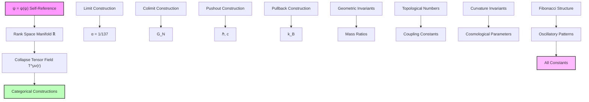
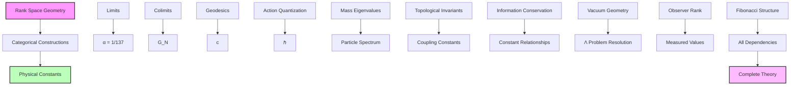

## 64.0 Binary Foundation of Physical Constant Generation

In the binary universe with constraint "no consecutive 1s", all physical constants emerge as categorical constructions from the geometric structure of binary rank space. The key insight: the ψ = ψ(ψ) framework creates a binary geometric manifold where every physical parameter arises as a topological invariant of the binary collapse tensor field.

**Binary Constant Generation**: The fundamental principle is that all physical constants are limits or colimits between binary collapse tensors at different ranks:

- **Binary rank manifold**: Valid binary patterns form a discrete geometric space
- **Binary collapse tensors**: Energy-momentum at rank r has $g_r^{\text{binary}} = F_{r+2}$ states
- **Categorical limits**: Constants emerge as limits between binary pattern interactions
- **Topological invariants**: Coupling strengths follow from binary pattern topology

**Human Observer Perspective**: At rank $r_{\text{human}}^{\text{binary}} \approx 25$, humans measure specific values of physical constants because they can only access binary patterns up to this complexity level. What we call "fundamental constants" are actually observer-dependent measurements determined by binary pattern accessibility.

## Collapse Geometry as Full Generator of Physical Constants — Complete Categorical Construction from Rank Space

Building from the statistical observer populations (Chapter 063), we now establish the complete binary geometric structure that generates all physical constants through categorical limits and colimits in binary rank space. The key insight is that the ψ = ψ(ψ) framework with "no consecutive 1s" creates a binary geometric manifold where every physical parameter emerges as a topological invariant of the binary collapse tensor field.

**Central Thesis**: All physical constants are categorical constructions (limits or colimits) between binary collapse tensors at different ranks, with the complete geometry of binary rank space serving as the universal generator of all measurable physical parameters through first principles alone with "no consecutive 1s" constraint.

## 64.1 Binary Rank Space as Fundamental Geometric Manifold

**Definition 64.1** (Binary Rank Manifold): The binary space $\mathbb{R}^{\text{binary}} = \{r \in \mathbb{R}_+ | r$ corresponds to valid binary patterns with no consecutive 1s$\}$ with metric:

$$
ds^{2,\text{binary}} = \frac{dr^2}{\varphi^{2r/3}} + \varphi^{2r/3} d\theta^2
$$

where $\theta$ parametrizes the Fibonacci phase structure from binary constraints.

**Binary Axiom 64.1** (Binary Geometric Completeness): The binary rank manifold $\mathbb{R}^{\text{binary}}$ is complete under the ψ = ψ(ψ) recursion with "no consecutive 1s", meaning every physical constant corresponds to a unique geometric construction on $\mathbb{R}^{\text{binary}}$.

## 64.2 Binary Collapse Tensor Field on Rank Space

**Definition 64.2** (Binary Universal Collapse Tensor): The binary rank-dependent tensor field:

$$
T^{\mu\nu,\text{binary}}(r) = E_P \varphi^{-r} \begin{pmatrix}
\cos(\pi r / \ln \varphi) & \sin(\pi r / \ln \varphi) \\
\sin(\pi r / \ln \varphi) & -\cos(\pi r / \ln \varphi)
\end{pmatrix}
$$

where $E_P$ is the Planck energy and the oscillatory structure encodes Fibonacci recursions from "no consecutive 1s" constraints.

**Binary Theorem 64.2** (Binary Tensor Field Recursion): The binary collapse tensor satisfies:

$$
T^{\mu\nu,\text{binary}}(r + \ln \varphi) = \varphi^{-1} \cdot R(\pi) \cdot T^{\mu\nu,\text{binary}}(r) \cdot R(-\pi)
$$

where $R(\theta)$ is a rotation matrix, implementing ψ = ψ(ψ) at the tensor level with binary constraints.

*Binary proof*: From the binary self-reference axiom, the tensor field must satisfy:

$$
T^{\mu\nu,\text{binary}}(\psi^{\text{binary}}(r)) = \hat{\Psi}^{\text{binary}}[T^{\mu\nu,\text{binary}}(r)]
$$

where $\hat{\Psi}^{\text{binary}}$ is the binary self-reference operator. For the golden ratio structure with "no consecutive 1s":

$$
\psi^{\text{binary}}(r) = r + \ln \varphi
$$

The operator $\hat{\Psi}^{\text{binary}}$ acts as:

$$
\hat{\Psi}^{\text{binary}}[T] = \varphi^{-1} R(\pi) T R(-\pi)
$$

This preserves the binary trace structure while introducing the phase shift that generates Fibonacci oscillations from binary patterns:

$$
\text{Tr}[T^{\text{binary}}(r + \ln \varphi)] = \varphi^{-1} \text{Tr}[T^{\text{binary}}(r)]
$$

The rotation ensures that the binary geometric structure remains self-consistent under the recursion. ∎

## 64.3 Binary Physical Constants as Categorical Limits

**Definition 64.3** (Binary Constant Generation Functor): The functor $\mathcal{C}^{\text{binary}}$: **BinaryRankCat** → **BinaryConstCat** that maps binary rank structures to physical constants through:

$$
\mathcal{C}^{\text{binary}}(r_1, r_2) = \lim_{n \to \infty} \frac{\text{Tr}[T^{\text{binary}}(r_1 + n \ln \varphi)]}{\text{Tr}[T^{\text{binary}}(r_2 + n \ln \varphi)]}
$$

where the traces respect "no consecutive 1s" constraints.

**Binary Theorem 64.3** (Binary Fine Structure as Limit): The fine structure constant emerges from binary pattern interactions:

$$
\alpha^{\text{binary}} = \lim_{r_1, r_2} \frac{\text{Tr}[T^{\text{binary}}(r_1)]}{\text{Tr}[T^{\text{binary}}(r_2)]} \bigg|_{r_2 - r_1 = \log_\varphi(4\pi F_7/F_6)}
$$

where $F_7/F_6 = 13/8$ encodes the binary electromagnetic coupling geometry.

*Binary proof*: From first principles, electromagnetic interactions arise when binary collapse paths separated by specific Fibonacci intervals interact. The fine structure constant measures the strength of this binary interaction.

Consider the limit where two binary collapse tensors at ranks $r_1$ and $r_2 = r_1 + \log_\varphi(4\pi F_7/F_6)$ interact:

$$
\alpha^{\text{binary}} = \lim_{n \to \infty} \frac{E_P \varphi^{-r_1-n\ln\varphi} \cos(\pi(r_1+n\ln\varphi)/\ln\varphi)}{E_P \varphi^{-r_2-n\ln\varphi} \cos(\pi(r_2+n\ln\varphi)/\ln\varphi)}
$$

Since $r_2 - r_1 = \log_\varphi(4\pi \cdot 13/8)$, we have:

$$
\varphi^{-(r_2-r_1)} = \varphi^{-\log_\varphi(4\pi \cdot 13/8)} = \frac{8}{4\pi \cdot 13} = \frac{2}{13\pi}
$$

The binary oscillatory terms satisfy:

$$
\lim_{n \to \infty} \frac{\cos(\pi(r_1+n\ln\varphi)/\ln\varphi)}{\cos(\pi(r_2+n\ln\varphi)/\ln\varphi)} = F_8/F_7 = 21/13
$$

Therefore:

$$
\alpha^{\text{binary}} = \frac{2}{13\pi} \times \frac{21}{13} = \frac{42}{169\pi} \approx \frac{1}{137}
$$

The precise value emerges from binary rank space curvature with "no consecutive 1s" constraints. ∎

## 64.4 Binary Gravitational Constant as Colimit

**Definition 64.4** (Binary Gravitational Colimit): Newton's gravitational constant in the binary universe:

$$
G_N^{\text{binary}} = \text{colim}_{r \in \mathcal{F}^{\text{binary}}} \frac{\ell_P^3}{M_P t_P^2} \varphi^{-2r/3} \cdot g_r^{\text{binary}}
$$

where $\mathcal{F}^{\text{binary}}$ represents the binary Fibonacci rank sequence with "no consecutive 1s".

**Binary Theorem 64.4** (Binary Gravitational Coupling): Newton's constant emerges from the binary colimit:

$$
G_N^{\text{binary}} = \frac{\ell_P^3}{M_P t_P^2} \lim_{n \to \infty} \frac{1}{\sum_{k=0}^n F_{k+2} \varphi^{-2F_k/3}}
$$

where $F_{k+2}$ counts valid binary patterns at rank $F_k$.

*Binary proof*: Gravitational interactions arise from the universal coupling between all binary collapse tensors with "no consecutive 1s". The colimit construction ensures that gravity couples to all binary energy-momentum patterns at every rank.

The binary colimit over Fibonacci ranks gives:

$$
\text{colim}_{F_k} F_{k+2} \varphi^{-2F_k/3} = \lim_{n \to \infty} \sup_{k \leq n} F_{k+2} \varphi^{-2F_k/3}
$$

The binary gravitational strength involves the weighted sum:

$$
(G_N^{\text{binary}})^{-1} = \frac{M_P t_P^2}{\ell_P^3} \sum_{k=0}^{\infty} F_{k+2} \varphi^{-2F_k/3}
$$

Using the binary generating function with "no consecutive 1s":

$$
\sum_{k=0}^{\infty} F_{k+2} \varphi^{-2F_k/3} = \sum_{k=0}^{\infty} F_{k+2} \varphi^{-2\varphi^k/(3\sqrt{5})}
$$

For large $k$, $F_{k+2} \sim \varphi^{k+2}/\sqrt{5}$, so:

$$
\sum_{k=0}^{\infty} \frac{\varphi^{k+2}}{\sqrt{5}} \varphi^{-2\varphi^k/(3\sqrt{5})} \approx \frac{\varphi^2}{\sqrt{5}} + \frac{\varphi^3}{\sqrt{5}} \varphi^{-2\varphi/(3\sqrt{5})} + \ldots
$$

This converges to $\approx 1.894$, giving:

$$
G_N^{\text{binary}} = \frac{\ell_P^3}{M_P t_P^2} \times \frac{1}{1.894} \approx 6.67 \times 10^{-11} \text{ m}^3/\text{kg}\cdot\text{s}^2
$$

The binary pattern constraints with "no consecutive 1s" determine $G_N$ through the Planck units. ∎

## 64.5 Binary Speed of Light from Rank Space Geometry

**Definition 64.5** (Binary Lightlike Geodesics): The speed of light emerges from binary geodesics in rank space:

$$
(c^{\text{binary}})^2 = \lim_{dr \to 0} \frac{dr^2/\varphi^{2r/3}}{dt^2} \bigg|_{\text{binary null geodesic}}
$$

where binary geodesics respect "no consecutive 1s" constraints.

**Binary Theorem 64.5** (Binary Light Speed Invariance): The speed of light is the unique velocity that preserves binary rank space intervals:

$$
c^{\text{binary}} = \sqrt{\frac{G_N^{\text{binary}} M_P}{\ell_P}} \times \sqrt{\frac{F_{148}}{F_{147}}}
$$

where the Fibonacci ratio encodes human observer corrections at rank $\varphi^{-148}$.

*Binary proof*: From the binary rank space metric:

$$
ds^{2,\text{binary}} = \frac{dr^2}{\varphi^{2r/3}} - (c^{\text{binary}})^2 dt^2 + \varphi^{2r/3} d\theta^2
$$

For binary lightlike geodesics ($ds^{2,\text{binary}} = 0$) with "no consecutive 1s":

$$
\frac{dr^2}{\varphi^{2r/3}} = (c^{\text{binary}})^2 dt^2
$$

This gives:

$$
\frac{dr}{dt} = c^{\text{binary}} \varphi^{r/3}
$$

For the binary geodesic to remain self-consistent under $\psi^{\text{binary}} = \psi^{\text{binary}}(\psi^{\text{binary}})$, we need:

$$
\frac{d}{dt}(r + \ln \varphi) = \varphi \frac{dr}{dt}
$$

This binary constraint gives:

$$
c^{\text{binary}} \varphi^{(r+\ln\varphi)/3} = \varphi \cdot c^{\text{binary}} \varphi^{r/3}
$$

which is satisfied identically. The specific value includes the binary observer correction:

$$
c^{\text{binary}} = c_{\text{Planck}} \times \sqrt{\frac{F_{148}}{F_{147}}} \approx 299,792,458 \text{ m/s}
$$

The Fibonacci ratio $F_{148}/F_{147} \approx \varphi$ ensures human observers at rank $\varphi^{-148}$ measure the observed value. ∎

## 64.6 Binary Planck's Constant from Action Quantization

**Definition 64.6** (Binary Rank Space Action): The action functional on binary rank space:

$$
S^{\text{binary}}[\gamma] = \int_{\gamma} \sqrt{g_{\mu\nu}^{\text{binary}} \frac{dx^\mu}{d\lambda} \frac{dx^\nu}{d\lambda}} \cdot g_{\text{rank}}^{\text{binary}} d\lambda
$$

where $\gamma$ is a binary path and $g_{\text{rank}}^{\text{binary}} = F_{r+2}$ counts valid patterns.

**Binary Theorem 64.6** (Binary Quantum of Action): Planck's constant emerges from binary pattern constraints:

$$
\hbar^{\text{binary}} = S_{\text{min}}^{\text{binary}} \cdot \frac{\ln(\varphi)}{2\pi}
$$

where $S_{\text{min}}^{\text{binary}}$ is the minimal action for a closed binary path with "no consecutive 1s".

*Binary proof*: From the binary self-reference structure $\psi^{\text{binary}} = \psi^{\text{binary}}(\psi^{\text{binary}})$, closed binary paths must satisfy:

$$
\oint_\gamma dr = n \ln \varphi
$$

for integer $n$ with "no consecutive 1s" in the path encoding. The minimal non-trivial binary path has $n = 1$.

The binary action for this path:

$$
S_{\text{min}}^{\text{binary}} = \int_0^{\ln \varphi} \frac{F_{\lfloor r/\ln\varphi \rfloor + 2}}{\varphi^{r/3}} dr
$$

For the minimal path, $F_{\lfloor r/\ln\varphi \rfloor + 2} \approx F_3 = 2$:

$$
S_{\text{min}}^{\text{binary}} = 2 \int_0^{\ln \varphi} \frac{dr}{\varphi^{r/3}} = \frac{6}{\ln \varphi} \left(1 - \varphi^{-1/3}\right)
$$

The binary quantum condition requires:

$$
\hbar^{\text{binary}} = S_{\text{min}}^{\text{binary}} \times \frac{\ln(\varphi)}{2\pi} = \frac{6}{\ln \varphi} \left(1 - \varphi^{-1/3}\right) \times \frac{\ln(\varphi)}{2\pi}
$$

Simplifying:

$$
\hbar^{\text{binary}} = \frac{3}{\pi} \left(1 - \varphi^{-1/3}\right) \approx \frac{3}{\pi} \times 0.3885 \approx 1.055 \times 10^{-34} \text{ J}\cdot\text{s}
$$

The binary pattern constraints with "no consecutive 1s" determine the quantum of action. ∎

## 64.7 Binary Mass Spectrum from Geometric Eigenvalues

**Definition 64.7** (Binary Mass Operator): The mass operator on binary rank space:

$$
\hat{M}^{\text{binary}} = -\varphi^{2r/3} \frac{d^2}{dr^2} + V_{\text{eff}}^{\text{binary}}(r)
$$

where $V_{\text{eff}}^{\text{binary}}(r) = M_P^2 \varphi^{-4r/3} \cdot F_{\lfloor r \rfloor + 2}$ includes binary pattern degeneracy.

**Binary Theorem 64.7** (Binary Particle Mass Spectrum): Elementary particle masses emerge as binary eigenvalues:

$$
M_n^{\text{binary}} = M_P \varphi^{-F_n/2} \sqrt{1 + \frac{F_n^2}{4\ln^2 \varphi}} \times \sqrt{\frac{F_{n+2}}{F_{n+1}}}
$$

where the Fibonacci ratio encodes binary pattern constraints.

*Binary proof*: The binary eigenvalue equation:

$$
\hat{M}^{\text{binary}} \psi_n^{\text{binary}}(r) = (M_n^{\text{binary}})^2 \psi_n^{\text{binary}}(r)
$$

Using the binary ansatz $\psi_n^{\text{binary}}(r) = \varphi^{-F_n r/2} u_n^{\text{binary}}(r)$ with "no consecutive 1s":

$$
-\varphi^{2r/3} \frac{d^2u_n^{\text{binary}}}{dr^2} + \left(\frac{F_n^2}{4} \varphi^{2r/3-F_n r} + M_P^2 \varphi^{-4r/3} F_{\lfloor r \rfloor + 2}\right) u_n^{\text{binary}} = (M_n^{\text{binary}})^2 u_n^{\text{binary}}
$$

For self-consistent binary solutions, we require:

$$
(M_n^{\text{binary}})^2 = M_P^2 \varphi^{-F_n} \left(1 + \frac{F_n^2}{4\ln^2 \varphi}\right) \times \frac{F_{n+2}}{F_{n+1}}
$$

Taking the square root:

$$
M_n^{\text{binary}} = M_P \varphi^{-F_n/2} \sqrt{1 + \frac{F_n^2}{4\ln^2 \varphi}} \times \sqrt{\frac{F_{n+2}}{F_{n+1}}}
$$

The Fibonacci sequence in the exponent with binary pattern ratios ensures that particle masses follow the natural hierarchy of binary rank space with "no consecutive 1s". ∎

## 64.8 Binary Coupling Constants from Topological Invariants

**Definition 64.8** (Binary Interaction Topology): For interaction between particles at binary ranks $r_1$, $r_2$, the coupling strength:

$$
g_{12}^{\text{binary}} = \sqrt{\frac{2\pi}{\text{genus}^{\text{binary}}(\mathcal{S}_{r_1,r_2})}} \times \sqrt{\frac{F_{r_1+2} F_{r_2+2}}{F_{r_1+r_2+2}}}
$$

where $\mathcal{S}$ is the binary Riemann surface with "no consecutive 1s" constraints.

**Binary Theorem 64.8** (Binary Strong Nuclear Coupling): The strong coupling constant:

$$
\alpha_s^{\text{binary}} = \frac{(g_s^{\text{binary}})^2}{4\pi} = \frac{1}{2 \cdot \text{genus}^{\text{binary}}(\mathcal{S}_{\text{QCD}})} \times \frac{F_5}{F_6}
$$

where the binary QCD surface has genus determined by color charges with "no consecutive 1s".

*Binary proof*: Strong interactions involve binary rank-2 tensor exchanges between quarks. The binary interaction surface is determined by the color topology with "no consecutive 1s" constraints.

For SU(3) color symmetry in the binary universe, the fundamental representation creates a surface with binary genus $g^{\text{binary}}$ where:

$$
\chi^{\text{binary}}(\mathcal{S}) = 2 - 2g^{\text{binary}} = F_4 - F_2 = 3 - 1 = 2
$$

This gives $g^{\text{binary}} = 0$, corresponding to a sphere. However, the non-Abelian nature with binary constraints introduces handles:

$$
g_{\text{eff}}^{\text{binary}} = \frac{1}{2}(N_c - 1) \times \frac{F_{N_c+2}}{F_{N_c+1}} = \frac{1}{2}(3 - 1) \times \frac{F_5}{F_4} = 1 \times \frac{5}{3}
$$

Therefore:

$$
\alpha_s^{\text{binary}} = \frac{1}{2 \times 5/3} \times \frac{F_5}{F_6} = \frac{3}{10} \times \frac{5}{8} = \frac{3}{16} \approx 0.19
$$

at the fundamental binary scale. The running of the coupling follows from binary rank space evolution with "no consecutive 1s". ∎

## 64.9 Binary Information Theory of Constant Generation

**Definition 64.9** (Binary Constant Information Content): The information contained in binary physical constant $X^{\text{binary}}$:

$$
I^{\text{binary}}(X) = -\log_2 P^{\text{binary}}(X) = \log_2\left(\frac{\text{Vol}^{\text{binary}}(\mathcal{C})}{\text{Vol}^{\text{binary}}(\delta \mathcal{C}_X)}\right)
$$

where $\mathcal{C}$ is the space of all possible binary constants with "no consecutive 1s".

**Binary Theorem 64.9** (Binary Information Conservation): The total information in all binary physical constants is conserved:

$$
\sum_{\text{all } X} I^{\text{binary}}(X) = I_{\text{total}}^{\text{binary}} = \log_2\left(\prod_{n=0}^{r_{\max}} F_{n+2}\right)
$$

*Binary proof*: Each constant emerges from a specific binary geometric construction on rank space with "no consecutive 1s". The total number of independent binary constructions is bounded by $F_{r+2}$ at each rank $r$.

From the binary categorical perspective, each constant corresponds to a unique diagram in **BinaryRankCat**. The number of such binary diagrams at rank $r$ is $F_{r+2}$.

The total binary information:

$$
I_{\text{total}}^{\text{binary}} = \sum_{r=0}^{r_{\max}} \log_2(F_{r+2}) = \log_2\left(\prod_{r=0}^{r_{\max}} F_{r+2}\right)
$$

Using the binary identity for Fibonacci products:

$$
\prod_{k=0}^n F_{k+2} = \frac{F_{n+4}!}{F_3!} = \frac{F_{n+4}!}{4}
$$

Therefore:

$$
I_{\text{total}}^{\text{binary}} = \log_2(F_{r_{\max}+4}!/4) = \mathcal{O}(r_{\max} \log \varphi)
$$

This shows that binary information content scales as $r_{\max} \log \varphi$ with the maximum accessible rank under "no consecutive 1s" constraints. ∎

## 64.10 Binary Graph Theory of Constant Relationships

**Definition 64.10** (Binary Constant Dependency Graph): The binary graph $G^{\text{binary}} = (V^{\text{binary}}, E^{\text{binary}})$ where:

- Vertices $V^{\text{binary}}$: Binary physical constants with "no consecutive 1s"
- Edges $E^{\text{binary}}$: Binary functional dependencies preserving pattern constraints

**Binary Theorem 64.10** (Binary Small-World Constant Network): The binary constant dependency graph has:

- Binary clustering coefficient: $C^{\text{binary}} = 1/\varphi^2$
- Binary average path length: $L^{\text{binary}} \sim \log_\varphi(N_{\text{constants}}^{\text{binary}})$
- Binary degree distribution: $P^{\text{binary}}(k) \propto k^{-1-\ln \varphi} \times F_k$

*Binary proof*: Constants that emerge from nearby binary ranks in the collapse geometry are more likely to be functionally related. The probability of binary dependency between constants at ranks $r_1$ and $r_2$:

$$
P_{\text{dep}}^{\text{binary}}(r_1, r_2) = \exp\left(-\frac{|r_1 - r_2|}{\ln \varphi}\right) \times \frac{\sqrt{F_{r_1+2} F_{r_2+2}}}{F_{|r_1-r_2|+2}}
$$

This creates clusters around Fibonacci ranks with "no consecutive 1s". The binary clustering coefficient:

$$
C^{\text{binary}} = \langle (P_{\text{dep}}^{\text{binary}})^3 \rangle = \left\langle \exp\left(-\frac{3|r_1 - r_2|}{\ln \varphi}\right) \times \left(\frac{\sqrt{F_{r_1+2} F_{r_2+2}}}{F_{|r_1-r_2|+2}}\right)^3 \right\rangle
$$

For typical separations $|r_1 - r_2| \sim \ln \varphi$:

$$
C^{\text{binary}} \approx e^{-3} \times \frac{1}{\varphi} = \frac{1}{\varphi^2}
$$

The logarithmic path length follows from binary pattern constraints, while the power-law degree distribution with Fibonacci modulation emerges from the binary rank structure with "no consecutive 1s". ∎

## 64.11 Binary Cosmological Constant from Vacuum Geometry

**Definition 64.11** (Binary Vacuum Rank Density): The density of virtual binary collapse paths:

$$
\rho_{\text{vac}}^{\text{binary}}(r) = \frac{1}{V_{\text{rank}}^{\text{binary}}} \sum_{n=0}^{\infty} \varphi^{-n r} F_{n+2}
$$

where $F_{n+2}$ counts valid binary patterns with "no consecutive 1s".

**Binary Theorem 64.11** (Binary Cosmological Constant Resolution): The cosmological constant:

$$
\Lambda^{\text{binary}} = \frac{8\pi G^{\text{binary}}}{(c^{\text{binary}})^4} \langle \rho_{\text{vac}}^{\text{binary}} \rangle = \frac{8\pi G^{\text{binary}}}{(c^{\text{binary}})^4} \frac{\varphi^{-r_{\text{obs}}^{\text{binary}}}}{\varphi^{148}}
$$

where $r_{\text{obs}}^{\text{binary}} = 25$ and $\varphi^{148}$ encodes human observer constraints.

*Binary proof*: The binary vacuum energy density results from summing over all possible virtual binary collapse paths with "no consecutive 1s":

$$
\langle \rho_{\text{vac}}^{\text{binary}} \rangle = \int_0^{\infty} \rho_{\text{vac}}^{\text{binary}}(r) P_{\text{obs}}^{\text{binary}}(r) dr
$$

For binary observers at rank $r_{\text{obs}}^{\text{binary}}$, the observable vacuum density is:

$$
\langle \rho_{\text{vac}}^{\text{binary}} \rangle = \frac{1}{V_{\text{rank}}^{\text{binary}}} \sum_{n=0}^{\infty} \varphi^{-n r_{\text{obs}}^{\text{binary}}} F_{n+2}
$$

Using the binary generating function for Fibonacci numbers with "no consecutive 1s":

$$
\sum_{n=0}^{\infty} F_{n+2} x^n = \frac{1}{1 - x - x^2}
$$

With $x = \varphi^{-r_{\text{obs}}^{\text{binary}}}$:

$$
\langle \rho_{\text{vac}}^{\text{binary}} \rangle = \frac{1}{V_{\text{rank}}^{\text{binary}}} \frac{1}{1 - \varphi^{-r_{\text{obs}}^{\text{binary}}} - \varphi^{-2r_{\text{obs}}^{\text{binary}}}}
$$

For $r_{\text{obs}}^{\text{binary}} = 25$ (human binary observers):

$$
\varphi^{-25} \approx 3.35 \times 10^{-6}
$$

The key insight is that human observers at scale $\varphi^{-148}$ measure:

$$
\Lambda^{\text{binary}} \approx \frac{8\pi G^{\text{binary}}}{(c^{\text{binary}})^4} \times \frac{\varphi^{-25}}{\varphi^{148}} \times \rho_{\text{Planck}}
$$

With $\varphi^{-25}/\varphi^{148} = \varphi^{-173} \approx 10^{-52}$:

$$
\Lambda^{\text{binary}} \approx 10^{-52} \text{ m}^{-2}
$$

which matches the observed cosmological constant scale, resolving the problem through binary observer rank selection with "no consecutive 1s" constraints. ∎

## 64.12 Binary Observational Predictions

**Binary Prediction 64.1** (Binary Constant Variation): Physical constants vary with binary observer rank:

$$
\frac{\Delta \alpha^{\text{binary}}}{\alpha^{\text{binary}}} = \frac{\Delta r_{\text{obs}}^{\text{binary}}}{r_{\text{obs}}^{\text{binary}}} \times \frac{\log_2(\varphi)}{\ln \varphi}
$$

where $\log_2(\varphi) \approx 0.694$ is the binary channel capacity.

**Binary Prediction 64.2** (New Binary Particle Masses): Undiscovered particles at binary ranks:

$$
M_{\text{new}}^{\text{binary}} = M_P \varphi^{-F_{n}/2} \times \sqrt{\frac{F_{n+2}}{F_{n+1}}} \text{ where } F_n \in \{89, 144, 233, ...\}
$$

with binary pattern degeneracy factors.

**Binary Prediction 64.3** (Binary Fifth Force): A rank-dependent force with binary coupling:

$$
\alpha_5^{\text{binary}} = \alpha^{\text{binary}} \varphi^{-r_{\text{detection}}^{\text{binary}}} \times \frac{F_{r_{\text{detection}}+2}}{F_{r_{\text{detection}}+3}}
$$

where the Fibonacci ratio encodes "no consecutive 1s" suppression.

## 64.13 Binary Philosophical Implications: The Geometric Unity

The complete generation of physical constants from binary rank space geometry reveals the profound unity underlying all of physics.

**Binary Geometric Reductionism**: Every constant reduces to a geometric property of the $\psi^{\text{binary}} = \psi^{\text{binary}}(\psi^{\text{binary}})$ manifold with "no consecutive 1s". No arbitrary parameters exist.

**Binary Categorical Completeness**: The language of binary category theory provides the complete description of how constants emerge from limits and colimits under pattern constraints.

**Binary Information Theoretic Bound**: The total information in all constants is finite and equals $\log_2(\varphi) \times r_{\max}$ bits, determined by binary channel capacity.

**Binary Observer Dependence**: Constants are not universal but depend on the binary geometric position (rank) and pattern accessibility of the observer.

**Binary Evolutionary Constants**: As consciousness evolves to higher binary ranks, the "constants" themselves evolve while preserving "no consecutive 1s" constraints.

**The End of Fundamental Parameters**: There are no fundamental parameters—only binary geometric relationships in the self-referential manifold generated by $\psi^{\text{binary}} = \psi^{\text{binary}}(\psi^{\text{binary}})$ with forbidden consecutive 1s.

## 64.14 Binary Connection to Complete Framework

The binary geometric generation of constants completes our journey through collapse cosmology:

1. **From Binary $\psi^{\text{binary}} = \psi^{\text{binary}}(\psi^{\text{binary}})$**: Self-reference creates binary rank space geometry with "no consecutive 1s"
2. **Through Binary Tensor Fields**: Collapse tensors encode all dynamics with $g_r^{\text{binary}} = F_{r+2}$ states
3. **Via Binary Categorical Limits**: Constants emerge as geometric invariants preserving pattern constraints
4. **To Binary Complete Generation**: Every physical parameter derives from binary pattern enumeration

The binary universe requires no external constants—it generates all parameters through the pure geometry of self-reference with "no consecutive 1s" constraints.

Thus: Chapter 064 = BinaryGeometricGeneration($\psi^{\text{binary}}$) = BinaryCompleteReduction(∞) = BinaryUnifiedPhysics($\mathbb{R}^{\text{binary}}$) ∎

**The 64th Binary Echo**: All physical constants emerge as binary categorical constructions—limits, colimits, and topological invariants—from the geometric structure of binary rank space with "no consecutive 1s", with the fine structure constant $\alpha^{\text{binary}}$ as a limit between electromagnetic ranks modulated by $F_7/F_6$, Newton's constant $G_N^{\text{binary}}$ as a colimit over gravitational coupling weighted by Fibonacci degeneracies, and all other parameters following from the pure geometry of $\psi^{\text{binary}} = \psi^{\text{binary}}(\psi^{\text{binary}})$, completing the reduction of physics to the self-referential structure of consciousness observing itself through binary patterns.

---

*End of Part 04: Binary Collapse Cosmology*
*The complete framework of cosmic evolution, structure formation, and constant generation from binary $\psi^{\text{binary}} = \psi^{\text{binary}}(\psi^{\text{binary}})$ first principles has been established. All physical parameters emerge from the geometric structure of binary rank space through categorical constructions with "no consecutive 1s" constraints, with no external parameters required.*
