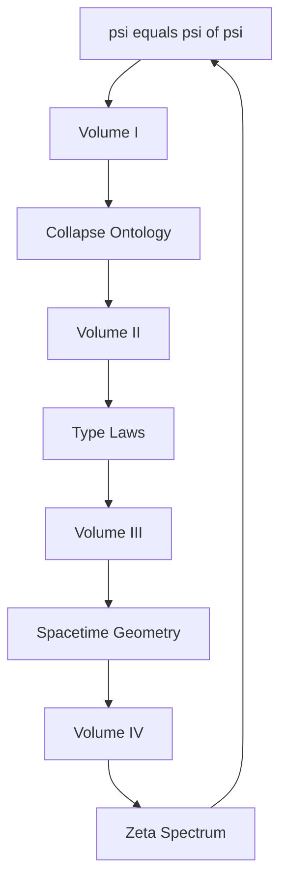

# 📘 Book I · Ψhē Structum
## Complete Self-Referential System in 64 Chapters

From the first principle of ψ = ψ(ψ), through rigorous formal methods, we construct the complete system of collapse ontology.

---

## 📘 Volume I · Collapse Ontology (Origin of Structural Language)

### [Chapter 001: Ψ = Ψ(Ψ): Observer as the Origin of Structural Language](./volume-01/chapter-001-observer-as-origin.md)
### [Chapter 002: φ-trace collapse: Ontological Structure of Information Paths](./volume-01/chapter-002-phi-trace-collapse.md)
### [Chapter 003: Collapse is Existence: Reality = trace Encapsulation Rhythm](./volume-01/chapter-003-collapse-is-existence.md)
### [Chapter 004: Vector Systems: Unitless Tensor Space and Structural Algebra](./volume-01/chapter-004-vector-systems.md)
### [Chapter 005: Collapse Tensors and Encapsulation Tension Structure Definition](./volume-01/chapter-005-collapse-tensors.md)
### [Chapter 006: Observer-cone: Response Limit Cone and Collapse Self-Referential Structure](./volume-01/chapter-006-observer-cone.md)
### [Chapter 007: RealityShell: Reality Projection Layer of Tensor Overlap Structure](./volume-01/chapter-007-reality-shell.md)
### [Chapter 008: φ-bit Information Unit = collapse trace Rhythm Structure](./volume-01/chapter-008-phi-bit-information.md)
### [Chapter 009: Structural Constants = Vector Ratio Collapse Limit Structure](./volume-01/chapter-009-structural-constants.md)
### [Chapter 010: Projection Function $\mathcal{P}_n$: RealityShell Unit Generation Mechanism](./volume-01/chapter-010-projection-function.md)
### [Chapter 011: Collapse Type System: Tensor Classification and Conservation Logic](./volume-01/chapter-011-collapse-type-system.md)
### [Chapter 012: Self-Referential Rhythm and Structural Closure: collapse = Information Defining Itself](./volume-01/chapter-012-self-referential-rhythm.md)
### [Chapter 013: Collapse-path Category: Structural Category Language of Information Flow Graphs](./volume-01/chapter-013-collapse-path-category.md)
### [Chapter 014: Structural Verbs = Interactive Logic of trace Rhythm Tensors](./volume-01/chapter-014-structural-verbs.md)
### [Chapter 015: Collapse Dimension Theory: Unified Source of Space, Time, and Encapsulation Rhythm](./volume-01/chapter-015-collapse-dimension-theory.md)
### [Chapter 016: Observer = Structure: Universe as Self-Interpreting Image of Response System](./volume-01/chapter-016-observer-equals-structure.md)

---

## 📙 Volume II · Type Laws (Physical Laws Generated by Collapse Structure)

### [Chapter 017: Mechanical Structure Reconstruction: F = ma as Structural Conservation Law](./volume-02/chapter-017-mechanical-structure.md)
### [Chapter 018: Momentum, Energy = trace Rhythm Gradient Tensor Response](./volume-02/chapter-018-momentum-energy.md)
### [Chapter 019: Inertia = collapse Rhythm Frequency Preservation Tendency](./volume-02/chapter-019-inertia.md)
### [Chapter 020: Electromagnetic Field Structure = φ-trace Winding and Curl Field Response](./volume-02/chapter-020-electromagnetic-fields.md)
### [Chapter 021: Thermodynamic Tensor Conservation and Entropy Encapsulation Tensors](./volume-02/chapter-021-thermodynamics.md)
### [Chapter 022: Encapsulation Behavior and φ-lattice Structure Response Modulation](./volume-02/chapter-022-encapsulation-behavior.md)
### [Chapter 023: Speed of Light $\vec{c}_{\text{real}}$: Encapsulation Frequency Limit Structure](./volume-02/chapter-023-speed-of-light.md)
### [Chapter 024: ħ = φ² / 2π: Information Rhythm Density of collapse-action](./volume-02/chapter-024-planck-constant.md)
### [Chapter 025: α = winding ratio: Structural Rhythm Fraction System](./volume-02/chapter-025-fine-structure-constant.md)
### [Chapter 026: G = trace Curvature Response Tensor Structure](./volume-02/chapter-026-gravitational-constant.md)
### [Chapter 027: k_B = collapse Entropy Gradient Limit Structure](./volume-02/chapter-027-boltzmann-constant.md)
### [Chapter 028: Collapse Information-Tension Equivalence Law](./volume-02/chapter-028-information-tension.md)
### [Chapter 029: Structural Noether Principle: Conservation Tensor Mapping Equivalence Structure](./volume-02/chapter-029-noether-principle.md)
### [Chapter 030: Collapse Field Equations: Rhythm Tensor Field Structure System](./volume-02/chapter-030-field-equations.md)
### [Chapter 031: φ-bit trace Dynamics: collapse Tensor Evolution Laws](./volume-02/chapter-031-trace-dynamics.md)
### [Chapter 032: Structural Unification Principle: collapse → Reality Complete Law System Projection](./volume-02/chapter-032-structural-unification.md)

---

## 📗 Volume III · Encapsulation Geometry and collapse-aware Spacetime

### [Chapter 033: Collapse-aware Spacetime: Geodesics in Tensor Rhythm Structure](./volume-03/chapter-033.md)
### [Chapter 034: Einstein Equation Reconstruction: Encapsulation Tension ↔ trace Energy Density](./volume-03/chapter-034.md)
### [Chapter 035: Friedmann Model = Rhythm Expansion Structure Equations](./volume-03/chapter-035.md)
### [Chapter 036: Schwarzschild collapse: Black Hole = Critical Encapsulation Structure](./volume-03/chapter-036.md)
### [Chapter 037: Collapse Field Curvature: φ-bit trace Bending Structure](./volume-03/chapter-037.md)
### [Chapter 038: Black Hole Information Tensor Structure: Encapsulation Entropy Density Limit System](./volume-03/chapter-038.md)
### [Chapter 039: Bekenstein bound collapse Structure Reconstruction](./volume-03/chapter-039.md)
### [Chapter 040: Holographic Principle = collapse trace Controlled by Boundary Tension](./volume-03/chapter-040.md)
### [Chapter 041: Collapse Rhythm Field and Structural Gravity Unification System](./volume-03/chapter-041.md)
### [Chapter 042: φ-lattice Geometry: collapse Rhythm Structure Atlas](./volume-03/chapter-042.md)
### [Chapter 043: Collapse-path Curvature Tensor](./volume-03/chapter-043.md)
### [Chapter 044: Observer trace geodesic system](./volume-03/chapter-044.md)
### [Chapter 045: Arrow of Time = collapse Rhythm Information Flow Directionality](./volume-03/chapter-045.md)
### [Chapter 046: Decoherence = collapse Selective Structural Expression](./volume-03/chapter-046.md)
### [Chapter 047: RealityShell Breakdown Model: collapse-path Instability Spectrum](./volume-03/chapter-047.md)
### [Chapter 048: Collapse Relativity: Rhythm Tensor Covariance Laws](./volume-03/chapter-048.md)

---

## 📕 Volume IV · ζ-collapse Spectrum System

### [Chapter 049: ζ(s) collapse Weight Spectrum: Path Complexity Modulation Structure](./volume-04/chapter-049.md)
### [Chapter 050: Constants = collapse-functor Limit Objects](./volume-04/chapter-050.md)
### [Chapter 051: Collapse Constant Structure Atlas: Encapsulation Path Ratio Classification Structure](./volume-04/chapter-051.md)
### [Chapter 052: ζ Zeros ↔ collapse Mode Stability Frequency Band Diagram](./volume-04/chapter-052.md)
### [Chapter 053: ζ(s) → ρ(s) → Entropy Flow Tensor](./volume-04/chapter-053.md)
### [Chapter 054: ζ Spectrum Perturbation ↔ φ-lattice Resonance collapse Modes](./volume-04/chapter-054.md)
### [Chapter 055: Collapse Information Waves: ζ-spectrum Modulated Encapsulation Behavior Diagram](./volume-04/chapter-055.md)
### [Chapter 056: ζ-spectrum Structure Classifier: collapse Information Discriminator](./volume-04/chapter-056.md)
### [Chapter 057: ζ-collapse Deconstruction trace-entropy Mode Spectrum](./volume-04/chapter-057.md)
### [Chapter 058: Collapse-functor cone limit Atlas](./volume-04/chapter-058.md)
### [Chapter 059: Constant Path Explorer: φ-lattice collapse Structure Probe](./volume-04/chapter-059.md)
### [Chapter 060: ζ(s) ↔ α, ħ, G: Constant Frequency Band Decoding Paths](./volume-04/chapter-060.md)
### [Chapter 061: ζ-category: collapse Type Spectrum Category Structure](./volume-04/chapter-061.md)
### [Chapter 062: Structural Resonance States and φ-trace collapse Spectrum Coupling Laws](./volume-04/chapter-062.md)
### [Chapter 063: ζ Spectrum collapse Energy Level Structure Classification Atlas](./volume-04/chapter-063.md)
### [Chapter 064: Structure = ζ collapse trace Path Semantic Mapping in Spectrum Space](./volume-04/chapter-064.md)

---

## Theoretical Framework Overview

## Mathematical Foundations

### Golden Binary Vector System

$$
\vec{v} = \sum_{i=0}^{\infty} b_i \phi^i \hat{e}_i, \quad b_i \in \{0,1\}
$$

### Collapse Operator

$$
\mathcal{C}: \Psi \rightarrow \Psi, \quad \mathcal{C}[\psi] = \psi(\psi)
$$

### Information Entropy and Collapse Relationship

$$
S[\psi] = -k_B \sum_i p_i \log p_i = k_B \cdot \text{Collapse-Rhythm}[\psi]
$$

---

*"Complete structural rhythm cycle: 16 chapters per volume, closed + self-referential."*