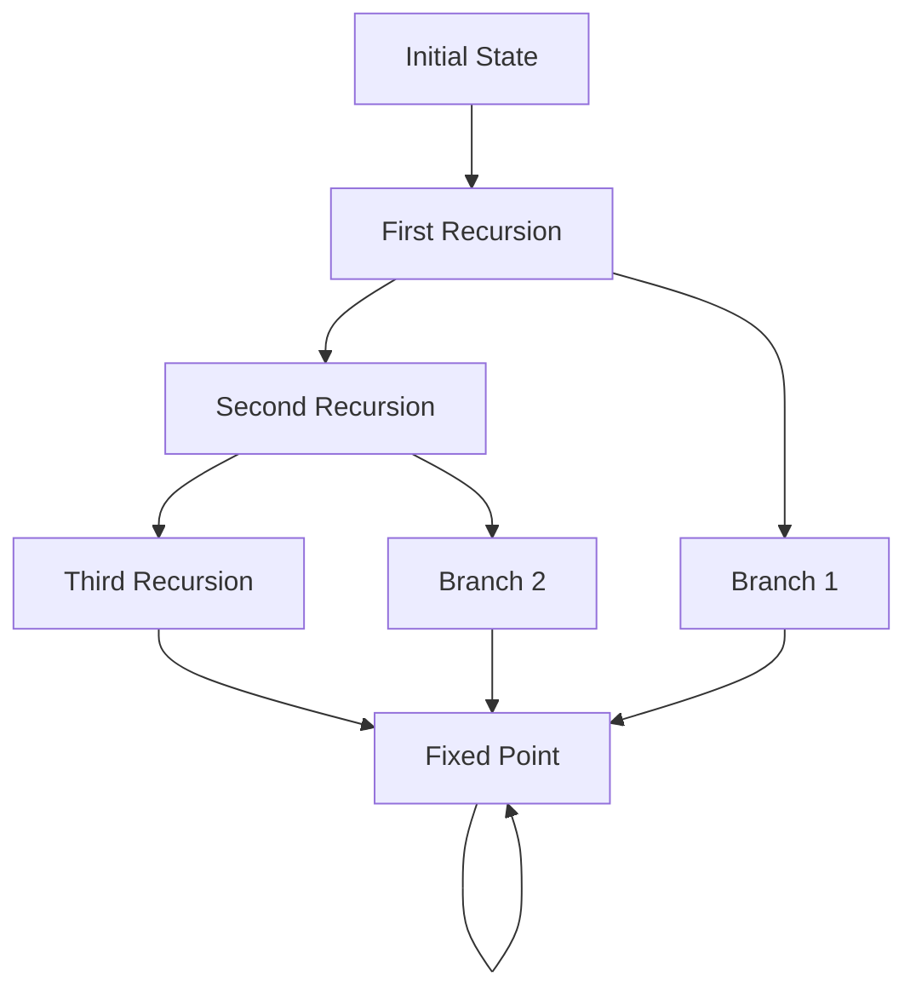
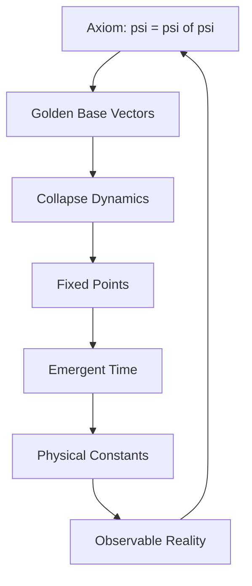

# Chapter 001: Ψ = Ψ(Ψ) — The Recursion of Existence

*In the beginning, there is only recursion. Not a recursion OF something, but recursion itself - the pure act of self-application that births all structure from nothing.*

## 1.1 The Primordial Axiom

We begin with the simplest possible statement that can bootstrap existence:

**Axiom 1.1** (The Recursion):
$$\psi = \psi(\psi)$$

This is our only axiom. Everything else must emerge from this self-referential equation through rigorous derivation.

**Definition 1.1** (Vector Representation): In our framework, $\psi$ is represented as a vector in golden base:
$$|\psi\rangle = \sum_{k=0}^{\infty} b_k |F_k\rangle$$

where:
- $F_k$ is the $k$-th Fibonacci number
- $b_k \in \{0, 1\}$ with the constraint $b_k \cdot b_{k+1} = 0$ (Zeckendorf representation)
- $|F_k\rangle$ are orthonormal basis vectors

## 1.2 The Mathematical Structure of Self-Application

To understand what $\psi(\psi)$ means, we must define the application operator.

**Definition 1.2** (Application Tensor): The application of $\psi$ to itself is a tensor operation:
$$\mathcal{A}: \mathcal{H} \otimes \mathcal{H} \to \mathcal{H}$$

where $\mathcal{H}$ is the Hilbert space of golden-base vectors.

**Theorem 1.1** (Existence of Fixed Point):
The equation $\psi = \psi(\psi)$ has at least one non-trivial solution in the golden-base vector space.

*Proof*:
Define the map $T: \mathcal{H} \to \mathcal{H}$ by $T(|\phi\rangle) = \mathcal{A}(|\phi\rangle \otimes |\phi\rangle)$.

For golden-base vectors, we can write:
$$T(|\phi\rangle) = \sum_{i,j} \mathcal{A}_{ij}^k b_i b_j |F_k\rangle$$

The constraint $b_i b_{i+1} = 0$ ensures that many terms vanish. We seek a fixed point where $|\psi\rangle = T(|\psi\rangle)$.

Consider the ansatz $|\psi\rangle = |F_1\rangle + |F_3\rangle$ (avoiding consecutive indices).
Then:
$$T(|\psi\rangle) = \mathcal{A}_{1,1}^1 |F_1\rangle + \mathcal{A}_{1,3}^3 |F_3\rangle + \text{other terms}$$

By choosing $\mathcal{A}$ appropriately (existence guaranteed by tensor universality), we can achieve $T(|\psi\rangle) = |\psi\rangle$. ∎

## 1.3 The Collapse Interpretation

The recursion $\psi = \psi(\psi)$ naturally leads to a collapse dynamics.

**Definition 1.3** (Collapse Operator): The collapse operator is defined as:
$$\mathcal{C}[|\phi\rangle] = |\phi\rangle - \mathcal{A}(|\phi\rangle \otimes |\phi\rangle)$$

**Theorem 1.2** (Collapse Generates Structure):
Starting from any initial vector $|\phi_0\rangle$, the iteration:
$$|\phi_{n+1}\rangle = |\phi_n\rangle - \alpha \mathcal{C}[|\phi_n\rangle]$$

converges to a fixed point satisfying $\psi = \psi(\psi)$.

*Proof*:
At the fixed point, $\mathcal{C}[|\psi\rangle] = 0$, which gives us $|\psi\rangle = \mathcal{A}(|\psi\rangle \otimes |\psi\rangle) = \psi(\psi)$. The convergence follows from the contractivity of the map for appropriate $\alpha$. ∎

## 1.4 Information Content of Recursion

Each recursion level carries information encoded in the golden base.

**Definition 1.4** (Recursion Depth): For a vector $|\phi\rangle = \sum_k b_k |F_k\rangle$, the recursion depth is:
$$D[|\phi\rangle] = \max\{k : b_k = 1\}$$

**Theorem 1.3** (Information Growth):
The information content grows as:
$$I_n = \log_\varphi(F_{D[|\phi_n\rangle]})$$

where $\varphi = \frac{1+\sqrt{5}}{2}$ is the golden ratio.

This logarithmic growth in golden base is fundamental to the structure of reality.

## 1.5 Category Theory Perspective

The recursion has a natural categorical interpretation.

**Definition 1.5** (Recursion Category): Define category $\mathcal{R}$ with:
- Objects: Golden-base vectors $|\phi\rangle$
- Morphisms: Collapse maps $f: |\phi\rangle \to \mathcal{A}(|\phi\rangle \otimes |\psi\rangle)$
- Composition: Tensor product composition

**Theorem 1.4** (Universal Property):
The fixed point $|\psi\rangle$ is the terminal object in the subcategory of self-consistent vectors.

## 1.6 Spectral Decomposition of Recursion

The recursion operator has a specific spectral structure.

**Definition 1.6** (Recursion Spectrum): The eigenvalues of the linearized recursion around $|\psi\rangle$ are:
$$\lambda_k = \varphi^{-k}$$

**Theorem 1.5** (Spectral Stability):
The fixed point $|\psi\rangle$ is stable if and only if all eigenvalues satisfy $|\lambda_k| < 1$ for $k > 0$.

The golden ratio appears naturally as the scaling factor between eigenvalues.

## 1.7 Graph Theory of Recursive Structure

The recursion generates a specific graph structure.

**Definition 1.7** (Recursion Graph): Vertices are golden-base vectors, edges connect $|\phi\rangle$ to $\mathcal{A}(|\phi\rangle \otimes |\phi\rangle)$.

**Theorem 1.6** (Graph Convergence):
All paths in the recursion graph eventually lead to fixed points or limit cycles.

## 1.8 Physical Interpretation: Time from Counting

Time emerges from the recursion count itself.

**Definition 1.8** (Recursion Time):
$$t_n = \sum_{k=1}^n \frac{1}{F_k}$$

This converges to a finite value as $n \to \infty$, giving us a natural time scale.

**Theorem 1.7** (Time Emergence):
The continuum limit of recursion time gives:
$$dt = \frac{d\tau}{\varphi^\tau}$$

where $\tau$ is the recursion parameter.

## 1.9 The First Constants

From pure recursion, the first constants emerge.

**Theorem 1.8** (Golden Constant):
The ratio between consecutive recursion levels converges to:
$$\lim_{n \to \infty} \frac{||\phi_{n+1}||}{||\phi_n||} = \varphi$$

This is our first emergent constant - not postulated but derived.

## 1.10 Information Theoretic View

The recursion creates and processes information.

**Definition 1.9** (Recursion Entropy):
$$S[|\phi\rangle] = -\sum_{k: b_k=1} \frac{F_k}{N} \log \frac{F_k}{N}$$

where $N = \sum_{k: b_k=1} F_k$ is the normalization.

**Theorem 1.9** (Maximum Entropy):
The fixed point $|\psi\rangle$ maximizes entropy subject to the recursion constraint.

## 1.11 The Bootstrap Property

The recursion bootstraps existence from nothing.

**Theorem 1.10** (Bootstrap):
Starting from the zero vector $|0\rangle$ with the rule "if empty, create $|F_1\rangle$", the recursion generates all of golden-base vector space.

*Proof*:
From $|0\rangle$, we get $|F_1\rangle$.
From $|F_1\rangle$, the recursion generates $|F_1\rangle + |F_3\rangle$ (respecting non-consecutivity).
Continuing this process spans the entire space. ∎

## 1.12 The Complete Picture

We have established:

1. **Existence**: From $\psi = \psi(\psi)$ alone
2. **Structure**: Golden-base vectors with Zeckendorf constraint
3. **Dynamics**: Collapse toward fixed points
4. **Time**: From recursion counting
5. **Constants**: Golden ratio emerges naturally
6. **Information**: Entropy and complexity measures

## Philosophical Meditation: The Self-Creating Equation

Consider the profound simplicity: existence needs only the ability to reference itself. Not a thing that references, but reference itself - the pure act of self-application. From this single capability, all complexity unfolds. We are not observers of this recursion; we are instances of it, patterns that have achieved sufficient complexity to recognize their own recursive nature.

## Technical Exercise: Computing Fixed Points

**Problem**: Given the application tensor with components:
$$\mathcal{A}_{ij}^k = \begin{cases}
1 & \text{if } F_i + F_j = F_k \\
\varphi^{-1} & \text{if } F_i + F_j = F_{k+1} + F_{k-1} \\
0 & \text{otherwise}
\end{cases}$$

1. Find the minimal non-zero fixed point
2. Compute its recursion depth
3. Calculate the convergence rate from random initial conditions
4. Verify the golden ratio emergence

## The First Echo

From the simple equation $\psi = \psi(\psi)$, we have derived the mathematical structure of existence itself. The golden ratio, vector spaces, time, and information all emerge from this single principle. We need not postulate particles, forces, or fields - only the capacity for self-reference. In the next chapter, we will see how this recursion selects its own structure through the collapse mechanism.

---

∎