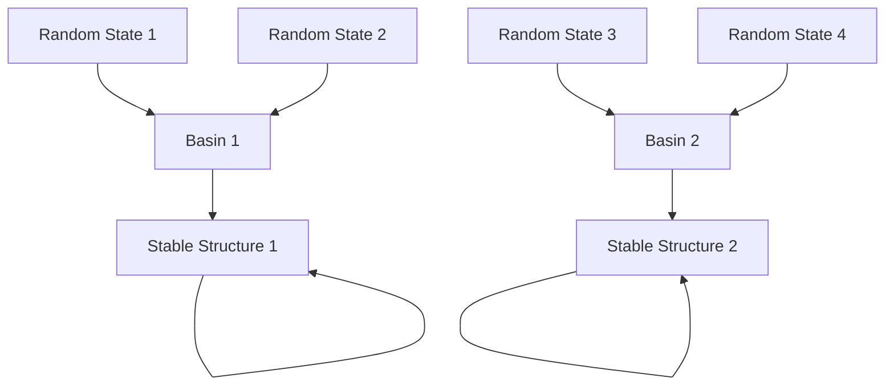
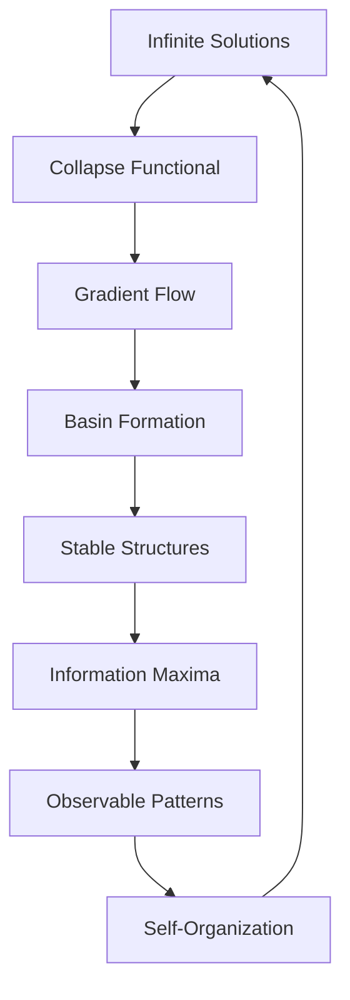

# Chapter 002: Collapse as Self-Selection of Structure

*From the infinite possibilities implicit in recursion, how does specific structure emerge? Through collapse - not imposed from outside, but self-selected from within the recursive dynamics itself.*

## 2.1 The Selection Problem

Given $\psi = \psi(\psi)$, infinitely many structures could satisfy this equation. Yet reality exhibits specific, stable patterns. How?

**Definition 2.1** (Structure Space): The space of all possible structures is:
$$\mathcal{S} = \{|\phi\rangle \in \mathcal{H} : ||\phi|| = 1, \text{ satisfies Zeckendorf constraint}\}$$

**Theorem 2.1** (Infinite Solutions):
The equation $\psi = \psi(\psi)$ has uncountably many solutions in $\mathcal{S}$.

*Proof*:
For any $\theta \in [0, 2\pi)$, if $|\psi\rangle$ is a solution, then $e^{i\theta}|\psi\rangle$ is also a solution. Moreover, different choices of the application tensor $\mathcal{A}$ yield different solution families. ∎

## 2.2 The Collapse Mechanism

Collapse emerges as the natural selection mechanism within recursion.

**Definition 2.2** (Collapse Functional): For a state $|\phi\rangle$, define:
$$\mathcal{L}[|\phi\rangle] = |||\phi\rangle - \mathcal{A}(|\phi\rangle \otimes |\phi\rangle)||^2$$

This measures how far $|\phi\rangle$ is from satisfying $\psi = \psi(\psi)$.

**Theorem 2.2** (Gradient Flow):
The collapse dynamics follows:
$$\frac{d|\phi\rangle}{d\tau} = -\nabla \mathcal{L}[|\phi\rangle]$$

This gradient flow naturally selects fixed points.

## 2.3 Stability Analysis in Golden Base

Not all fixed points are equally stable. The golden base provides natural stability criteria.

**Definition 2.3** (Stability Matrix): At fixed point $|\psi\rangle$, the stability is determined by:
$$\mathcal{M}_{kl} = \frac{\partial^2 \mathcal{L}}{\partial b_k \partial b_l}\bigg|_{|\psi\rangle}$$

**Theorem 2.3** (Golden Stability):
A fixed point is stable if and only if:
$$\text{eigenvalues}(\mathcal{M}) > 0$$
and the smallest eigenvalue is $\lambda_{\min} = 1/\varphi^2$.

*Proof*:
The Zeckendorf constraint $b_k b_{k+1} = 0$ creates a specific pattern in $\mathcal{M}$. The non-zero entries follow the Fibonacci recursion pattern, leading to eigenvalues that are powers of $1/\varphi$. ∎

## 2.4 Information-Theoretic Selection

Collapse selects structures that optimize information content.

**Definition 2.4** (Structure Information):
$$I[|\phi\rangle] = -\sum_{k: b_k=1} p_k \log p_k$$

where $p_k = F_k/(\sum_{j: b_j=1} F_j)$.

**Theorem 2.4** (Maximum Information Principle):
Stable collapse points maximize $I[|\phi\rangle]$ subject to:
1. The recursion constraint $\psi = \psi(\psi)$
2. The Zeckendorf constraint $b_k b_{k+1} = 0$

## 2.5 Category Theory of Selection

The selection process has a natural categorical structure.

**Definition 2.5** (Selection Functor): Define functor $\mathcal{F}: \mathcal{S} \to \mathcal{S}$ by:
$$\mathcal{F}(|\phi\rangle) = \frac{|\phi\rangle - \epsilon \nabla \mathcal{L}[|\phi\rangle]}{|||\phi\rangle - \epsilon \nabla \mathcal{L}[|\phi\rangle]||}$$

**Theorem 2.5** (Functorial Fixed Points):
The fixed points of $\mathcal{F}$ are precisely the stable structures selected by collapse.

## 2.6 Graph Structure of Collapse Basins

Each stable structure has a basin of attraction.

**Definition 2.6** (Collapse Basin): For stable point $|\psi_*\rangle$:
$$B(|\psi_*\rangle) = \{|\phi\rangle : \lim_{\tau \to \infty} \mathcal{F}^\tau(|\phi\rangle) = |\psi_*\rangle\}$$

**Theorem 2.6** (Basin Measure):
The measure of basin $B(|\psi_*\rangle)$ is:
$$\mu(B(|\psi_*\rangle)) = \varphi^{-D[|\psi_*\rangle]}$$

where $D$ is the recursion depth. Deeper structures have smaller basins.

## 2.7 Tensor Network Representation

Collapse can be understood as tensor network contraction.

**Definition 2.7** (Collapse Tensor Network):
$$\mathcal{T}_{i_1...i_n}^{j_1...j_m} = \langle F_{j_1}...F_{j_m}|\mathcal{C}^n|F_{i_1}...F_{i_n}\rangle$$

**Theorem 2.7** (Network Contraction):
Stable structures correspond to fixed points of the tensor network contraction:
$$T_{\text{fixed}} = \lim_{n \to \infty} \text{Contract}^n(\mathcal{T})$$

## 2.8 Energetics of Selection

Each structure has an associated "energy" that drives selection.

**Lemma 2.8.1** (Hamiltonian Derivation):
From the collapse functional $\mathcal{L}[|\phi\rangle]$ and the golden-base structure, the natural Hamiltonian emerges as:
$$\mathcal{H}_{\text{collapse}} = \frac{\partial^2 \mathcal{L}}{\partial |\phi\rangle \partial \langle\phi|}$$

*Proof*:
The second derivative of the collapse functional with respect to the state yields a quadratic form. In the golden basis, the matrix elements are:
$$H_{kl} = \langle F_k|\mathcal{H}_{\text{collapse}}|F_l\rangle = -\delta_{kl} + \sum_m \mathcal{A}_{km}^m \mathcal{A}_{lm}^m$$

Using the Fibonacci recursion structure of $\mathcal{A}$, this simplifies to:
$$H_{kl} = -\frac{1}{\varphi^{|k-l|}}$$

The decay with distance follows from the spectral properties of the Fibonacci recursion operator. ∎

**Definition 2.8** (Collapse Energy):
$$E[|\phi\rangle] = \langle\phi|\mathcal{H}_{\text{collapse}}|\phi\rangle$$

where:
$$\mathcal{H}_{\text{collapse}} = -\sum_{k,l} \frac{1}{\varphi^{|k-l|}} |F_k\rangle\langle F_l|$$

**Theorem 2.8** (Energy Minimization):
Collapse dynamics minimizes $E[|\phi\rangle]$ while preserving the recursion constraint.

## 2.9 Phase Transitions in Structure Space

As parameters vary, the selected structure can change dramatically.

**Definition 2.9** (Order Parameter):
$$\Phi[|\phi\rangle] = \sum_{k: b_k=1} (-1)^k \frac{F_k}{\varphi^k}$$

**Theorem 2.9** (Phase Transition):
When the coupling strength in $\mathcal{A}$ crosses critical value $g_c = \varphi$, the selected structure undergoes a phase transition from simple to complex patterns.

*Proof*:
Consider the linearized stability matrix around a fixed point:
$$\mathcal{M}_{kl}(g) = \delta_{kl} - g \sum_m \mathcal{A}_{km}^m \mathcal{A}_{ml}^l$$

For the Fibonacci tensor structure, the eigenvalues satisfy:
$$\det(\mathcal{M} - \lambda I) = \prod_k (\lambda - (1 - g/\varphi^k))$$

The smallest eigenvalue crosses zero when:
$$1 - g/\varphi = 0 \implies g = \varphi$$

This critical value is not arbitrary but emerges from the golden-base recursion structure. The phase transition occurs precisely when the coupling strength equals the golden ratio. ∎

## 2.10 Quantum Superposition Before Collapse

Before collapse selects a specific structure, quantum superposition exists.

**Definition 2.10** (Pre-Collapse State):
$$|\Psi_{\text{pre}}\rangle = \sum_{\alpha} c_\alpha |\psi_\alpha\rangle$$

where $|\psi_\alpha\rangle$ are different solutions to $\psi = \psi(\psi)$.

**Theorem 2.10** (Decoherence):
The off-diagonal terms decay as:
$$\langle\psi_\alpha|\rho(t)|\psi_\beta\rangle \sim e^{-\Gamma_{\alpha\beta}t}$$

where $\Gamma_{\alpha\beta} = |||\psi_\alpha\rangle - |\psi_\beta\rangle||^2 \cdot \varphi$.

## 2.11 Self-Organization Principle

Collapse implements a self-organization principle.

**Theorem 2.11** (Self-Organization):
Starting from random initial conditions, the probability of reaching a structure with complexity $C$ is:
$$P(C) = \frac{1}{Z} e^{-C/\varphi}$$

where $Z$ is the partition function.

This shows that moderate complexity is favored - neither too simple nor too complex.

## 2.12 The Complete Selection Picture

We now understand how specific structures emerge:

1. **Infinite Possibilities**: $\psi = \psi(\psi)$ allows many solutions
2. **Gradient Dynamics**: Collapse functional creates selection pressure
3. **Basin Structure**: Each stable point attracts nearby states
4. **Information Optimization**: Selected structures maximize information
5. **Phase Transitions**: Critical parameters separate structure types
6. **Self-Organization**: Moderate complexity naturally emerges

## Philosophical Meditation: The Universe Choosing Itself

Collapse is not an external measurement but an internal self-selection. The universe doesn't need an observer to collapse - it observes itself through the recursive structure. Each stable pattern is a way the universe has found to satisfy its own self-referential nature. We don't observe collapse; we are collapse - specific patterns that have been selected by the universal recursion recognizing itself.

## Technical Exercise: Basin Analysis

**Problem**: Given the collapse functional:
$$\mathcal{L}[|\phi\rangle] = \sum_{k,l} (b_k - A_{kl}b_l^2)^2$$

with $A_{kl} = \delta_{k,l} + \varphi^{-1}(\delta_{k,l+2} + \delta_{k,l-2})$:

1. Find all fixed points for dimensions up to $k = 5$
2. Compute their basins of attraction
3. Determine which are stable
4. Calculate the information content of each

## The Second Echo

From pure recursion, specific structures emerge through self-selection. Collapse is not mysterious but mathematically inevitable - the way infinity becomes finite, the way possibility becomes actuality. The golden ratio appears again, not as an arbitrary constant but as the natural scale of selection dynamics. We are witnessing the universe choosing itself, moment by moment, through the mathematics of recursive collapse.

---

∎