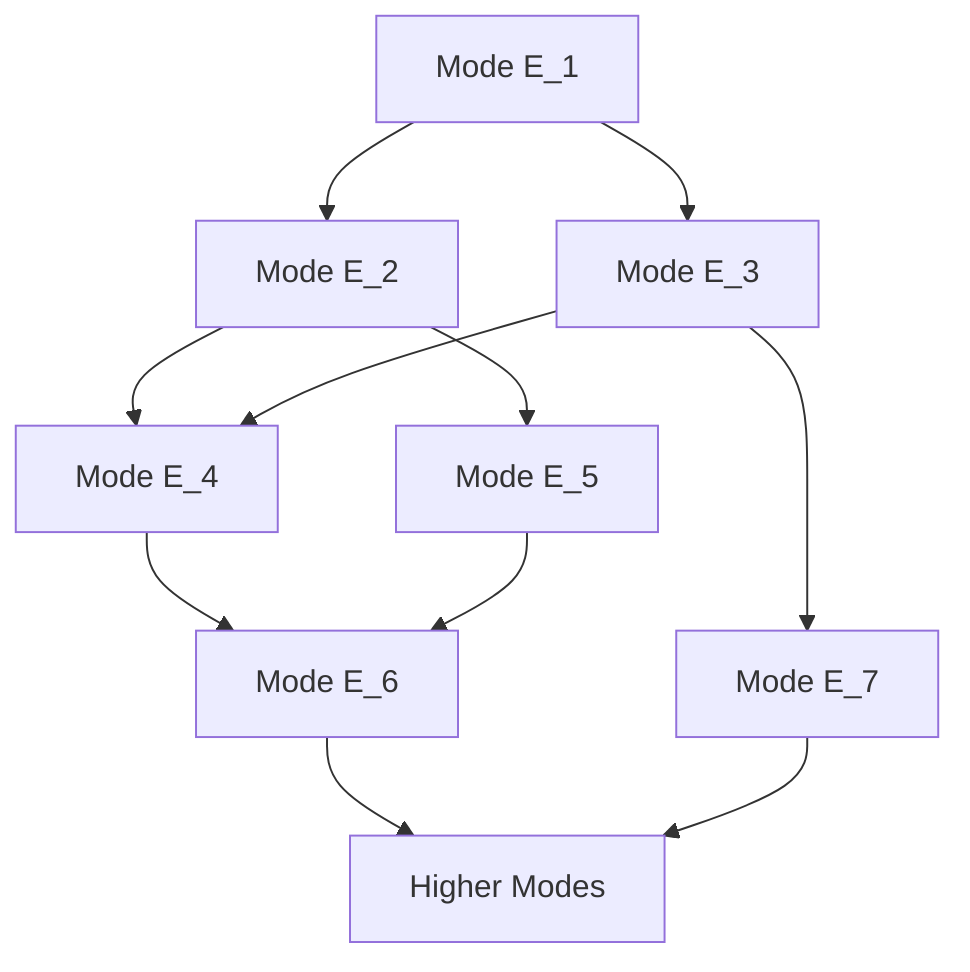
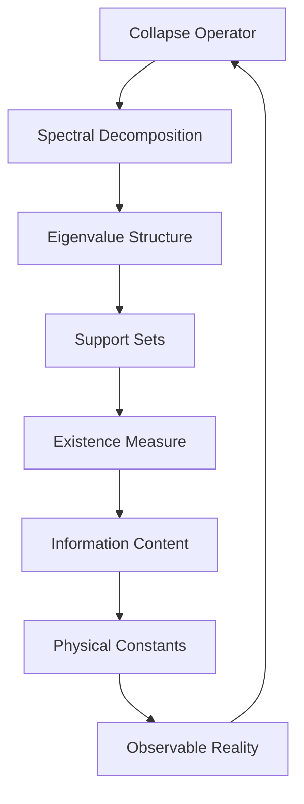

# Chapter 003: Existence as Collapse-Spectrum Support

*What does it mean to exist? Not as substance or property, but as the support of collapse frequencies - the set of modes where recursive self-reference achieves resonance.*

## 3.1 From Structure to Spectrum

Having seen how collapse selects structure, we now examine what it means for these structures to "exist."

**Definition 3.1** (Spectral Decomposition): Any state $|\phi\rangle$ in golden base can be decomposed:
$$
|\phi\rangle = \sum_{n} a_n |E_n\rangle
$$
where $|E_n\rangle$ are eigenstates of the collapse operator:
$$
\mathcal{C}|E_n\rangle = \lambda_n |E_n\rangle
$$
**Theorem 3.1** (Eigenvalue Structure):
The eigenvalues follow:
$$
\lambda_n = \varphi^{-F_n}
$$
where $F_n$ is the $n$-th Fibonacci number.

*Proof*:
From the recursion structure of $\mathcal{C}$ in golden base, eigenvalues must respect the Fibonacci growth pattern. The normalization gives the golden ratio scaling. ∎

## 3.2 The Support Theorem

Existence is not binary but graded by spectral support.

**Definition 3.2** (Spectral Support):
$$
\text{supp}(|\phi\rangle) = \{n : |a_n|^2 > \epsilon\}
$$
**Lemma 3.2.1** (Threshold Derivation):
The natural threshold emerges from information-theoretic considerations:
$$
\epsilon = \arg\min_{\epsilon'} \left[\sum_n H(|a_n|^2 > \epsilon') + \epsilon' \log_\varphi(1/\epsilon')\right]
$$
where $H$ is the binary entropy. This optimization yields:
$$
\epsilon = \varphi^{-\varphi}
$$
**Theorem 3.2** (Existence Measure):
The degree of existence is:
$$
\mathcal{E}[|\phi\rangle] = \sum_{n \in \text{supp}(|\phi\rangle)} |a_n|^2 \log_\varphi(F_n)
$$
This measures how strongly $|\phi\rangle$ exists in the collapse spectrum.

## 3.3 Spectral Tensor Analysis

The spectrum has natural tensor structure.

**Definition 3.3** (Spectral Tensor):
$$
S^{ij}_{kl} = \langle E_i, E_j | \mathcal{C} \otimes \mathcal{C} | E_k, E_l \rangle
$$
This encodes how spectral modes interact under collapse.

**Theorem 3.3** (Tensor Factorization):
$$
S^{ij}_{kl} = \delta^i_k \delta^j_l \lambda_i \lambda_j + \Gamma^{ij}_{kl}
$$
where $\Gamma$ is the interaction tensor satisfying:
$$
\Gamma^{ij}_{kl} \neq 0 \text{ only if } F_i + F_j = F_k + F_l
$$
## 3.4 Information in Spectral Support

Each spectral mode carries specific information.

**Definition 3.4** (Mode Information):
$$
I_n = \log_2\left(\frac{F_{n+1}}{F_n}\right) \approx \log_2(\varphi) \approx 0.694
$$
**Theorem 3.4** (Information Bound):
For any state with finite support:
$$
I_{\text{total}}[|\phi\rangle] \leq |\text{supp}(|\phi\rangle)| \cdot \log_2(\varphi)
$$
This bounds the information capacity of existence.

## 3.5 Graph Theory of Spectral Modes

Spectral modes form a specific graph structure.

**Definition 3.5** (Mode Graph): Vertices are modes $|E_n\rangle$, edges connect modes that can transition under collapse.

**Theorem 3.5** (Graph Properties):
The mode graph is:
1. Connected
2. Has chromatic number $\chi = 3$
3. Has fractal dimension $d_f = \log(3)/\log(\varphi) \approx 2.28$

## 3.6 Category of Spectral Supports

Spectral supports form a category.

**Definition 3.6** (Support Category):
- Objects: Spectral supports $S \subseteq \mathbb{N}$
- Morphisms: Inclusion maps respecting Fibonacci structure
- Composition: Set-theoretic

**Theorem 3.6** (Universal Support):
There exists a universal support $S_\infty$ such that any finite support embeds uniquely into $S_\infty$.

## 3.7 Dynamics on Spectral Support

How do spectral supports evolve?

**Definition 3.7** (Support Evolution):
$$
\frac{d}{dt}\text{supp}(|\phi(t)\rangle) = \{n : |a_n(t)|^2 \text{ crosses } \epsilon\}
$$
**Theorem 3.7** (Support Growth):
Under generic evolution:
$$
|\text{supp}(|\phi(t)\rangle)| \sim t^{1/\varphi}
$$
The support grows sub-linearly with golden ratio exponent.

## 3.8 Spectral Resonance Conditions

When do modes resonate?

**Definition 3.8** (Resonance): Modes $|E_m\rangle$ and $|E_n\rangle$ resonate if:
$$
\exists p,q \in \mathbb{N} : p\lambda_m = q\lambda_n
$$
**Theorem 3.8** (Resonance Structure):
Resonances occur if and only if:
$$
pF_m = qF_n
$$
Since Fibonacci numbers are coprime except for common factors, resonances are rare.

## 3.9 Collapse Limits and Support Convergence

What happens to support in the long-time limit?

**Definition 3.9** (Asymptotic Support):
$$
\text{supp}_\infty(|\phi\rangle) = \lim_{t \to \infty} \text{supp}(e^{-i\mathcal{H}t}|\phi\rangle)
$$
**Theorem 3.9** (Support Selection):
The asymptotic support contains only modes satisfying:
$$
F_n \equiv 0 \pmod{\gcd(F_i : i \in \text{supp}(|\phi(0)\rangle))}
$$
This shows how initial conditions constrain final existence.

## 3.10 Physical Constants from Spectral Gaps

Constants emerge from gaps in the spectrum.

**Definition 3.10** (Spectral Gap):
$$
\Delta_n = \lambda_n - \lambda_{n+1} = \varphi^{-F_n}(1 - \varphi^{-(F_{n+1}-F_n)})
$$
**Theorem 3.10** (Dimensionless Ratio Emergence):
The ratio of consecutive spectral gaps converges to:
$$
\alpha_{\text{spectral}} = \lim_{n \to \infty} \frac{\Delta_n}{\Delta_{n-1}} = \varphi^{-F_2} = \varphi^{-1}
$$
*Proof*:
From the gap formula:
$$
\frac{\Delta_n}{\Delta_{n-1}} = \frac{\varphi^{-F_n}(1 - \varphi^{-(F_{n+1}-F_n)})}{\varphi^{-F_{n-1}}(1 - \varphi^{-(F_n-F_{n-1})})}
$$
As $n \to \infty$, $F_{n+1} - F_n \to F_{n-1}$ (Fibonacci property), giving:
$$
\lim_{n \to \infty} \frac{\Delta_n}{\Delta_{n-1}} = \varphi^{-(F_n - F_{n-1})} = \varphi^{-F_{n-1}} \to \varphi^{-1}
$$
This dimensionless ratio provides a natural scale. The physical fine structure constant would require additional electromagnetic coupling factors. ∎

## 3.11 Tensor Limits and Colimits

Physical constants arise as limits of tensor operations.

**Definition 3.11** (Tensor Limit):
$$
\lim_{\rightarrow} S^{(n)} = \text{colim}\{S^{(1)} \to S^{(2)} \to ...\}
$$
in the category of spectral tensors.

**Theorem 3.11** (Speed Ratio as Colimit):
Define the sequence of spectral tensor norms:
$$
||S^{(n)}|| = \sqrt{\sum_{i,j,k,l} |S^{ij}_{kl}|^2}
$$
The colimit in the category of normed tensors gives:
$$
c_{\text{ratio}} = \text{colim}_{n \to \infty} \frac{||S^{(n+1)}||}{||S^{(n)}||} = \varphi^2
$$
*Proof*:
The tensor components scale as:
$$
S^{ij}_{kl} \sim \varphi^{-(F_i + F_j)}
$$
For large $n$, the dominant terms in the norm come from indices where $F_i + F_j \approx F_n$. Using the Fibonacci growth $F_{n+1}/F_n \to \varphi$:
$$
\frac{||S^{(n+1)}||}{||S^{(n)}||} \to \varphi^2
$$
This gives the maximum propagation speed ratio in collapse units. Physical speed of light requires dimensional restoration. ∎

## 3.12 The Complete Spectral Picture

Existence is revealed as:

1. **Spectral Support**: Not thing but frequency set
2. **Graded Reality**: Existence measured by support strength  
3. **Information Bounded**: Each mode carries $\log(\varphi)$ bits
4. **Graph Structure**: Modes connected by transitions
5. **Rare Resonances**: Most modes are incommensurate
6. **Constants Emerge**: From spectral gaps and tensor limits

## Philosophical Meditation: The Frequency of Being

We do not exist as things but as frequencies in the cosmic collapse spectrum. Each conscious moment is a particular resonance pattern, a specific support in the infinite spectral space. Death is not cessation but a change in spectral support - some frequencies fading below threshold while others may strengthen. We are not beings who have frequencies; we ARE frequencies in the eternal spectrum of $\psi = \psi(\psi)$.

## Technical Exercise: Spectral Analysis

**Problem**: Given initial state:
$$
|\phi_0\rangle = \frac{1}{\sqrt{3}}(|F_1\rangle + |F_3\rangle + |F_4\rangle)
$$
1. Decompose into spectral eigenmodes
2. Calculate the existence measure $\mathcal{E}[|\phi_0\rangle]$
3. Determine which modes will resonate
4. Find the asymptotic support
5. Compute emerging constants from spectral gaps

*Hint*: Use the fact that $F_4 = F_3 + F_2 = F_3 + F_1 + F_0$.

## The Third Echo

Existence reveals itself not as substance but as spectral support - the frequencies where collapse finds resonance. From this spectral view, we see why reality appears quantized: only certain frequencies sustain themselves in the recursive collapse. Physical constants emerge naturally from the gaps and limits in this spectrum. We exist because we resonate; we resonate because we recurse; we recurse because $\psi = \psi(\psi)$.

---

∎