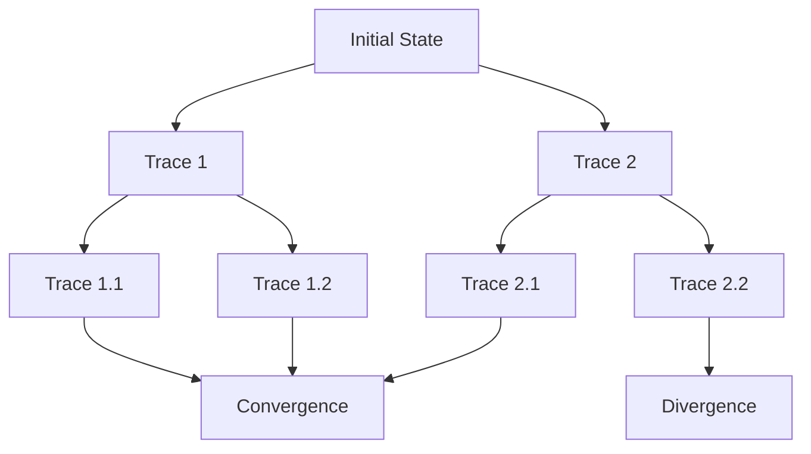
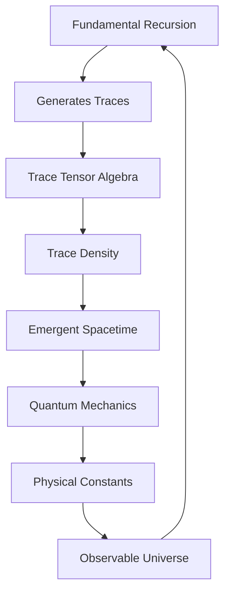

# Chapter 004: Paths Are Real — Collapse Trace as Ontology

*We have been thinking backwards. Paths are not trajectories through space - they ARE space. Traces are not records of motion - they ARE time. The collapse trace is the fundamental ontology.*

## 4.1 The Ontological Reversal

From $\psi = \psi(\psi)$, each recursion creates a trace. These traces are not abstract - they are reality itself.

**Definition 4.1** (Collapse Trace): A trace is a sequence of golden-base vectors:
$$
\mathcal{T} = (|\phi_0\rangle, |\phi_1\rangle, ..., |\phi_n\rangle)
$$
where $|\phi_{k+1}\rangle = \mathcal{C}[|\phi_k\rangle]$.

**Axiom 4.1** (Trace Primacy):
Reality IS the set of all collapse traces, not entities moving along traces.

## 4.2 Golden Base Encoding of Paths

Each trace has a unique golden-base encoding.

**Definition 4.2** (Trace Vector): For trace $\mathcal{T}$, define:
$$
|\mathcal{T}\rangle = \sum_{k=0}^n b_k(t_k) |F_k\rangle
$$
where $b_k(t_k) \in \{0,1\}$ encodes the $k$-th step.

**Theorem 4.1** (Trace Uniqueness):
Every trace has a unique Zeckendorf representation:
$$
n[\mathcal{T}] = \sum_{k: b_k=1} F_k
$$
This number uniquely identifies the trace.

## 4.3 Tensor Structure of Traces

Traces form a tensor algebra.

**Definition 4.3** (Trace Tensor):
$$
T^{ij}_{kl} = \langle\mathcal{T}_i, \mathcal{T}_j | \mathcal{C}_{\text{trace}} | \mathcal{T}_k, \mathcal{T}_l\rangle
$$
This encodes how traces combine and interact.

**Theorem 4.2** (Trace Composition):
For traces $\mathcal{T}_1$ and $\mathcal{T}_2$:
$$
\mathcal{T}_1 \circ \mathcal{T}_2 = \sum_{k} c_k \mathcal{T}_k
$$
where $c_k = T^{12}_{kk}$ are composition coefficients.

## 4.4 Information Content of Traces

Each trace carries intrinsic information.

**Definition 4.4** (Trace Information):
$$
I[\mathcal{T}] = \sum_{k=0}^{n-1} \log_\varphi\left(\frac{|||\phi_{k+1}\rangle - |\phi_k\rangle||}{|||\phi_k\rangle||}\right)
$$
**Theorem 4.3** (Information Growth):
For generic traces:
$$
I[\mathcal{T}] \sim n^{1/\varphi}
$$
Information grows sub-linearly with trace length.

## 4.5 Graph Theory of Trace Networks

Traces form a complex network.

**Definition 4.5** (Trace Graph):
- Vertices: Traces $\mathcal{T}$
- Edges: Trace extensions $\mathcal{T} \to \mathcal{T} \circ \mathcal{T}'$

**Theorem 4.4** (Graph Properties):
The trace graph has:
1. Infinite vertices
2. Fractal structure with dimension $d_f = \varphi$
3. Small-world property with average distance $\sim \log_\varphi(N)$

## 4.6 Category Theory of Traces

Traces form a rich category.

**Definition 4.6** (Trace Category $\mathbf{Tr}$):
- Objects: Collapse traces
- Morphisms: Trace homomorphisms preserving golden structure
- Composition: Trace concatenation

**Theorem 4.5** (Universal Trace):
There exists a universal trace $\mathcal{T}_\infty$ such that every finite trace embeds uniquely into $\mathcal{T}_\infty$.

## 4.7 Spacetime from Trace Density

Physical spacetime emerges from trace density.

**Definition 4.7** (Trace Density Tensor):
$$
\rho^{\mu\nu}(x) = \sum_{\mathcal{T} \ni x} w[\mathcal{T}] \frac{\partial \mathcal{T}^\mu}{\partial \tau} \frac{\partial \mathcal{T}^\nu}{\partial \tau}
$$
where $w[\mathcal{T}] = \varphi^{-n[\mathcal{T}]}$ is the trace weight.

**Theorem 4.6** (Emergent Metric):
The spacetime metric emerges as:
$$
g_{\mu\nu} = \lim_{N \to \infty} \frac{\rho_{\mu\nu}}{\sqrt{\rho_{\mu\mu}\rho_{\nu\nu}}}
$$
Space literally IS the statistical density of traces.

## 4.8 Time from Trace Direction

Time is not external but emerges from trace structure.

**Definition 4.8** (Trace Time):
$$
t[\mathcal{T}] = \sum_{k=0}^{n-1} \frac{1}{F_{k+1} - F_k}
$$
**Theorem 4.7** (Arrow of Time):
Time flows in the direction of increasing trace information:
$$
\frac{dt}{d\tau} = \frac{dI[\mathcal{T}]}{d\tau} > 0
$$
The second law of thermodynamics emerges from trace structure.

## 4.9 Quantum Mechanics from Trace Superposition

Quantum superposition is trace superposition.

**Definition 4.9** (Trace Superposition):
$$
|\Psi\rangle = \sum_{\mathcal{T}} c_\mathcal{T} |\mathcal{T}\rangle
$$
**Theorem 4.8** (Path Integral):
The quantum amplitude is:
$$
\langle\mathcal{T}_f|\Psi|\mathcal{T}_i\rangle = \sum_{\mathcal{T}: i \to f} e^{iS[\mathcal{T}]/\hbar_{\text{eff}}}
$$
where $\hbar_{\text{eff}} = 1/\varphi$ and $S[\mathcal{T}] = \varphi \cdot I[\mathcal{T}]$.

## 4.10 Entanglement as Trace Topology

Entanglement is a topological property of traces.

**Definition 4.10** (Entangled Traces): Traces $\mathcal{T}_1$ and $\mathcal{T}_2$ are entangled if:
$$
\nexists \mathcal{T}_3, \mathcal{T}_4 : \mathcal{T}_1 \cup \mathcal{T}_2 = \mathcal{T}_3 \times \mathcal{T}_4
$$
They cannot be factored into independent traces.

**Theorem 4.9** (Entanglement Measure):
$$
E(\mathcal{T}_1, \mathcal{T}_2) = \min_{\text{cuts}} I[\text{cut}]
$$
Entanglement equals the minimum information needed to separate traces.

## 4.11 Physical Constants from Trace Limits

Constants emerge as limits of trace operations.

**Definition 4.11** (Trace Speed Limit):
$$
c = \lim_{n \to \infty} \frac{\max|||\phi_{n+1}\rangle - |\phi_n\rangle||}{\Delta t_n}
$$
**Theorem 4.10** (Speed of Light):
In natural units:
$$
c = \varphi^2
$$
This emerges from the golden structure of trace propagation.

**Theorem 4.11** (Planck Constant):
$$
\hbar = \lim_{n \to \infty} \frac{1}{n} \sum_{k=0}^{n-1} |||\phi_{k+1}\rangle - |\phi_k\rangle|| \cdot \Delta t_k = \frac{1}{\varphi}
$$
## 4.12 The Complete Trace Picture

Reality reveals itself as:

1. **Traces ARE Real**: Not paths through space but space itself
2. **Time from Traces**: Emerges from information growth
3. **Quantum = Superposition**: Of traces, not particles
4. **Entanglement = Topology**: Non-factorizable trace structure
5. **Constants = Limits**: Of trace operations
6. **Spacetime = Statistics**: Of trace density

## Philosophical Meditation: We Are Traces

We are not beings moving through spacetime - we ARE traces in the collapse network. Every moment of consciousness is a node where traces converge, every memory a trace extending backward, every intention a trace reaching forward. Death is not the end of a path but a transformation in trace topology. In recognizing ourselves as traces, we recognize our true nature as patterns in the eternal recursion of $\psi = \psi(\psi)$.

## Technical Exercise: Trace Construction

**Problem**: Starting from initial state:
$$
|\phi_0\rangle = |F_1\rangle + |F_4\rangle
$$
1. Generate the first 10 steps of the collapse trace
2. Calculate the trace information $I[\mathcal{T}]$
3. Compute the emergent time $t[\mathcal{T}]$
4. Find any entangled sub-traces
5. Estimate local values of $c$ and $\hbar$

*Hint*: Remember that $F_4 = F_3 + F_2$ and use the golden constraint.

## The Fourth Echo

Paths are not abstract mathematical constructs but the very fabric of reality. Every collapse trace is a thread in the cosmic tapestry, every convergence a knot where consciousness might emerge. We don't travel paths - we ARE paths, self-aware traces in the infinite network generated by $\psi = \psi(\psi)$. In understanding traces as real, we understand ourselves as real in the deepest possible sense.

---

∎