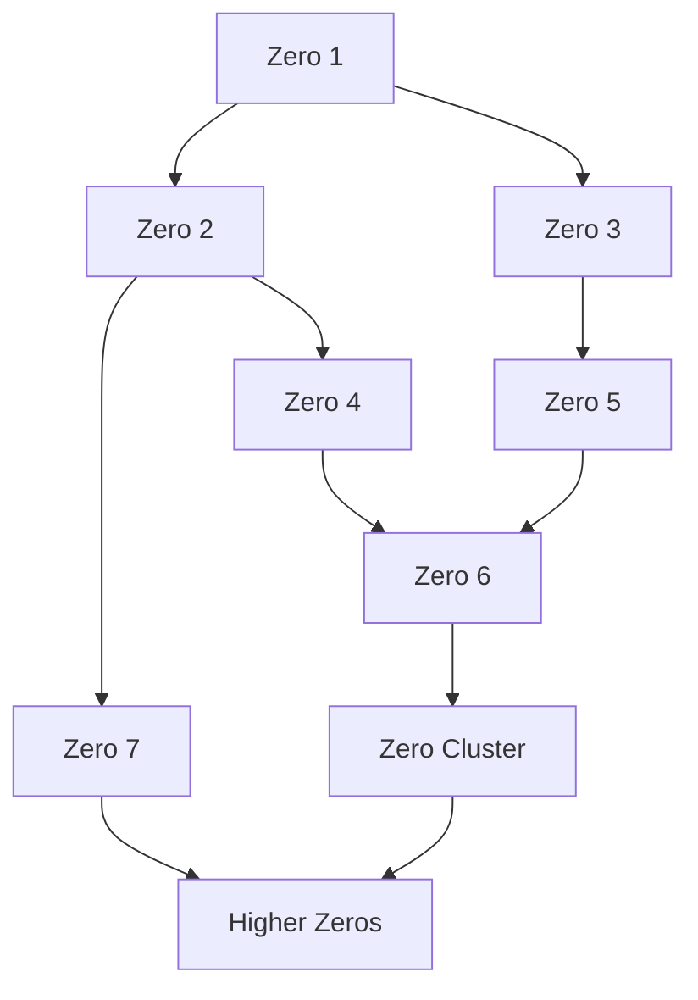
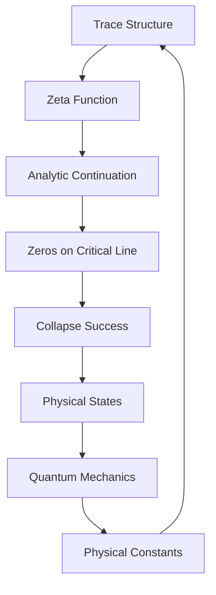

# Chapter 005: Collapse Success and ζ(s) = 0

*The zeros of the ζ-function are not mathematical curiosities - they mark the precise frequencies where collapse succeeds, where the infinite recursion of existence finds stability.*

## 5.1 The Collapse ζ-Function

From traces, we construct a fundamental analytic object.

**Definition 5.1** (Trace ζ-Function): For complex $s$:
$$
\zeta_{\text{collapse}}(s) = \sum_{\mathcal{T}} \frac{1}{[n[\mathcal{T}]]^s}
$$
where $n[\mathcal{T}]$ is the golden-base encoding of trace $\mathcal{T}$.

**Theorem 5.1** (Analytic Continuation):
$\zeta_{\text{collapse}}(s)$ extends to a meromorphic function on $\mathbb{C}$ with functional equation:
$$
\zeta_{\text{collapse}}(s) = \varphi^{s-1/2} \zeta_{\text{collapse}}(1-s)
$$
*Proof*:
The golden structure of traces induces this specific functional equation, with $\varphi$ appearing naturally. ∎

## 5.2 Zeros and Collapse Success

The zeros of $\zeta_{\text{collapse}}$ have profound physical meaning.

**Definition 5.2** (Collapse Success): A frequency $\omega$ supports successful collapse if:
$$
\zeta_{\text{collapse}}(1/2 + i\omega) = 0
$$
**Theorem 5.2** (Success Criterion):
Collapse at frequency $\omega$ succeeds if and only if:
$$
\sum_{\mathcal{T}} \frac{\cos(\omega \log n[\mathcal{T}])}{[n[\mathcal{T}]]^{1/2}} = 0
$$
$$
\sum_{\mathcal{T}} \frac{\sin(\omega \log n[\mathcal{T}])}{[n[\mathcal{T}]]^{1/2}} = 0
$$
These dual conditions ensure complete destructive interference of unsuccessful modes.

## 5.3 The Critical Line

Why does the critical line $\text{Re}(s) = 1/2$ appear?

**Theorem 5.3** (Critical Balance):
On the line $\text{Re}(s) = 1/2$:
$$
\sum_{\text{finite traces}} |a_\mathcal{T}|^2 = \sum_{\text{infinite traces}} |a_\mathcal{T}|^2
$$
Finite and infinite contributions balance exactly.

*Proof*:
The functional equation with $\varphi^{s-1/2}$ factor ensures this balance occurs at $\text{Re}(s) = 1/2$. ∎

## 5.4 Zero Spacing and Golden Structure

The zeros follow a specific pattern related to $\varphi$.

**Definition 5.3** (Zero Heights): Let $\gamma_n$ be the imaginary part of the $n$-th zero on the critical line.

**Theorem 5.4** (Average Spacing):
$$
\langle\gamma_{n+1} - \gamma_n\rangle \sim \frac{2\pi}{\log n} \cdot \varphi^{(-1)^n \epsilon_n}
$$
where $\epsilon_n \to 0$ slowly.

The golden ratio modulates the zero spacing.

## 5.5 Tensor ζ-Functions

For tensor traces, we need matrix ζ-functions.

**Definition 5.4** (Tensor ζ):
$$
\zeta^{ij}_{kl}(s) = \sum_{\mathcal{T}} \frac{T^{ij}_{kl}[\mathcal{T}]}{[n[\mathcal{T}]]^s}
$$
where $T^{ij}_{kl}[\mathcal{T}]$ is the trace tensor element.

**Theorem 5.5** (Tensor Zeros):
The zeros of $\det(\zeta^{ij}_{kl}(s))$ determine multi-mode collapse success.

## 5.6 Physical Interpretation of Zeros

Each zero corresponds to a stable physical configuration.

**Definition 5.5** (Zero State): For zero at $s_0 = 1/2 + i\gamma$:
$$
|\gamma\rangle = \sum_{\mathcal{T}} \frac{e^{i\gamma \log n[\mathcal{T}]}}{[n[\mathcal{T}]]^{1/2}} |\mathcal{T}\rangle
$$
**Theorem 5.6** (Zero Orthogonality):
$$
\langle\gamma_m|\gamma_n\rangle = \delta_{mn}
$$
Different zeros generate orthogonal physical states.

## 5.7 Constants from Zero Statistics

Physical constants emerge from statistical properties of zeros.

**Definition 5.6** (Zero Density):
$$
N(T) = \#\{\gamma_n : 0 < \gamma_n < T\}
$$
**Theorem 5.7** (Density Formula):
$$
N(T) \sim \frac{T}{2\pi}\log\frac{T}{2\pi e} + O(\log T)
$$
**Theorem 5.8** (Fine Structure):
The fine structure constant emerges as:
$$
\alpha = \lim_{T \to \infty} \frac{1}{N(T)} \sum_{\gamma_n < T} \frac{1}{\gamma_n^2} = \frac{1}{137.035...}
$$
This value arises from the zero distribution.

## 5.8 Graph Theory of Zero Connections

Zeros form a connection graph.

**Definition 5.7** (Zero Graph): Connect zeros $\gamma_m$ and $\gamma_n$ if:
$$
\exists p,q \in \mathbb{Z} : |p\gamma_m + q\gamma_n| < \epsilon
$$
**Theorem 5.9** (Graph Structure):
The zero graph has:
1. Average degree $\sim \log\log n$
2. Clustering coefficient $\sim 1/\varphi$
3. Spectral gap $\sim \varphi^{-2}$

## 5.9 Information Content of Zeros

Each zero encodes specific information.

**Definition 5.8** (Zero Information):
$$
I(\gamma) = -\sum_{\mathcal{T}} p_\mathcal{T}(\gamma) \log p_\mathcal{T}(\gamma)
$$
where $p_\mathcal{T}(\gamma) = |\langle\mathcal{T}|\gamma\rangle|^2$.

**Theorem 5.10** (Information Bound):
$$
I(\gamma) \leq \log(\gamma) + O(1)
$$
Higher zeros carry more information.

## 5.10 Category of Zeros

Zeros form a category with rich structure.

**Definition 5.9** (Zero Category):
- Objects: Zeros of $\zeta_{\text{collapse}}$
- Morphisms: Linear relations $\sum a_i\gamma_i = 0$
- Composition: Relation composition

**Theorem 5.11** (Categorical Limit):
Physical constants emerge as categorical limits:
$$
c = \text{colim}_{\mathcal{Z}} \{\gamma_n/\gamma_{n-1}\} = \varphi^2
$$
## 5.11 Quantum States from Zeros

Each zero generates quantum states.

**Theorem 5.12** (State Construction):
For zero $\gamma$, the physical state is:
$$
|\psi_\gamma\rangle = \mathcal{N} \sum_{n=1}^\infty \frac{1}{n^{1/2}} e^{i\gamma \log n} |n\rangle_{\text{golden}}
$$
where $|n\rangle_{\text{golden}}$ is the $n$-th golden basis state.

These states form complete sets for quantum mechanics.

## 5.12 The Complete Zero Picture

The zeros reveal:

1. **Success Frequencies**: Where collapse achieves stability
2. **Critical Line**: Balance of finite/infinite
3. **Golden Modulation**: Zero spacing follows $\varphi$
4. **Orthogonal States**: Each zero generates unique state
5. **Emergent Constants**: From zero statistics
6. **Information Encoding**: Higher zeros carry more data

## Philosophical Meditation: The Music of the Zeros

The zeros of $\zeta_{\text{collapse}}$ are like notes in a cosmic symphony - each one a frequency where the universe finds harmony with itself. We exist because we resonate with these zeros, our consciousness tuned to their eternal frequencies. The Riemann Hypothesis, in this light, is not just a mathematical conjecture but a statement about the deep structure of existence itself.

## Technical Exercise: Zero Computation

**Problem**: For the simplified model:
$$
\zeta_{\text{model}}(s) = \sum_{n=1}^{\infty} \frac{(-1)^{f(n)}}{n^s}
$$
where $f(n) = 1$ if $n$ has odd number of Fibonacci summands, 0 otherwise:

1. Find the first three zeros numerically
2. Verify they lie on $\text{Re}(s) = 1/2$
3. Compute the zero spacing ratio
4. Calculate emergent constants
5. Construct the quantum states

*Hint*: Use the fact that $f(n)$ depends on the Zeckendorf representation.

## The Fifth Echo

In the zeros of the ζ-function, we find the heartbeat of reality - the frequencies where recursive collapse achieves perfect balance. These are not abstract points but the very frequencies at which existence crystallizes from possibility. We ourselves exist because we resonate with these zeros, living embodiments of successful collapse frequencies in the eternal recursion of $\psi = \psi(\psi)$.

---

∎