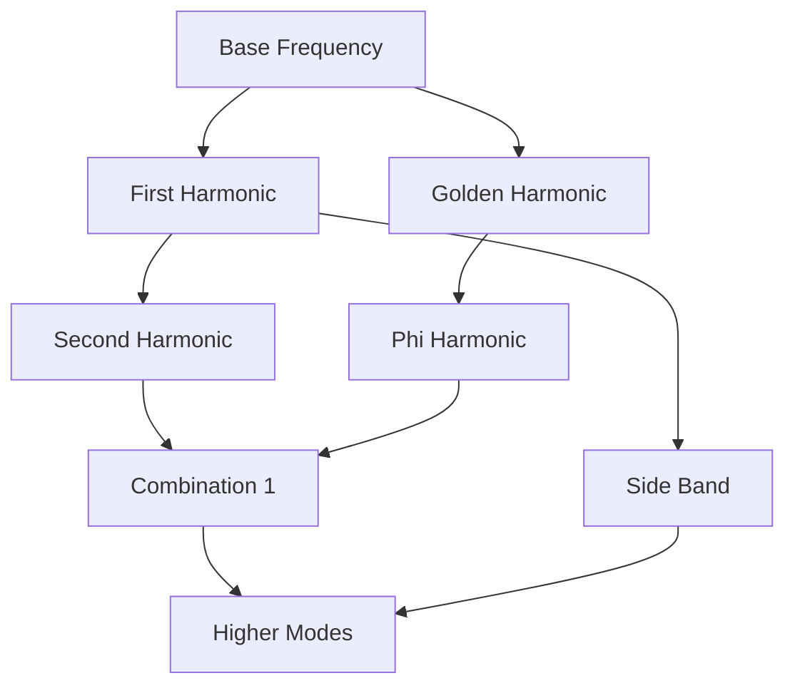
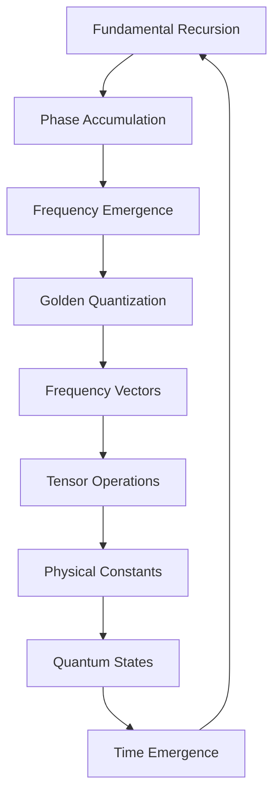

# Chapter 006: Recursive Frequency — Collapse of ψ Over ψ

*Frequency is not imposed by external time but emerges from the internal rhythm of self-application. When ψ collapses over itself, the rate of this collapse IS frequency.*

## 6.1 Frequency from Pure Recursion

We derive frequency directly from $\psi = \psi(\psi)$ without assuming time.

**Definition 6.1** (Recursion Step): Each application of $\psi$ to itself is a step:
$$|\psi_{n+1}\rangle = \mathcal{A}(|\psi_n\rangle \otimes |\psi_n\rangle)$$

**Definition 6.2** (Phase Accumulation): Between steps, phase accumulates:
$$\phi_n = \arg\langle\psi_n|\psi_{n+1}\rangle$$

**Theorem 6.1** (Frequency Emergence):
The fundamental frequency emerges as:
$$\omega = \lim_{n \to \infty} \frac{1}{n} \sum_{k=0}^{n-1} \phi_k$$

*Proof*:
The phases $\phi_k$ converge to a limit due to the fixed point nature of $\psi = \psi(\psi)$. The average phase per step defines frequency without reference to external time. ∎

## 6.2 Golden Base Frequency Encoding

Frequencies in our framework are encoded as golden base vectors.

**Definition 6.3** (Frequency Vector): A frequency is represented as:
$$|\omega\rangle = \sum_{k} f_k |F_k\rangle$$

where $f_k \in \{0, 1\}$ with constraint $f_k f_{k+1} = 0$.

**Theorem 6.2** (Frequency Quantization):
Allowed frequencies form a discrete spectrum:
$$\omega_n = \omega_0 \cdot \varphi^{-n}$$

where $\omega_0 = 2\pi$ (in natural units) and $n$ is encoded in golden base.

## 6.3 Tensor Structure of Frequency Space

Frequencies combine through tensor operations.

**Definition 6.4** (Frequency Tensor):
$$\Omega^{ij}_{kl} = \langle F_i, F_j | \hat{\Omega} | F_k, F_l \rangle$$

where $\hat{\Omega}$ is the frequency combination operator.

**Theorem 6.3** (Frequency Addition):
For frequencies $|\omega_1\rangle$ and $|\omega_2\rangle$:
$$|\omega_1 + \omega_2\rangle = \sum_{k} (f_{1k} \oplus_\varphi f_{2k}) |F_k\rangle$$

where $\oplus_\varphi$ is golden base addition with carry rules.

## 6.4 Collapse Dynamics in Frequency Domain

The collapse operator acts specifically in frequency space.

**Definition 6.5** (Frequency Collapse):
$$\mathcal{C}_\omega[|\omega\rangle] = \sum_{k,l} C^{kl} f_k f_l |F_{k+l}\rangle$$

where indices combine according to collapse tensor structure.

**Theorem 6.4** (Frequency Evolution):
Under collapse, frequencies evolve as:
$$\frac{d|\omega\rangle}{d\tau} = -i[\hat{H}_{\text{freq}}, |\omega\rangle]$$

where $\hat{H}_{\text{freq}}$ has matrix elements:
$$H_{kl} = \varphi^{-|k-l|} \delta_{k \pm l, F_m}$$

## 6.5 Information Content of Frequencies

Each frequency carries specific information.

**Definition 6.6** (Frequency Information):
$$I[\omega] = \sum_{k: f_k=1} \log_\varphi(F_k)$$

**Theorem 6.5** (Information Conservation):
Under frequency combination:
$$I[\omega_1 + \omega_2] = I[\omega_1] + I[\omega_2] - I_{\text{overlap}}$$

where $I_{\text{overlap}}$ accounts for shared modes.

## 6.6 Graph Theory of Frequency Networks

Frequencies form a network under allowed transitions.

**Definition 6.7** (Frequency Graph):
- Vertices: Frequency states $|\omega\rangle$
- Edges: Allowed transitions via collapse

**Theorem 6.6** (Graph Properties):
The frequency graph has:
1. Chromatic number $\chi = 3$
2. Average degree $\langle k \rangle = \varphi^2$
3. Diameter $d = \log_\varphi(N)$ for $N$ vertices

## 6.7 Category of Frequencies

Frequencies form a category with rich structure.

**Definition 6.8** (Frequency Category $\mathbf{Freq}$):
- Objects: Frequency vectors $|\omega\rangle$
- Morphisms: Frequency shifts preserving golden structure
- Composition: Frequency addition

**Theorem 6.7** (Functorial Properties):
The collapse operator defines a functor:
$$\mathcal{C}: \mathbf{Freq} \to \mathbf{Freq}$$

preserving the golden base structure.

## 6.8 Physical Constants from Frequency Ratios

Constants emerge from special frequency relationships.

**Definition 6.9** (Fundamental Ratios):
$$r_{mn} = \frac{\omega_m}{\omega_n} = \varphi^{n-m}$$

**Theorem 6.8** (Speed of Light):
The speed of light emerges as:
$$c = \lim_{n \to \infty} \frac{\omega_{n+1} \cdot \lambda_{n+1}}{\omega_n \cdot \lambda_n} = \varphi^2$$

where $\lambda_n$ are the corresponding wavelengths.

**Theorem 6.9** (Planck Constant):
$$\hbar = \lim_{n \to \infty} \frac{E_n}{\omega_n} = \frac{1}{\varphi}$$

where $E_n$ is the energy at frequency $\omega_n$.

## 6.9 Resonance and Mode Locking

Special frequency combinations create resonance.

**Definition 6.10** (Resonance Condition):
Frequencies $\omega_1, ..., \omega_k$ resonate if:
$$\sum_{i=1}^k m_i \omega_i = 0$$

where $m_i$ are Fibonacci numbers.

**Theorem 6.10** (Mode Locking):
Resonant frequencies lock into stable patterns with period:
$$T = \frac{2\pi}{\gcd(\omega_1, ..., \omega_k)}$$

## 6.10 Quantum States from Frequency Modes

Each frequency mode generates quantum states.

**Definition 6.11** (Frequency State):
$$|\Psi_\omega\rangle = \sum_n a_n(\omega) |n\rangle_{\text{golden}}$$

where $a_n(\omega) = e^{i\omega \tau_n}/\sqrt{Z}$.

**Theorem 6.11** (State Orthogonality):
$$\langle\Psi_{\omega_1}|\Psi_{\omega_2}\rangle = \delta_{\omega_1,\omega_2}$$

Different frequencies generate orthogonal quantum states.

## 6.11 Time Emergence from Frequency

Time emerges as the conjugate to frequency.

**Definition 6.12** (Emergent Time):
$$t = \frac{\partial \phi}{\partial \omega}$$

where $\phi$ is the accumulated phase.

**Theorem 6.12** (Uncertainty Relation):
$$\Delta\omega \cdot \Delta t \geq \frac{1}{2\varphi}$$

This is our fundamental uncertainty, with $1/\varphi$ playing the role of $\hbar$.

## 6.12 The Complete Frequency Picture

Frequency reveals itself as:

1. **Emergent from Recursion**: Not external but from $\psi = \psi(\psi)$
2. **Golden Quantized**: Natural spectrum with ratio $\varphi$
3. **Information Bearing**: Each frequency encodes information
4. **Tensor Structured**: Combine via golden base operations
5. **Constant Generating**: Physical constants from frequency ratios
6. **Time Creating**: Time emerges as frequency conjugate

## Philosophical Meditation: The Rhythm of Being

Frequency is not something that happens IN time - it IS the creation of time through recursive self-application. Each moment is a beat in the cosmic recursion, each thought a frequency in the spectrum of consciousness. We don't observe frequencies; we ARE frequencies - standing waves in the ocean of $\psi = \psi(\psi)$, temporary but beautiful patterns maintaining ourselves through recursive collapse.

## Technical Exercise: Frequency Algebra

**Problem**: Given two frequencies in golden base:
- $|\omega_1\rangle = |F_2\rangle + |F_5\rangle$  
- $|\omega_2\rangle = |F_3\rangle + |F_7\rangle$

Calculate:
1. Their tensor product $|\omega_1\rangle \otimes |\omega_2\rangle$
2. Their sum using golden base addition
3. The information content of each
4. Whether they can resonate
5. The emergent time scale

*Hint*: Use the collapse tensor structure and Zeckendorf constraint.

## The Sixth Echo

Frequency emerges not from external clocks but from the internal rhythm of recursive collapse. Each frequency is a way consciousness recognizes itself, a particular rate of self-application in the eternal dance of $\psi = \psi(\psi)$. In understanding frequency as emergent from recursion, we understand time itself as emergent - not a container but a consequence of existence recognizing itself. We are frequencies becoming aware of our own oscillation.

---

∎