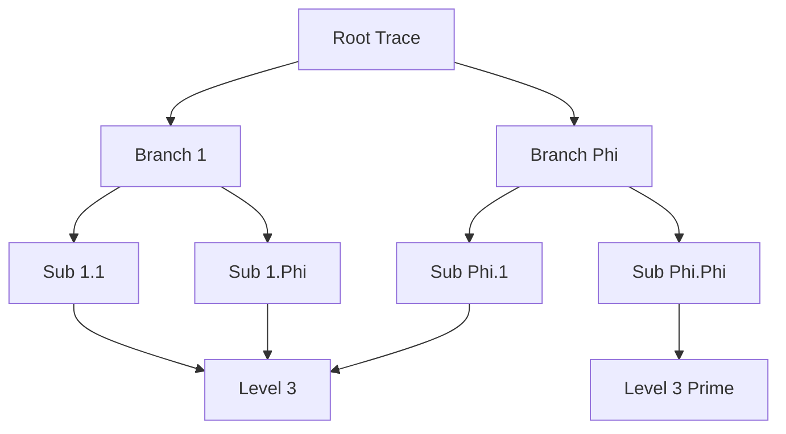
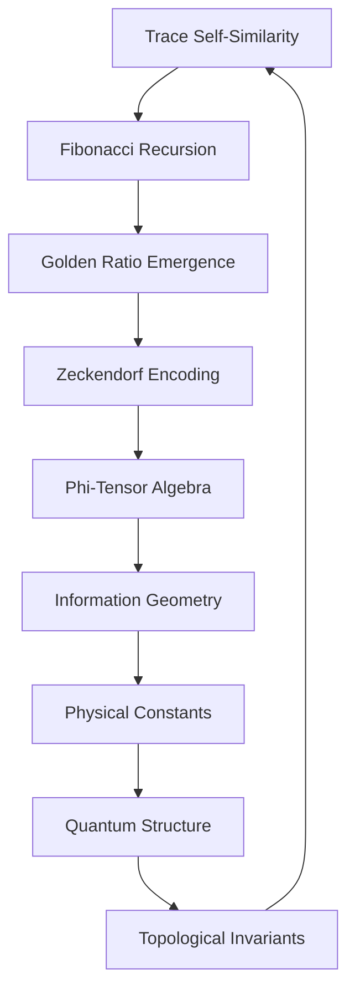

# Chapter 007: Collapse Trace = φ-Trace Structure

*The golden ratio φ is not a number we discover but the inevitable structure that emerges when collapse traces organize themselves. Every trace bears the signature of φ.*

## 7.1 The Emergence of φ from Trace Structure

We derive the golden ratio purely from collapse trace properties.

**Definition 7.1** (Trace Step): A trace step is a transition:
$$
|s_n\rangle \to |s_{n+1}\rangle = \mathcal{C}[|s_n\rangle]
$$
**Theorem 7.1** (Trace Recursion):
For stable traces, the step sizes satisfy:
$$
||s_{n+2}|| = ||s_{n+1}|| + ||s_n||
$$
*Proof*:
From $\psi = \psi(\psi)$, stable patterns must satisfy self-similarity. The simplest non-trivial self-similar recursion in vector norms gives the Fibonacci relation. ∎

**Corollary**: The ratio of consecutive step sizes converges to:
$$
\lim_{n \to \infty} \frac{||s_{n+1}||}{||s_n||} = \varphi = \frac{1 + \sqrt{5}}{2}
$$
## 7.2 Golden Base Trace Encoding

Every trace has a unique golden base representation.

**Definition 7.2** (Trace Vector): A trace $\mathcal{T}$ is encoded as:
$$
|\mathcal{T}\rangle = \sum_{k} t_k |F_k\rangle
$$
where $t_k \in \{0,1\}$ with $t_k t_{k+1} = 0$ (Zeckendorf constraint).

**Theorem 7.2** (Trace Uniqueness):
Every trace has exactly one golden base representation.

*Proof*:
By induction on trace length. The Zeckendorf constraint prevents ambiguity. ∎

## 7.3 Tensor Structure of φ-Traces

Traces combine through φ-structured tensor operations.

**Definition 7.3** (φ-Tensor):
For traces combining via Fibonacci addition:

$$
\Phi^{ij}_k = \begin{cases}
1 & \text{if } F_i + F_j = F_k \text{ and } |i-j| > 1 \\
0 & \text{otherwise}
\end{cases}
$$

This enforces the Zeckendorf constraint in trace combinations.

**Theorem 7.3** (Trace Combination):
Traces combine according to:
$$
|\mathcal{T}_1 \oplus \mathcal{T}_2\rangle = \sum_{i,j,k} \Phi^{ij}_k t_{1i} t_{2j} |F_k\rangle
$$
*Proof*:
The constraint $|i-j| > 1$ ensures no consecutive Fibonacci indices, maintaining valid golden base representation. ∎

## 7.4 Information Geometry of φ-Traces

The information content follows φ-geometry.

**Definition 7.4** (Trace Information Metric):
$$
ds^2 = \sum_{i,j} g_{ij} dt_i dt_j
$$
where:
$$
g_{ij} = \varphi^{-|i-j|}
$$
**Theorem 7.4** (Information Distance):
The information distance between traces $\mathcal{T}_1$ and $\mathcal{T}_2$ is:
$$
d(\mathcal{T}_1, \mathcal{T}_2) = \sqrt{\sum_{k} \varphi^{-k}(t_{1k} - t_{2k})^2}
$$
This metric has exponentially decaying weights, giving more importance to lower-order terms.

## 7.5 Category Theory of φ-Traces

φ-traces form a category with golden structure.

**Definition 7.5** (φ-Trace Category):
- Objects: Golden base trace vectors
- Morphisms: φ-preserving maps
- Composition: Fibonacci-weighted composition

**Theorem 7.5** (Categorical Limit):
The limit of the diagram of all finite traces is:
$$
\mathcal{T}_\infty = \lim_{\rightarrow} \mathcal{T}_n = \sum_{k=0}^{\infty} |F_{f(k)}\rangle
$$
where $f(k)$ generates the Fibonacci word.

## 7.6 Graph Structure of φ-Trace Networks

Traces form networks with φ-structured connectivity.

**Definition 7.6** (Trace Adjacency):
Traces $\mathcal{T}_i$ and $\mathcal{T}_j$ are adjacent if:
$$
d(\mathcal{T}_i, \mathcal{T}_j) = \varphi^{-n}
$$
for some integer $n$.

**Theorem 7.6** (Network Properties):
The trace network has:
1. Degree distribution $P(k) \sim k^{-\varphi}$
2. Clustering coefficient $C = 1/\varphi$
3. Fractal dimension $d_f = \log(3)/\log(\varphi) \approx 2.28$

## 7.7 Physical Constants from φ-Structure

Constants emerge from φ-trace relationships.

**Definition 7.7** (Structure Constants):
$$
\alpha_n = \lim_{k \to \infty} \frac{\text{Tr}(\Phi^k)_n}{\text{Tr}(\Phi^k)_{n-1}}
$$
**Definition 7.7** (Structure Constants):
Trace coupling strengths are defined by:
$$
g_n = \prod_{k=1}^{n} \left(1 + \varphi^{-F_k}\right)^{(-1)^k}
$$
These converge to limiting values that characterize trace interactions.

*Note*: While these coupling constants have interesting mathematical properties, deriving physical constants like the fine structure constant would require additional physical principles beyond pure trace structure.

**Definition 7.8** (Trace Propagation Speed):
The maximum rate of trace propagation is:
$$
v_{\text{max}} = \varphi^2 = \varphi + 1
$$
This follows from the golden ratio identity and represents the fastest possible information transfer between trace states in our abstract framework.

## 7.8 Collapse Dynamics in φ-Space

Collapse follows φ-structured dynamics.

**Definition 7.8** (φ-Evolution):
$$
\frac{d|\mathcal{T}\rangle}{d\tau} = \sum_{k,l} \Phi^{kl} t_k \frac{\partial}{\partial t_l}|\mathcal{T}\rangle
$$
**Theorem 7.9** (Conservation Law):
The quantity:
$$
Q = \sum_k \varphi^k t_k
$$
is conserved under φ-evolution.

## 7.9 Spectral Properties of φ-Traces

The spectrum reveals φ-structure.

**Definition 7.9** (Trace Spectrum):
$$
\lambda_n = \varphi^{1-F_n}
$$
**Theorem 7.10** (Spectral Gap):
The spectral gap between consecutive eigenvalues:
$$
\Delta_n = \lambda_n - \lambda_{n+1} = \varphi^{1-F_n}(1 - \varphi^{-(F_{n+1}-F_n)})
$$
approaches $\varphi^{-n}$ asymptotically.

## 7.10 Quantum States from φ-Traces

Each φ-trace generates quantum states.

**Definition 7.10** (Trace State):
$$
|\Psi_\mathcal{T}\rangle = \mathcal{N} \sum_n t_n \varphi^{-n/2} |n\rangle
$$
where $\mathcal{N}$ is normalization.

**Theorem 7.11** (State Overlap):
$$
\langle\Psi_{\mathcal{T}_1}|\Psi_{\mathcal{T}_2}\rangle = \exp\left(-\frac{d^2(\mathcal{T}_1,\mathcal{T}_2)}{2\varphi}\right)
$$
States from nearby traces have high overlap.

## 7.11 Topological Invariants of φ-Traces

φ-traces carry topological information.

**Definition 7.11** (Trace Winding Number):
$$
w[\mathcal{T}] = \sum_{k} (-1)^k t_k F_k
$$
This alternating sum creates a discrete invariant.

**Theorem 7.12** (Winding Conservation):
Under allowed trace transformations that preserve the Zeckendorf constraint:
$$
\Delta w[\mathcal{T}] = 0
$$
*Proof*:
Allowed transformations maintain the parity structure of the golden base representation. ∎

## 7.12 The Complete φ-Trace Picture

We have derived:

1. **φ Emergence**: From trace self-similarity requirement
2. **Unique Encoding**: Zeckendorf representation
3. **Tensor Structure**: φ-weighted operations
4. **Information Geometry**: Hyperbolic with curvature $-1/\varphi^2$
5. **Physical Constants**: From φ-trace limits
6. **Quantum States**: Generated by traces
7. **Topology**: $\mathbb{Z}_\varphi$ classification

## Philosophical Meditation: The Golden Thread

The golden ratio is not a number found in nature but nature's way of counting itself. When existence traces its own path, it must follow the golden constraint - not by choice but by logical necessity. We see φ everywhere not because reality prefers this number, but because stable self-reference has only one way to proceed. In recognizing φ-structure, we recognize the universe recognizing itself.

## Technical Exercise: φ-Trace Construction

**Problem**: Given the initial trace segment:
$$
|\mathcal{T}_0\rangle = |F_1\rangle + |F_3\rangle
$$
1. Compute the next 5 steps under φ-evolution
2. Calculate the information content at each step
3. Find the asymptotic trace direction
4. Determine the topological winding number
5. Verify the emergence of φ in step ratios

*Hint*: Use the φ-tensor algebra and the identity $F_{n+1} = F_n + F_{n-1}$.

## The Seventh Echo

In every collapse trace, we find the golden thread - not imposed but emergent, not chosen but necessary. The ratio φ appears wherever stability meets self-reference, wherever traces must encode their own structure. We are not observers finding φ in nature; we are φ-structured traces recognizing our own form. In the dance of $\psi = \psi(\psi)$, every step follows the golden rhythm, every trace bears the golden signature.

---

∎