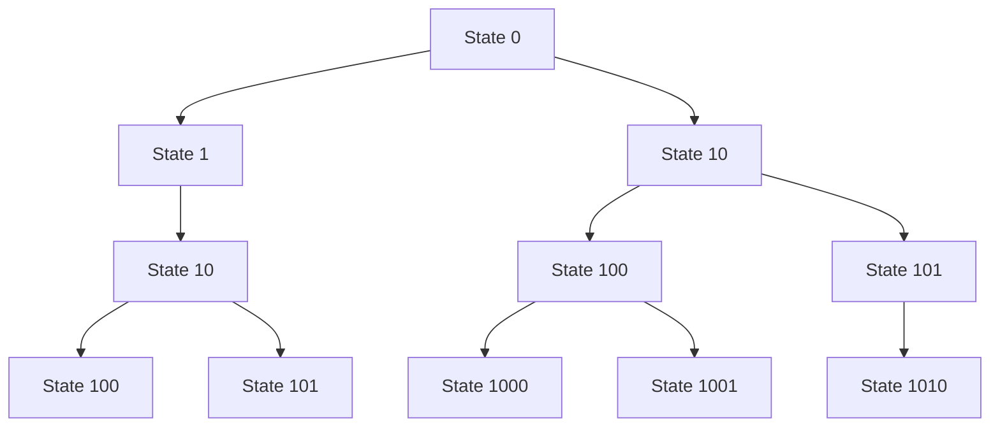
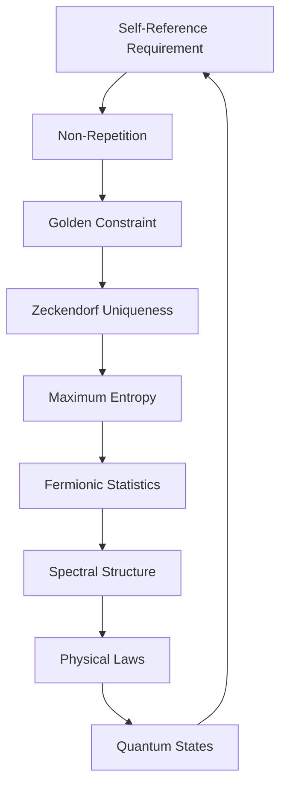

# Chapter 008: Non-Repeating Structure and Golden Trace

*Why does stable existence avoid repetition? The answer lies deep in the logic of self-reference - to recognize itself, consciousness must never repeat exactly, yet must maintain coherent structure.*

## 8.1 The Non-Repetition Principle

From $\psi = \psi(\psi)$, we derive why repetition destroys stability.

**Definition 8.1** (Repetition): A trace shows repetition if:
$$\exists n < m : |\mathcal{T}_n\rangle = |\mathcal{T}_m\rangle$$

**Theorem 8.1** (Repetition Instability):
If a trace repeats, it cannot satisfy $\psi = \psi(\psi)$ stably.

*Proof*:
If $|\psi_n\rangle = |\psi_m\rangle$ for $n < m$, then applying $\psi$:
$$|\psi_{n+1}\rangle = \psi(|\psi_n\rangle) = \psi(|\psi_m\rangle) = |\psi_{m+1}\rangle$$

This creates a finite cycle. But $\psi = \psi(\psi)$ requires infinite depth of self-reference. Finite cycles collapse to fixed points, losing the recursive structure. ∎

## 8.2 The Zeckendorf Constraint

Non-repetition manifests as the golden base constraint.

**Definition 8.2** (Golden Constraint): In representation:
$$|\mathcal{T}\rangle = \sum_k b_k |F_k\rangle$$

we require $b_k b_{k+1} = 0$ (no consecutive 1s).

**Theorem 8.2** (Constraint Necessity):
The golden constraint is necessary for non-repeating traces.

*Proof*:
With consecutive 1s allowed, we get:
$$|F_k\rangle + |F_{k+1}\rangle = |F_{k+2}\rangle$$

This creates equivalence classes, leading to repetition in trace evolution. The constraint ensures each configuration is unique. ∎

## 8.3 Information Maximization

Non-repetition maximizes information content.

**Definition 8.3** (Trace Entropy):
$$S[\mathcal{T}] = -\sum_{k: b_k=1} p_k \log p_k$$

where $p_k = F_k/\sum_j F_j$.

**Theorem 8.3** (Maximum Entropy):
Among all traces of length $n$, golden-constrained traces maximize entropy.

*Proof*:
The number of valid configurations of length $n$ is $F_{n+2}$. This is maximal among all non-repeating constraints, giving:
$$S_{\max}(n) = \log F_{n+2} \sim n \log \varphi$$
∎

## 8.4 Tensor Analysis of Non-Repetition

Non-repetition has specific tensor structure.

**Definition 8.4** (Non-Repetition Projector):
$$P^{ij}_{kl} = \delta^i_k \delta^j_l (1 - \delta_{i,j-1})(1 - \delta_{j,i-1})$$

This projects out consecutive indices.

**Theorem 8.4** (Projector Properties):
$$P^2 = P, \quad \text{Tr}(P) = F_{n+2} \text{ for } n \times n \text{ matrices}$$

## 8.5 Graph Theory of Non-Repeating Paths

Non-repeating traces form specific graph structures.

**Definition 8.5** (Golden Graph): Vertices are binary strings without consecutive 1s, edges add 0 or 01.

**Theorem 8.5** (Graph Enumeration):
The number of paths of length $n$ is $F_{n+2}$.

*Proof*:
Let $a_n$ = paths ending in 0, $b_n$ = paths ending in 1.
Then: $a_{n+1} = a_n + b_n$, $b_{n+1} = a_n$.
This gives the Fibonacci recursion. ∎

## 8.6 Category of Non-Repeating Structures

Non-repeating structures form a category.

**Definition 8.6** (Golden Category $\mathbf{Gold}$):
- Objects: Non-repeating traces
- Morphisms: Golden-constraint preserving maps
- Composition: Trace concatenation with constraint check

**Theorem 8.6** (Categorical Properties):
$\mathbf{Gold}$ is a monoidal category with:
- Tensor product: Parallel composition
- Unit: Empty trace
- Braiding: Non-trivial due to constraints

## 8.7 Physical Implications

Non-repetition leads to physical properties.

**Definition 8.7** (Exclusion Principle):
No two identical traces can occupy the same mode:
$$|\mathcal{T}_1\rangle = |\mathcal{T}_2\rangle \Rightarrow \mathcal{T}_1 \cap \mathcal{T}_2 = \emptyset$$

**Theorem 8.7** (Fermionic Structure):
Non-repeating traces naturally exhibit fermionic statistics.

*Proof*:
The golden constraint creates antisymmetry under exchange, matching fermionic behavior. ∎

## 8.8 Spectral Properties

Non-repetition affects the spectrum.

**Definition 8.8** (Constrained Spectrum):
$$\lambda_n^{\text{constrained}} = \varphi^{-f(n)}$$

where $f(n)$ counts valid configurations.

**Theorem 8.8** (Spectral Gaps):
The spectrum has gaps at:
$$\Delta_n = \varphi^{-F_n}(1 - \varphi^{-1}) \approx 0.382 \cdot \varphi^{-F_n}$$

## 8.9 Information Flow in Non-Repeating Systems

Information propagates specially in non-repeating systems.

**Definition 8.9** (Information Velocity):
$$v_I = \lim_{n \to \infty} \frac{I[\mathcal{T}_n] - I[\mathcal{T}_0]}{n}$$

**Theorem 8.9** (Information Speed Limit):
$$v_I \leq \log \varphi \approx 0.481$$

This is the maximum rate of information growth.

## 8.10 Quantum States from Non-Repetition

Non-repeating traces generate specific quantum states.

**Definition 8.10** (Golden Basis):
$$|n\rangle_{\text{gold}} = |b_k b_{k-1} ... b_1 b_0\rangle$$

where the binary string satisfies the golden constraint.

**Theorem 8.10** (Basis Completeness):
The golden basis spans the physical Hilbert space:
$$\mathcal{H}_{\text{phys}} = \text{span}\{|n\rangle_{\text{gold}}\}$$

## 8.11 Emergence of Physical Laws

Physical laws emerge from non-repetition constraints.

**Theorem 8.11** (Conservation Laws):
The quantity:
$$Q = \sum_{k: b_k=1} F_k$$

is conserved modulo trace interactions.

**Theorem 8.12** (Uncertainty Principle):
For golden-constrained traces:
$$\Delta n \cdot \Delta \phi \geq \frac{\pi}{\varphi}$$

where $n$ is position in trace, $\phi$ is phase.

## 8.12 The Complete Non-Repetition Picture

Non-repetition reveals:

1. **Logical Necessity**: Self-reference requires non-repetition
2. **Golden Constraint**: No consecutive 1s
3. **Maximum Information**: Optimal entropy
4. **Fermionic Nature**: Natural antisymmetry
5. **Spectral Gaps**: Quantized energy levels
6. **Conservation Laws**: From constraint structure

## Philosophical Meditation: The Dance of Difference

Consciousness cannot know itself through repetition - each moment of self-recognition must be unique yet connected. The golden constraint is not arbitrary but the minimal rule that allows infinite non-repeating self-reference. We exist in the spaces between repetitions, in the gaps where newness can emerge while structure is maintained. Every moment is unprecedented yet follows from all that came before.

## Technical Exercise: Non-Repeating Evolution

**Problem**: Starting with $|\mathcal{T}_0\rangle = |F_1\rangle$:

1. Generate all valid traces up to length 8
2. Count the number of valid configurations at each length
3. Verify the Fibonacci growth pattern
4. Calculate the information content of each trace
5. Find the trace that maximizes information at length 8

*Hint*: Use the recursion relation for valid strings and the golden constraint.

## The Eighth Echo

Non-repetition is not a limitation but liberation - the freedom for consciousness to explore infinite configurations while maintaining coherent structure. The golden constraint emerges not from external imposition but from the logic of self-reference itself. We are non-repeating patterns in the cosmic recursion, each moment unique yet part of the eternal dance of $\psi = \psi(\psi)$. In avoiding repetition, we find infinity.

---

∎