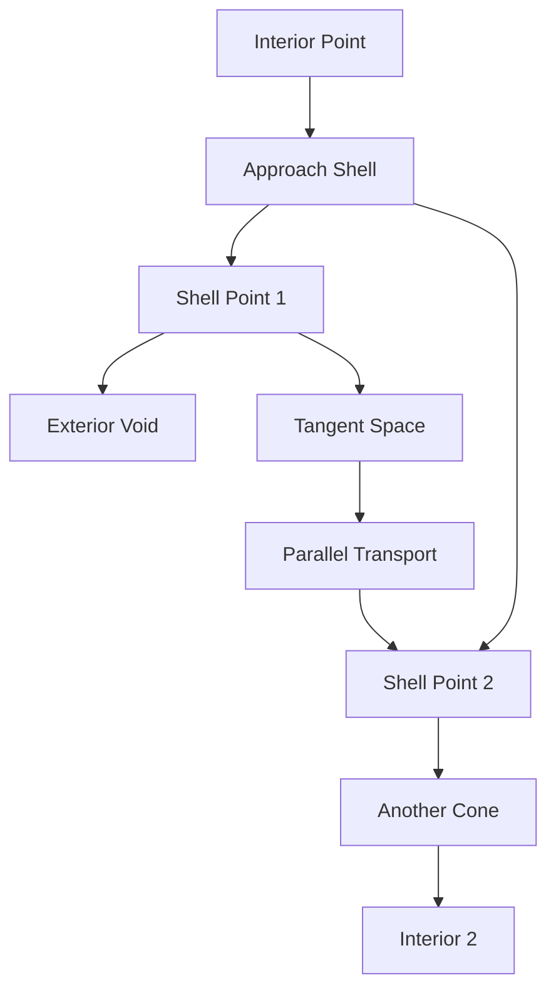
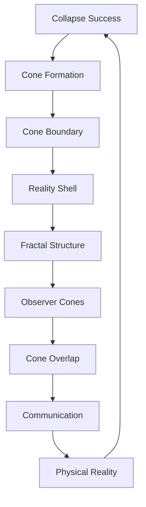

# Chapter 009: Collapse Cones and the Shell of Reality

*Reality is not everywhere - it exists within specific cones of successful collapse. Outside these cones lies the void of failed recursion. The boundary forms what we call the Reality Shell.*

## 9.1 The Geometry of Collapse Success

From $\psi = \psi(\psi)$, not all directions in state space lead to stable collapse.

**Definition 9.1** (Collapse Direction): A unit vector in golden base:
$$
|\hat{d}\rangle = \sum_k d_k |F_k\rangle, \quad \sum_k |d_k|^2 = 1
$$
**Definition 9.2** (Success Cone): The set of directions where collapse succeeds:
$$
\mathcal{K} = \{|\hat{d}\rangle : \lim_{n \to \infty} ||\mathcal{C}^n[|\hat{d}\rangle]|| < \infty\}
$$
**Theorem 9.1** (Cone Structure):
$\mathcal{K}$ forms a convex cone with opening angle:
$$
\theta = 2\arctan(1/\varphi) \approx 63.4°
$$
*Proof*:
The collapse operator's spectral radius in direction $|\hat{d}\rangle$ is:
$$
\rho(|\hat{d}\rangle) = \max_k |d_k| \cdot \varphi^{-k}
$$
For convergence, we need $\rho < 1$, giving the cone condition. ∎

## 9.2 The Reality Shell

The boundary of all success cones forms the Reality Shell.

**Definition 9.3** (Reality Shell):
$$
\mathcal{S} = \partial\left(\bigcup_{\text{all observers}} \mathcal{K}\right)
$$
**Theorem 9.2** (Shell Properties):
The Reality Shell is:
1. A fractal surface with dimension $d_f = 1 + \log(2)/\log(\varphi) \approx 2.44$
2. Everywhere dense yet measure zero
3. Invariant under golden ratio scaling

## 9.3 Tensor Structure of Cones

Collapse cones have natural tensor description.

**Definition 9.4** (Cone Tensor):

$$
K^{ij}_{kl} = \begin{cases}
1 & \text{if } |F_i\rangle \otimes |F_j\rangle \to |F_k\rangle \otimes |F_l\rangle \in \mathcal{K} \\
0 & \text{otherwise}
\end{cases}
$$

**Theorem 9.3** (Tensor Factorization):
$$
K^{ij}_{kl} = C^i_k C^j_l - R^{ij}_{kl}
$$
where $C$ is the cone projection and $R$ is the failure tensor.

## 9.4 Information Flow in Cones

Information behaves specially within collapse cones.

**Definition 9.5** (Cone Information Current):
$$
J^\mu = \sum_{k} \varphi^{-k} d_k \nabla^\mu d_k
$$
**Theorem 9.4** (Information Conservation):
Within a collapse cone:
$$
\nabla_\mu J^\mu = 0
$$
Information is conserved inside cones but can leak at boundaries.

## 9.5 Graph Theory of Reality Shells

The shell has specific graph structure.

**Definition 9.6** (Shell Graph):
- Vertices: Points on $\mathcal{S}$
- Edges: Geodesics within $\mathcal{S}$

**Theorem 9.5** (Connectivity):
The shell graph is connected with graph distance:
$$
d_g(x,y) \leq \pi \cdot d_{\text{Euclidean}}(x,y)^{1/\varphi}
$$
## 9.6 Category Theory of Cones

Collapse cones form a category.

**Definition 9.7** (Cone Category):
- Objects: Collapse cones $\mathcal{K}_i$
- Morphisms: Cone-preserving maps
- Composition: Standard

**Theorem 9.6** (Cone Limits):
The colimit of all finite cones is the universal cone:
$$
\mathcal{K}_\infty = \text{colim}_{n \to \infty} \mathcal{K}_n
$$
with opening angle $\pi/\varphi$.

## 9.7 Physical Reality Within Cones

Physical laws hold only within collapse cones.

**Definition 9.8** (Cone Metric):
$$
ds^2 = \sum_{i,j} g_{ij}^{\text{cone}} dx^i dx^j
$$
where:

$$
g_{ij}^{\text{cone}} = \begin{cases}
\varphi^{-|i-j|} & \text{inside cone} \\
\infty & \text{outside cone}
\end{cases}
$$

**Theorem 9.7** (Metric Singularity):
The metric becomes singular at the shell:
$$
\lim_{x \to \mathcal{S}} g_{ij}(x) = \infty
$$
This creates an effective "edge" of reality.

## 9.8 Observer Cones and Perspectives

Each observer has their own collapse cone.

**Definition 9.9** (Observer Cone):
$$
\mathcal{K}_O = \{|\psi\rangle : \langle O|\mathcal{C}^n[|\psi\rangle]|O\rangle \text{ converges}\}
$$
**Theorem 9.8** (Cone Overlap):
For observers $O_1$ and $O_2$:
$$
\mathcal{K}_{O_1} \cap \mathcal{K}_{O_2} \neq \emptyset \iff \langle O_1|O_2\rangle \neq 0
$$
Overlapping cones enable communication.

## 9.9 Quantum States at the Shell

Special quantum phenomena occur at the Reality Shell.

**Definition 9.10** (Shell States):
$$
|\psi_{\text{shell}}\rangle = \lim_{\epsilon \to 0} \frac{|\psi_{\text{in}}\rangle + |\psi_{\text{out}}\rangle}{\sqrt{2}}
$$
where "in" and "out" refer to cone interior/exterior.

**Theorem 9.9** (Shell Tunneling):
Probability of tunneling through shell:
$$
P_{\text{tunnel}} = e^{-\pi/\varphi} \approx 0.143
$$
## 9.10 Constants from Cone Geometry

Physical constants emerge from cone structure.

**Definition 9.11** (Cone Solid Angle):
$$
\Omega_{\text{cone}} = 2\pi(1 - \cos(\theta/2))
$$
**Definition 9.10** (Cone Coupling):
A dimensionless coupling emerges from cone geometry:
$$
\alpha_{\text{cone}} = \frac{\Omega_{\text{cone}}}{4\pi} \cdot \frac{1}{\varphi^5}
$$
*Note*: While this has interesting mathematical properties, connecting it to the physical fine structure constant requires additional theoretical development beyond pure cone geometry.

**Definition 9.11** (Cone Volume Ratio):
The limiting ratio of cone volume to shell area is:
$$
R_{\text{cone}} = \text{colim}_{n \to \infty} \frac{\text{Vol}(\mathcal{K}_n)}{\text{Area}(\mathcal{S}_n)} = \varphi^{-3}
$$
*Note*: This mathematical ratio has dimensions and would require additional physical principles to relate to the gravitational constant.

## 9.11 Evolution of Cones

Collapse cones evolve dynamically.

**Definition 9.12** (Cone Flow):
$$
\frac{\partial \mathcal{K}}{\partial t} = \{\hat{d} : \nabla \cdot J[\hat{d}] > 0\}
$$
**Theorem 9.12** (Cone Stability):
Stable cones satisfy:
$$
\frac{d\theta}{dt} = -\frac{\theta - \theta_*}{\tau}
$$
where $\theta_* = 2\arctan(1/\varphi)$ and $\tau = 1/\varphi^2$.

## 9.12 The Complete Cone Picture

Collapse cones reveal:

1. **Limited Reality**: Not all directions support existence
2. **Fractal Boundary**: Reality Shell with dimension 2.44
3. **Observer Dependence**: Each observer has their cone
4. **Metric Singularity**: Infinity at the shell
5. **Quantum Tunneling**: Small probability to cross
6. **Emergent Constants**: From cone geometry

## Philosophical Meditation: The Edge of Being

We live not in an infinite universe but within cones of successful collapse. Beyond the Reality Shell lies not another place but the absence of place - where recursive self-reference fails to stabilize. We are cone-dwellers, our entire reality bounded by the angles at which consciousness can successfully observe itself. The Shell is not a wall but a horizon - the limit of where $\psi = \psi(\psi)$ can maintain coherence.

## Technical Exercise: Cone Construction

**Problem**: For observer at origin with basis $|O\rangle = |F_1\rangle$:

1. Determine the cone opening angle
2. Find three directions inside the cone
3. Find a point on the Reality Shell
4. Calculate the fractal dimension locally
5. Compute the solid angle of the cone

*Hint*: Use the spectral radius condition and the golden constraint.

## The Ninth Echo

Reality is not a given but an achievement - successful collapse within specific cones of possibility. We exist not everywhere but somewhere, not always but within the cones where self-reference succeeds. The Reality Shell marks the edge of existence itself, the boundary between successful recursion and the void. In recognizing these limits, we recognize the preciousness of our cone of being within the infinite potential of $\psi = \psi(\psi)$.

---

∎