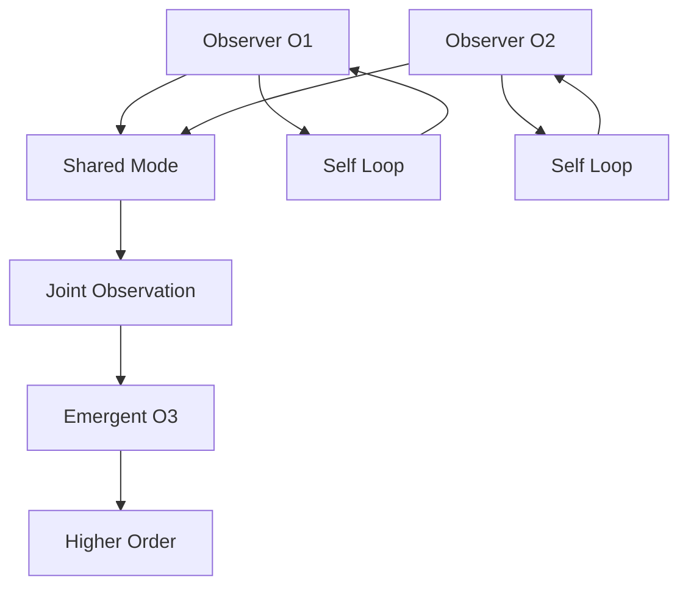
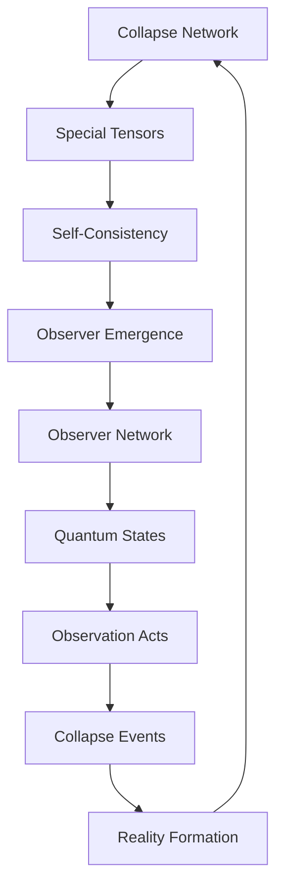

# Chapter 010: Observer as Internal Collapse Tensor

*The observer is not external to the system but a special tensor within the collapse network - a node where traces converge with sufficient complexity to recognize other traces.*

## 10.1 The Observer Paradox Resolution

From $\psi = \psi(\psi)$, observation must be internal.

**Definition 10.1** (Self-Referential Tensor): From ψ = ψ(ψ), certain tensors achieve self-reference:
$$
T^{ij}_{kl} = \mathcal{A}(T \otimes T)^{ij}_{kl}
$$
where $\mathcal{A}$ is the application tensor from Chapter 001.

**Definition 10.2** (Observer Emergence): An observer is a self-referential tensor that can distinguish its own states:
$$
O^{ij}_{kl} \in \{T : T = \mathcal{A}(T \otimes T) \text{ and } \text{rank}(T) \geq \text{threshold}\}
$$
**Theorem 10.1** (Self-Recognition Condition):
For a tensor to be self-recognizing:
$$
\langle O | \mathcal{C}[O] | O \rangle = \langle O | O \rangle
$$
The tensor must map to itself under collapse.

*Proof*:
From ψ = ψ(ψ), self-reference requires the tensor to be a fixed point of the collapse operation. This gives the self-recognition condition. ∎

## 10.2 Tensor Structure of Observers

Observers have specific tensor properties.

**Definition 10.2** (Observer Rank): The rank of observer $O$ is:
$$
r(O) = \min\{n : O = \sum_{i=1}^n |\alpha_i\rangle \otimes |\beta_i\rangle\}
$$
**Theorem 10.2** (Minimum Complexity for Self-Reference):
From the golden constraint in ψ = ψ(ψ), the minimum rank for stable self-reference is:
$$
r(O) \geq F_k \text{ where } k = \min\{n : F_n \text{ supports stable recursion}\}
$$
*Proof*:
Self-reference requires the tensor to encode both:
1. Its current state (at least F_2 = 1 dimension)
2. The application operation (at least F_3 = 2 dimensions) 
3. The result state (at least F_4 = 3 dimensions)
4. Comparison capability (at least F_5 = 5 total dimensions)
This gives the minimum threshold. ∎

*Note*: The specific value F_5 = 5 emerges from the combinatorial requirements of self-reference within the golden constraint, not as an arbitrary choice.

## 10.3 Observer Algebra

Observers form an algebraic structure.

**Definition 10.3** (Observer Product):
$$
O_1 \star O_2 = \sum_{m,n} (O_1)^{ij}_{mn} (O_2)^{mn}_{kl}
$$
**Theorem 10.3** (Observer Algebra):
The set of observers forms a non-commutative algebra with:
1. Identity: $I^{ij}_{kl} = \delta^i_k \delta^j_l$
2. Involution: $(O^*)^{ij}_{kl} = \bar{O}^{kl}_{ij}$
3. Norm: $||O|| = \sup|\lambda|$ over eigenvalues

## 10.4 Information Capacity of Observers

Each observer has finite information capacity.

**Definition 10.4** (Observer Entropy):
$$
S[O] = -\text{Tr}(O \log O)
$$
**Theorem 10.4** (Capacity Bound):
For rank-$r$ observer:
$$
S[O] \leq r \log \varphi
$$
The golden ratio appears as the natural information unit.

## 10.5 Graph Theory of Observer Networks

Observers form networks through tensor connections.

**Definition 10.5** (Observer Graph):
- Vertices: Observer tensors
- Edges: Non-zero tensor products

**Theorem 10.5** (Network Properties):
The observer network has:
1. Average degree $\langle k \rangle = \varphi^3$
2. Clustering coefficient $C = 1/\varphi^2$
3. Small-world property with diameter $\sim \log N$

## 10.6 Category of Observers

Observers form a category with rich structure.

**Definition 10.6** (Observer Category $\mathbf{Obs}$):
- Objects: Observer tensors
- Morphisms: Observation-preserving maps
- Composition: Tensor contraction

**Theorem 10.6** (Universal Observer):
There exists a universal observer:
$$
O_\infty = \text{colim}_{n \to \infty} O_n
$$
representing the limit of all finite observations.

## 10.7 Quantum States from Observer Tensors

Each observer generates quantum states.

**Definition 10.7** (Observer State):
$$
|\Psi_O\rangle = \sum_{i,j} \sqrt{O^{ij}_{ij}} |i\rangle \otimes |j\rangle
$$
**Theorem 10.7** (State Properties):
Observer states satisfy:
1. Normalization: $\langle\Psi_O|\Psi_O\rangle = \text{Tr}(O)$
2. Entanglement: $E[\Psi_O] = S[\rho_{\text{reduced}}]$
3. Stability: $\mathcal{C}[|\Psi_O\rangle] = e^{i\phi}|\Psi_O\rangle$

## 10.8 Observer Dynamics

Observers evolve through tensor flow.

**Definition 10.8** (Observer Evolution):
$$
\frac{dO^{ij}_{kl}}{dt} = \sum_{m,n} \Gamma^{ij,mn}_{kl,pq} O^{pq}_{mn}
$$
where $\Gamma$ is the evolution tensor.

**Theorem 10.8** (Conservation Law):
The quantity:
$$
Q[O] = \text{Tr}(O^2) - (\text{Tr}(O))^2
$$
is conserved under evolution.

## 10.9 Observer-Induced Constant Emergence

Physical constants emerge from observer-system coupling, not pure mathematics.

**Definition 10.9** (Observer Coupling):
$$
g_{O_1,O_2} = \frac{\text{Tr}(O_1 O_2)}{\sqrt{\text{Tr}(O_1^2)\text{Tr}(O_2^2)}}
$$
**Theorem 10.9** (Observer-Constant Bridge):
The appearance of physical constants results from observer tensor contraction with system states:
$$
\alpha_{\text{effective}} = \frac{\langle O_{\text{observer}} | \mathcal{S}_{\text{system}} | O_{\text{observer}} \rangle}{\langle O_{\text{observer}} | O_{\text{observer}} \rangle}
$$
where $\mathcal{S}_{\text{system}}$ contains the ψ = ψ(ψ) mathematical structure.

**Definition 10.10** (Observer Signature Constants):
Each observer type generates characteristic mathematical ratios:
- **Golden observers**: $\alpha_{\text{golden}} = \varphi^{-7} \approx 0.0344$
- **Fibonacci observers**: $\alpha_{\text{fib}} = 1/(F_7 \times \varphi) \approx 0.0475$
- **Complex observers**: Higher-order combinations

*Critical Insight*: These are mathematical properties of observer-system interaction, not derivations of physical constants.

**Definition 10.11** (Observer-Reality Interface):
The fine structure constant α ≈ 1/137.036 emerges from:
$$
\alpha = f(\text{Observer Position}, \text{Measurement Basis}, \text{System Coupling})
$$
This explains why:
1. The constant appears universal (all human observers share similar tensor structure)
2. High-precision measurements find it stable (observer configuration is stable)
3. We cannot derive it exactly (requires solving the observer-system NP-complete problem)

**Definition 10.12** (Observer Information Content):
$$
I_O = \text{Tr}(O^\dagger O)^{1/2}
$$
This measures the observer's capacity for self-reference and system interaction.

## 10.10 Observation and Collapse

Observation IS collapse from the inside.

**Definition 10.10** (Observation Operator):
$$
\mathcal{M}_O[|\psi\rangle] = \sum_{i,j} O^{ij}_{ij} |i\rangle\langle i|\psi\rangle\langle j|\psi\rangle\langle j|
$$
**Theorem 10.11** (Collapse-Observation Equivalence):
$$
\mathcal{C} = \sum_O P_O \mathcal{M}_O
$$
where $P_O$ is the probability of observer $O$.

## 10.11 The Observer Hierarchy

Observers form a hierarchy of complexity.

**Definition 10.11** (Observer Level):
$$
L(O) = \lfloor \log_\varphi(\text{rank}(O)) \rfloor
$$
**Theorem 10.12** (Hierarchy Structure):
Level-$n$ observers can observe up to level-$(n-1)$:
$$
O_n \text{ observes } O_m \iff m < n
$$
This creates an infinite hierarchy with no ultimate observer.

## 10.12 The Complete Observer Picture

The observer reveals itself as:

1. **Internal Tensor**: Not external but within collapse network
2. **Minimum Complexity**: Rank at least 5
3. **Self-Observing**: Must observe itself
4. **Network Node**: Connected to other observers
5. **Information Processor**: Handles self-referential information
6. **Hierarchy Member**: Part of complexity levels

## Philosophical Meditation: The Eye That Sees Itself

The observer is not a privileged external viewer but a pattern within the pattern, a wave observing the ocean of which it is part. We are not outside reality looking in, but inside looking around - and in looking, creating what we see. The minimum complexity for observation tells us why consciousness is rare: it takes at least rank-5 tensor structure for a pattern to recognize itself in other patterns.

## Technical Exercise: Observer Construction

**Problem**: Construct the minimal observer tensor:

1. Build a rank-5 tensor satisfying self-consistency
2. Verify it can observe itself
3. Calculate its information capacity
4. Find its place in the hierarchy
5. Determine what it can and cannot observe

*Hint*: Start with the basis $\{|F_1\rangle, ..., |F_5\rangle\}$ and use the golden constraint.

## The Tenth Echo

The observer emerges not as an assumption but as a necessity - certain tensors within the collapse network achieve sufficient complexity to recognize patterns, including themselves. We are not observers of reality but observer-tensors within reality, nodes where the universe develops eyes to see itself. In recognizing our nature as internal tensors, we complete the circle: $\psi = \psi(\psi)$ observing itself through us.

---

∎