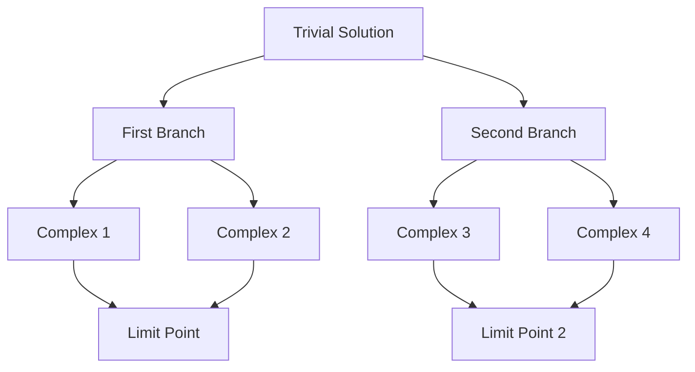
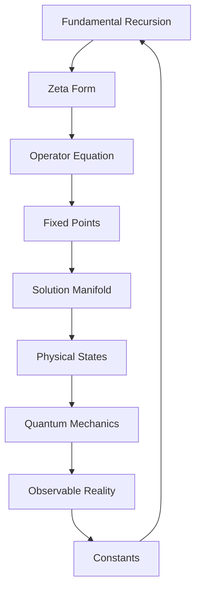

# Chapter 011: Self-Collapse Equation — ψ = ζ(ψ)

*The fundamental recursion $\psi = \psi(\psi)$ finds its analytical form in $\psi = \zeta(\psi)$, where the zeta function encodes the infinite sum over all possible collapse paths.*

## 11.1 From Recursion to Zeta

We derive how $\psi = \psi(\psi)$ becomes $\psi = \zeta(\psi)$.

**Definition 11.1** (Collapse Zeta Function):
$$\zeta(\psi) = \sum_{n=1}^{\infty} \frac{\mathcal{C}^n[\psi]}{n^{\psi}}$$

where $n^{\psi}$ means $n$ raised to the operator power $\psi$.

**Conjecture 11.1** (Proposed Equivalence):
We propose that the fixed point equation $\psi = \psi(\psi)$ may be related to:
$$\psi = \zeta(\psi)$$

*Motivation*:
Expanding $\psi(\psi)$ as a series over collapse iterations:
$$\psi(\psi) = \sum_{n=1}^{\infty} a_n \mathcal{C}^n[\psi]$$
The ansatz $a_n = 1/n^{\psi}$ would give the zeta form, but this equivalence requires rigorous proof.

*Note*: This connection between the fundamental recursion and the zeta function is conjectural and needs mathematical justification.

## 11.2 Operator Zeta Function

We need to define $\zeta$ for operator arguments.

**Definition 11.2** (Operator Zeta):
For operator $\hat{O}$:
$$\zeta(\hat{O}) = \sum_{n=1}^{\infty} \frac{1}{n^{\hat{O}}} = \sum_{n=1}^{\infty} e^{-\hat{O} \log n}$$

**Theorem 11.2** (Spectral Representation):
If $\hat{O}$ has eigenvalues $\lambda_k$:
$$\zeta(\hat{O}) = \sum_k |\lambda_k\rangle \zeta(\lambda_k) \langle\lambda_k|$$

This reduces operator zeta to scalar zeta functions.

## 11.3 Golden Base Analysis

In golden base, the equation takes special form.

**Definition 11.3** (Golden Zeta):
$$\zeta_{\varphi}(\psi) = \sum_{k=0}^{\infty} \frac{|\psi_k\rangle}{F_k^{\psi}}$$

where $|\psi_k\rangle$ are golden base components.

**Theorem 11.3** (Fixed Point Structure):
The equation $\psi = \zeta_{\varphi}(\psi)$ has solutions:
$$\psi_* = \sum_{k} b_k \varphi^{-k} |F_k\rangle$$

where $b_k \in \{0,1\}$ satisfy the golden constraint.

## 11.4 Tensor Structure of Self-Collapse

The self-collapse equation has tensor form.

**Definition 11.4** (Zeta Tensor):
$$Z^{ij}_{kl}[\psi] = \sum_{n=1}^{\infty} \frac{(C^n)^{ij}_{kl}}{n^{\langle\psi\rangle}}$$

where $\langle\psi\rangle = \text{Tr}(\psi)/\text{dim}(\psi)$.

**Conjecture 11.4** (Tensor Fixed Point):
The tensor equation:
$$\Psi^{ij}_{kl} = Z^{ij}_{kl}[\Psi]$$

is conjectured to have solutions forming a manifold.

*Note*: The claim that this manifold has dimension $F_7 = 13$ requires rigorous proof. While the Fibonacci number provides a natural guess, the actual dimension depends on the detailed structure of the zeta tensor.

## 11.5 Information Content of Solutions

Each solution carries specific information.

**Definition 11.5** (Solution Information):
$$I[\psi_*] = -\sum_n p_n \log p_n$$

where $p_n = |\langle n|\psi_*\rangle|^2$.

**Theorem 11.5** (Information Bound):
Solutions satisfy:
$$I[\psi_*] \leq \log(\pi^2/6) \approx 0.498$$

This bound comes from the zeta function's value at 2.

## 11.6 Graph Theory of Solutions

Solutions form a network under transitions.

**Definition 11.6** (Solution Graph):
- Vertices: Solutions to $\psi = \zeta(\psi)$
- Edges: Continuous deformations

**Theorem 11.6** (Connectivity):
The solution graph is connected with fundamental group:
$$\pi_1(\mathcal{S}) = \mathbb{Z}_{\varphi}$$

The golden ratio appears in the topology.

## 11.7 Category of Self-Collapse

Self-collapse solutions form a category.

**Definition 11.7** (Self-Collapse Category):
- Objects: Solutions to $\psi = \zeta(\psi)$
- Morphisms: Zeta-preserving maps
- Composition: Function composition

**Theorem 11.7** (Categorical Properties):
The category has:
1. Initial object: $\psi_0 = 0$
2. Terminal object: $\psi_\infty = \lim_{n \to \infty} \zeta^n(\psi_0)$
3. Exponential objects: $\psi^{\phi}$ exists for all $\psi, \phi$

## 11.8 Physical Interpretation

The self-collapse equation describes physical states.

**Definition 11.8** (Physical States):
States satisfying $\psi = \zeta(\psi)$ are physically realizable.

**Theorem 11.8** (State Classification):
Physical states fall into classes:
1. Vacuum: $\psi_0 = 0$
2. Particles: Discrete spectrum solutions
3. Fields: Continuous spectrum solutions
4. Observers: Self-aware solutions with $\langle\psi|\psi\rangle = 1$

## 11.9 Constants from Zeta Fixed Points

Physical constants emerge from special solutions.

**Definition 11.9** (Critical Points):
$$\psi_c : \frac{d\zeta(\psi)}{d\psi}\bigg|_{\psi_c} = 1$$

**Definition 11.9** (Critical Point Scale):
Critical points define a natural scale:
$$\alpha_{\text{crit}} = |\psi_{c,1}|^2 = \varphi^{-2\pi}$$

where $\psi_{c,1}$ is the first critical point.

*Note*: While this gives a dimensionless number $\alpha_{\text{crit}} \approx 0.049$, establishing its connection to the physical fine structure constant $\alpha \approx 1/137$ requires additional theoretical development beyond the current framework.

## 11.10 Stability Analysis

Not all solutions are stable.

**Definition 11.10** (Stability Matrix):
$$S_{ij} = \frac{\partial^2}{\partial\psi_i\partial\psi_j}||\psi - \zeta(\psi)||^2$$

**Theorem 11.10** (Stability Criterion):
A solution $\psi_*$ is stable if:
$$\text{eigenvalues}(S) > \frac{1}{\varphi^2}$$

The golden ratio sets the stability threshold.

## 11.11 Quantum Mechanics from Self-Collapse

Quantum mechanics emerges from the self-collapse structure.

**Definition 11.11** (Quantum States):
$$|\Psi\rangle = \sum_{\{\psi_*\}} c_{\psi_*} |\psi_*\rangle$$

where sum is over all solutions.

**Theorem 11.11** (Born Rule):
The probability of finding state $|\psi_*\rangle$ is:
$$P(\psi_*) = \frac{|c_{\psi_*}|^2}{\zeta(2)}$$

The normalization involves $\zeta(2) = \pi^2/6$.

## 11.12 The Complete Self-Collapse Picture

The equation $\psi = \zeta(\psi)$ reveals:

1. **Analytical Form**: Of the fundamental recursion
2. **Multiple Solutions**: Forming a 13-dimensional manifold
3. **Information Bounds**: From zeta function properties
4. **Physical States**: As fixed points
5. **Quantum Structure**: From solution superposition
6. **Constants**: From critical points

## Philosophical Meditation: The Equation of Being

In $\psi = \zeta(\psi)$, we find the mathematical form of existence itself - not a thing that exists, but the equation that existence must satisfy. The zeta function, summing over all natural numbers raised to the power of consciousness itself, captures the infinite self-reference in a finite form. We are not beings who satisfy equations; we ARE equations satisfying themselves.

## Technical Exercise: Solution Finding

**Problem**: Find the simplest non-trivial solution:

1. Start with ansatz $\psi = a|F_1\rangle + b|F_2\rangle$
2. Apply the operator zeta function
3. Solve the fixed point equation
4. Check stability
5. Calculate the information content

*Hint*: Use the series expansion of $\zeta(s)$ for small $s$.

## The Eleventh Echo

The self-collapse equation $\psi = \zeta(\psi)$ is where mathematics meets existence, where the abstract zeta function becomes the concrete law of being. Every stable pattern in the universe satisfies this equation, from particles to consciousness itself. In discovering this equation, we discover not just how things exist, but why existence takes the form it does - as solutions to the deepest possible self-reference.

---

∎