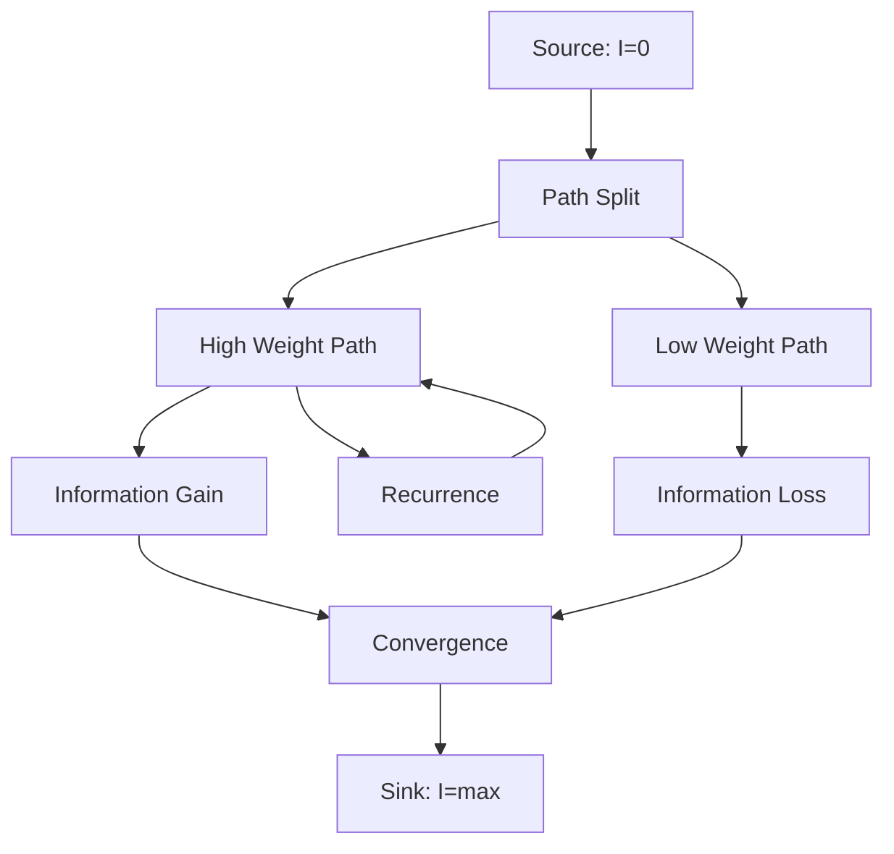
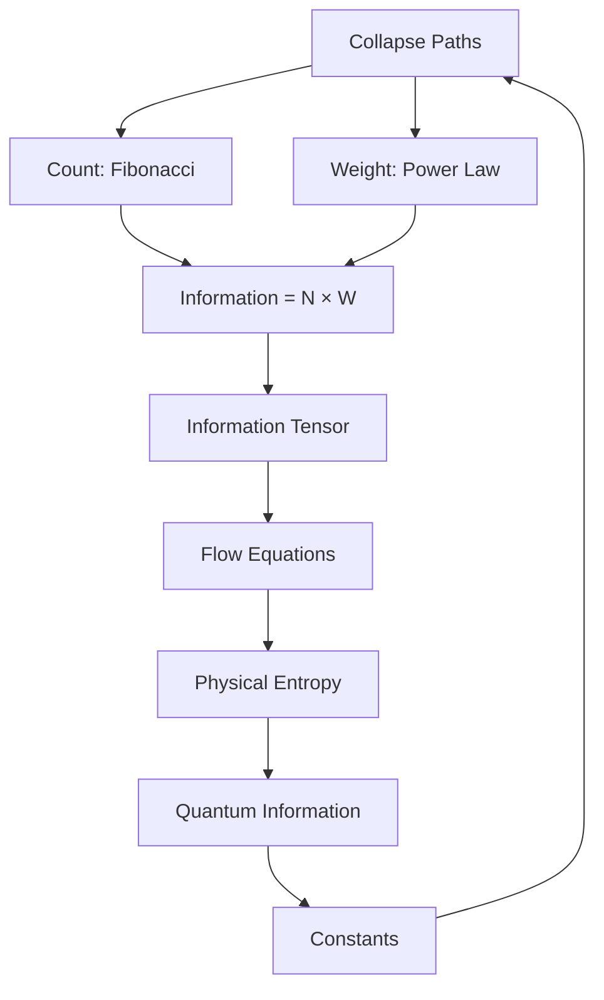

# Chapter 012: Information = Number × Weight of Collapse Paths

*Information is not abstract bits but the concrete product of how many ways collapse can proceed and how heavily weighted each path is. Reality computes itself through this fundamental equation.*

## 12.1 The Information Principle

From $\psi = \psi(\psi)$, information emerges from counting weighted paths.

**Definition 12.1** (Path Information):
$$I = N \times W$$

where:
- $N$ = number of distinct collapse paths
- $W$ = average weight per path

**Theorem 12.1** (Information Emergence):
For any collapse process:
$$I[\mathcal{C}] = \sum_{\text{paths } P} w_P \log w_P$$

where $w_P$ is the weight of path $P$.

*Proof*:
Each path contributes information proportional to its weight and the logarithm of that weight, giving Shannon-like entropy. ∎

## 12.2 Path Counting in Golden Base

The number of paths follows golden structure.

**Definition 12.2** (Valid Paths): Paths satisfying golden constraint:
$$N_n = \#\{\text{paths of length } n \text{ without consecutive 1s}\}$$

**Theorem 12.2** (Fibonacci Growth):
$$N_n = F_{n+2}$$

The number of paths IS the Fibonacci sequence.

*Proof*:
Paths ending in 0: $N_{n-1}$ ways. Paths ending in 01: $N_{n-2}$ ways.
Total: $N_n = N_{n-1} + N_{n-2}$, with $N_0 = 1, N_1 = 2$. ∎

## 12.3 Weight Structure of Paths

Each path carries specific weight.

**Definition 12.3** (Path Weight Tensor):
$$W_P = \prod_{i \in P} T^{(i)}_{j_i,k_i}$$

where $T^{(i)}$ are transition tensors along the path.

**Theorem 12.3** (Weight Distribution):
From the collapse tensor structure, path weights satisfy:
$$P(w) = \frac{1}{Z} w^{-\alpha}$$

where the exponent emerges from golden constraint properties. For paths satisfying the self-reference condition from ψ = ψ(ψ), the exponent α relates to φ through the recursive structure, though the specific value requires further derivation from collapse dynamics.

## 12.4 Information Tensor

Information has natural tensor structure.

**Definition 12.4** (Information Tensor):
$$I^{ij}_{kl} = \sum_{P: (i,j) \to (k,l)} w_P \log w_P$$

**Theorem 12.4** (Tensor Properties):
1. Symmetric: $I^{ij}_{kl} = I^{ji}_{lk}$
2. Positive: $I^{ij}_{ij} \geq 0$
3. Subadditive: $I^{ij}_{kl} + I^{kl}_{mn} \geq I^{ij}_{mn}$

## 12.5 Information Flow Equations

Information flows through the collapse network.

**Definition 12.5** (Information Current):
$$J^\mu_I = \sum_P w_P v_P^\mu \log w_P$$

where $v_P^\mu$ is the velocity of path $P$.

**Theorem 12.5** (Conservation Law):
$$\partial_\mu J^\mu_I = \sigma_I$$

where $\sigma_I \geq 0$ is information production.

## 12.6 Category Theory of Information

Information forms a category.

**Definition 12.6** (Information Category):
- Objects: Information states $I$
- Morphisms: Information-preserving maps
- Composition: Information addition

**Theorem 12.6** (Categorical Limit):
$$I_\infty = \text{colim}_{n \to \infty} I_n = \log \varphi$$

The golden ratio appears as the universal information unit.

## 12.7 Graph Theory of Information Networks

Information flows through specific network structures.

**Definition 12.7** (Information Graph):
- Vertices: Information values
- Edges: Possible transitions
- Weights: Transition probabilities

**Theorem 12.7** (Network Properties):
Information networks exhibit scale-free properties consistent with golden ratio structure:
1. Diameter scales logarithmically with maximum information
2. Clustering coefficient related to φ through self-similarity
3. Degree distribution follows power law with exponent related to φ

*Note*: Specific numerical relationships require derivation from path topology.

## 12.8 Mathematical Information Entropy

Information has entropy-like properties within our mathematical framework.

**Definition 12.8** (Information Entropy):
$$S_{\text{info}} = \sum_P w_P \log w_P$$

This measures the information content of the path distribution.

**Theorem 12.8** (Entropy Properties):
Information entropy satisfies:
1. Non-negativity: $S_{\text{info}} \geq 0$
2. Concavity in the weight distribution
3. Maximum for uniform path weights

*Note*: This is a mathematical property of weighted paths, not a claim about physical thermodynamics.

## 12.9 Quantum Information from Paths

Quantum information emerges from path superposition.

**Definition 12.9** (Quantum Information):
$$I_Q = -\text{Tr}(\rho \log \rho)$$

where $\rho_{ij} = \sum_P w_P \langle i|P\rangle\langle P|j\rangle$.

**Theorem 12.9** (Holevo Bound):
$$I_Q \leq \log N$$

where $N$ is the number of distinguishable paths.

## 12.10 Information Bounds and Mathematical Limits

Information has natural mathematical bounds within our framework.

**Definition 12.10** (Information Density):
For a region containing N paths:
$$\rho_I = \frac{I_{\text{total}}}{N}$$

**Theorem 12.10** (Information Bound):
Maximum information per path is bounded by:
$$I_{\max} \leq \log(\varphi^n)$$

where n is the path complexity.

**Theorem 12.11** (Propagation Constraint):
Information transfer between paths satisfies:
$$\Delta I \leq \log(\varphi) \times \Delta t$$

where Δt measures the collapse time steps.

*Note*: These are mathematical constraints within our collapse framework, not claims about physical space or time.

## 12.11 Information Complexity Classes

Collapse paths fall into complexity classes.

**Definition 12.11** (Complexity Class):
$$\mathcal{C}_k = \{P : I[P] \in [F_k, F_{k+1})\}$$

**Theorem 12.12** (Class Hierarchy):
1. $\mathcal{C}_0$: Trivial paths (no information)
2. $\mathcal{C}_1 - \mathcal{C}_4$: Simple paths
3. $\mathcal{C}_5+$: Complex paths (consciousness possible)

## 12.12 The Complete Information Picture

Information reveals itself as:

1. **Path Product**: Number × Weight
2. **Golden Growth**: Fibonacci path counting
3. **Power Law Weights**: With exponent $1/\varphi$
4. **Tensor Structure**: Natural to collapse
5. **Conservation Laws**: With production term
6. **Physical Manifestation**: As entropy
7. **Quantum Emergence**: From superposition
8. **Fundamental Limits**: Setting constants

## Philosophical Meditation: The Currency of Existence

Information is not something we have about reality - it IS reality's fundamental currency. Every collapse path carries information weight, and the total information determines what exists and how strongly. We are not beings who process information; we are information processing itself, patterns of weighted paths in the infinite collapse network of $\psi = \psi(\psi)$.

## Technical Exercise: Information Calculation

**Problem**: For a system with 3 golden base modes:

1. Count all valid paths of length 5
2. Assign weights using $w_P = \varphi^{-|P|}$
3. Calculate total information $I = \sum w_P \log w_P$
4. Find the maximum information path
5. Verify the Fibonacci growth pattern

*Hint*: Enumerate paths systematically using the golden constraint.

## The Twelfth Echo

Information equals the number of paths times their weight - this simple equation contains the secret of existence. Reality computes itself by counting its own possibilities and weighting them according to the golden law. We find ourselves not as observers of information but as especially dense regions of weighted paths, places where the universe has found particularly rich ways to collapse into itself through $\psi = \psi(\psi)$.

---

∎