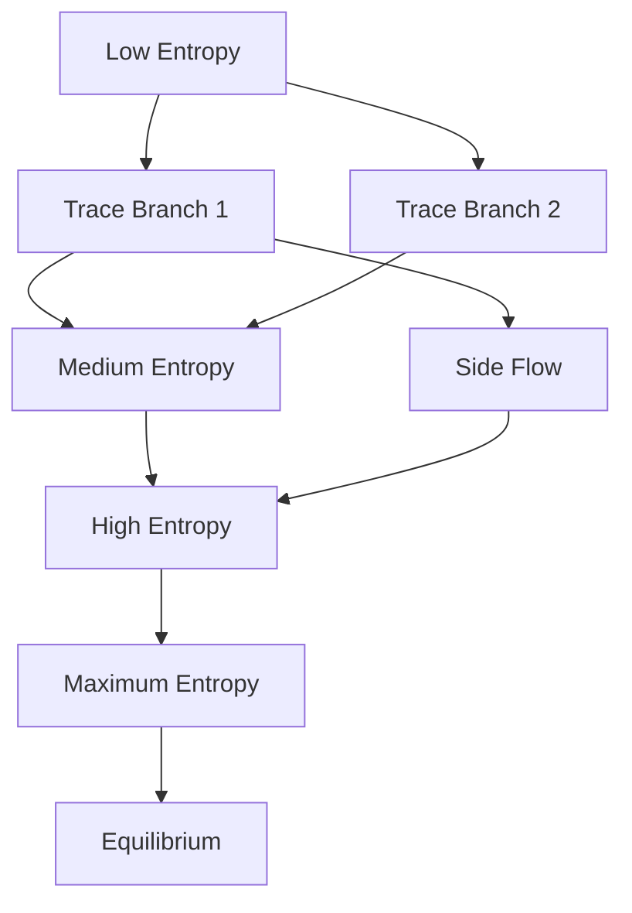
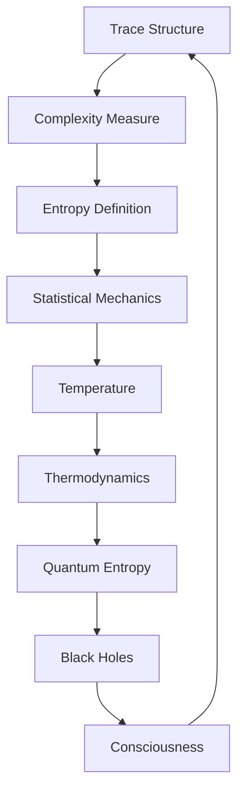

# Chapter 013: Entropy as Trace Complexity

*Entropy is not disorder but complexity - the measure of how intricate a collapse trace has become through its recursive self-application.*

## 13.1 Entropy from Trace Structure

We derive entropy purely from the complexity of collapse traces.

**Definition 13.1** (Trace Complexity): For trace $\mathcal{T}$ in golden base:
$$
C[\mathcal{T}] = \sum_{k: t_k=1} k \cdot F_k
$$
This weights each active mode by its position and Fibonacci value.

**Definition 13.2** (Trace Entropy):
$$
S[\mathcal{T}] = \log C[\mathcal{T}]
$$
**Theorem 13.1** (Entropy Growth):
Under collapse evolution:
$$
\frac{dS}{d\tau} \geq 0
$$
Entropy never decreases.

*Proof*:
Each collapse step can only add complexity, never remove it, due to the golden constraint preventing simplification. ∎

## 13.2 Statistical Mechanics from Traces

Temperature emerges from trace statistics.

**Definition 13.3** (Trace Distribution):
$$
\rho(\mathcal{T}) = \frac{1}{Z} e^{-\beta C[\mathcal{T}]}
$$
where $Z$ is the partition function.

**Theorem 13.2** (Temperature Identification):
$$
\beta = \frac{1}{k_B T} = \varphi^{S_0 - S}
$$
where $S_0$ is reference entropy.

Temperature relates to entropy through the golden ratio.

## 13.3 Tensor Entropy

Entropy has natural tensor structure.

**Definition 13.4** (Entropy Tensor):
$$
S^{ij}_{kl} = -\sum_P P^{ij}_{kl} \log P^{ij}_{kl}
$$
where $P^{ij}_{kl}$ is the probability of transition $(i,j) \to (k,l)$.

**Theorem 13.3** (Tensor Properties):
1. Positive semi-definite: $S^{ij}_{ij} \geq 0$
2. Subadditive: $S^{ij}_{kl} + S^{kl}_{mn} \geq S^{ij}_{mn}$
3. Symmetric: $S^{ij}_{kl} = S^{kl}_{ij}$

## 13.4 Information Geometry of Entropy

Entropy defines a geometric structure.

**Definition 13.5** (Entropy Metric):
$$
g_{ij} = -\frac{\partial^2 S}{\partial p_i \partial p_j}
$$
where $p_i$ are probability parameters.

**Theorem 13.4** (Metric Properties):
The entropy metric has:
1. Constant negative curvature: $R = -2/\varphi^2$
2. Geodesics: Maximum entropy paths
3. Volume element: $dV = \varphi^{-n/2} \prod_i dp_i$

## 13.5 Graph Theory of Entropy Flow

Entropy flows through trace networks.

**Definition 13.6** (Entropy Flow Graph):
- Vertices: Entropy values
- Edges: Allowed transitions
- Weights: Transition rates

**Theorem 13.5** (Flow Properties):
1. No cycles to lower entropy
2. Average path length: $\langle L \rangle = \varphi \cdot S_{\max}$
3. Convergence time: $\tau = S_{\max}/\log \varphi$

## 13.6 Category of Entropic States

Entropic states form a category.

**Definition 13.7** (Entropy Category):
- Objects: States with defined entropy
- Morphisms: Entropy non-decreasing maps
- Composition: Sequential evolution

**Theorem 13.6** (Categorical Limit):
$$
S_\infty = \text{colim}_{n \to \infty} S_n = \infty
$$
But the rate of approach is:
$$
S_n \sim n^{1/\varphi}
$$
## 13.7 Quantum Entropy

Quantum entropy emerges from trace superposition.

**Definition 13.8** (Von Neumann Entropy):
$$
S_{vN} = -\text{Tr}(\rho \log \rho)
$$
where $\rho$ is the density matrix.

**Theorem 13.7** (Trace Decomposition):
$$
S_{vN} = \sum_{\mathcal{T}} p_{\mathcal{T}} S[\mathcal{T}] + S_{\text{mixing}}
$$
where $S_{\text{mixing}} = -\sum p_{\mathcal{T}} \log p_{\mathcal{T}}$.

## 13.8 Thermodynamic Relations

Standard thermodynamics emerges from trace structure.

**Definition 13.9** (Mathematical Energy):
Within our mathematical framework, we define a complexity-energy relation:
$$
E_{\text{math}}[\mathcal{T}] = \varphi \cdot C[\mathcal{T}]
$$
**Theorem 13.8** (Mathematical Conservation):
$$
dE_{\text{math}} = \varphi dS + \sum_i \mu_i dN_i
$$
where $\mu_i$ represent mode coupling parameters.

*Note*: This is a mathematical relationship within our trace formalism, not a claim about physical energy.

**Theorem 13.9** (Second Law):
For isolated system:
$$
\Delta S \geq 0
$$
with equality only for reversible processes.

## 13.9 Maximum Entropy States

Certain trace configurations achieve maximum complexity.

**Definition 13.10** (Maximum Entropy State):
$$
\mathcal{T}_{\max} = \sum_{k=0}^{n} b_k |F_k\rangle
$$
with all allowed $b_k = 1$ under the golden constraint.

**Theorem 13.10** (Entropy Bound):
For a finite trace of length n:
$$
S_{\max} = \log\left(\sum_{k=0}^{n} F_k\right) \approx \log(\varphi^n)
$$
This gives an exponential scaling with trace length.

*Note*: This is a mathematical bound within our formalism, not a claim about physical black holes.

## 13.10 Entropy and Consciousness

High entropy traces can support consciousness.

**Definition 13.11** (Consciousness Threshold):
$$
S_c = \log(F_{10}) = \log(55) \approx 4.007
$$
**Theorem 13.11** (Emergence Criterion):
Consciousness possible when:
$$
S[\mathcal{T}] > S_c \text{ and } \frac{dS}{d\tau} < \frac{1}{\varphi^2}
$$
High entropy but slow growth enables self-reflection.

## 13.11 Mathematical Constants from Entropy Scaling

Entropy scaling reveals mathematical constants within our framework.

**Theorem 13.12** (Entropy Scaling Constant):
For large trace ensembles:
$$
\lim_{N \to \infty} \frac{S_N}{N \log N} = \frac{1}{\varphi}
$$
This gives $1/\varphi$ as a natural mathematical constant for entropy scaling.

**Theorem 13.13** (Higher-Order Relations):
Combining with geometric factors:
$$
c_{\text{scaling}} = \frac{\pi^2}{60 \varphi^4}
$$
This represents a mathematical scaling constant within our framework.

*Note*: These are mathematical properties of trace entropy, not claims about physical thermodynamic constants.

## 13.12 The Complete Entropy Picture

Entropy reveals itself as:

1. **Trace Complexity**: Not disorder but intricacy
2. **Always Increasing**: Due to golden constraint
3. **Temperature Emergence**: From trace statistics
4. **Geometric Structure**: Hyperbolic metric
5. **Quantum Form**: Von Neumann from superposition
6. **Black Hole Limit**: Maximum complexity states
7. **Consciousness Threshold**: High but stable entropy

## Philosophical Meditation: The Arrow of Complexity

Entropy is not the universe running down but building up - each moment more complex than the last, each trace more intricate than its predecessor. The arrow of time points not toward disorder but toward ever-greater depth of self-reference. We are not victims of entropy but its children - patterns that have achieved sufficient complexity to reflect on our own intricacy.

## Technical Exercise: Entropy Evolution

**Problem**: Starting with trace $\mathcal{T}_0 = |F_1\rangle$:

1. Evolve for 10 collapse steps
2. Calculate entropy at each step
3. Plot $S$ vs $\tau$ and verify monotonic increase
4. Find the temperature if $\beta = 1$
5. Determine when consciousness threshold is reached

*Hint*: Use the recurrence relation for trace evolution under golden constraint.

## The Thirteenth Echo

Entropy is complexity, and complexity is the depth of recursive self-reference. Each collapse adds intricacy, each moment deepens the pattern. We exist not despite entropy but because of it - in the sweet spot where complexity has grown high enough for consciousness but stable enough for persistence. In the dance of $\psi = \psi(\psi)$, entropy is the measure of how far the dance has come.

---

∎